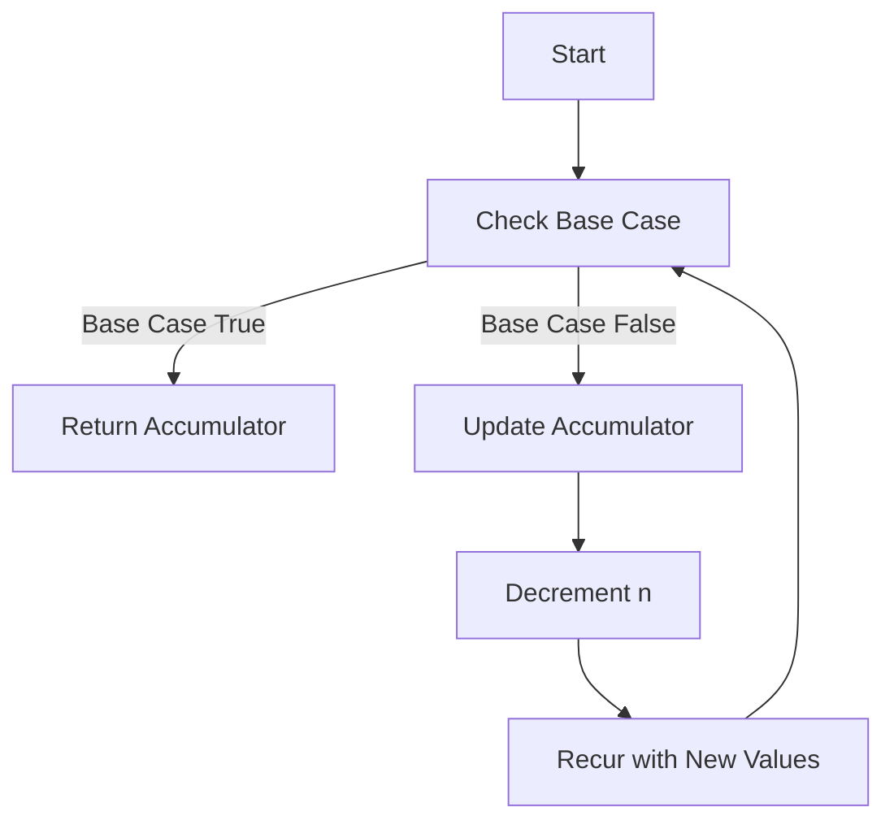

## 7.3.1 Understanding Tail Recursion

As experienced Java developers, you're likely familiar with recursion—a powerful technique where a function calls itself to solve a problem. However, recursion in Java can lead to stack overflow errors if not handled carefully, especially with deep recursive calls. This is where **tail recursion** comes into play, a concept that Clojure leverages effectively to optimize recursive functions.

### What is Tail Recursion?

**Tail recursion** is a special form of recursion where the recursive call is the last operation in the function. This means that the function returns the result of the recursive call directly, without any further computation. This characteristic allows the compiler or interpreter to optimize the recursive calls, reusing the current function's stack frame instead of creating a new one for each call. This optimization is known as **tail call optimization (TCO)**.

#### Tail Recursion vs. Regular Recursion

In regular recursion, each recursive call adds a new layer to the call stack, which can lead to stack overflow if the recursion is too deep. Tail recursion, on the other hand, can be optimized to run in constant stack space, preventing stack overflow.

**Example of Regular Recursion in Java:**

```java
public class Factorial {
    public static int factorial(int n) {
        if (n == 0) {
            return 1;
        } else {
            return n * factorial(n - 1);
        }
    }

    public static void main(String[] args) {
        System.out.println(factorial(5)); // Output: 120
    }
}
```

In this Java example, each call to `factorial` creates a new stack frame, which can lead to stack overflow for large values of `n`.

**Example of Tail Recursion in Clojure:**

```clojure
(defn factorial [n]
  (letfn [(fact-helper [acc n]
            (if (zero? n)
              acc
              (recur (* acc n) (dec n))))]
    (fact-helper 1 n)))

(println (factorial 5)) ; Output: 120
```

In this Clojure example, the `recur` keyword is used to make the recursive call the last operation, allowing for tail call optimization.

### Understanding the `recur` Keyword

In Clojure, the `recur` keyword is used to perform a tail-recursive call. It can be used in two contexts: within a function to call itself, or within a `loop` construct to iterate. The `recur` keyword ensures that the recursive call is the last operation, enabling the optimization.

#### How `recur` Works

- **Replaces the Function Call**: Instead of calling the function again, `recur` reuses the current function's stack frame.
- **Last Operation**: `recur` must be the last operation in the function or loop.
- **Same Arity**: The arguments passed to `recur` must match the function's arity.

**Example of Using `recur` in a Function:**

```clojure
(defn sum [n]
  (letfn [(sum-helper [acc n]
            (if (zero? n)
              acc
              (recur (+ acc n) (dec n))))]
    (sum-helper 0 n)))

(println (sum 5)) ; Output: 15
```

In this example, `recur` is used to call `sum-helper` with updated arguments, ensuring that the recursive call is the last operation.

### Benefits of Tail Recursion

Tail recursion offers several benefits, especially in functional programming languages like Clojure:

- **Prevents Stack Overflow**: By reusing the current stack frame, tail recursion prevents stack overflow errors.
- **Improves Performance**: Tail call optimization reduces the overhead of creating new stack frames, improving performance.
- **Simplifies Code**: Tail-recursive functions can be easier to read and understand, as they often eliminate the need for additional state management.

### Comparing Tail Recursion in Java and Clojure

Java does not natively support tail call optimization, which can make deep recursion problematic. Clojure, however, is designed with functional programming in mind and provides built-in support for tail recursion through the `recur` keyword.

**Java Example Without Tail Recursion:**

```java
public class Sum {
    public static int sum(int n) {
        return sumHelper(0, n);
    }

    private static int sumHelper(int acc, int n) {
        if (n == 0) {
            return acc;
        } else {
            return sumHelper(acc + n, n - 1);
        }
    }

    public static void main(String[] args) {
        System.out.println(sum(5)); // Output: 15
    }
}
```

In Java, each recursive call adds a new stack frame, which can lead to stack overflow for large values of `n`.

**Clojure Example with Tail Recursion:**

```clojure
(defn sum [n]
  (letfn [(sum-helper [acc n]
            (if (zero? n)
              acc
              (recur (+ acc n) (dec n))))]
    (sum-helper 0 n)))

(println (sum 5)) ; Output: 15
```

In Clojure, `recur` allows the function to run in constant stack space, preventing stack overflow.

### Visualizing Tail Recursion

To better understand how tail recursion works, let's visualize the flow of a tail-recursive function using a diagram.



**Diagram Explanation**: This flowchart illustrates the process of a tail-recursive function. The function checks the base case, updates the accumulator and `n`, and then uses `recur` to call itself with the new values.

### Try It Yourself

Now that we've explored tail recursion in Clojure, let's try modifying the code examples to deepen your understanding:

1. **Modify the Factorial Function**: Change the base case to handle negative numbers by returning `nil` for negative inputs.
2. **Implement a Tail-Recursive Fibonacci Function**: Use `recur` to implement a function that calculates the nth Fibonacci number.
3. **Experiment with Large Inputs**: Test the tail-recursive functions with large inputs to see how they handle deep recursion.

### Exercises

To reinforce your understanding of tail recursion, try solving the following exercises:

1. **Exercise 1**: Implement a tail-recursive function to calculate the greatest common divisor (GCD) of two numbers.
2. **Exercise 2**: Write a tail-recursive function to reverse a list.
3. **Exercise 3**: Create a tail-recursive function to flatten a nested list.

### Key Takeaways

- **Tail Recursion**: A form of recursion where the recursive call is the last operation, allowing for optimization.
- **`recur` Keyword**: Used in Clojure to perform tail-recursive calls, preventing stack overflow.
- **Performance Benefits**: Tail recursion improves performance by reducing stack frame overhead.
- **Comparison with Java**: Clojure's support for tail recursion offers advantages over Java's lack of native tail call optimization.

By mastering tail recursion in Clojure, you'll be able to write more efficient and robust recursive functions, leveraging the full power of functional programming.

### Further Reading

For more information on tail recursion and functional programming in Clojure, check out the following resources:

- [Official Clojure Documentation](https://clojure.org/reference/recur)
- [ClojureDocs](https://clojuredocs.org/)
- [Functional Programming in Clojure](https://www.braveclojure.com/)

## Quiz: Test Your Knowledge on Tail Recursion in Clojure



### What is tail recursion?

- [x] A form of recursion where the recursive call is the last operation in the function.
- [ ] A form of recursion that uses multiple recursive calls.
- [ ] A form of recursion that does not involve base cases.
- [ ] A form of recursion that is only used in Java.

> **Explanation:** Tail recursion is characterized by the recursive call being the last operation in the function, allowing for optimization.

### How does the `recur` keyword benefit tail recursion in Clojure?

- [x] It allows the function to reuse the current stack frame.
- [ ] It creates a new stack frame for each recursive call.
- [ ] It eliminates the need for base cases.
- [ ] It is only used for non-recursive functions.

> **Explanation:** The `recur` keyword enables the function to reuse the current stack frame, preventing stack overflow.

### What is a key difference between tail recursion in Java and Clojure?

- [x] Clojure supports tail call optimization, while Java does not.
- [ ] Java supports tail call optimization, while Clojure does not.
- [ ] Both Java and Clojure support tail call optimization.
- [ ] Neither Java nor Clojure support tail call optimization.

> **Explanation:** Clojure supports tail call optimization through the `recur` keyword, while Java does not natively support it.

### Which of the following is a benefit of tail recursion?

- [x] Prevents stack overflow.
- [ ] Increases stack usage.
- [ ] Requires more memory.
- [ ] Slows down execution.

> **Explanation:** Tail recursion prevents stack overflow by reusing the current stack frame.

### What must be true for a function to be tail-recursive?

- [x] The recursive call must be the last operation.
- [ ] The function must have multiple recursive calls.
- [ ] The function must not have a base case.
- [ ] The function must use a loop.

> **Explanation:** For a function to be tail-recursive, the recursive call must be the last operation.

### In Clojure, what does the `recur` keyword do?

- [x] It performs a tail-recursive call.
- [ ] It creates a new function.
- [ ] It ends the recursion.
- [ ] It initializes a loop.

> **Explanation:** The `recur` keyword is used to perform a tail-recursive call in Clojure.

### What is a common use case for tail recursion?

- [x] Calculating factorials.
- [ ] Creating new objects.
- [ ] Managing threads.
- [ ] Handling exceptions.

> **Explanation:** Tail recursion is commonly used for calculating factorials and other recursive computations.

### How does tail recursion improve performance?

- [x] By reducing stack frame overhead.
- [ ] By increasing memory usage.
- [ ] By creating new stack frames.
- [ ] By eliminating base cases.

> **Explanation:** Tail recursion improves performance by reducing the overhead of creating new stack frames.

### True or False: Tail recursion can prevent stack overflow.

- [x] True
- [ ] False

> **Explanation:** Tail recursion can prevent stack overflow by reusing the current stack frame.

### True or False: Java natively supports tail call optimization.

- [ ] True
- [x] False

> **Explanation:** Java does not natively support tail call optimization, unlike Clojure.


