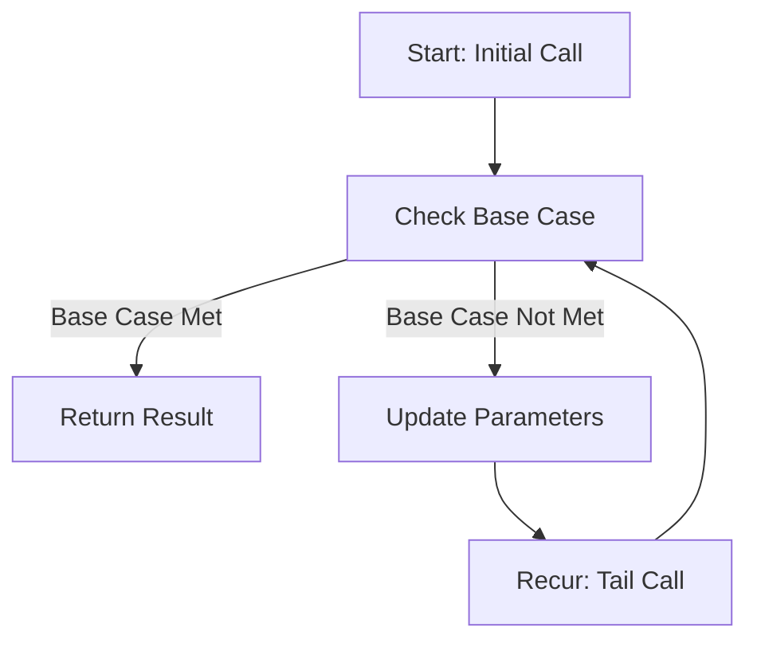

## 7.3.2 Using `recur` in Clojure

In the realm of functional programming, recursion is a fundamental concept that allows us to solve problems by defining functions that call themselves. However, recursion can lead to stack overflow errors if not handled properly, especially in languages like Java where each recursive call consumes a stack frame. Clojure, being a functional language on the JVM, provides a powerful tool to optimize recursive calls: the `recur` keyword. In this section, we will explore how `recur` allows Clojure to perform tail call optimization, enabling efficient recursion without the risk of stack overflow.

### Understanding Tail Recursion

Before diving into `recur`, let's briefly discuss tail recursion. A function is tail-recursive if the recursive call is the last operation performed before the function returns. This means there is no need to keep the current function's stack frame, allowing the language runtime to optimize the call by reusing the current frame.

#### Tail Recursion in Java

In Java, tail recursion is not optimized by the JVM, which means each recursive call adds a new frame to the stack. Consider the following Java example of a factorial function:

```java
public class Factorial {
    public static int factorial(int n) {
        if (n == 0) {
            return 1;
        } else {
            return n * factorial(n - 1);
        }
    }

    public static void main(String[] args) {
        System.out.println(factorial(5)); // Output: 120
    }
}
```

This implementation is not tail-recursive because the multiplication operation occurs after the recursive call. As a result, the stack grows with each call, potentially leading to a stack overflow for large inputs.

### Tail Recursion in Clojure with `recur`

Clojure addresses this limitation by providing the `recur` keyword, which allows for tail call optimization. `recur` can be used in place of a recursive function call when the call is in the tail position. Let's rewrite the factorial function using `recur` in Clojure:

```clojure
(defn factorial [n]
  (let [helper (fn [n acc]
                 (if (zero? n)
                   acc
                   (recur (dec n) (* n acc))))]
    (helper n 1)))

(println (factorial 5)) ; Output: 120
```

In this example, we define a helper function within `factorial` that takes an accumulator `acc` to hold the result. The `recur` keyword is used to call the helper function recursively, passing the decremented value of `n` and the updated accumulator. Since `recur` is in the tail position, Clojure optimizes the call by reusing the current stack frame.

### Key Characteristics of `recur`

- **Tail Position Requirement**: `recur` must be the last operation in a function or loop. It cannot be used in non-tail positions.
- **Local Recursion**: `recur` is limited to the current function or loop. It cannot be used to call other functions.
- **Stack Frame Reuse**: By reusing the current stack frame, `recur` prevents stack overflow, making it suitable for deep recursion.

### Rewriting Recursive Functions with `recur`

To effectively use `recur`, we often need to refactor our recursive functions to ensure the recursive call is in the tail position. Let's explore some common patterns and examples.

#### Example: Calculating Fibonacci Numbers

The Fibonacci sequence is a classic example of recursion. Here's a naive recursive implementation in Java:

```java
public class Fibonacci {
    public static int fibonacci(int n) {
        if (n <= 1) {
            return n;
        } else {
            return fibonacci(n - 1) + fibonacci(n - 2);
        }
    }

    public static void main(String[] args) {
        System.out.println(fibonacci(5)); // Output: 5
    }
}
```

This implementation is inefficient due to repeated calculations. Let's rewrite it in Clojure using `recur`:

```clojure
(defn fibonacci [n]
  (let [helper (fn [a b count]
                 (if (zero? count)
                   a
                   (recur b (+ a b) (dec count))))]
    (helper 0 1 n)))

(println (fibonacci 5)) ; Output: 5
```

Here, we use a helper function with three parameters: `a` and `b` for the current and next Fibonacci numbers, and `count` for the remaining iterations. The `recur` call updates these parameters, ensuring efficient computation without stack growth.

### Visualizing Tail Recursion with `recur`

To better understand how `recur` optimizes recursion, let's visualize the flow of a tail-recursive function using a diagram.



**Diagram Explanation**: This flowchart illustrates the process of a tail-recursive function using `recur`. The function checks the base case, updates parameters, and makes a tail call using `recur`, looping back to the base case check without growing the stack.

### Comparing `recur` with Java Iteration

In Java, we often use loops to avoid recursion when dealing with large input sizes. Let's compare a loop-based approach in Java with a `recur`-based approach in Clojure.

#### Java Iterative Factorial

```java
public class IterativeFactorial {
    public static int factorial(int n) {
        int result = 1;
        for (int i = 1; i <= n; i++) {
            result *= i;
        }
        return result;
    }

    public static void main(String[] args) {
        System.out.println(factorial(5)); // Output: 120
    }
}
```

#### Clojure Recursive Factorial with `recur`

```clojure
(defn factorial [n]
  (loop [i n acc 1]
    (if (zero? i)
      acc
      (recur (dec i) (* acc i)))))

(println (factorial 5)) ; Output: 120
```

**Comparison**: Both implementations achieve the same result, but the Clojure version uses recursion with `recur` to maintain functional purity and immutability. The `loop` construct in Clojure provides a way to initialize local bindings for the recursive process.

### Best Practices for Using `recur`

- **Ensure Tail Position**: Always place `recur` in the tail position to enable optimization.
- **Use Accumulators**: When necessary, use accumulators to carry intermediate results.
- **Prefer `recur` over Explicit Loops**: In functional programming, prefer recursion with `recur` over explicit loops to maintain immutability and functional purity.

### Try It Yourself

Experiment with the following exercises to deepen your understanding of `recur`:

1. **Modify the Fibonacci Function**: Change the initial values of `a` and `b` in the Fibonacci function to see how it affects the sequence.
2. **Implement a Sum Function**: Write a tail-recursive function using `recur` to calculate the sum of a list of numbers.
3. **Refactor a Java Loop**: Take a loop-based Java function and refactor it into a tail-recursive Clojure function using `recur`.

### Further Reading

For more information on recursion and `recur` in Clojure, consider exploring the following resources:

- [Official Clojure Documentation on Recursion](https://clojure.org/reference/recursion)
- [ClojureDocs: recur](https://clojuredocs.org/clojure.core/recur)

### Key Takeaways

- **`recur` enables tail call optimization** in Clojure, allowing for efficient recursion without stack overflow.
- **Tail recursion requires the recursive call to be the last operation** in a function or loop.
- **Clojure's `recur` promotes functional purity and immutability**, aligning with functional programming principles.
- **Practice using `recur` to refactor recursive functions**, leveraging accumulators and tail position for optimal performance.

Now that we've explored how `recur` optimizes recursion in Clojure, let's apply these concepts to manage recursion effectively in your applications.

## Quiz: Mastering Recursion with `recur` in Clojure



### What is the primary benefit of using `recur` in Clojure?

- [x] It enables tail call optimization by reusing the current stack frame.
- [ ] It allows calling other functions within recursion.
- [ ] It automatically parallelizes recursive calls.
- [ ] It simplifies syntax for recursive functions.

> **Explanation:** `recur` allows Clojure to optimize recursive calls by reusing the current stack frame, preventing stack overflow.

### In Clojure, where must `recur` be placed to enable optimization?

- [x] In the tail position of a function or loop.
- [ ] At the beginning of a function.
- [ ] Inside a `let` binding.
- [ ] Within a `cond` expression.

> **Explanation:** `recur` must be in the tail position to enable tail call optimization, allowing the current stack frame to be reused.

### How does `recur` differ from a regular function call in Clojure?

- [x] `recur` reuses the current stack frame, while regular calls do not.
- [ ] `recur` can call other functions, while regular calls cannot.
- [ ] `recur` is only used for loops, not functions.
- [ ] `recur` automatically handles exceptions.

> **Explanation:** `recur` reuses the current stack frame, optimizing tail-recursive calls, unlike regular function calls.

### Which of the following is a characteristic of tail recursion?

- [x] The recursive call is the last operation before returning.
- [ ] The function calls itself multiple times within the same frame.
- [ ] It requires mutable state to function correctly.
- [ ] It cannot be optimized by the runtime.

> **Explanation:** Tail recursion requires the recursive call to be the last operation, allowing for optimization.

### What is a common pattern when using `recur` in recursive functions?

- [x] Using accumulators to carry intermediate results.
- [ ] Using global variables to store state.
- [ ] Calling `recur` in non-tail positions.
- [ ] Avoiding base cases to simplify logic.

> **Explanation:** Accumulators are often used with `recur` to carry intermediate results, ensuring efficient recursion.

### In Java, why might recursion lead to a stack overflow?

- [x] Each recursive call consumes a new stack frame.
- [ ] Java automatically optimizes all recursive calls.
- [ ] Java does not support recursion.
- [ ] Recursive calls are converted to loops.

> **Explanation:** In Java, each recursive call consumes a new stack frame, leading to stack overflow for deep recursion.

### Which Clojure construct is often used with `recur` for local bindings?

- [x] `loop`
- [ ] `cond`
- [ ] `let`
- [ ] `def`

> **Explanation:** `loop` is often used with `recur` to establish local bindings for recursive processes.

### How does Clojure's `recur` promote functional purity?

- [x] By maintaining immutability and avoiding side effects.
- [ ] By allowing mutable state within recursion.
- [ ] By enabling parallel execution of recursive calls.
- [ ] By simplifying syntax for loops.

> **Explanation:** `recur` promotes functional purity by maintaining immutability and avoiding side effects in recursion.

### What is a key difference between `recur` and Java's iterative loops?

- [x] `recur` maintains functional purity, while loops often involve mutable state.
- [ ] `recur` is faster than loops in all cases.
- [ ] `recur` can only be used for mathematical functions.
- [ ] `recur` is limited to a single recursive call.

> **Explanation:** `recur` maintains functional purity and immutability, unlike Java's iterative loops, which often involve mutable state.

### True or False: `recur` can be used to call other functions in Clojure.

- [ ] True
- [x] False

> **Explanation:** `recur` is limited to the current function or loop and cannot be used to call other functions.


