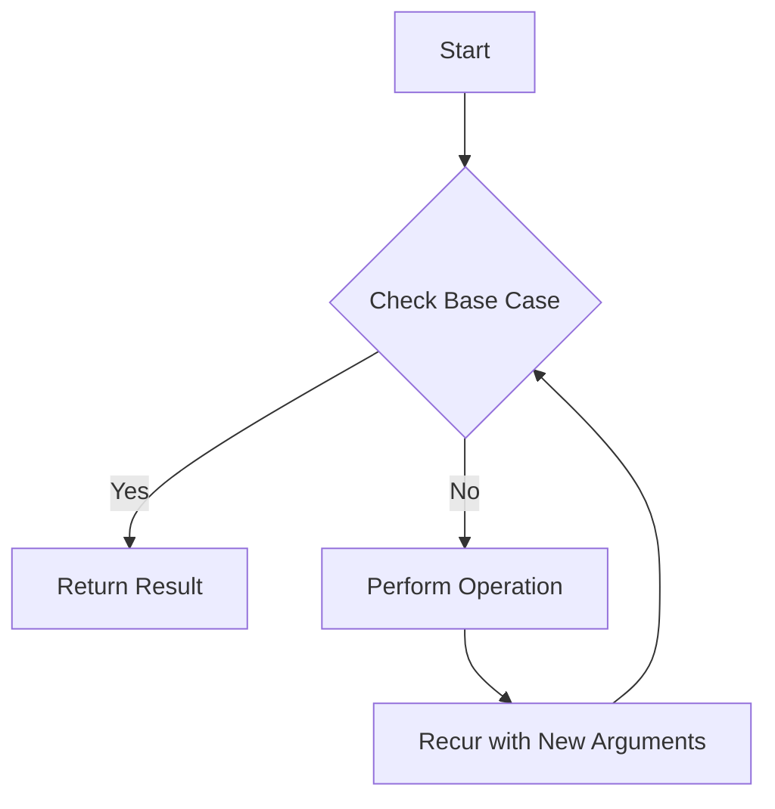

## 7.3.3 Limitations of `recur`

In Clojure, recursion is a fundamental concept that allows us to solve problems by defining functions that call themselves. The `recur` keyword is a powerful tool in Clojure that enables tail-call optimization, allowing recursive functions to execute without growing the call stack. However, `recur` comes with specific limitations that developers must understand to use it effectively. In this section, we will explore these limitations, discuss how to refactor code to accommodate them, and compare Clojure's approach to recursion with Java's traditional iterative constructs.

### Understanding `recur` in Clojure

Before diving into the limitations, let's briefly revisit what `recur` does. The `recur` keyword is used to perform a tail call in Clojure, which is a call to a function or loop that is the last action in a function. This allows the Clojure runtime to optimize the call, preventing the stack from growing and thus avoiding stack overflow errors in deep recursion scenarios.

Here's a simple example of using `recur` in a function:

```clojure
(defn factorial [n]
  (letfn [(fact-helper [acc n]
            (if (zero? n)
              acc
              (recur (* acc n) (dec n))))]
    (fact-helper 1 n)))

;; Usage
(factorial 5) ; => 120
```

In this example, `recur` is used to call `fact-helper` recursively, with the multiplication and decrement operations being the last actions performed.

### Limitations of `recur`

#### 1. Must Be in Tail Position

One of the primary limitations of `recur` is that it must be in the tail position. This means that `recur` must be the last operation in a function or loop. If `recur` is not in the tail position, Clojure will throw a compilation error.

**Example of Incorrect Usage:**

```clojure
(defn sum [n]
  (if (zero? n)
    0
    (+ n (recur (dec n)))) ; Error: `recur` is not in tail position
  )
```

In this example, the `recur` call is not in the tail position because it is wrapped inside the `+` operation. To fix this, we need to refactor the code to ensure `recur` is the last operation:

**Corrected Version:**

```clojure
(defn sum [n]
  (letfn [(sum-helper [acc n]
            (if (zero? n)
              acc
              (recur (+ acc n) (dec n))))]
    (sum-helper 0 n)))

;; Usage
(sum 5) ; => 15
```

#### 2. Can Only Recur to the Nearest Enclosing Function or Loop

Another limitation is that `recur` can only recur to the nearest enclosing function or loop. This means you cannot use `recur` to jump back to an outer function or loop.

**Example of Incorrect Usage:**

```clojure
(defn outer-function [n]
  (defn inner-function [m]
    (if (zero? m)
      (recur (dec n)) ; Error: `recur` cannot jump to `outer-function`
      (recur (dec m))))
  (inner-function n))
```

In this example, `recur` is incorrectly used to try to jump back to `outer-function`. Instead, `recur` can only be used within `inner-function`.

**Corrected Version:**

To achieve similar functionality, you can use a loop construct:

```clojure
(defn outer-function [n]
  (loop [n n]
    (if (zero? n)
      0
      (recur (dec n)))))

;; Usage
(outer-function 5) ; => 0
```

### Refactoring Code to Meet `recur` Requirements

To effectively use `recur`, we often need to refactor our code to ensure that recursive calls are in the tail position and that they recur to the nearest enclosing function or loop. Here are some strategies to achieve this:

#### Strategy 1: Use Helper Functions

Helper functions can encapsulate the recursive logic and ensure that `recur` is in the tail position.

**Example:**

```clojure
(defn fibonacci [n]
  (letfn [(fib-helper [a b n]
            (if (zero? n)
              a
              (recur b (+ a b) (dec n))))]
    (fib-helper 0 1 n)))

;; Usage
(fibonacci 10) ; => 55
```

#### Strategy 2: Use `loop` and `recur`

The `loop` construct can be used to create a local recursion point, allowing `recur` to be used effectively.

**Example:**

```clojure
(defn gcd [a b]
  (loop [a a b b]
    (if (zero? b)
      a
      (recur b (mod a b)))))

;; Usage
(gcd 48 18) ; => 6
```

### Comparing Clojure's `recur` with Java's Iterative Constructs

In Java, recursion is often avoided in favor of iterative constructs like loops due to the lack of tail-call optimization. Let's compare how similar problems are solved in Java and Clojure.

**Java Example: Factorial Calculation**

```java
public class Factorial {
    public static int factorial(int n) {
        int result = 1;
        for (int i = 1; i <= n; i++) {
            result *= i;
        }
        return result;
    }

    public static void main(String[] args) {
        System.out.println(factorial(5)); // Output: 120
    }
}
```

**Clojure Example: Factorial Calculation**

```clojure
(defn factorial [n]
  (loop [acc 1 n n]
    (if (zero? n)
      acc
      (recur (* acc n) (dec n)))))

;; Usage
(factorial 5) ; => 120
```

In Clojure, we use `loop` and `recur` to achieve the same result without growing the call stack, while in Java, we use a simple `for` loop.

### Visualizing `recur` Limitations

To better understand the limitations of `recur`, let's visualize the flow of a recursive function using a diagram.



**Diagram Explanation:**

- **Start**: The function begins execution.
- **Check Base Case**: The function checks if the base case is met.
- **Return Result**: If the base case is met, the result is returned.
- **Perform Operation**: If not, an operation is performed.
- **Recur with New Arguments**: The function calls itself with new arguments using `recur`.

This diagram illustrates the flow of a recursive function using `recur`, highlighting the requirement for `recur` to be in the tail position.

### Try It Yourself

To deepen your understanding, try modifying the following code examples:

1. **Modify the Factorial Function**: Change the base case to handle negative numbers gracefully.
2. **Implement a Recursive Sum Function**: Use `recur` to sum a list of numbers.
3. **Create a Fibonacci Sequence Generator**: Use `recur` to generate a sequence of Fibonacci numbers up to a given limit.

### Exercises

1. **Refactor the Following Code to Use `recur`:**

```clojure
(defn sum-of-squares [n]
  (if (zero? n)
    0
    (+ (* n n) (sum-of-squares (dec n)))))
```

2. **Implement a Recursive Function to Reverse a List Using `recur`.**

3. **Compare the Performance of a Recursive Function with and Without `recur` for Large Inputs.**

### Key Takeaways

- **`recur` Must Be in Tail Position**: Ensure that `recur` is the last operation in a function or loop to avoid compilation errors.
- **Recur to the Nearest Enclosing Function or Loop**: `recur` can only jump back to the nearest enclosing function or loop, not to outer scopes.
- **Refactor Code to Meet `recur` Requirements**: Use helper functions and `loop` constructs to refactor code and accommodate `recur` limitations.
- **Clojure vs. Java**: Clojure's `recur` provides tail-call optimization, unlike Java's traditional recursion, which can lead to stack overflow.

By understanding these limitations and strategies, you can effectively use `recur` in your Clojure programs, leveraging its power to write efficient and elegant recursive functions.

### Further Reading

For more information on recursion and `recur` in Clojure, consider exploring the following resources:

- [Official Clojure Documentation on Recursion](https://clojure.org/reference/recursion)
- [ClojureDocs: `recur` Examples](https://clojuredocs.org/clojure.core/recur)
- [Functional Programming in Clojure](https://www.braveclojure.com/)

## Quiz: Mastering `recur` in Clojure



### What is a primary limitation of using `recur` in Clojure?

- [x] It must be in the tail position.
- [ ] It can only be used with functions that have no parameters.
- [ ] It can only be used with functions that return integers.
- [ ] It must be used with a `loop` construct.

> **Explanation:** `recur` must be in the tail position, meaning it must be the last operation in a function or loop.

### How can you refactor a function to ensure `recur` is in the tail position?

- [x] Use helper functions to encapsulate recursive logic.
- [ ] Use global variables to store intermediate results.
- [ ] Use `recur` within a `try-catch` block.
- [ ] Use `recur` with a `for` loop.

> **Explanation:** Helper functions can encapsulate recursive logic, ensuring `recur` is in the tail position.

### What happens if `recur` is not in the tail position?

- [x] Clojure throws a compilation error.
- [ ] The function executes but with reduced performance.
- [ ] The function executes but may produce incorrect results.
- [ ] The function executes without any issues.

> **Explanation:** If `recur` is not in the tail position, Clojure throws a compilation error.

### Can `recur` be used to jump back to an outer function?

- [ ] Yes, it can jump to any function in the call stack.
- [x] No, it can only recur to the nearest enclosing function or loop.
- [ ] Yes, but only if the outer function is marked with `@recur`.
- [ ] No, it can only be used within `loop` constructs.

> **Explanation:** `recur` can only recur to the nearest enclosing function or loop, not to outer functions.

### Which of the following is a correct use of `recur`?

- [x] Using `recur` as the last operation in a helper function.
- [ ] Using `recur` inside a `try-catch` block.
- [ ] Using `recur` to jump between different functions.
- [ ] Using `recur` with a `for` loop.

> **Explanation:** `recur` must be the last operation in a function or loop, often used in helper functions.

### How does `recur` differ from traditional recursion in Java?

- [x] `recur` provides tail-call optimization, preventing stack overflow.
- [ ] `recur` allows recursion without any base case.
- [ ] `recur` can be used with any Java method.
- [ ] `recur` requires explicit memory management.

> **Explanation:** `recur` provides tail-call optimization, unlike traditional recursion in Java, which can lead to stack overflow.

### What is a common strategy to refactor code for `recur`?

- [x] Use `loop` constructs to create local recursion points.
- [ ] Use global variables to store recursive state.
- [ ] Use `recur` with `try-catch` blocks.
- [ ] Use `recur` with `for` loops.

> **Explanation:** `loop` constructs can create local recursion points, allowing `recur` to be used effectively.

### What is the result of using `recur` incorrectly?

- [x] Compilation error.
- [ ] Runtime warning.
- [ ] Silent failure.
- [ ] Performance degradation.

> **Explanation:** Using `recur` incorrectly results in a compilation error.

### How can you visualize the flow of a recursive function using `recur`?

- [x] Use a flowchart to illustrate the recursive process.
- [ ] Use a pie chart to show recursion depth.
- [ ] Use a bar graph to compare recursion times.
- [ ] Use a scatter plot to map recursion calls.

> **Explanation:** A flowchart can effectively illustrate the recursive process and the role of `recur`.

### True or False: `recur` can be used to optimize any recursive function in Clojure.

- [ ] True
- [x] False

> **Explanation:** `recur` can only be used in tail-recursive functions, where the recursive call is the last operation.


