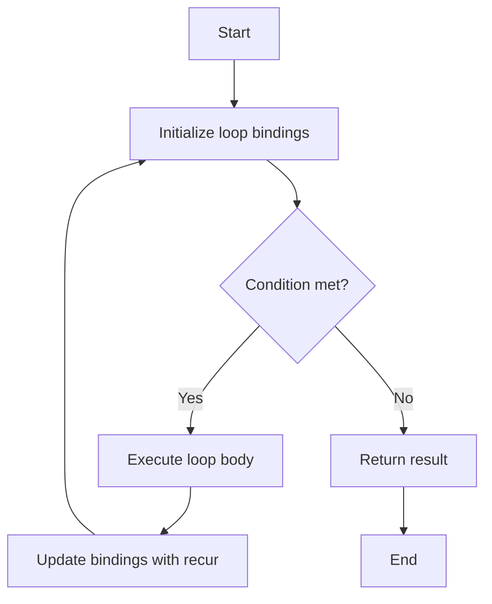

## 7.4.1 Using `loop` and `recur`

As Java developers, we are accustomed to using traditional looping constructs like `for`, `while`, and `do-while` to iterate over data structures and perform repetitive tasks. However, in Clojure, a functional programming language, recursion is the primary mechanism for iteration. In this section, we will explore how to simulate traditional loops using Clojure's `loop` and `recur` constructs, providing a seamless transition from imperative to functional programming paradigms.

### Understanding `loop` and `recur`

In Clojure, `loop` and `recur` are used together to create recursive loops. The `loop` construct establishes a recursion point, while `recur` is used to jump back to this point, effectively simulating a loop. This approach eliminates the need for mutable state, which is a common source of bugs in imperative languages.

#### Why Use `loop` and `recur`?

- **Immutability**: Clojure emphasizes immutability, and `loop` and `recur` allow us to iterate without mutating variables.
- **Tail Call Optimization**: `recur` is optimized for tail recursion, preventing stack overflow errors that can occur with traditional recursion.
- **Functional Paradigm**: Embracing recursion aligns with functional programming principles, promoting cleaner and more maintainable code.

### Basic Syntax

Let's start with the basic syntax of `loop` and `recur`:

```clojure
(loop [bindings]
  (if (condition)
    (recur new-bindings)
    result))
```

- **`loop`**: Initializes the recursion with a vector of bindings, similar to initializing loop variables.
- **`recur`**: Re-invokes the loop with updated bindings, analogous to updating loop variables in each iteration.

### Example: Simulating a `for` Loop

Consider a simple `for` loop in Java that sums numbers from 1 to 10:

```java
int sum = 0;
for (int i = 1; i <= 10; i++) {
    sum += i;
}
System.out.println(sum);
```

In Clojure, we can achieve the same result using `loop` and `recur`:

```clojure
(loop [i 1 sum 0]
  (if (<= i 10)
    (recur (inc i) (+ sum i))
    (println sum)))
```

**Explanation**:
- We initialize `i` and `sum` in the `loop` bindings.
- The `if` condition checks if `i` is less than or equal to 10.
- `recur` updates `i` and `sum` for the next iteration.
- Once the condition is false, the result (`sum`) is printed.

### Diagram: Flow of `loop` and `recur`



*Diagram Caption*: This flowchart illustrates the flow of control in a `loop` and `recur` construct, highlighting the initialization, condition check, execution, and result return phases.

### Example: Simulating a `while` Loop

Let's simulate a `while` loop that prints numbers from 1 to 5:

```java
int i = 1;
while (i <= 5) {
    System.out.println(i);
    i++;
}
```

In Clojure, we use `loop` and `recur`:

```clojure
(loop [i 1]
  (when (<= i 5)
    (println i)
    (recur (inc i))))
```

**Explanation**:
- The `loop` initializes `i` to 1.
- The `when` condition checks if `i` is less than or equal to 5.
- `recur` increments `i` and continues the loop.

### Try It Yourself

Experiment with the following modifications:
- Change the range of numbers to print from 1 to 10.
- Modify the loop to print only even numbers.

### Comparing `loop` and `recur` with Java Loops

| Feature                | Java `for` Loop                         | Clojure `loop` and `recur`            |
|------------------------|-----------------------------------------|---------------------------------------|
| **State Management**   | Mutable variables                       | Immutable bindings                    |
| **Loop Control**       | `for`, `while`, `do-while` constructs   | `loop` and `recur`                    |
| **Recursion**          | Not inherently recursive                | Tail recursion with `recur`           |
| **Error Handling**     | Risk of stack overflow with recursion   | Tail call optimization with `recur`   |

### Advanced Example: Factorial Calculation

Let's calculate the factorial of a number using recursion:

**Java Implementation**:

```java
int factorial(int n) {
    int result = 1;
    for (int i = 1; i <= n; i++) {
        result *= i;
    }
    return result;
}
```

**Clojure Implementation**:

```clojure
(defn factorial [n]
  (loop [i n result 1]
    (if (<= i 1)
      result
      (recur (dec i) (* result i)))))
```

**Explanation**:
- The `loop` initializes `i` to `n` and `result` to 1.
- The `if` condition checks if `i` is less than or equal to 1.
- `recur` decrements `i` and multiplies `result` by `i`.

### Exercise: Implement Fibonacci Sequence

Try implementing a function to calculate the nth Fibonacci number using `loop` and `recur`. Consider the following hints:
- Initialize two variables to represent the last two Fibonacci numbers.
- Use `recur` to update these variables in each iteration.

### Key Takeaways

- **Immutability**: `loop` and `recur` promote immutability by using bindings instead of mutable variables.
- **Tail Recursion**: `recur` is optimized for tail recursion, preventing stack overflow.
- **Functional Paradigm**: Embracing recursion aligns with functional programming principles.

### Further Reading

- [Official Clojure Documentation on Recursion](https://clojure.org/reference/functional_programming#_recursion)
- [ClojureDocs: loop and recur](https://clojuredocs.org/clojure.core/loop)

### Quiz: Mastering `loop` and `recur` in Clojure



### What is the primary purpose of `loop` in Clojure?

- [x] To establish a recursion point for `recur`
- [ ] To create mutable variables
- [ ] To replace all Java loops
- [ ] To handle exceptions

> **Explanation:** `loop` establishes a recursion point that `recur` can jump back to, enabling recursive iteration without mutable state.

### How does `recur` differ from traditional recursion?

- [x] It is optimized for tail recursion
- [ ] It uses mutable state
- [ ] It cannot be used in loops
- [ ] It is slower than traditional recursion

> **Explanation:** `recur` is optimized for tail recursion, preventing stack overflow by reusing the current stack frame.

### Which of the following is a benefit of using `loop` and `recur`?

- [x] Promotes immutability
- [x] Prevents stack overflow
- [ ] Requires more memory
- [ ] Increases code complexity

> **Explanation:** `loop` and `recur` promote immutability and prevent stack overflow through tail call optimization.

### In Clojure, what does `recur` do?

- [x] Re-invokes the loop with updated bindings
- [ ] Creates a new loop
- [ ] Ends the loop
- [ ] Throws an exception

> **Explanation:** `recur` re-invokes the loop with updated bindings, effectively simulating a loop iteration.

### What is a key difference between Java loops and Clojure's `loop` and `recur`?

- [x] Java loops use mutable variables
- [x] Clojure uses immutable bindings
- [ ] Java loops are always faster
- [ ] Clojure loops are less readable

> **Explanation:** Java loops typically use mutable variables, while Clojure's `loop` and `recur` use immutable bindings.

### How can `loop` and `recur` prevent stack overflow?

- [x] By optimizing for tail recursion
- [ ] By using more memory
- [ ] By creating new stack frames
- [ ] By limiting recursion depth

> **Explanation:** `loop` and `recur` are optimized for tail recursion, allowing the reuse of the current stack frame.

### What is the role of `loop` in a recursive function?

- [x] To initialize recursion bindings
- [ ] To terminate recursion
- [ ] To handle exceptions
- [ ] To create mutable variables

> **Explanation:** `loop` initializes recursion bindings, setting up the state for recursive iterations.

### Which of the following is true about `recur`?

- [x] It must be in tail position
- [ ] It can be used anywhere in the code
- [ ] It creates new stack frames
- [ ] It is slower than traditional loops

> **Explanation:** `recur` must be in tail position to enable tail call optimization and prevent stack overflow.

### Can `recur` be used outside of a `loop` or function?

- [ ] True
- [x] False

> **Explanation:** `recur` can only be used within a `loop` or a function to re-invoke the recursion point.

### Is `loop` and `recur` usage limited to numeric operations?

- [ ] True
- [x] False

> **Explanation:** `loop` and `recur` can be used for various operations, not limited to numeric calculations.



Now that we've explored how to use `loop` and `recur` in Clojure, let's apply these concepts to manage iteration effectively in your applications. Embrace the power of recursion and immutability to write cleaner, more maintainable code.
