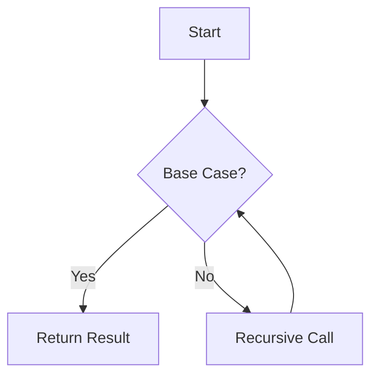

## 7.4.2 Advantages of Recursive Loops

As experienced Java developers, we are accustomed to using imperative loops such as `for`, `while`, and `do-while` to iterate over collections or perform repetitive tasks. However, when transitioning to Clojure, a functional programming language, we encounter a different paradigm that emphasizes recursion over traditional looping constructs. In this section, we will explore the advantages of using recursive loops in Clojure, highlighting how they lead to clearer code, easier reasoning about state, and a more functional approach to problem-solving.

### Understanding Recursive Loops

In Clojure, recursion is a fundamental concept that replaces the need for traditional looping constructs. Recursive loops involve a function calling itself with updated parameters until a base condition is met. This approach aligns with the functional programming paradigm, where functions are first-class citizens and immutability is emphasized.

#### Key Characteristics of Recursive Loops

- **Base Case**: A condition that terminates the recursion, preventing infinite loops.
- **Recursive Case**: The part of the function that calls itself with modified arguments.
- **Tail Recursion**: A special form of recursion where the recursive call is the last operation in the function, allowing for optimization by the compiler.

### Advantages of Recursive Loops

#### 1. **Clearer Code and Simplicity**

Recursive loops often result in code that is more concise and easier to read. By focusing on the problem's structure rather than the mechanics of iteration, recursive solutions can be more intuitive.

**Example: Factorial Calculation**

Let's compare a factorial calculation in Java using a loop and in Clojure using recursion.

**Java Code:**

```java
public class Factorial {
    public static int factorial(int n) {
        int result = 1;
        for (int i = 1; i <= n; i++) {
            result *= i;
        }
        return result;
    }
}
```

**Clojure Code:**

```clojure
(defn factorial [n]
  (if (<= n 1)
    1
    (* n (factorial (dec n)))))
```

In the Clojure example, the recursive function directly mirrors the mathematical definition of factorial, making it easier to understand.

#### 2. **Easier Reasoning About State**

In functional programming, managing state is a common challenge. Recursive loops in Clojure help simplify state management by avoiding mutable variables. Each recursive call operates with a new set of parameters, ensuring that state changes are explicit and controlled.

**Example: Sum of a List**

Consider calculating the sum of a list of numbers.

**Java Code:**

```java
public class Sum {
    public static int sum(int[] numbers) {
        int total = 0;
        for (int number : numbers) {
            total += number;
        }
        return total;
    }
}
```

**Clojure Code:**

```clojure
(defn sum [numbers]
  (if (empty? numbers)
    0
    (+ (first numbers) (sum (rest numbers)))))
```

In Clojure, the recursive approach eliminates the need for a mutable accumulator variable, making the function easier to reason about.

#### 3. **Alignment with Functional Paradigms**

Recursive loops align with the core principles of functional programming, such as immutability and first-class functions. By using recursion, we embrace a declarative style that focuses on what to compute rather than how to compute it.

**Example: Fibonacci Sequence**

Let's explore the Fibonacci sequence, a classic example of recursion.

**Java Code:**

```java
public class Fibonacci {
    public static int fibonacci(int n) {
        if (n <= 1) return n;
        return fibonacci(n - 1) + fibonacci(n - 2);
    }
}
```

**Clojure Code:**

```clojure
(defn fibonacci [n]
  (cond
    (= n 0) 0
    (= n 1) 1
    :else (+ (fibonacci (- n 1)) (fibonacci (- n 2)))))
```

Both implementations are recursive, but the Clojure version naturally fits into the functional paradigm, emphasizing immutability and function composition.

### Tail Recursion and Optimization

Clojure supports tail recursion, which optimizes recursive calls to prevent stack overflow. By using the `recur` keyword, we can ensure that the recursive call is the last operation, allowing the compiler to optimize the recursion into a loop.

**Example: Tail-Recursive Factorial**

```clojure
(defn factorial [n]
  (letfn [(fact [n acc]
            (if (<= n 1)
              acc
              (recur (dec n) (* acc n))))]
    (fact n 1)))
```

In this example, `recur` ensures that the recursive call is optimized, making it suitable for large input values.

### Visualizing Recursive Loops

To better understand the flow of recursive loops, let's visualize the process using a diagram.



**Diagram Description**: This flowchart illustrates the process of a recursive loop. The function checks if the base case is met. If yes, it returns the result. If no, it makes a recursive call with updated parameters, repeating the process.

### Comparing Recursive and Imperative Loops

While recursive loops offer many advantages, it's essential to understand when they are most beneficial compared to imperative loops.

#### When to Use Recursive Loops

- **When the problem is naturally recursive**: Problems like tree traversal, factorial calculation, and Fibonacci sequence are inherently recursive.
- **When immutability is crucial**: Recursive loops avoid mutable state, making them ideal for functional programming.
- **When code clarity is a priority**: Recursive solutions often mirror the problem's structure, leading to more readable code.

#### When to Use Imperative Loops

- **When performance is critical**: In some cases, imperative loops may offer better performance due to lower overhead.
- **When dealing with simple iterations**: For straightforward tasks, imperative loops can be more efficient.

### Try It Yourself

To deepen your understanding of recursive loops, try modifying the examples provided:

1. **Factorial Function**: Implement a tail-recursive version of the factorial function in Clojure.
2. **Sum of a List**: Modify the sum function to handle nested lists (e.g., `[[1 2] [3 4]]`).
3. **Fibonacci Sequence**: Optimize the Fibonacci function using memoization to improve performance.

### Exercises and Practice Problems

1. **Implement a Recursive Function**: Write a recursive function in Clojure to reverse a list.
2. **Tree Traversal**: Implement a recursive function to traverse a binary tree and collect all node values.
3. **String Permutations**: Write a recursive function to generate all permutations of a string.

### Key Takeaways

- Recursive loops in Clojure offer clearer code, easier state management, and alignment with functional programming paradigms.
- Tail recursion and the `recur` keyword enable optimization, making recursive loops efficient for large inputs.
- Understanding when to use recursive loops versus imperative loops is crucial for writing efficient and maintainable code.

By embracing recursive loops, we can leverage the power of functional programming in Clojure, leading to more elegant and robust solutions.

### Further Reading

- [Official Clojure Documentation](https://clojure.org/)
- [ClojureDocs](https://clojuredocs.org/)
- [Functional Programming Principles](https://en.wikipedia.org/wiki/Functional_programming)

## Quiz: Test Your Understanding of Recursive Loops in Clojure



### What is a key advantage of using recursive loops in Clojure over imperative loops in Java?

- [x] Clearer code and easier reasoning about state
- [ ] Faster execution time
- [ ] Less memory usage
- [ ] More complex syntax

> **Explanation:** Recursive loops often result in clearer code and easier reasoning about state due to their alignment with functional programming principles.

### Which keyword in Clojure is used to optimize tail recursion?

- [x] recur
- [ ] loop
- [ ] defn
- [ ] let

> **Explanation:** The `recur` keyword is used in Clojure to optimize tail recursion by allowing the compiler to transform the recursive call into a loop.

### In the context of recursion, what is a base case?

- [x] A condition that terminates the recursion
- [ ] A recursive call with updated parameters
- [ ] The first call to the recursive function
- [ ] A function that calls itself indefinitely

> **Explanation:** A base case is a condition that terminates the recursion, preventing infinite loops and ensuring the function eventually returns a result.

### How does recursion help with state management in functional programming?

- [x] By avoiding mutable variables and making state changes explicit
- [ ] By using global variables to track state
- [ ] By allowing direct manipulation of memory
- [ ] By using loops to iterate over state changes

> **Explanation:** Recursion helps with state management by avoiding mutable variables and making state changes explicit through function parameters.

### What is tail recursion?

- [x] A form of recursion where the recursive call is the last operation in the function
- [ ] A recursion that uses a loop to iterate
- [ ] A recursion that does not have a base case
- [ ] A recursion that calls multiple functions

> **Explanation:** Tail recursion is a form of recursion where the recursive call is the last operation in the function, allowing for optimization by the compiler.

### Which of the following problems is naturally suited for recursion?

- [x] Tree traversal
- [ ] Sorting an array
- [ ] Calculating the average of numbers
- [ ] Reading a file line by line

> **Explanation:** Tree traversal is naturally suited for recursion due to its hierarchical structure, which can be easily navigated using recursive calls.

### What is the primary benefit of using the `recur` keyword in Clojure?

- [x] It optimizes recursive calls to prevent stack overflow
- [ ] It allows for mutable state within a function
- [ ] It simplifies the syntax of recursive functions
- [ ] It enables parallel execution of recursive calls

> **Explanation:** The `recur` keyword optimizes recursive calls to prevent stack overflow by transforming the recursion into a loop.

### Which of the following is a common use case for recursive loops?

- [x] Calculating the factorial of a number
- [ ] Iterating over a fixed number of elements
- [ ] Performing file I/O operations
- [ ] Managing network connections

> **Explanation:** Calculating the factorial of a number is a common use case for recursive loops, as it naturally fits the recursive pattern.

### How does recursion align with the principles of functional programming?

- [x] By emphasizing immutability and function composition
- [ ] By allowing direct manipulation of memory
- [ ] By using global variables to track state
- [ ] By focusing on iterative processes

> **Explanation:** Recursion aligns with the principles of functional programming by emphasizing immutability and function composition, which are core tenets of the paradigm.

### True or False: Recursive loops in Clojure can be more efficient than imperative loops in all cases.

- [ ] True
- [x] False

> **Explanation:** Recursive loops in Clojure can be more efficient in terms of code clarity and state management, but they may not always be more efficient in terms of performance compared to imperative loops, especially for simple iterations.


