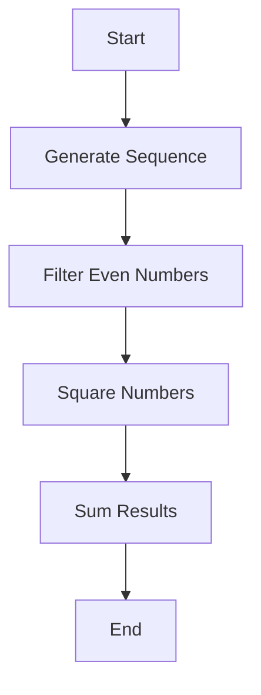

## 7.5.1 Introduction to Lazy Sequences

As experienced Java developers, you're likely familiar with the concept of eager evaluation, where expressions are evaluated as soon as they are bound to a variable. However, Clojure introduces a powerful concept known as **lazy sequences**, which can significantly enhance the way you handle data processing, especially when dealing with large or infinite datasets. In this section, we'll delve into the intricacies of lazy sequences, explore their benefits, and provide practical examples to illustrate their use.

### Understanding Lazy Sequences

Lazy sequences in Clojure are sequences where the elements are computed only as needed. This means that instead of evaluating an entire sequence upfront, Clojure evaluates each element only when it is accessed. This approach can lead to significant performance improvements, especially when working with large datasets or when you only need a subset of the data.

#### Key Characteristics of Lazy Sequences

- **On-Demand Computation**: Elements are computed only when accessed, reducing unnecessary computations.
- **Memory Efficiency**: Since elements are not stored in memory until needed, lazy sequences can handle large or infinite datasets without consuming excessive memory.
- **Composability**: Lazy sequences can be easily composed with other sequence operations, allowing for flexible and efficient data processing pipelines.

### Benefits of Laziness

Lazy sequences offer several advantages over eager evaluation, particularly in the context of functional programming and data processing:

1. **Handling Infinite Sequences**: Lazy sequences allow you to work with infinite data structures, such as streams of numbers, without running into memory issues. This is particularly useful for generating sequences that are conceptually infinite, like the Fibonacci series or prime numbers.

2. **Performance Optimization**: By deferring computation until necessary, lazy sequences can improve performance by avoiding unnecessary calculations. This is especially beneficial when dealing with large datasets where only a portion of the data is needed.

3. **Improved Modularity**: Lazy sequences enable the creation of modular and reusable code. You can build complex data processing pipelines by composing simple, lazy operations without worrying about intermediate data structures.

4. **Seamless Integration with Clojure's Functional Paradigm**: Laziness aligns well with Clojure's functional programming model, allowing you to express complex data transformations in a concise and declarative manner.

### Lazy Sequences in Action

Let's explore some examples to see how lazy sequences work in practice. We'll start with a simple example of generating an infinite sequence of natural numbers.

```clojure
(defn natural-numbers
  "Generates an infinite lazy sequence of natural numbers starting from n."
  [n]
  (cons n (lazy-seq (natural-numbers (inc n)))))

;; Usage
(take 10 (natural-numbers 0))
;; => (0 1 2 3 4 5 6 7 8 9)
```

In this example, the `natural-numbers` function generates an infinite sequence of natural numbers starting from `n`. The `lazy-seq` macro is used to create a lazy sequence, ensuring that each subsequent number is computed only when needed.

#### Comparison with Java

In Java, generating an infinite sequence would typically involve using an `Iterator` or a similar construct. However, Java's iterators are not inherently lazy, and managing infinite sequences can be cumbersome. Here's a simple Java example for comparison:

```java
import java.util.Iterator;

public class NaturalNumbers implements Iterator<Integer> {
    private int current;

    public NaturalNumbers(int start) {
        this.current = start;
    }

    @Override
    public boolean hasNext() {
        return true; // Infinite sequence
    }

    @Override
    public Integer next() {
        return current++;
    }

    public static void main(String[] args) {
        NaturalNumbers numbers = new NaturalNumbers(0);
        for (int i = 0; i < 10; i++) {
            System.out.println(numbers.next());
        }
    }
}
```

While the Java example achieves a similar result, it lacks the elegance and simplicity of Clojure's lazy sequences. Additionally, Java's approach requires explicit management of the iterator state.

### Practical Use Cases for Lazy Sequences

Lazy sequences are not just a theoretical concept; they have practical applications in various scenarios:

#### 1. Data Processing Pipelines

Lazy sequences can be used to build efficient data processing pipelines. For example, you can chain multiple transformations on a dataset without evaluating intermediate results until necessary.

```clojure
(defn process-data
  "Processes a collection of numbers by filtering, mapping, and reducing."
  [numbers]
  (->> numbers
       (filter even?)
       (map #(* % %))
       (reduce +)))

;; Usage
(process-data (range 1 1000000))
```

In this example, the `process-data` function filters even numbers, squares them, and then sums the results. The use of lazy sequences ensures that each step is evaluated only when needed, optimizing performance.

#### 2. Infinite Data Structures

Lazy sequences are ideal for representing infinite data structures. For instance, you can generate an infinite sequence of Fibonacci numbers:

```clojure
(defn fibonacci
  "Generates an infinite lazy sequence of Fibonacci numbers."
  []
  (letfn [(fib [a b] (cons a (lazy-seq (fib b (+ a b)))))]
    (fib 0 1)))

;; Usage
(take 10 (fibonacci))
;; => (0 1 1 2 3 5 8 13 21 34)
```

This example demonstrates how lazy sequences can elegantly handle infinite data structures without running into memory issues.

### Try It Yourself

To deepen your understanding of lazy sequences, try modifying the examples above:

- **Experiment with Different Starting Points**: Modify the `natural-numbers` function to start from a different number and observe the results.
- **Create a Custom Sequence**: Implement a lazy sequence that generates prime numbers or any other mathematical series.
- **Combine Lazy Operations**: Chain multiple lazy operations (e.g., `filter`, `map`, `take`) and observe how they interact.

### Visualizing Lazy Sequences

To better understand how lazy sequences work, let's visualize the flow of data through a simple lazy sequence operation:



**Diagram Explanation**: This flowchart illustrates a data processing pipeline using lazy sequences. The sequence is generated, filtered, mapped, and reduced, with each step being evaluated lazily.

### Further Reading

For more information on lazy sequences and their applications, consider exploring the following resources:

- [Official Clojure Documentation on Sequences](https://clojure.org/reference/sequences)
- [ClojureDocs: Lazy Sequences](https://clojuredocs.org/clojure.core/lazy-seq)
- [Functional Programming in Clojure](https://www.braveclojure.com/functional-programming/)

### Exercises

To reinforce your understanding of lazy sequences, try solving the following exercises:

1. **Implement a Lazy Sequence for Prime Numbers**: Create a function that generates an infinite lazy sequence of prime numbers.
2. **Optimize a Data Processing Pipeline**: Given a large dataset, use lazy sequences to filter, transform, and aggregate the data efficiently.
3. **Explore Lazy Evaluation in Java**: Research and implement a Java solution that mimics Clojure's lazy sequences using Java Streams or other constructs.

### Key Takeaways

- **Lazy sequences** in Clojure allow for on-demand computation, improving performance and memory efficiency.
- They enable the handling of **infinite sequences** and facilitate the creation of modular data processing pipelines.
- Lazy sequences align well with Clojure's functional programming paradigm, offering a concise and expressive way to work with data.
- By understanding and leveraging lazy sequences, you can write more efficient and elegant Clojure code.

Now that we've explored the concept of lazy sequences, let's continue our journey into the world of recursion and looping in Clojure, where we'll delve deeper into the power of functional programming.

## Quiz: Mastering Lazy Sequences in Clojure



### What is a key characteristic of lazy sequences in Clojure?

- [x] Elements are computed only when accessed.
- [ ] Elements are precomputed and stored in memory.
- [ ] Elements are computed in parallel.
- [ ] Elements are computed eagerly.

> **Explanation:** Lazy sequences compute elements only when they are accessed, which helps in optimizing performance and memory usage.

### How do lazy sequences improve performance?

- [x] By deferring computation until necessary.
- [ ] By precomputing all elements.
- [ ] By using multithreading.
- [ ] By storing all elements in memory.

> **Explanation:** Lazy sequences defer computation until necessary, avoiding unnecessary calculations and improving performance.

### Which Clojure function is used to create a lazy sequence?

- [x] `lazy-seq`
- [ ] `cons`
- [ ] `map`
- [ ] `filter`

> **Explanation:** The `lazy-seq` function is used to create lazy sequences in Clojure.

### What is an advantage of using lazy sequences for infinite data structures?

- [x] They can handle infinite sequences without memory issues.
- [ ] They require more memory.
- [ ] They are faster than finite sequences.
- [ ] They are easier to debug.

> **Explanation:** Lazy sequences can handle infinite sequences without consuming excessive memory, as elements are computed on demand.

### How can lazy sequences be used in data processing pipelines?

- [x] By chaining multiple lazy operations.
- [ ] By precomputing all data.
- [ ] By using multithreading.
- [ ] By storing intermediate results in memory.

> **Explanation:** Lazy sequences allow chaining multiple operations, creating efficient data processing pipelines without precomputing all data.

### What is the primary difference between lazy sequences in Clojure and iterators in Java?

- [x] Lazy sequences compute elements on demand, while Java iterators do not inherently support laziness.
- [ ] Java iterators are more memory efficient.
- [ ] Lazy sequences are faster than Java iterators.
- [ ] Java iterators can handle infinite sequences better.

> **Explanation:** Lazy sequences in Clojure compute elements on demand, whereas Java iterators require explicit management for laziness.

### Which of the following is a practical use case for lazy sequences?

- [x] Generating an infinite sequence of Fibonacci numbers.
- [ ] Precomputing all elements of a dataset.
- [ ] Using multithreading for data processing.
- [ ] Storing all elements in memory.

> **Explanation:** Lazy sequences are ideal for generating infinite sequences, such as Fibonacci numbers, without precomputing all elements.

### How can you visualize the flow of data through a lazy sequence operation?

- [x] Using a flowchart.
- [ ] Using a bar chart.
- [ ] Using a pie chart.
- [ ] Using a scatter plot.

> **Explanation:** A flowchart can effectively visualize the flow of data through a lazy sequence operation, illustrating each step in the process.

### True or False: Lazy sequences in Clojure are always finite.

- [ ] True
- [x] False

> **Explanation:** Lazy sequences in Clojure can be infinite, as they compute elements on demand and do not require precomputation.

### Which resource is recommended for further reading on lazy sequences?

- [x] Official Clojure Documentation on Sequences
- [ ] Java Documentation on Iterators
- [ ] Python Documentation on Generators
- [ ] JavaScript Documentation on Promises

> **Explanation:** The Official Clojure Documentation on Sequences is a recommended resource for further reading on lazy sequences.


