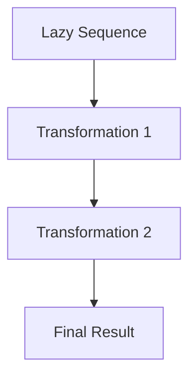

## 7.5.2 Creating Lazy Sequences

Lazy sequences are a powerful feature in Clojure that allow you to work with potentially infinite data structures without incurring the cost of generating all elements upfront. This concept is particularly useful when dealing with large datasets or streams of data where you only need a subset of the data at any given time. In this section, we'll explore how to create lazy sequences in Clojure using functions like `lazy-seq`, `repeat`, `range`, and `iterate`. We'll also compare these techniques to Java's approach to handling sequences and discuss the advantages of lazy evaluation.

### Understanding Lazy Sequences

In Clojure, a lazy sequence is a sequence whose elements are computed on demand. This means that the elements of the sequence are not generated until they are needed, which can lead to significant performance improvements, especially when dealing with large or infinite sequences.

#### Key Benefits of Lazy Sequences

- **Efficiency**: Only the necessary elements are computed, reducing memory usage and computation time.
- **Composability**: Lazy sequences can be easily composed and transformed using Clojure's rich set of sequence operations.
- **Infinite Data Structures**: Lazy sequences enable the creation of infinite data structures, which can be processed incrementally.

### Creating Lazy Sequences with `lazy-seq`

The `lazy-seq` function is a fundamental building block for creating lazy sequences in Clojure. It allows you to define a sequence where each element is computed only when needed.

```clojure
(defn lazy-fib
  "Generates an infinite lazy sequence of Fibonacci numbers."
  ([] (lazy-fib 0 1))
  ([a b]
   (lazy-seq
     (cons a (lazy-fib b (+ a b))))))
```

In this example, `lazy-fib` generates an infinite sequence of Fibonacci numbers. The `lazy-seq` function ensures that each Fibonacci number is computed only when it is accessed.

#### Java Comparison

In Java, creating a similar infinite sequence would typically involve using an `Iterator` or a custom class. However, Java lacks native support for lazy evaluation, which can lead to more complex and less efficient implementations.

### Using `repeat` for Lazy Sequences

The `repeat` function generates an infinite lazy sequence of a given value. This can be useful for creating constant sequences or initializing data structures.

```clojure
(def infinite-ones (repeat 1))

(take 5 infinite-ones) ; => (1 1 1 1 1)
```

Here, `infinite-ones` is an infinite sequence of the number `1`. The `take` function is used to retrieve the first five elements.

#### Java Comparison

In Java, you might use a loop or a stream to achieve similar functionality, but it would require more boilerplate code and wouldn't be as naturally lazy.

### Generating Sequences with `range`

The `range` function creates a lazy sequence of numbers. It can generate finite or infinite sequences depending on the arguments provided.

```clojure
(def numbers (range 10)) ; Finite sequence from 0 to 9

(def infinite-numbers (range)) ; Infinite sequence starting from 0

(take 5 infinite-numbers) ; => (0 1 2 3 4)
```

The `range` function is versatile and can be used to generate sequences with specific start, end, and step values.

#### Java Comparison

Java's `Stream` API introduced in Java 8 provides similar functionality with methods like `IntStream.range()`, but Clojure's `range` is more concise and integrates seamlessly with other sequence operations.

### Creating Sequences with `iterate`

The `iterate` function generates a lazy sequence by repeatedly applying a function to an initial value.

```clojure
(def powers-of-two (iterate #(* 2 %) 1))

(take 5 powers-of-two) ; => (1 2 4 8 16)
```

In this example, `iterate` is used to create a sequence of powers of two. The function `#(* 2 %)` is applied to each element to generate the next one.

#### Java Comparison

Java's `Stream.iterate()` provides similar functionality, but Clojure's `iterate` is more idiomatic for functional programming and integrates better with Clojure's sequence operations.

### Combining Lazy Sequences

Lazy sequences in Clojure can be combined and transformed using various sequence operations. This composability is one of the key strengths of Clojure's approach to lazy evaluation.

```clojure
(def even-fibs
  (filter even? (lazy-fib)))

(take 5 even-fibs) ; => (0 2 8 34 144)
```

In this example, we use `filter` to create a new lazy sequence of even Fibonacci numbers. The `filter` function itself returns a lazy sequence, ensuring that only the necessary elements are computed.

### Visualizing Lazy Sequences

To better understand how lazy sequences work, let's visualize the flow of data through a series of transformations.



This diagram represents the flow of data through a series of transformations, each of which is applied lazily.

### Try It Yourself

Experiment with the code examples provided by modifying the functions or parameters. For instance, try creating a lazy sequence of prime numbers or a sequence that generates random numbers.

### Exercises

1. Create a lazy sequence of squares of natural numbers.
2. Implement a lazy sequence that generates the sequence of factorials.
3. Use `lazy-seq` to create a sequence of the first 100 prime numbers.

### Key Takeaways

- Lazy sequences in Clojure allow for efficient computation and memory usage by generating elements on demand.
- Functions like `lazy-seq`, `repeat`, `range`, and `iterate` provide powerful tools for creating and manipulating lazy sequences.
- Clojure's approach to lazy evaluation offers significant advantages over Java's traditional methods, particularly in terms of composability and simplicity.

### Further Reading

- [Clojure Official Documentation on Sequences](https://clojure.org/reference/sequences)
- [ClojureDocs: Lazy Sequences](https://clojuredocs.org/clojure.core/lazy-seq)
- [Java Stream API Documentation](https://docs.oracle.com/javase/8/docs/api/java/util/stream/Stream.html)

Now that we've explored how to create and work with lazy sequences in Clojure, let's apply these concepts to efficiently process large datasets and streams in your applications.

## Quiz: Mastering Lazy Sequences in Clojure



### What is a key benefit of lazy sequences in Clojure?

- [x] They compute elements only when needed, improving efficiency.
- [ ] They store all elements in memory, ensuring fast access.
- [ ] They require explicit iteration to access elements.
- [ ] They are always finite.

> **Explanation:** Lazy sequences compute elements on demand, which can lead to significant performance improvements by reducing memory usage and computation time.

### Which function is used to create a lazy sequence of repeated values?

- [ ] lazy-seq
- [x] repeat
- [ ] range
- [ ] iterate

> **Explanation:** The `repeat` function generates an infinite lazy sequence of a given value, making it ideal for creating constant sequences.

### How does the `range` function in Clojure differ from Java's `IntStream.range()`?

- [x] Clojure's `range` is more concise and integrates seamlessly with other sequence operations.
- [ ] Java's `IntStream.range()` is more concise and integrates seamlessly with other sequence operations.
- [ ] Both functions are identical in functionality and usage.
- [ ] Clojure's `range` requires more boilerplate code.

> **Explanation:** Clojure's `range` is more concise and idiomatic for functional programming, allowing for seamless integration with other sequence operations.

### What does the `iterate` function do in Clojure?

- [x] It generates a lazy sequence by repeatedly applying a function to an initial value.
- [ ] It creates a finite sequence of numbers.
- [ ] It generates a sequence of random numbers.
- [ ] It creates a sequence of repeated values.

> **Explanation:** The `iterate` function generates a lazy sequence by applying a function to an initial value, producing each subsequent element.

### Which of the following is a correct use of `lazy-seq`?

- [x] `(lazy-seq (cons 1 (lazy-seq (cons 2 nil))))`
- [ ] `(lazy-seq 1 2 3)`
- [ ] `(lazy-seq [1 2 3])`
- [ ] `(lazy-seq (1 2 3))`

> **Explanation:** The correct use of `lazy-seq` involves wrapping a sequence construction, such as `cons`, to ensure elements are computed lazily.

### What is the result of `(take 5 (repeat 3))`?

- [x] `(3 3 3 3 3)`
- [ ] `(3)`
- [ ] `(3 3 3)`
- [ ] `(3 3 3 3 3 3)`

> **Explanation:** The `repeat` function generates an infinite sequence of the value `3`, and `take 5` retrieves the first five elements.

### How can lazy sequences improve performance?

- [x] By computing only the necessary elements, reducing memory usage and computation time.
- [ ] By storing all elements in memory for fast access.
- [ ] By requiring explicit iteration to access elements.
- [ ] By ensuring all elements are computed upfront.

> **Explanation:** Lazy sequences improve performance by computing only the necessary elements, which reduces memory usage and computation time.

### Which function would you use to create an infinite sequence of natural numbers?

- [ ] repeat
- [ ] iterate
- [x] range
- [ ] lazy-seq

> **Explanation:** The `range` function can be used to create an infinite sequence of natural numbers by calling it without arguments.

### What is the purpose of the `filter` function in the context of lazy sequences?

- [x] To create a new lazy sequence containing only elements that satisfy a predicate.
- [ ] To generate a sequence of repeated values.
- [ ] To create a finite sequence of numbers.
- [ ] To apply a function to each element of a sequence.

> **Explanation:** The `filter` function creates a new lazy sequence containing only elements that satisfy a given predicate, allowing for efficient data processing.

### True or False: Lazy sequences in Clojure are always finite.

- [ ] True
- [x] False

> **Explanation:** Lazy sequences in Clojure can be infinite, as they compute elements on demand and do not require all elements to be generated upfront.


