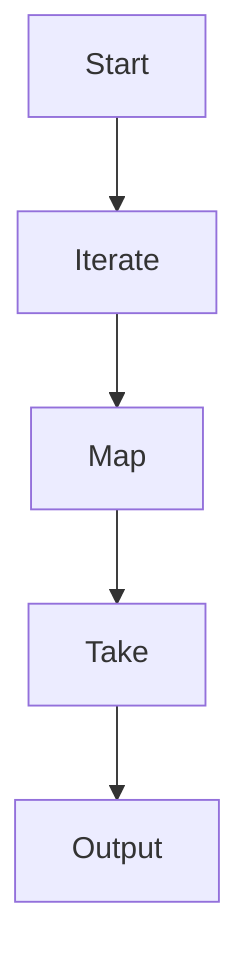

## 7.5.3 Working with Infinite Sequences

In this section, we'll delve into the fascinating world of infinite sequences in Clojure, a concept that might seem daunting at first but offers immense power and flexibility in functional programming. As experienced Java developers, you're familiar with finite data structures like arrays and lists. However, Clojure introduces the concept of infinite sequences, which can be particularly useful for handling large or unbounded datasets efficiently.

### Understanding Infinite Sequences

Infinite sequences in Clojure are a type of lazy sequence. They are not evaluated until their elements are needed, which allows you to work with potentially infinite data without running into memory issues. This is a stark contrast to Java, where data structures are typically finite and fully realized in memory.

#### Key Concepts of Infinite Sequences

- **Laziness**: Infinite sequences are lazy, meaning they compute their elements on demand. This allows you to work with large datasets without loading everything into memory at once.
- **Immutability**: Like all Clojure data structures, infinite sequences are immutable. Once created, they cannot be changed, which simplifies reasoning about code and enhances concurrency.
- **Functional Composition**: Infinite sequences can be easily composed with other functions, allowing for elegant and concise data transformations.

### Creating Infinite Sequences

Clojure provides several ways to create infinite sequences. Let's explore some of the most common methods.

#### Using `iterate`

The `iterate` function generates an infinite sequence by repeatedly applying a function to an initial value.

```clojure
(defn infinite-sequence []
  (iterate inc 0)) ; Starts from 0 and increments by 1 indefinitely

(take 10 (infinite-sequence))
;; => (0 1 2 3 4 5 6 7 8 9)
```

In this example, `iterate` creates an infinite sequence starting from 0, incrementing by 1 each time. We use `take` to consume only the first 10 elements.

#### Using `repeat`

The `repeat` function generates an infinite sequence of a single repeated value.

```clojure
(defn infinite-ones []
  (repeat 1)) ; An infinite sequence of 1s

(take 5 (infinite-ones))
;; => (1 1 1 1 1)
```

Here, `repeat` creates an infinite sequence of the number 1. Again, `take` is used to limit the output.

#### Using `cycle`

The `cycle` function creates an infinite sequence by repeating a given collection.

```clojure
(defn infinite-cycle []
  (cycle [1 2 3])) ; Repeats the sequence [1 2 3] indefinitely

(take 9 (infinite-cycle))
;; => (1 2 3 1 2 3 1 2 3)
```

In this case, `cycle` repeats the sequence `[1 2 3]` infinitely.

### Consuming Infinite Sequences Safely

When working with infinite sequences, it's crucial to consume them safely to avoid infinite loops or memory exhaustion. The `take` function is your best friend here, as it allows you to specify how many elements you want to consume.

#### Using `take`

The `take` function extracts a specified number of elements from a sequence.

```clojure
(defn first-ten-squares []
  (take 10 (map #(* % %) (iterate inc 0)))) ; Squares of the first 10 natural numbers

(first-ten-squares)
;; => (0 1 4 9 16 25 36 49 64 81)
```

In this example, we use `map` to apply a squaring function to each element of an infinite sequence generated by `iterate`. `take` ensures we only get the first 10 squares.

#### Using `take-while`

The `take-while` function takes elements from a sequence as long as a predicate holds true.

```clojure
(defn take-until-ten []
  (take-while #(< % 10) (iterate inc 0))) ; Takes numbers less than 10

(take-until-ten)
;; => (0 1 2 3 4 5 6 7 8 9)
```

Here, `take-while` stops taking elements as soon as the predicate `#(< % 10)` returns false.

### Comparing with Java

In Java, handling infinite sequences requires a different approach, often involving custom iterators or streams. Let's compare how you might achieve similar functionality in Java.

#### Java Example: Infinite Stream

Java 8 introduced streams, which can be used to create infinite sequences.

```java
import java.util.stream.Stream;

public class InfiniteSequence {
    public static void main(String[] args) {
        Stream<Integer> infiniteStream = Stream.iterate(0, n -> n + 1);
        infiniteStream.limit(10).forEach(System.out::println);
    }
}
```

In this Java example, `Stream.iterate` creates an infinite stream, and `limit` is used to consume only the first 10 elements. While Java streams offer similar functionality, Clojure's lazy sequences provide more flexibility and integration with functional programming paradigms.

### Advantages of Infinite Sequences in Clojure

- **Memory Efficiency**: Since elements are computed on demand, infinite sequences use memory efficiently.
- **Functional Composition**: Infinite sequences can be easily combined with other functions, leading to concise and expressive code.
- **Concurrency**: Immutability and laziness make infinite sequences well-suited for concurrent programming.

### Practical Applications

Infinite sequences are not just theoretical constructs; they have practical applications in real-world programming.

#### Generating Fibonacci Numbers

The Fibonacci sequence is a classic example of an infinite sequence.

```clojure
(defn fibonacci []
  (map first (iterate (fn [[a b]] [b (+ a b)]) [0 1])))

(take 10 (fibonacci))
;; => (0 1 1 2 3 5 8 13 21 34)
```

In this example, `iterate` generates pairs of Fibonacci numbers, and `map first` extracts the first element of each pair.

#### Simulating Sensor Data

Infinite sequences can simulate continuous data streams, such as sensor readings.

```clojure
(defn simulate-sensor []
  (map (fn [_] (rand-int 100)) (range)))

(take 5 (simulate-sensor))
;; => (42 17 89 56 23) ; Random values
```

Here, `map` applies a function that generates random integers to an infinite sequence of indices.

### Try It Yourself

Experiment with the following modifications to deepen your understanding:

- Change the starting value or increment in the `iterate` example.
- Use `take-while` with different predicates to control sequence consumption.
- Create a new infinite sequence using `cycle` with a custom collection.

### Visualizing Infinite Sequences

To better understand how infinite sequences work, let's visualize the flow of data through a sequence of transformations.



**Diagram Caption**: This diagram illustrates the flow of data through an infinite sequence, starting with `iterate`, transforming with `map`, and consuming with `take`.

### Further Reading

For more information on infinite sequences and lazy evaluation in Clojure, consider exploring the following resources:

- [Official Clojure Documentation](https://clojure.org/reference/sequences)
- [ClojureDocs](https://clojuredocs.org/)
- [GitHub Clojure Examples](https://github.com/clojure-examples)

### Exercises

1. **Create an Infinite Sequence**: Write a function that generates an infinite sequence of even numbers. Use `take` to consume the first 20 elements.
2. **Simulate Data Stream**: Simulate a data stream of temperature readings, using `rand-int` to generate random temperatures between 0 and 100. Use `take-while` to stop when a reading exceeds 90.
3. **Fibonacci Sequence**: Modify the Fibonacci example to start from different initial values and observe the changes in the sequence.

### Key Takeaways

- **Infinite sequences** in Clojure allow you to work with unbounded data efficiently.
- **Laziness** ensures that elements are computed only when needed, conserving memory.
- **Functional composition** with infinite sequences leads to concise and expressive code.
- **Safety** is paramount when consuming infinite sequences; use functions like `take` and `take-while` to control consumption.

Now that we've explored how to work with infinite sequences in Clojure, let's apply these concepts to manage large datasets and streams effectively in your applications.

## Quiz: Mastering Infinite Sequences in Clojure



### What is a key characteristic of infinite sequences in Clojure?

- [x] They are lazy and compute elements on demand.
- [ ] They are mutable and can be changed after creation.
- [ ] They are always finite and limited in size.
- [ ] They require manual memory management.

> **Explanation:** Infinite sequences in Clojure are lazy, meaning they compute elements only when needed, allowing for efficient memory usage.

### How can you safely consume elements from an infinite sequence in Clojure?

- [x] Use the `take` function to limit the number of elements.
- [ ] Use the `reduce` function to process all elements.
- [ ] Use the `filter` function to remove unwanted elements.
- [ ] Use the `map` function to transform elements.

> **Explanation:** The `take` function allows you to specify how many elements to consume from an infinite sequence, preventing infinite loops.

### Which function creates an infinite sequence by repeating a given collection?

- [x] `cycle`
- [ ] `repeat`
- [ ] `iterate`
- [ ] `map`

> **Explanation:** The `cycle` function creates an infinite sequence by repeating the elements of a given collection indefinitely.

### What is the purpose of the `take-while` function in Clojure?

- [x] To consume elements from a sequence as long as a predicate holds true.
- [ ] To transform each element of a sequence.
- [ ] To create an infinite sequence from a single value.
- [ ] To concatenate multiple sequences into one.

> **Explanation:** The `take-while` function consumes elements from a sequence until the predicate returns false.

### How does Clojure's approach to infinite sequences differ from Java's?

- [x] Clojure uses lazy evaluation, while Java requires streams or custom iterators.
- [ ] Clojure sequences are mutable, while Java streams are immutable.
- [ ] Clojure sequences are always finite, while Java streams can be infinite.
- [ ] Clojure requires manual memory management, while Java handles it automatically.

> **Explanation:** Clojure's infinite sequences are lazy and immutable, whereas Java typically uses streams or custom iterators for similar functionality.

### Which function generates an infinite sequence by applying a function to an initial value?

- [x] `iterate`
- [ ] `repeat`
- [ ] `cycle`
- [ ] `filter`

> **Explanation:** The `iterate` function generates an infinite sequence by repeatedly applying a function to an initial value.

### What is a practical application of infinite sequences in Clojure?

- [x] Simulating continuous data streams, such as sensor readings.
- [ ] Storing large datasets in memory.
- [ ] Creating mutable data structures.
- [ ] Managing manual memory allocation.

> **Explanation:** Infinite sequences can simulate continuous data streams, allowing for efficient handling of real-time data.

### How can you visualize the flow of data through an infinite sequence?

- [x] Using a flowchart to represent the sequence of transformations.
- [ ] Using a pie chart to show data distribution.
- [ ] Using a bar graph to compare sequence lengths.
- [ ] Using a scatter plot to display element values.

> **Explanation:** A flowchart can effectively illustrate the sequence of transformations applied to data in an infinite sequence.

### What is the benefit of using infinite sequences for Fibonacci numbers?

- [x] They allow for efficient computation without predefining the sequence length.
- [ ] They require less code than finite sequences.
- [ ] They automatically handle edge cases.
- [ ] They provide built-in error handling.

> **Explanation:** Infinite sequences allow for efficient computation of Fibonacci numbers without needing to define the sequence length in advance.

### True or False: Infinite sequences in Clojure are mutable and can be changed after creation.

- [ ] True
- [x] False

> **Explanation:** Infinite sequences in Clojure are immutable, meaning they cannot be changed once created.


