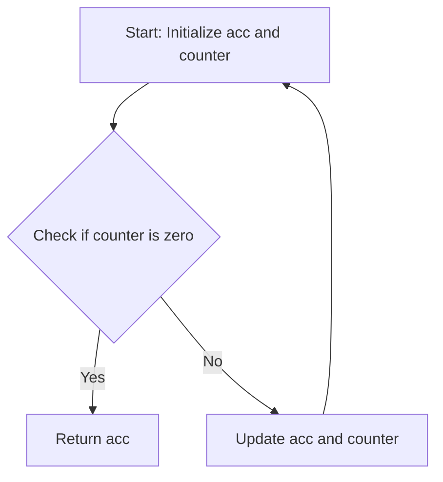

## 7.6.1 Using `loop` for Recursion

In this section, we delve into the powerful constructs of `loop` and `recur` in Clojure, which allow us to perform recursion in a way that is both efficient and idiomatic. As experienced Java developers, you are familiar with iterative constructs like `for`, `while`, and recursion using method calls. Clojure offers a unique approach to recursion that eliminates the risk of stack overflow, a common issue in traditional recursive methods.

### Understanding `loop` and `recur`

Clojure's `loop` and `recur` provide a mechanism for recursion that is optimized for performance. The `loop` construct establishes a recursion point and binds variables, while `recur` is used to jump back to this point, effectively creating a loop without consuming stack space.

#### Key Concepts

- **Tail Recursion**: Clojure's `recur` is a form of tail recursion, where the recursive call is the last operation in a function. This allows Clojure to optimize the call, reusing the current stack frame.
- **Immutable State**: Unlike Java's mutable variables, Clojure's variables are immutable. `loop` allows us to simulate mutable state by rebinding variables with new values on each iteration.
- **Functional Iteration**: Instead of traditional loops, Clojure encourages a functional approach to iteration, using recursion and higher-order functions.

### `loop` and `recur` Syntax

Let's start with the basic syntax of `loop` and `recur`:

```clojure
(loop [bindings*]
  exprs*)
```

- **bindings**: A vector of variable bindings, similar to `let`.
- **exprs**: A series of expressions that are evaluated in the context of the loop.

The `recur` form is used within the loop to rebind the variables and continue the iteration:

```clojure
(recur exprs*)
```

### Example: Calculating Factorials

Let's explore a simple example of calculating factorials using `loop` and `recur`:

```clojure
(defn factorial [n]
  (loop [acc 1
         counter n]
    (if (zero? counter)
      acc
      (recur (* acc counter) (dec counter)))))
```

**Explanation**:

- We start with an accumulator `acc` initialized to 1 and a `counter` set to `n`.
- The `if` expression checks if the `counter` is zero. If true, it returns the accumulated result `acc`.
- Otherwise, `recur` is called with the updated accumulator and decremented counter.

### Comparing with Java

In Java, a similar factorial calculation might look like this:

```java
public class Factorial {
    public static int factorial(int n) {
        int acc = 1;
        for (int i = n; i > 0; i--) {
            acc *= i;
        }
        return acc;
    }
}
```

**Comparison**:

- **State Management**: Java uses mutable variables, whereas Clojure uses immutable bindings with `loop`.
- **Iteration**: Java uses a `for` loop, while Clojure uses recursion with `recur`.
- **Performance**: Clojure's `recur` avoids stack overflow by reusing the stack frame.

### Visualizing `loop` and `recur`

Below is a diagram illustrating the flow of data in a `loop` and `recur` construct:



**Diagram Explanation**: This flowchart shows the iterative process of calculating a factorial using `loop` and `recur`. The loop continues until the counter reaches zero, at which point the accumulated result is returned.

### Advanced Example: Fibonacci Sequence

Let's consider a more complex example: calculating the Fibonacci sequence.

```clojure
(defn fibonacci [n]
  (loop [a 0
         b 1
         count n]
    (if (zero? count)
      a
      (recur b (+ a b) (dec count)))))
```

**Explanation**:

- We start with two variables `a` and `b` representing the first two Fibonacci numbers.
- The `count` variable tracks the number of iterations.
- The `recur` form updates `a` and `b` to the next Fibonacci numbers and decrements `count`.

### Try It Yourself

Experiment with the Fibonacci example by modifying the initial values of `a` and `b` to see how it affects the sequence. Try calculating other sequences using similar logic.

### Exercises

1. **Exercise 1**: Implement a function using `loop` and `recur` to calculate the sum of a list of numbers.
2. **Exercise 2**: Modify the factorial example to handle negative inputs gracefully.
3. **Exercise 3**: Use `loop` and `recur` to implement a function that reverses a vector.

### Key Takeaways

- **Efficiency**: `loop` and `recur` provide a stack-safe way to perform recursion in Clojure.
- **Immutability**: Clojure's approach to state management ensures that variables remain immutable, promoting safer and more predictable code.
- **Functional Paradigm**: Embrace the functional paradigm by using recursion and higher-order functions instead of traditional loops.

### Further Reading

- [Clojure Official Documentation on Recursion](https://clojure.org/reference/loop)
- [ClojureDocs: loop and recur](https://clojuredocs.org/clojure.core/loop)
- [Functional Programming in Java: Harnessing the Power of Java 8 Lambda Expressions](https://www.amazon.com/Functional-Programming-Java-Harnessing-Expressions/dp/1937785467)

Now that we've explored how to use `loop` and `recur` in Clojure, let's apply these concepts to manage iterative processes effectively in your applications.

## Quiz: Mastering Clojure Recursion with `loop` and `recur`



### What is the primary purpose of the `recur` keyword in Clojure?

- [x] To perform tail-recursive calls without consuming stack space
- [ ] To create new threads for parallel execution
- [ ] To define a new function
- [ ] To handle exceptions

> **Explanation:** `recur` is used for tail-recursive calls, allowing the reuse of the current stack frame, thus preventing stack overflow.

### How does Clojure's `loop` differ from Java's `for` loop?

- [x] `loop` uses immutable bindings, while `for` uses mutable variables
- [ ] `loop` is faster than `for`
- [ ] `loop` can only be used for numeric iterations
- [ ] `loop` automatically parallelizes iterations

> **Explanation:** Clojure's `loop` uses immutable bindings, which is a key difference from Java's `for` loop that uses mutable variables.

### In the context of `loop` and `recur`, what does "tail recursion" mean?

- [x] The recursive call is the last operation in a function
- [ ] The recursion occurs at the beginning of the function
- [ ] The recursion involves multiple functions
- [ ] The recursion is only used for mathematical calculations

> **Explanation:** Tail recursion means the recursive call is the last operation, allowing optimizations like reusing the stack frame.

### Which of the following is a benefit of using `loop` and `recur` in Clojure?

- [x] Avoiding stack overflow
- [ ] Automatically parallelizing code
- [ ] Simplifying exception handling
- [ ] Enabling dynamic typing

> **Explanation:** `loop` and `recur` help avoid stack overflow by reusing the stack frame for recursive calls.

### What happens if `recur` is used outside of a `loop` or function context?

- [x] It results in a compile-time error
- [ ] It creates a new thread
- [ ] It behaves like a regular function call
- [ ] It silently fails

> **Explanation:** `recur` must be used within a `loop` or function context; otherwise, it results in a compile-time error.

### How can you modify the Fibonacci example to return a sequence instead of a single number?

- [x] Use a vector to accumulate results and return it at the end
- [ ] Use a map to store results
- [ ] Use a set to collect unique numbers
- [ ] Use a string to concatenate results

> **Explanation:** You can accumulate results in a vector and return it at the end to get a sequence of Fibonacci numbers.

### What is the role of the `bindings` vector in a `loop` construct?

- [x] It initializes variables for the loop
- [ ] It specifies the return type of the loop
- [ ] It defines the loop's termination condition
- [ ] It sets the loop's iteration count

> **Explanation:** The `bindings` vector initializes variables for the loop, similar to `let`.

### Which of the following is a key advantage of using recursion over iteration in functional programming?

- [x] Recursion promotes immutability and functional purity
- [ ] Recursion is always faster than iteration
- [ ] Recursion simplifies exception handling
- [ ] Recursion allows for dynamic typing

> **Explanation:** Recursion promotes immutability and functional purity, which are core principles of functional programming.

### How does Clojure ensure that `recur` calls are optimized for performance?

- [x] By reusing the current stack frame
- [ ] By creating a new thread for each call
- [ ] By compiling to native code
- [ ] By using a JIT compiler

> **Explanation:** Clojure optimizes `recur` calls by reusing the current stack frame, preventing stack overflow.

### True or False: `loop` and `recur` can be used to implement any iterative process in Clojure.

- [x] True
- [ ] False

> **Explanation:** `loop` and `recur` are versatile constructs that can be used to implement a wide range of iterative processes in Clojure.


