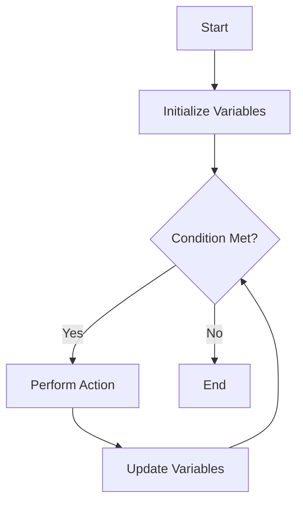

## 7.6.2 Examples of `loop/recur`

In this section, we will delve into the practical applications of Clojure's `loop/recur` construct. As experienced Java developers, you are likely familiar with iterative constructs such as `for`, `while`, and `do-while` loops. In Clojure, the `loop/recur` construct provides a powerful and idiomatic way to perform iteration, while maintaining the benefits of functional programming, such as immutability and recursion.

### Understanding `loop/recur`

Before we dive into examples, let's briefly understand how `loop/recur` works. The `loop` construct in Clojure establishes a recursion point, and `recur` is used to jump back to this point, effectively creating a loop. Unlike traditional loops in Java, `loop/recur` is tail-recursive, meaning it does not consume stack space with each iteration, thus avoiding stack overflow errors.

Here's a simple example to illustrate the syntax:

```clojure
(loop [i 0]
  (when (< i 10)
    (println i)
    (recur (inc i))))
```

In this example, `loop` initializes a local binding `i` with the value `0`. The `when` condition checks if `i` is less than `10`, and if true, it prints `i` and calls `recur` with the incremented value of `i`. This process repeats until `i` reaches `10`.

### Iterative Algorithms with `loop/recur`

Let's explore some iterative algorithms using `loop/recur`. We'll start with a simple example and gradually move to more complex scenarios.

#### Example 1: Calculating Factorial

Calculating the factorial of a number is a classic example of recursion. However, it can also be implemented iteratively using `loop/recur`.

```clojure
(defn factorial [n]
  (loop [acc 1
         i n]
    (if (zero? i)
      acc
      (recur (* acc i) (dec i)))))

(println (factorial 5)) ; Output: 120
```

**Explanation:**

- We define a function `factorial` that takes a single argument `n`.
- The `loop` initializes two bindings: `acc` (accumulator) with `1` and `i` with `n`.
- If `i` is zero, we return `acc`, which holds the factorial result.
- Otherwise, we multiply `acc` by `i` and decrement `i`, then call `recur`.

#### Example 2: Fibonacci Sequence

The Fibonacci sequence is another classic example. Let's implement it using `loop/recur`.

```clojure
(defn fibonacci [n]
  (loop [a 0
         b 1
         i n]
    (if (zero? i)
      a
      (recur b (+ a b) (dec i)))))

(println (fibonacci 10)) ; Output: 55
```

**Explanation:**

- We define a function `fibonacci` that takes `n` as an argument.
- The `loop` initializes `a` with `0`, `b` with `1`, and `i` with `n`.
- If `i` is zero, we return `a`, which holds the nth Fibonacci number.
- Otherwise, we update `a` to `b`, `b` to `a + b`, and decrement `i`, then call `recur`.

### Processing Collections with `loop/recur`

Clojure's `loop/recur` can also be used to process collections. Let's see how we can sum the elements of a vector.

#### Example 3: Summing a Vector

```clojure
(defn sum-vector [v]
  (loop [acc 0
         coll v]
    (if (empty? coll)
      acc
      (recur (+ acc (first coll)) (rest coll)))))

(println (sum-vector [1 2 3 4 5])) ; Output: 15
```

**Explanation:**

- We define a function `sum-vector` that takes a vector `v`.
- The `loop` initializes `acc` with `0` and `coll` with `v`.
- If `coll` is empty, we return `acc`, which holds the sum.
- Otherwise, we add the first element of `coll` to `acc` and call `recur` with the rest of `coll`.

### Simulating State Changes Over Time

`loop/recur` can be used to simulate state changes over time, such as in a simple game or simulation.

#### Example 4: Simulating a Counter

Let's simulate a counter that increments every second until it reaches a specified limit.

```clojure
(defn simulate-counter [limit]
  (loop [count 0]
    (when (< count limit)
      (println "Count:" count)
      (Thread/sleep 1000) ; Sleep for 1 second
      (recur (inc count)))))

(simulate-counter 5)
```

**Explanation:**

- We define a function `simulate-counter` that takes a `limit`.
- The `loop` initializes `count` with `0`.
- If `count` is less than `limit`, we print the count, sleep for 1 second, and call `recur` with the incremented count.

### Comparing with Java

In Java, similar iterative logic would typically be implemented using `for` or `while` loops. Here's how the factorial example might look in Java:

```java
public class Factorial {
    public static int factorial(int n) {
        int acc = 1;
        for (int i = n; i > 0; i--) {
            acc *= i;
        }
        return acc;
    }

    public static void main(String[] args) {
        System.out.println(factorial(5)); // Output: 120
    }
}
```

**Comparison:**

- In Java, we use a `for` loop to iterate from `n` down to `1`, multiplying `acc` by `i` in each iteration.
- In Clojure, `loop/recur` achieves the same result with a more functional approach, emphasizing immutability and recursion.

### Try It Yourself

Now that we've explored some examples, try modifying the code to deepen your understanding:

- **Factorial**: Modify the `factorial` function to handle negative numbers gracefully.
- **Fibonacci**: Change the `fibonacci` function to return a sequence of Fibonacci numbers up to `n`.
- **Sum Vector**: Implement a function that multiplies all elements of a vector using `loop/recur`.
- **Simulate Counter**: Adjust the `simulate-counter` function to decrement the counter instead of incrementing it.

### Diagrams and Visualizations

To help visualize the flow of `loop/recur`, consider the following diagram illustrating the flow of a simple loop:



**Diagram Description**: This flowchart represents the iterative process of a `loop/recur` construct in Clojure. It starts by initializing variables, checks a condition, performs an action if the condition is met, updates variables, and repeats until the condition is no longer met.

### Exercises and Practice Problems

1. **Implement a Prime Checker**: Write a function using `loop/recur` that checks if a number is prime.
2. **Reverse a List**: Use `loop/recur` to reverse a list without using built-in functions.
3. **Simulate a Simple Game**: Create a simple game simulation where a character moves across a grid, using `loop/recur` to update the character's position.

### Key Takeaways

- **`loop/recur`** provides a powerful way to perform iteration in Clojure, maintaining the benefits of functional programming.
- **Tail Recursion**: `loop/recur` is tail-recursive, avoiding stack overflow errors common in traditional recursion.
- **Comparison with Java**: While Java uses `for` and `while` loops, Clojure's `loop/recur` offers a more functional approach.
- **Practical Applications**: From iterative algorithms to state simulations, `loop/recur` is versatile and efficient.

By mastering `loop/recur`, you can effectively implement iterative logic in Clojure, leveraging the language's strengths in functional programming and immutability.

For further reading, explore the [Official Clojure Documentation](https://clojure.org/reference/loop) and [ClojureDocs](https://clojuredocs.org/clojure.core/loop) for more examples and detailed explanations.

---

## Quiz: Mastering Clojure's `loop/recur`



### What is the primary advantage of using `loop/recur` in Clojure?

- [x] It provides tail recursion, avoiding stack overflow.
- [ ] It allows for mutable state within loops.
- [ ] It is faster than traditional loops in Java.
- [ ] It simplifies syntax compared to Java loops.

> **Explanation:** `loop/recur` in Clojure is tail-recursive, meaning it does not consume stack space with each iteration, thus avoiding stack overflow errors.

### How does `loop/recur` differ from Java's `for` loop?

- [x] `loop/recur` is tail-recursive and functional.
- [ ] `loop/recur` allows for mutable variables.
- [ ] `loop/recur` is only used for infinite loops.
- [ ] `loop/recur` is a syntactic sugar for `for` loops.

> **Explanation:** `loop/recur` is tail-recursive and adheres to functional programming principles, unlike Java's `for` loop which often involves mutable state.

### In the `factorial` example, what does `recur` do?

- [x] It calls the loop with updated arguments.
- [ ] It exits the loop.
- [ ] It initializes the loop variables.
- [ ] It performs a side effect.

> **Explanation:** `recur` is used to call the loop with updated arguments, effectively creating an iteration.

### What happens if the condition in a `loop/recur` is never met?

- [x] The loop continues indefinitely.
- [ ] The loop exits immediately.
- [ ] An error is thrown.
- [ ] The loop skips to the next iteration.

> **Explanation:** If the condition is never met, the loop will continue indefinitely, similar to an infinite loop in Java.

### Which of the following is a valid use case for `loop/recur`?

- [x] Iterative algorithms
- [x] Processing collections
- [ ] Directly modifying global state
- [ ] Performing I/O operations

> **Explanation:** `loop/recur` is ideal for iterative algorithms and processing collections, maintaining functional programming principles.

### How can you simulate state changes over time using `loop/recur`?

- [x] By updating loop variables and using `recur`.
- [ ] By using mutable variables.
- [ ] By directly modifying global state.
- [ ] By using Java's `Thread` class.

> **Explanation:** State changes over time can be simulated by updating loop variables and using `recur` to iterate.

### What is a key difference between `loop/recur` and traditional recursion?

- [x] `loop/recur` is tail-recursive and does not consume stack space.
- [ ] `loop/recur` allows for mutable state.
- [ ] `loop/recur` is faster than recursion.
- [ ] `loop/recur` is only used for mathematical calculations.

> **Explanation:** `loop/recur` is tail-recursive, meaning it does not consume stack space with each iteration, unlike traditional recursion.

### What is the purpose of the `loop` construct in Clojure?

- [x] To establish a recursion point for `recur`.
- [ ] To create mutable variables.
- [ ] To perform side effects.
- [ ] To simplify syntax.

> **Explanation:** The `loop` construct establishes a recursion point for `recur`, allowing for iterative processes.

### Can `loop/recur` be used to process collections?

- [x] Yes
- [ ] No

> **Explanation:** `loop/recur` can be effectively used to process collections, maintaining functional programming principles.

### True or False: `loop/recur` is only used for infinite loops.

- [ ] True
- [x] False

> **Explanation:** `loop/recur` is not limited to infinite loops; it is used for any iterative process where tail recursion is beneficial.


