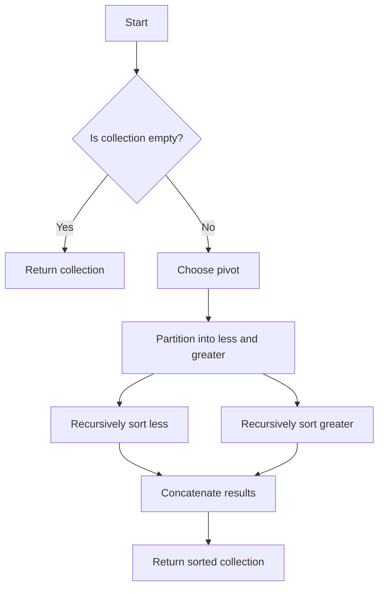
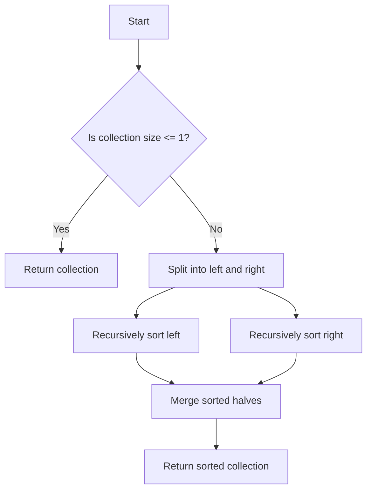
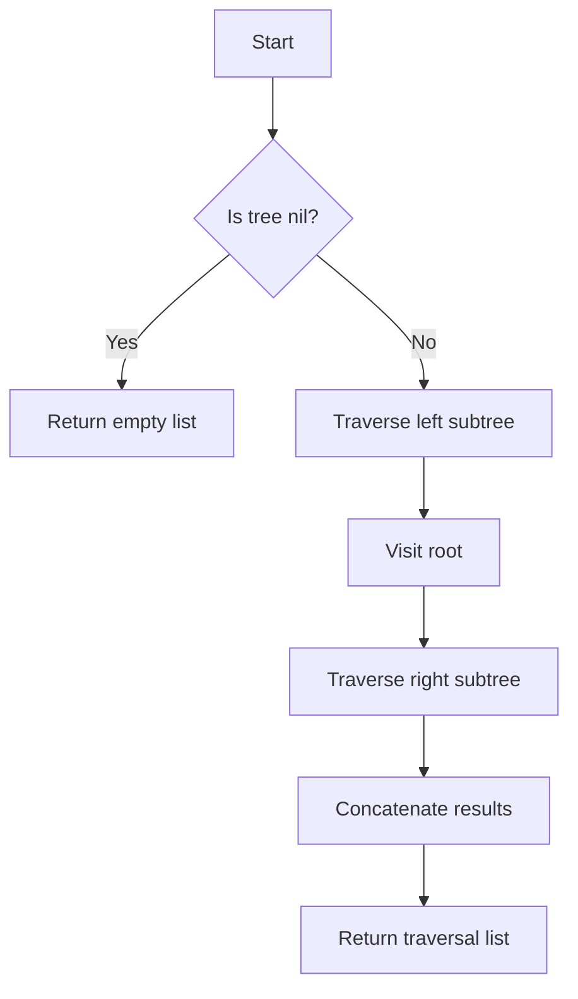

## 7.7.1 Implementing Algorithms

In this section, we will explore how to implement classic algorithms such as quicksort and mergesort using Clojure, leveraging its functional programming capabilities. As experienced Java developers, you are likely familiar with these algorithms in an imperative context. Here, we'll demonstrate how Clojure's recursive and functional paradigms offer a different approach, often leading to more concise and expressive code.

### Understanding Recursion in Clojure

Before diving into specific algorithms, it's crucial to understand how recursion works in Clojure. Unlike Java, which often relies on iterative loops, Clojure encourages recursion, especially with its support for tail recursion through the `recur` keyword.

#### Tail Recursion and `recur`

Tail recursion is a form of recursion where the recursive call is the last operation in the function. Clojure optimizes tail-recursive functions using the `recur` keyword, allowing them to execute in constant stack space.

```clojure
(defn factorial [n]
  (loop [acc 1, n n]
    (if (zero? n)
      acc
      (recur (* acc n) (dec n)))))
```

In this example, `factorial` uses `loop` and `recur` to compute the factorial of a number without growing the stack, similar to a loop in Java.

### Implementing Quicksort

Quicksort is a classic divide-and-conquer algorithm that sorts by partitioning an array into two sub-arrays, then recursively sorting the sub-arrays.

#### Quicksort in Java

Here's a typical implementation of quicksort in Java:

```java
public class QuickSort {
    public static void quickSort(int[] array, int low, int high) {
        if (low < high) {
            int pi = partition(array, low, high);
            quickSort(array, low, pi - 1);
            quickSort(array, pi + 1, high);
        }
    }

    private static int partition(int[] array, int low, int high) {
        int pivot = array[high];
        int i = (low - 1);
        for (int j = low; j < high; j++) {
            if (array[j] <= pivot) {
                i++;
                int temp = array[i];
                array[i] = array[j];
                array[j] = temp;
            }
        }
        int temp = array[i + 1];
        array[i + 1] = array[high];
        array[high] = temp;
        return i + 1;
    }
}
```

#### Quicksort in Clojure

In Clojure, we can implement quicksort using recursion and immutable data structures:

```clojure
(defn quicksort [coll]
  (if (empty? coll)
    coll
    (let [pivot (first coll)
          rest (rest coll)
          less (filter #(<= % pivot) rest)
          greater (filter #(> % pivot) rest)]
      (concat (quicksort less) [pivot] (quicksort greater)))))
```

**Explanation:**

- **Base Case**: If the collection is empty, return it.
- **Recursive Case**: Choose a pivot (first element), partition the rest into `less` and `greater` sub-collections, and recursively sort them.

**Diagram: Quicksort Flow**



This diagram illustrates the recursive flow of the quicksort algorithm in Clojure.

### Implementing Mergesort

Mergesort is another divide-and-conquer algorithm that divides the array into halves, sorts them, and merges the sorted halves.

#### Mergesort in Java

Here's how mergesort might look in Java:

```java
public class MergeSort {
    public static void mergeSort(int[] array, int left, int right) {
        if (left < right) {
            int middle = (left + right) / 2;
            mergeSort(array, left, middle);
            mergeSort(array, middle + 1, right);
            merge(array, left, middle, right);
        }
    }

    private static void merge(int[] array, int left, int middle, int right) {
        int n1 = middle - left + 1;
        int n2 = right - middle;
        int[] L = new int[n1];
        int[] R = new int[n2];
        for (int i = 0; i < n1; ++i)
            L[i] = array[left + i];
        for (int j = 0; j < n2; ++j)
            R[j] = array[middle + 1 + j];
        int i = 0, j = 0;
        int k = left;
        while (i < n1 && j < n2) {
            if (L[i] <= R[j]) {
                array[k] = L[i];
                i++;
            } else {
                array[k] = R[j];
                j++;
            }
            k++;
        }
        while (i < n1) {
            array[k] = L[i];
            i++;
            k++;
        }
        while (j < n2) {
            array[k] = R[j];
            j++;
            k++;
        }
    }
}
```

#### Mergesort in Clojure

In Clojure, mergesort can be implemented using recursion and higher-order functions:

```clojure
(defn merge [left right]
  (cond
    (empty? left) right
    (empty? right) left
    :else (let [l (first left)
                r (first right)]
            (if (<= l r)
              (cons l (merge (rest left) right))
              (cons r (merge left (rest right)))))))

(defn mergesort [coll]
  (if (<= (count coll) 1)
    coll
    (let [mid (quot (count coll) 2)
          left (subvec coll 0 mid)
          right (subvec coll mid)]
      (merge (mergesort left) (mergesort right)))))
```

**Explanation:**

- **Base Case**: If the collection has one or zero elements, it's already sorted.
- **Recursive Case**: Split the collection into two halves, recursively sort each half, and merge the sorted halves.

**Diagram: Mergesort Flow**



This diagram shows the recursive flow of the mergesort algorithm in Clojure.

### Traversing Data Structures

Traversing data structures is a common task in algorithm implementation. In Clojure, recursion and higher-order functions like `map`, `reduce`, and `filter` are often used for this purpose.

#### Traversing a Binary Tree

Let's implement a simple binary tree traversal in Clojure.

```clojure
(defn inorder-traversal [tree]
  (when tree
    (concat (inorder-traversal (:left tree))
            [(:value tree)]
            (inorder-traversal (:right tree)))))

;; Example usage
(def tree {:value 1
           :left {:value 2
                  :left nil
                  :right nil}
           :right {:value 3
                   :left nil
                   :right nil}})

(inorder-traversal tree) ;; => (2 1 3)
```

**Explanation:**

- **Base Case**: If the tree is `nil`, return an empty list.
- **Recursive Case**: Traverse the left subtree, visit the root, and traverse the right subtree.

**Diagram: Inorder Traversal**



This diagram illustrates the recursive flow of an inorder traversal in a binary tree.

### Try It Yourself

To deepen your understanding, try modifying the code examples:

- **Quicksort**: Change the pivot selection strategy and observe how it affects performance.
- **Mergesort**: Implement a bottom-up iterative version using `loop` and `recur`.
- **Tree Traversal**: Implement preorder and postorder traversals.

### Exercises

1. **Implement a Recursive Fibonacci Function**: Write a recursive function to compute Fibonacci numbers and optimize it using memoization.
2. **Binary Search**: Implement a recursive binary search algorithm for a sorted vector.
3. **Graph Traversal**: Implement depth-first and breadth-first search algorithms for a graph represented as an adjacency list.

### Key Takeaways

- **Recursion** is a powerful tool in Clojure, often replacing iterative loops found in Java.
- **Immutable Data Structures** in Clojure lead to different algorithmic approaches compared to Java.
- **Higher-Order Functions** like `map`, `reduce`, and `filter` simplify data structure traversal.
- **Tail Recursion** with `recur` allows efficient recursive algorithms without stack overflow.

By exploring these algorithms in Clojure, you gain a deeper understanding of functional programming paradigms and how they can be applied to solve complex problems efficiently. Now, let's apply these concepts to manage state effectively in your applications.

For further reading, check out the [Official Clojure Documentation](https://clojure.org/reference/documentation) and [ClojureDocs](https://clojuredocs.org/).

## Quiz: Test Your Knowledge on Implementing Algorithms in Clojure



### What is the primary advantage of using recursion in Clojure over iteration in Java?

- [x] Recursion in Clojure often leads to more concise and expressive code.
- [ ] Recursion in Clojure is faster than iteration in Java.
- [ ] Recursion in Clojure uses less memory than iteration in Java.
- [ ] Recursion in Clojure is easier to debug than iteration in Java.

> **Explanation:** Clojure's recursion, especially with tail recursion, often results in more concise and expressive code compared to Java's iterative loops.

### How does Clojure handle tail recursion?

- [x] By using the `recur` keyword to optimize recursive calls.
- [ ] By automatically converting recursion to iteration.
- [ ] By using a special compiler flag.
- [ ] By limiting recursion depth.

> **Explanation:** Clojure uses the `recur` keyword to optimize tail-recursive functions, allowing them to execute in constant stack space.

### In the Clojure quicksort implementation, what is the role of the `filter` function?

- [x] It partitions the collection into elements less than and greater than the pivot.
- [ ] It sorts the collection.
- [ ] It combines the sorted sub-collections.
- [ ] It selects the pivot element.

> **Explanation:** The `filter` function is used to partition the collection into elements less than and greater than the pivot.

### What is a key difference between quicksort and mergesort?

- [x] Quicksort partitions the array in place, while mergesort requires additional space for merging.
- [ ] Quicksort is always faster than mergesort.
- [ ] Mergesort is an in-place sorting algorithm.
- [ ] Quicksort is stable, while mergesort is not.

> **Explanation:** Quicksort partitions the array in place, whereas mergesort requires additional space to merge sorted halves.

### Which Clojure function is commonly used to traverse data structures?

- [x] `map`
- [ ] `loop`
- [ ] `recur`
- [ ] `defn`

> **Explanation:** The `map` function is commonly used to traverse and transform data structures in Clojure.

### What is the base case in a recursive function?

- [x] The condition under which the recursion stops.
- [ ] The first call to the recursive function.
- [ ] The last call to the recursive function.
- [ ] The condition under which the recursion starts.

> **Explanation:** The base case is the condition under which the recursion stops, preventing infinite recursion.

### How can you optimize a recursive Fibonacci function in Clojure?

- [x] By using memoization to cache results of expensive function calls.
- [ ] By using a loop instead of recursion.
- [ ] By increasing the recursion depth.
- [ ] By using a different algorithm.

> **Explanation:** Memoization can be used to cache results of expensive function calls, optimizing the recursive Fibonacci function.

### What is the purpose of the `concat` function in the Clojure quicksort implementation?

- [x] To combine the sorted sub-collections and the pivot into a single collection.
- [ ] To sort the collection.
- [ ] To partition the collection.
- [ ] To select the pivot element.

> **Explanation:** The `concat` function combines the sorted sub-collections and the pivot into a single collection.

### Which of the following is a benefit of using immutable data structures in Clojure?

- [x] They simplify reasoning about code and avoid side effects.
- [ ] They are faster than mutable data structures.
- [ ] They use less memory than mutable data structures.
- [ ] They are easier to modify than mutable data structures.

> **Explanation:** Immutable data structures simplify reasoning about code and avoid side effects, making them beneficial in functional programming.

### True or False: In Clojure, recursion is always more efficient than iteration.

- [ ] True
- [x] False

> **Explanation:** While recursion can be more expressive and concise, it is not always more efficient than iteration, especially if not optimized with tail recursion.


