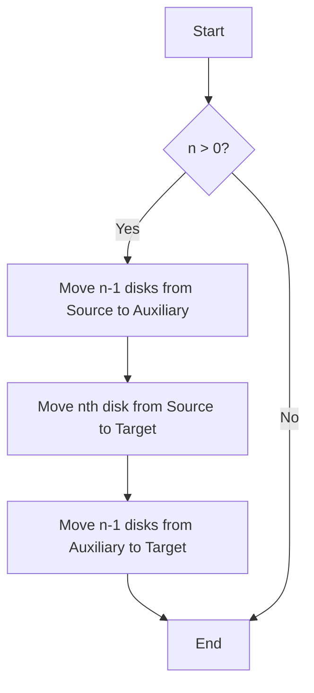

## 7.7.2 Solving Mathematical Problems

In this section, we delve into solving mathematical problems using recursion in Clojure. As experienced Java developers, you are likely familiar with iterative approaches to problem-solving. However, Clojure's functional paradigm encourages us to think recursively, allowing us to express solutions more elegantly and concisely. We'll explore how to calculate permutations, combinations, and solve the classic Towers of Hanoi problem using recursion.

### Understanding Recursion in Clojure

Recursion is a fundamental concept in functional programming, where a function calls itself to solve smaller instances of the same problem. In Clojure, recursion is often preferred over iteration due to its alignment with functional programming principles, such as immutability and pure functions.

#### Tail Recursion and the `recur` Keyword

Clojure optimizes recursive calls using tail recursion, which prevents stack overflow by reusing the current function's stack frame. The `recur` keyword is used to perform tail-recursive calls efficiently.

```clojure
(defn factorial [n]
  (loop [acc 1, n n]
    (if (zero? n)
      acc
      (recur (* acc n) (dec n)))))
```

In this example, `factorial` calculates the factorial of a number using a loop and `recur`, ensuring the recursion is tail-optimized.

### Solving Permutations

Permutations involve rearranging elements of a set in all possible orders. Recursively generating permutations can be elegantly expressed in Clojure.

#### Recursive Permutation Function

Let's define a function to generate permutations of a list:

```clojure
(defn permutations [coll]
  (if (empty? coll)
    '(())
    (for [x coll
          perm (permutations (remove #{x} coll))]
      (cons x perm))))
```

**Explanation:**

- **Base Case:** If the collection is empty, return a list containing an empty list.
- **Recursive Case:** For each element `x` in the collection, remove `x` and recursively find permutations of the remaining elements. Prepend `x` to each permutation.

#### Comparing with Java

In Java, generating permutations typically involves more boilerplate code, often using loops and mutable data structures. Clojure's recursive approach is more concise and expressive.

```java
// Java example for generating permutations
public static List<List<Integer>> permutations(List<Integer> list) {
    if (list.isEmpty()) {
        List<List<Integer>> result = new ArrayList<>();
        result.add(new ArrayList<>());
        return result;
    }
    List<List<Integer>> result = new ArrayList<>();
    for (int i = 0; i < list.size(); i++) {
        List<Integer> remaining = new ArrayList<>(list);
        Integer element = remaining.remove(i);
        for (List<Integer> perm : permutations(remaining)) {
            perm.add(0, element);
            result.add(perm);
        }
    }
    return result;
}
```

### Solving Combinations

Combinations involve selecting elements from a set without regard to order. Recursive solutions can efficiently generate combinations.

#### Recursive Combination Function

Here's a function to generate combinations of a given size:

```clojure
(defn combinations [coll k]
  (cond
    (zero? k) '(())
    (empty? coll) '()
    :else (let [[x & xs] coll]
            (concat
              (map #(cons x %) (combinations xs (dec k)))
              (combinations xs k)))))
```

**Explanation:**

- **Base Cases:** Return a list containing an empty list if `k` is zero. Return an empty list if the collection is empty.
- **Recursive Case:** Use the first element `x` and recursively find combinations of size `k-1` from the rest of the collection. Also, find combinations of size `k` without `x`.

#### Comparing with Java

Java solutions for combinations often involve nested loops and manual management of indices, making Clojure's recursive approach more intuitive.

```java
// Java example for generating combinations
public static List<List<Integer>> combinations(List<Integer> list, int k) {
    List<List<Integer>> result = new ArrayList<>();
    if (k == 0) {
        result.add(new ArrayList<>());
        return result;
    }
    if (list.isEmpty()) {
        return result;
    }
    Integer first = list.get(0);
    List<Integer> rest = list.subList(1, list.size());
    for (List<Integer> comb : combinations(rest, k - 1)) {
        List<Integer> newComb = new ArrayList<>(comb);
        newComb.add(0, first);
        result.add(newComb);
    }
    result.addAll(combinations(rest, k));
    return result;
}
```

### Solving the Towers of Hanoi

The Towers of Hanoi is a classic problem that demonstrates the power of recursion. The goal is to move a stack of disks from one peg to another, following specific rules.

#### Recursive Solution for Towers of Hanoi

Here's a Clojure function to solve the Towers of Hanoi problem:

```clojure
(defn towers-of-hanoi [n source target auxiliary]
  (when (pos? n)
    (towers-of-hanoi (dec n) source auxiliary target)
    (println "Move disk from" source "to" target)
    (towers-of-hanoi (dec n) auxiliary target source)))
```

**Explanation:**

- **Base Case:** If `n` is zero, do nothing.
- **Recursive Case:** Move `n-1` disks from the source to the auxiliary peg, move the nth disk to the target peg, and finally move the `n-1` disks from the auxiliary to the target peg.

#### Comparing with Java

Java solutions for the Towers of Hanoi often involve more verbose code due to explicit stack management, whereas Clojure's recursion provides a cleaner approach.

```java
// Java example for solving Towers of Hanoi
public static void towersOfHanoi(int n, char source, char target, char auxiliary) {
    if (n > 0) {
        towersOfHanoi(n - 1, source, auxiliary, target);
        System.out.println("Move disk from " + source + " to " + target);
        towersOfHanoi(n - 1, auxiliary, target, source);
    }
}
```

### Try It Yourself

To deepen your understanding, try modifying the provided Clojure functions:

- **Permutations:** Modify the `permutations` function to handle duplicate elements.
- **Combinations:** Extend the `combinations` function to return combinations with repetition.
- **Towers of Hanoi:** Add a counter to track the number of moves made.

### Visualizing Recursion with Diagrams

Let's visualize the recursive process of solving the Towers of Hanoi using a flowchart:



**Diagram Explanation:** This flowchart illustrates the recursive steps involved in solving the Towers of Hanoi problem. The process involves moving `n-1` disks, transferring the nth disk, and then moving the `n-1` disks again.

### Key Takeaways

- **Recursion in Clojure** is a powerful tool for solving mathematical problems, offering concise and expressive solutions.
- **Tail recursion** with the `recur` keyword optimizes recursive calls, preventing stack overflow.
- **Permutations and combinations** can be elegantly expressed using recursive functions, contrasting with Java's iterative approaches.
- **Towers of Hanoi** demonstrates the elegance of recursion, simplifying complex problem-solving.

### Exercises

1. **Permutations with Duplicates:** Modify the `permutations` function to handle lists with duplicate elements.
2. **Combinations with Repetition:** Extend the `combinations` function to allow repeated elements in combinations.
3. **Towers of Hanoi with Move Counter:** Add a counter to the `towers-of-hanoi` function to track the number of moves.

By exploring these exercises, you'll gain a deeper understanding of recursion and its applications in solving mathematical problems with Clojure.

## Quiz: Mastering Recursion in Clojure



### What is the primary advantage of using recursion in Clojure over iteration?

- [x] Recursion aligns with functional programming principles and immutability.
- [ ] Recursion is faster than iteration in all cases.
- [ ] Recursion is easier to debug than iteration.
- [ ] Recursion uses less memory than iteration.

> **Explanation:** Recursion aligns with functional programming principles and immutability, making it a preferred approach in Clojure.

### How does the `recur` keyword help in Clojure recursion?

- [x] It optimizes recursive calls by reusing the current stack frame.
- [ ] It makes recursive functions run in parallel.
- [ ] It automatically handles base cases.
- [ ] It converts recursion into iteration.

> **Explanation:** The `recur` keyword optimizes recursive calls by reusing the current stack frame, preventing stack overflow.

### In the permutations function, what is the purpose of `(remove #{x} coll)`?

- [x] To remove the current element `x` from the collection for the next recursive call.
- [ ] To add the current element `x` to the collection.
- [ ] To sort the collection.
- [ ] To duplicate the collection.

> **Explanation:** `(remove #{x} coll)` removes the current element `x` from the collection for the next recursive call.

### What is the base case for the combinations function when generating combinations of size `k`?

- [x] When `k` is zero, return a list containing an empty list.
- [ ] When `k` is equal to the size of the collection.
- [ ] When the collection is empty.
- [ ] When `k` is greater than the size of the collection.

> **Explanation:** When `k` is zero, the base case returns a list containing an empty list, representing a combination of zero elements.

### How does the Towers of Hanoi function handle the movement of disks?

- [x] By recursively moving `n-1` disks, transferring the nth disk, and moving `n-1` disks again.
- [ ] By iteratively moving each disk one by one.
- [ ] By using a stack data structure.
- [ ] By sorting the disks.

> **Explanation:** The Towers of Hanoi function recursively moves `n-1` disks, transfers the nth disk, and moves `n-1` disks again.

### What is a key difference between Clojure and Java when solving mathematical problems?

- [x] Clojure uses recursion and immutability, while Java often uses iteration and mutable data structures.
- [ ] Clojure is faster than Java in all mathematical computations.
- [ ] Java supports recursion, but Clojure does not.
- [ ] Java has built-in functions for all mathematical problems.

> **Explanation:** Clojure uses recursion and immutability, while Java often uses iteration and mutable data structures.

### Why is tail recursion important in functional programming?

- [x] It prevents stack overflow by reusing the current stack frame.
- [ ] It makes code run faster.
- [ ] It simplifies debugging.
- [ ] It allows for parallel execution.

> **Explanation:** Tail recursion prevents stack overflow by reusing the current stack frame, which is crucial in functional programming.

### What is the role of the `println` function in the Towers of Hanoi solution?

- [x] To print the movement of disks from one peg to another.
- [ ] To calculate the number of moves.
- [ ] To sort the disks.
- [ ] To initialize the pegs.

> **Explanation:** The `println` function prints the movement of disks from one peg to another, providing a visual representation of the solution.

### How can you modify the permutations function to handle duplicate elements?

- [x] By using a set to track unique permutations.
- [ ] By sorting the collection first.
- [ ] By using a loop instead of recursion.
- [ ] By removing the base case.

> **Explanation:** Using a set to track unique permutations can help handle duplicate elements in the permutations function.

### True or False: Recursion in Clojure is always more efficient than iteration in Java.

- [ ] True
- [x] False

> **Explanation:** Recursion in Clojure is not always more efficient than iteration in Java; efficiency depends on the specific problem and implementation.



By mastering recursion in Clojure, you'll be well-equipped to tackle a wide range of mathematical problems with elegance and efficiency.
