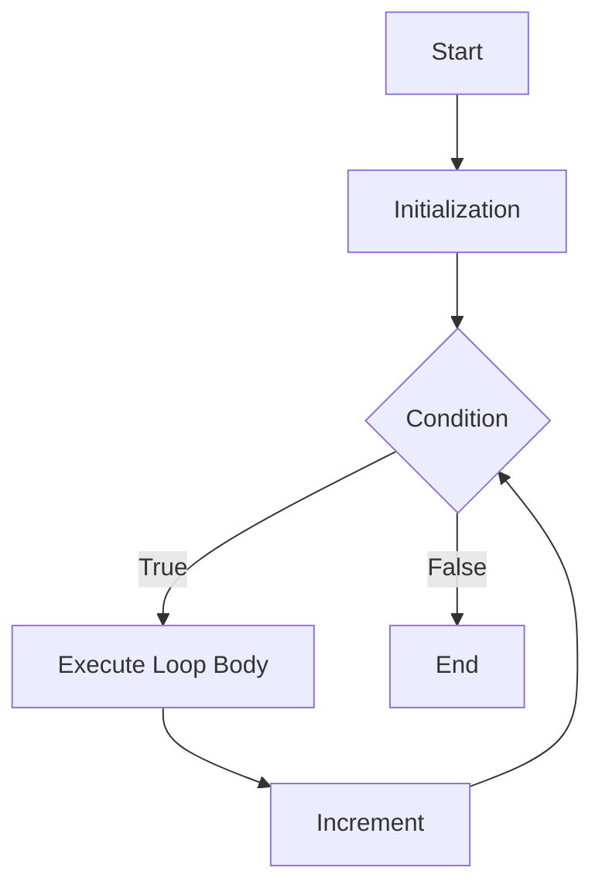

## 7.8.1 Iterative Constructs in Java

As experienced Java developers, you are likely familiar with the iterative constructs that Java provides for managing loops and control flow. These constructs, namely `for`, `while`, and `do-while` loops, are fundamental to imperative programming and are often used to perform repetitive tasks. In this section, we will delve into these constructs, examining how they manage state and control flow, and how they compare to Clojure's recursion-based approach. Understanding these differences is crucial as you transition to Clojure, where recursion and functional programming paradigms take precedence.

### The `for` Loop

The `for` loop is one of the most commonly used iterative constructs in Java. It allows you to execute a block of code a specific number of times, which is particularly useful when you know in advance how many iterations are required.

#### Basic Syntax

```java
for (initialization; termination; increment) {
    // Code to be executed
}
```

- **Initialization**: This step is executed once, setting up the loop control variable.
- **Termination**: The loop continues as long as this condition is true.
- **Increment**: This step is executed after each iteration, updating the loop control variable.

#### Example

```java
for (int i = 0; i < 5; i++) {
    System.out.println("Iteration: " + i);
}
```

**Explanation**: This loop prints "Iteration: 0" to "Iteration: 4". The loop initializes `i` to 0, checks if `i` is less than 5, and increments `i` by 1 after each iteration.

### The `while` Loop

The `while` loop is another fundamental construct that repeats a block of code as long as a specified condition is true. It is particularly useful when the number of iterations is not known beforehand.

#### Basic Syntax

```java
while (condition) {
    // Code to be executed
}
```

#### Example

```java
int i = 0;
while (i < 5) {
    System.out.println("Iteration: " + i);
    i++;
}
```

**Explanation**: Similar to the `for` loop example, this `while` loop prints "Iteration: 0" to "Iteration: 4". The loop continues as long as `i` is less than 5, incrementing `i` with each iteration.

### The `do-while` Loop

The `do-while` loop is similar to the `while` loop, but it guarantees that the loop body will be executed at least once, as the condition is evaluated after the execution of the loop body.

#### Basic Syntax

```java
do {
    // Code to be executed
} while (condition);
```

#### Example

```java
int i = 0;
do {
    System.out.println("Iteration: " + i);
    i++;
} while (i < 5);
```

**Explanation**: This loop also prints "Iteration: 0" to "Iteration: 4". The key difference is that the loop body is executed before the condition is checked, ensuring at least one iteration.

### Managing State and Control Flow

In Java, iterative constructs inherently manage state through loop control variables. These variables are typically mutable, allowing their values to change with each iteration. This mutability is a hallmark of imperative programming, where state changes are explicit and central to the control flow.

#### State Management

- **Mutable State**: Loop control variables are mutable, allowing their values to be updated with each iteration.
- **Explicit Control Flow**: The flow of execution is explicitly controlled through conditions and increments.

#### Example of State Management

```java
int sum = 0;
for (int i = 1; i <= 5; i++) {
    sum += i; // Accumulate the sum of numbers from 1 to 5
}
System.out.println("Sum: " + sum);
```

**Explanation**: This `for` loop calculates the sum of numbers from 1 to 5. The variable `sum` is mutable, and its value is updated with each iteration.

### Comparison with Clojure's Recursion

In contrast to Java's iterative constructs, Clojure emphasizes recursion and immutable data structures. This shift from mutable state to immutability and recursion is a key aspect of functional programming.

#### Key Differences

- **Immutability**: Clojure promotes immutable data structures, reducing side effects and enhancing predictability.
- **Recursion**: Instead of loops, Clojure uses recursion to achieve repetition, often with the help of the `recur` keyword for tail-call optimization.

#### Clojure Example

```clojure
(defn sum [n]
  (loop [i 1 sum 0]
    (if (<= i n)
      (recur (inc i) (+ sum i))
      sum)))

(println (sum 5)) ; Output: 15
```

**Explanation**: This Clojure function calculates the sum of numbers from 1 to `n` using recursion. The `loop` and `recur` constructs manage state without mutable variables.

### Visualizing Iterative Constructs

To better understand the flow of iterative constructs, let's visualize the control flow of a `for` loop using a flowchart.



**Diagram Explanation**: This flowchart represents the control flow of a `for` loop. The loop begins with initialization, checks the condition, executes the loop body if the condition is true, increments the control variable, and repeats until the condition is false.

### Try It Yourself

Experiment with the following Java code snippets to deepen your understanding of iterative constructs:

1. Modify the termination condition in a `for` loop to see how it affects the number of iterations.
2. Change the increment step in a `while` loop to explore different iteration patterns.
3. Implement a `do-while` loop that executes a block of code at least once, regardless of the condition.

### Exercises

1. **Calculate Factorial**: Write a Java program using a `for` loop to calculate the factorial of a given number.
2. **Sum of Even Numbers**: Use a `while` loop to calculate the sum of even numbers between 1 and 10.
3. **User Input Validation**: Implement a `do-while` loop that repeatedly prompts the user for input until a valid number is entered.

### Key Takeaways

- Java's iterative constructs (`for`, `while`, `do-while`) are essential for managing loops and control flow in imperative programming.
- These constructs rely on mutable state and explicit control flow, which differ from Clojure's emphasis on immutability and recursion.
- Understanding these differences is crucial for transitioning to Clojure and embracing functional programming paradigms.

By mastering Java's iterative constructs, you are well-prepared to explore Clojure's recursion-based approach, leveraging the power of functional programming to write more predictable and maintainable code.

## Quiz: Mastering Iterative Constructs in Java



### Which of the following is true about the `for` loop in Java?

- [x] It allows you to execute a block of code a specific number of times.
- [ ] It always executes at least once.
- [ ] It does not require an initialization step.
- [ ] It cannot be used for iterating over arrays.

> **Explanation:** The `for` loop is designed to execute a block of code a specific number of times, based on the initialization, termination, and increment steps.

### What is the primary difference between a `while` loop and a `do-while` loop?

- [x] A `do-while` loop guarantees at least one execution of the loop body.
- [ ] A `while` loop guarantees at least one execution of the loop body.
- [ ] A `do-while` loop does not require a condition.
- [ ] A `while` loop executes the loop body before checking the condition.

> **Explanation:** A `do-while` loop evaluates the condition after executing the loop body, ensuring at least one execution.

### In Java, how is state typically managed within iterative constructs?

- [x] Through mutable loop control variables.
- [ ] Through immutable data structures.
- [ ] By using recursion.
- [ ] By avoiding state changes.

> **Explanation:** Iterative constructs in Java manage state through mutable loop control variables, allowing their values to change with each iteration.

### How does Clojure's approach to iteration differ from Java's?

- [x] Clojure uses recursion and immutability.
- [ ] Clojure relies on mutable loop control variables.
- [ ] Clojure uses `for`, `while`, and `do-while` loops.
- [ ] Clojure does not support iteration.

> **Explanation:** Clojure emphasizes recursion and immutability, contrasting with Java's use of mutable state and iterative loops.

### Which Java loop construct is best suited for situations where the number of iterations is unknown?

- [x] `while` loop
- [ ] `for` loop
- [ ] `do-while` loop
- [ ] `switch` statement

> **Explanation:** The `while` loop is ideal for situations where the number of iterations is not known beforehand, as it continues as long as a condition is true.

### What is the purpose of the increment step in a `for` loop?

- [x] To update the loop control variable after each iteration.
- [ ] To initialize the loop control variable.
- [ ] To terminate the loop.
- [ ] To execute the loop body.

> **Explanation:** The increment step updates the loop control variable after each iteration, ensuring the loop progresses towards termination.

### Which of the following is a key characteristic of imperative programming?

- [x] Explicit state changes
- [ ] Immutability
- [ ] Recursion
- [ ] Functional composition

> **Explanation:** Imperative programming is characterized by explicit state changes, often managed through mutable variables.

### How does the `do-while` loop ensure at least one execution of the loop body?

- [x] By evaluating the condition after executing the loop body.
- [ ] By using a mutable loop control variable.
- [ ] By initializing the loop control variable.
- [ ] By using recursion.

> **Explanation:** The `do-while` loop evaluates the condition after executing the loop body, ensuring at least one execution.

### Which of the following is NOT a Java iterative construct?

- [x] `switch` statement
- [ ] `for` loop
- [ ] `while` loop
- [ ] `do-while` loop

> **Explanation:** The `switch` statement is a control flow statement, not an iterative construct.

### True or False: In Java, the `for` loop can be used to iterate over arrays.

- [x] True
- [ ] False

> **Explanation:** The `for` loop can be used to iterate over arrays, often with the enhanced `for-each` loop syntax.


