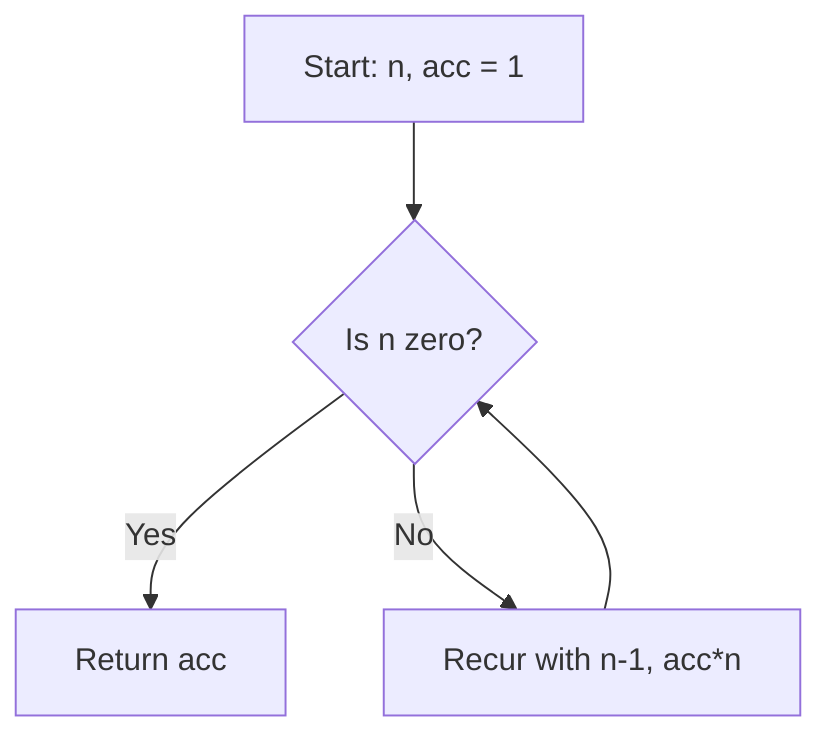
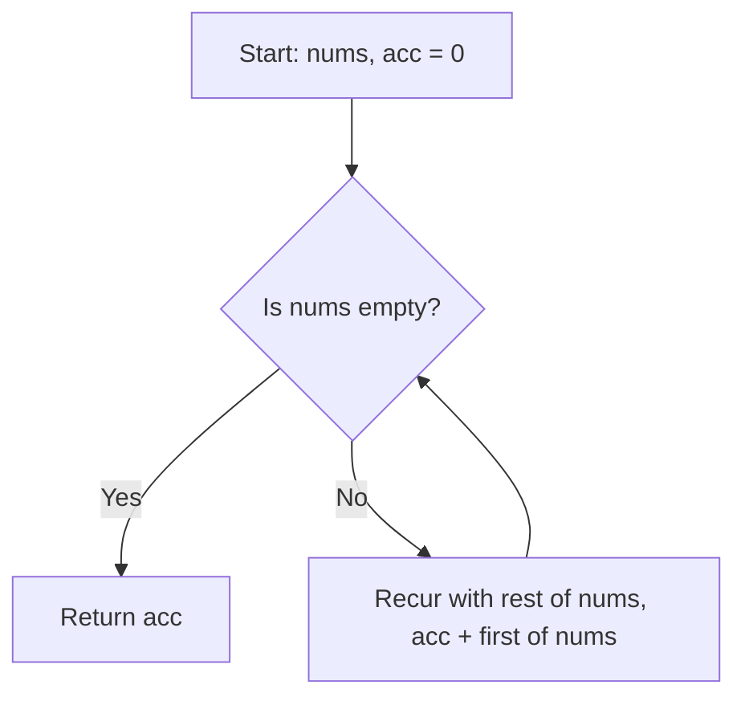

## 7.8.2 Comparing Code Examples: Java Iterative Loops vs Clojure Recursion

In this section, we will delve into the differences between Java's iterative loops and Clojure's recursion by comparing code examples that solve the same problems. As experienced Java developers, you are already familiar with iterative constructs such as `for` and `while` loops. Clojure, on the other hand, embraces recursion as a fundamental approach to iteration, leveraging its functional programming paradigm. Let's explore these concepts through practical examples.

### Understanding Iterative Loops in Java

Java's iterative loops, such as `for`, `while`, and `do-while`, are imperative constructs that allow you to execute a block of code repeatedly based on a condition. These loops are straightforward and efficient for many tasks, but they can become cumbersome when dealing with complex data transformations or when trying to maintain immutability.

#### Java Example: Calculating Factorial Using a `for` Loop

Let's start with a simple example: calculating the factorial of a number using a `for` loop in Java.

```java
public class Factorial {
    public static int factorial(int n) {
        int result = 1;
        for (int i = 1; i <= n; i++) {
            result *= i; // Multiply result by i
        }
        return result; // Return the final result
    }

    public static void main(String[] args) {
        int number = 5;
        System.out.println("Factorial of " + number + " is: " + factorial(number));
    }
}
```

**Explanation**: This Java code uses a `for` loop to iterate from 1 to `n`, multiplying the `result` by each number in the sequence. The loop maintains a mutable variable `result` to accumulate the product.

### Embracing Recursion in Clojure

Clojure, being a functional language, encourages the use of recursion over iteration. Recursion in Clojure is often accompanied by the `recur` keyword, which allows for tail-call optimization, making recursive calls efficient.

#### Clojure Example: Calculating Factorial Using Recursion

Now, let's see how we can achieve the same factorial calculation using recursion in Clojure.

```clojure
(defn factorial [n]
  (loop [i n
         acc 1] ; Initialize accumulator
    (if (zero? i)
      acc ; Return accumulator if i is zero
      (recur (dec i) (* acc i))))) ; Recur with decremented i and updated acc

(println "Factorial of 5 is:" (factorial 5))
```

**Explanation**: In this Clojure example, we use a `loop` construct with `recur` to achieve tail recursion. The `loop` initializes with `i` set to `n` and an accumulator `acc` set to 1. The `if` condition checks if `i` is zero, returning the accumulator if true. Otherwise, it calls `recur` with `i` decremented and `acc` updated.

### Comparing Java and Clojure Approaches

Both the Java and Clojure examples achieve the same result, but they do so using different paradigms. Let's compare these approaches:

- **Mutability vs. Immutability**: Java's iterative approach relies on mutable state (`result`), while Clojure's recursive approach uses immutable data structures, updating the accumulator through recursion.
- **Code Clarity**: Clojure's recursion can be more expressive and concise, especially for complex transformations, while Java's loops are more verbose but straightforward for simple iterations.
- **Performance**: Java's loops are inherently efficient, but Clojure's `recur` enables tail-call optimization, making recursion performant.

### Try It Yourself: Modify the Factorial Function

To deepen your understanding, try modifying the factorial function to handle edge cases, such as negative numbers or zero. Experiment with both Java and Clojure versions to see how each language handles these scenarios.

### Diagram: Flow of Data in Recursive Function

Below is a diagram illustrating the flow of data in the recursive factorial function in Clojure:



**Diagram Explanation**: This flowchart represents the recursive process of calculating factorial in Clojure. It starts with `n` and an accumulator `acc` initialized to 1. If `n` is zero, it returns `acc`. Otherwise, it recurs with `n-1` and `acc*n`.

### Java Example: Summing an Array Using a `for` Loop

Let's look at another example: summing the elements of an array using a `for` loop in Java.

```java
public class SumArray {
    public static int sum(int[] numbers) {
        int sum = 0;
        for (int number : numbers) {
            sum += number; // Add each number to sum
        }
        return sum; // Return the total sum
    }

    public static void main(String[] args) {
        int[] numbers = {1, 2, 3, 4, 5};
        System.out.println("Sum of array is: " + sum(numbers));
    }
}
```

**Explanation**: This Java code iterates over the array `numbers`, adding each element to the `sum` variable.

### Clojure Example: Summing a List Using Recursion

Now, let's implement the same functionality using recursion in Clojure.

```clojure
(defn sum [numbers]
  (loop [nums numbers
         acc 0] ; Initialize accumulator
    (if (empty? nums)
      acc ; Return accumulator if nums is empty
      (recur (rest nums) (+ acc (first nums))))) ; Recur with rest of nums and updated acc

(println "Sum of list is:" (sum [1 2 3 4 5]))
```

**Explanation**: In this Clojure example, we use a `loop` with `recur` to iterate over the list `numbers`. The loop continues until `nums` is empty, updating the accumulator `acc` by adding the first element of `nums`.

### Comparing Java and Clojure Approaches

- **Iteration vs. Recursion**: Java uses a `for` loop to iterate over the array, while Clojure uses recursion with `recur` to process the list.
- **State Management**: Java maintains a mutable `sum` variable, whereas Clojure uses an immutable accumulator updated through recursion.
- **Expressiveness**: Clojure's recursion can be more expressive, especially for complex data transformations, while Java's loops are more intuitive for simple tasks.

### Try It Yourself: Modify the Sum Function

Experiment with modifying the sum function to handle different data structures, such as nested lists or arrays. Try implementing these changes in both Java and Clojure to see how each language handles them.

### Diagram: Flow of Data in Recursive Sum Function

Below is a diagram illustrating the flow of data in the recursive sum function in Clojure:



**Diagram Explanation**: This flowchart represents the recursive process of summing a list in Clojure. It starts with `nums` and an accumulator `acc` initialized to 0. If `nums` is empty, it returns `acc`. Otherwise, it recurs with the rest of `nums` and `acc` updated by adding the first element.

### Exercises: Practice Problems

To reinforce your understanding of recursion in Clojure, try solving the following problems:

1. **Fibonacci Sequence**: Implement a recursive function in Clojure to calculate the nth Fibonacci number.
2. **Reverse a List**: Write a recursive function in Clojure to reverse a list.
3. **Find Maximum**: Create a recursive function in Clojure to find the maximum element in a list.

### Summary and Key Takeaways

- **Recursion vs. Iteration**: Clojure's recursion offers a powerful alternative to Java's iterative loops, promoting immutability and functional programming principles.
- **Tail-Call Optimization**: Clojure's `recur` enables efficient recursion by optimizing tail calls, making it suitable for iterative processes.
- **Expressiveness**: Clojure's recursive functions can be more expressive and concise, especially for complex data transformations.
- **Practice and Experimentation**: Experiment with modifying and extending the provided examples to deepen your understanding of recursion in Clojure.

By comparing Java's iterative loops with Clojure's recursion, we gain insights into the strengths and trade-offs of each approach. Embrace the functional paradigm of Clojure to write expressive, concise, and efficient code.

For further reading on recursion and functional programming in Clojure, check out the [Official Clojure Documentation](https://clojure.org/reference/recursion) and [ClojureDocs](https://clojuredocs.org/).

---

## Quiz: Test Your Understanding of Java Iterative Loops vs Clojure Recursion



### Which of the following is a key difference between Java's iterative loops and Clojure's recursion?

- [x] Java uses mutable state, while Clojure uses immutable data structures.
- [ ] Java supports recursion, while Clojure does not.
- [ ] Clojure's recursion is less expressive than Java's loops.
- [ ] Java's loops are inherently functional.

> **Explanation:** Java's iterative loops often rely on mutable state, whereas Clojure's recursion leverages immutable data structures, promoting functional programming principles.

### What is the purpose of the `recur` keyword in Clojure?

- [x] To enable tail-call optimization in recursive functions.
- [ ] To declare a new variable in a loop.
- [ ] To terminate a loop immediately.
- [ ] To define a new function.

> **Explanation:** The `recur` keyword in Clojure is used to enable tail-call optimization, allowing recursive functions to be executed efficiently without growing the call stack.

### In the Clojure factorial example, what is the role of the accumulator `acc`?

- [x] It stores the intermediate product of numbers during recursion.
- [ ] It counts the number of recursive calls.
- [ ] It holds the initial value of `n`.
- [ ] It tracks the recursion depth.

> **Explanation:** The accumulator `acc` in the Clojure factorial example stores the intermediate product of numbers, accumulating the result as the recursion progresses.

### How does Clojure handle state management differently from Java in recursive functions?

- [x] Clojure uses immutable data structures, while Java relies on mutable variables.
- [ ] Clojure uses global variables, while Java uses local variables.
- [ ] Clojure does not support state management in recursion.
- [ ] Clojure uses pointers for state management.

> **Explanation:** Clojure handles state management in recursive functions using immutable data structures, updating state through recursion, whereas Java often relies on mutable variables.

### Which of the following is an advantage of using recursion in Clojure over iteration in Java?

- [x] Recursion promotes immutability and functional programming principles.
- [ ] Recursion is always faster than iteration.
- [ ] Recursion is easier to debug than iteration.
- [ ] Recursion requires less memory than iteration.

> **Explanation:** Recursion in Clojure promotes immutability and functional programming principles, offering a more expressive and concise approach to solving problems.

### What is the primary benefit of tail-call optimization in Clojure?

- [x] It allows recursive functions to execute without growing the call stack.
- [ ] It improves the readability of recursive functions.
- [ ] It simplifies the syntax of recursive functions.
- [ ] It enables parallel execution of recursive functions.

> **Explanation:** Tail-call optimization in Clojure allows recursive functions to execute efficiently without growing the call stack, preventing stack overflow errors.

### In the Clojure sum function, what happens when the list `nums` is empty?

- [x] The accumulator `acc` is returned as the final result.
- [ ] The function throws an error.
- [ ] The recursion continues indefinitely.
- [ ] A default value is returned.

> **Explanation:** When the list `nums` is empty in the Clojure sum function, the accumulator `acc` is returned as the final result, representing the sum of the list.

### How does Clojure's approach to recursion differ from Java's approach to loops?

- [x] Clojure uses recursion with `recur`, while Java uses iterative loops.
- [ ] Clojure does not support recursion, while Java does.
- [ ] Clojure's recursion is less efficient than Java's loops.
- [ ] Java's loops are more expressive than Clojure's recursion.

> **Explanation:** Clojure uses recursion with the `recur` keyword to achieve iteration, while Java uses traditional iterative loops like `for` and `while`.

### What is a common use case for recursion in Clojure?

- [x] Processing complex data transformations.
- [ ] Declaring global variables.
- [ ] Implementing low-level system operations.
- [ ] Managing hardware resources.

> **Explanation:** Recursion in Clojure is commonly used for processing complex data transformations, leveraging the power of functional programming.

### True or False: Clojure's recursion can be more expressive and concise than Java's iterative loops.

- [x] True
- [ ] False

> **Explanation:** True. Clojure's recursion can be more expressive and concise, especially for complex data transformations, compared to Java's iterative loops.


