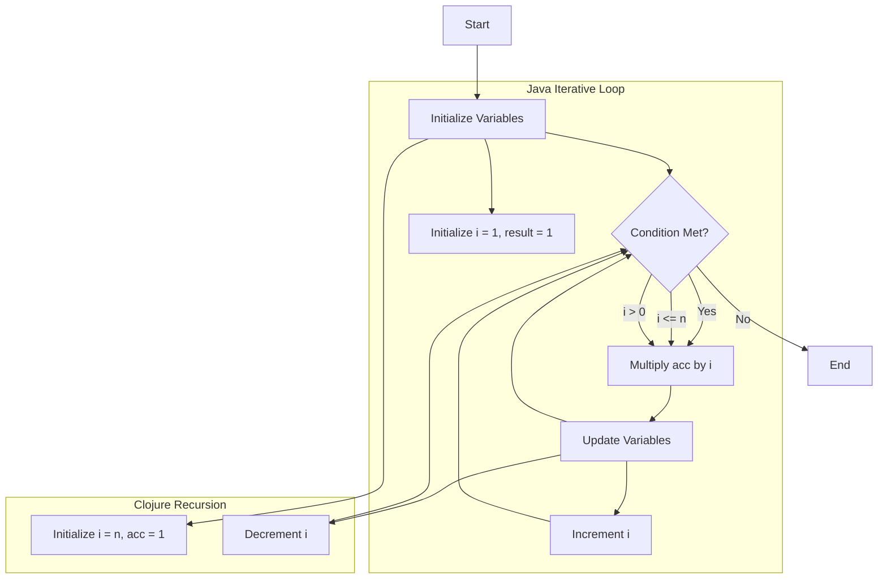

## 7.8.3 Advantages and Trade-offs

In this section, we will delve into the advantages and trade-offs of using recursion in Clojure compared to iterative loops in Java. As experienced Java developers, you are likely familiar with the traditional iterative constructs such as `for`, `while`, and `do-while` loops. Clojure, on the other hand, embraces recursion as a fundamental approach to iteration, which aligns with its functional programming paradigm. We will explore how these two approaches differ in terms of readability, maintainability, and performance, and how they can impact your development process.

### Understanding Iterative Loops in Java

Java's iterative loops are a staple in imperative programming, providing a straightforward way to repeat a block of code. Let's consider a simple example of calculating the sum of numbers from 1 to 10 using a `for` loop in Java:

```java
public class SumExample {
    public static void main(String[] args) {
        int sum = 0;
        for (int i = 1; i <= 10; i++) {
            sum += i; // Accumulate sum
        }
        System.out.println("Sum: " + sum); // Output the result
    }
}
```

**Key Characteristics of Java Iterative Loops:**

- **Explicit Control Flow:** Java loops provide explicit control over the iteration process, allowing developers to easily understand the flow of execution.
- **Mutable State:** Iterative loops often rely on mutable variables, which can lead to side effects if not managed carefully.
- **Performance:** Iterative loops are generally efficient in terms of performance, as they avoid the overhead of function calls associated with recursion.

### Embracing Recursion in Clojure

Clojure, as a functional language, encourages the use of recursion to achieve iteration. Here's how we can calculate the sum of numbers from 1 to 10 using recursion in Clojure:

```clojure
(defn sum [n]
  (if (zero? n)
    0
    (+ n (sum (dec n))))) ; Recursive call with decremented n

(println "Sum:" (sum 10)) ; Output the result
```

**Key Characteristics of Clojure Recursion:**

- **Immutable State:** Clojure's recursion leverages immutable data structures, reducing the risk of unintended side effects.
- **Tail Recursion Optimization:** Clojure supports tail recursion optimization through the `recur` keyword, allowing recursive functions to execute efficiently without growing the call stack.
- **Functional Paradigm:** Recursion aligns with Clojure's functional programming paradigm, promoting code that is often more concise and expressive.

### Advantages of Recursion in Clojure

1. **Enhanced Readability and Expressiveness:**
   - Recursion often leads to more concise and expressive code, as it eliminates the need for explicit loop constructs and mutable state.
   - Recursive functions can be easier to reason about, as they focus on the problem's logic rather than the mechanics of iteration.

2. **Immutability and Safety:**
   - By using immutable data structures, recursion in Clojure minimizes the risk of side effects, leading to safer and more predictable code.
   - This immutability also facilitates easier debugging and testing, as functions do not rely on external state.

3. **Alignment with Functional Programming:**
   - Recursion is a natural fit for functional programming, allowing developers to leverage higher-order functions and composition to build complex logic.
   - It encourages a declarative style of programming, where the focus is on what to compute rather than how to compute it.

4. **Tail Recursion Optimization:**
   - Clojure's support for tail recursion optimization ensures that recursive functions can execute efficiently without consuming excessive stack space.
   - This optimization allows developers to write recursive solutions for problems that would otherwise require iterative loops.

### Trade-offs of Recursion in Clojure

1. **Performance Considerations:**
   - While tail recursion optimization mitigates some performance concerns, recursion can still be less efficient than iterative loops for certain problems, especially those that require deep recursion.
   - Developers need to be mindful of the potential overhead associated with function calls in recursive solutions.

2. **Complexity in Non-Tail Recursion:**
   - Non-tail recursive functions can lead to stack overflow errors if the recursion depth exceeds the stack limit.
   - Developers must carefully design recursive functions to ensure they are tail-recursive or manage stack usage appropriately.

3. **Learning Curve:**
   - For developers accustomed to imperative programming, transitioning to a recursive mindset can be challenging.
   - Understanding and applying recursion effectively requires a shift in thinking, which may take time to master.

### Comparing Java Iterative Loops and Clojure Recursion

To better understand the differences between Java's iterative loops and Clojure's recursion, let's compare them side by side:

| Aspect                  | Java Iterative Loops                   | Clojure Recursion                        |
|-------------------------|----------------------------------------|------------------------------------------|
| **Control Flow**        | Explicit control with loop constructs  | Implicit control through recursive calls |
| **State Management**    | Relies on mutable state                | Utilizes immutable data structures       |
| **Performance**         | Generally efficient                    | Tail recursion optimization available    |
| **Readability**         | Can be verbose                         | Often more concise and expressive        |
| **Error Handling**      | Requires manual handling               | Recursion depth can lead to stack overflow|
| **Paradigm Alignment**  | Imperative                             | Functional                               |

### Code Example: Factorial Calculation

Let's explore a more complex example: calculating the factorial of a number. We'll implement this in both Java and Clojure to highlight the differences.

**Java Implementation:**

```java
public class FactorialExample {
    public static int factorial(int n) {
        int result = 1;
        for (int i = 1; i <= n; i++) {
            result *= i; // Multiply result by i
        }
        return result;
    }

    public static void main(String[] args) {
        System.out.println("Factorial: " + factorial(5)); // Output the result
    }
}
```

**Clojure Implementation:**

```clojure
(defn factorial [n]
  (loop [i n acc 1]
    (if (zero? i)
      acc
      (recur (dec i) (* acc i))))) ; Tail-recursive call with updated accumulator

(println "Factorial:" (factorial 5)) ; Output the result
```

**Analysis:**

- **Java's Iterative Approach:** The Java implementation uses a `for` loop to iterate from 1 to `n`, multiplying the result by each number. This approach is straightforward but relies on mutable state.
- **Clojure's Recursive Approach:** The Clojure implementation uses a `loop` construct with `recur` to achieve tail recursion. This approach is more aligned with functional programming principles, using an accumulator to maintain state.

### Try It Yourself: Experimenting with Recursion

To deepen your understanding of recursion in Clojure, try modifying the factorial function to handle edge cases, such as negative numbers or zero. Consider implementing additional recursive functions, such as calculating the Fibonacci sequence or finding the greatest common divisor (GCD) of two numbers.

### Visualizing Recursion and Iteration

To further illustrate the differences between recursion and iteration, let's use a flowchart to visualize the process of calculating the factorial of a number in both Java and Clojure.



**Diagram Description:** This flowchart illustrates the iterative process of calculating the factorial in Java and the recursive process in Clojure. The Java loop explicitly controls the iteration, while Clojure's recursion implicitly manages the flow through recursive calls.

### Exercises: Applying Recursion in Clojure

1. **Implement a Recursive Function:** Write a recursive function in Clojure to calculate the nth Fibonacci number. Ensure that your function is tail-recursive to handle large values of n efficiently.

2. **Refactor an Iterative Java Loop:** Take an existing Java program that uses iterative loops and refactor it into a recursive Clojure function. Compare the readability and performance of both implementations.

3. **Explore Recursive Data Structures:** Implement a recursive function to traverse a binary tree in Clojure. Consider how recursion can simplify the traversal process compared to iterative approaches.

### Key Takeaways

- **Recursion in Clojure** offers enhanced readability, expressiveness, and alignment with functional programming principles, but it requires careful consideration of performance and stack usage.
- **Iterative Loops in Java** provide explicit control and efficient performance but rely on mutable state, which can lead to side effects.
- **Tail Recursion Optimization** in Clojure mitigates some performance concerns, allowing recursive functions to execute efficiently.
- **Understanding the Trade-offs** between recursion and iteration is crucial for making informed decisions in your development process.

By embracing recursion in Clojure, you can leverage the power of functional programming to write more concise, expressive, and maintainable code. As you continue your journey from Java to Clojure, consider how these concepts can enhance your development process and lead to more robust applications.

### Further Reading

- [Official Clojure Documentation](https://clojure.org/reference/reader)
- [ClojureDocs: Recursion](https://clojuredocs.org/clojure.core/recur)
- [Java Tutorials: Control Flow Statements](https://docs.oracle.com/javase/tutorial/java/nutsandbolts/flow.html)

---

## Quiz: Mastering Recursion and Iteration in Clojure and Java



### What is a key advantage of using recursion in Clojure over iterative loops in Java?

- [x] Immutability and reduced side effects
- [ ] Explicit control flow
- [ ] Better performance in all cases
- [ ] Simpler syntax

> **Explanation:** Recursion in Clojure leverages immutable data structures, reducing side effects and enhancing code safety.

### How does Clojure handle recursion efficiently?

- [x] Tail recursion optimization
- [ ] Loop unrolling
- [ ] Inline expansion
- [ ] Stack expansion

> **Explanation:** Clojure supports tail recursion optimization, allowing recursive functions to execute without growing the call stack.

### Which of the following is a trade-off of using recursion in Clojure?

- [x] Potential stack overflow in non-tail recursive functions
- [ ] Lack of expressiveness
- [ ] Inability to handle complex logic
- [ ] Difficulty in managing state

> **Explanation:** Non-tail recursive functions can lead to stack overflow if the recursion depth exceeds the stack limit.

### What is a common characteristic of iterative loops in Java?

- [x] Reliance on mutable state
- [ ] Use of immutable data structures
- [ ] Implicit control flow
- [ ] Functional paradigm alignment

> **Explanation:** Iterative loops in Java often rely on mutable variables, which can lead to side effects.

### Which of the following best describes the alignment of recursion with functional programming?

- [x] Recursion promotes a declarative style of programming
- [ ] Recursion is primarily used for performance optimization
- [ ] Recursion is less expressive than iterative loops
- [ ] Recursion requires mutable state

> **Explanation:** Recursion aligns with functional programming by promoting a declarative style, focusing on what to compute rather than how to compute it.

### What is a potential drawback of using iterative loops in Java?

- [x] Reliance on mutable state can lead to side effects
- [ ] Lack of performance optimization
- [ ] Difficulty in expressing complex logic
- [ ] Incompatibility with modern programming paradigms

> **Explanation:** Iterative loops often rely on mutable state, which can lead to unintended side effects if not managed carefully.

### How can developers mitigate performance concerns with recursion in Clojure?

- [x] Ensure functions are tail-recursive
- [ ] Use mutable variables
- [ ] Avoid recursion altogether
- [ ] Rely on external libraries

> **Explanation:** Ensuring functions are tail-recursive allows them to execute efficiently without consuming excessive stack space.

### What is a benefit of using recursion for data structure traversal?

- [x] Simplifies the traversal process
- [ ] Requires less memory
- [ ] Provides explicit control flow
- [ ] Eliminates the need for function calls

> **Explanation:** Recursion can simplify the traversal process by naturally expressing the logic of traversing data structures like trees.

### Which of the following is true about tail recursion optimization in Clojure?

- [x] It allows recursive functions to execute without growing the call stack
- [ ] It is automatically applied to all recursive functions
- [ ] It eliminates the need for recursion
- [ ] It improves performance in all cases

> **Explanation:** Tail recursion optimization allows recursive functions to execute efficiently without consuming additional stack space.

### True or False: Recursion in Clojure always provides better performance than iterative loops in Java.

- [ ] True
- [x] False

> **Explanation:** While recursion offers many advantages, it does not always provide better performance than iterative loops, especially in cases of deep recursion without tail recursion optimization.




