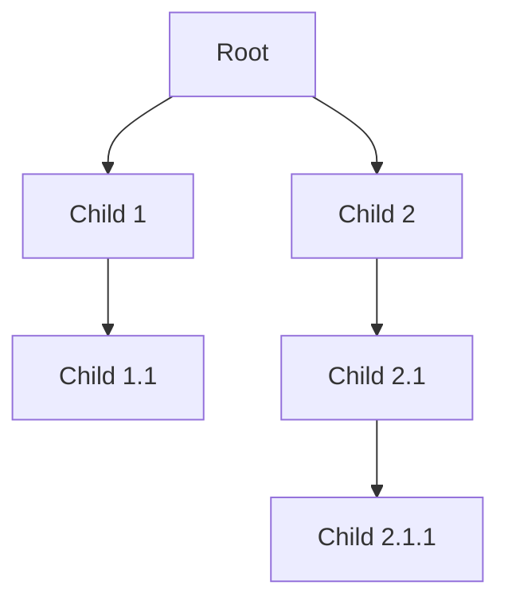
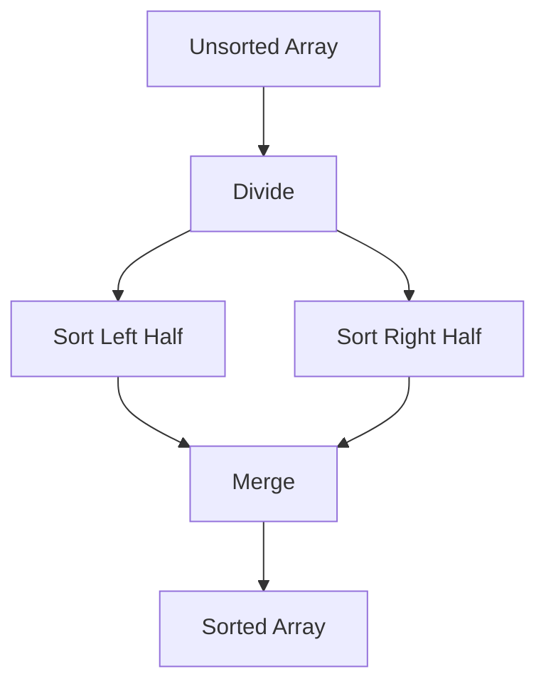
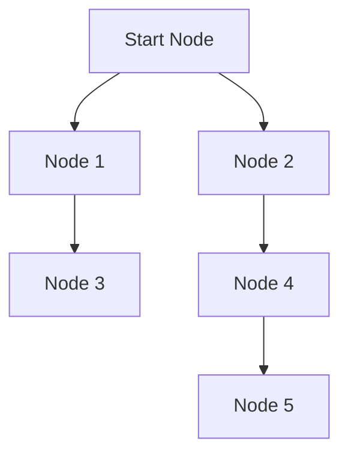
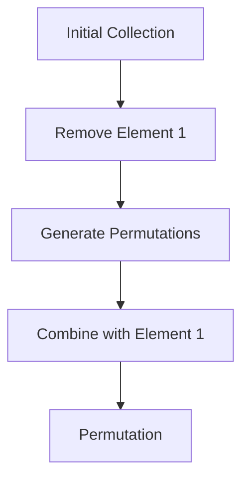

## 7.9.1 Appropriate Use Cases for Recursion in Clojure

Recursion is a fundamental concept in functional programming, and Clojure, as a Lisp dialect, embraces recursion as a primary mechanism for iteration and problem-solving. In this section, we will explore the appropriate use cases for recursion in Clojure, focusing on scenarios where recursion is a natural fit, such as processing hierarchical data structures or solving problems that are inherently recursive in nature.

### Understanding Recursion in Clojure

Before diving into specific use cases, let's briefly review what recursion is and how it is implemented in Clojure. Recursion is a technique where a function calls itself in order to solve a problem. In Clojure, recursion is often used in place of traditional loops found in imperative languages like Java.

#### Tail Recursion and `recur`

Clojure provides a special form called `recur` to optimize recursive calls, allowing them to be executed in constant stack space. This is known as tail recursion. When a recursive call is the last operation in a function, Clojure can optimize it to avoid growing the call stack, preventing stack overflow errors.

Here's a simple example of a tail-recursive function using `recur`:

```clojure
(defn factorial [n]
  (letfn [(fact-helper [acc n]
            (if (zero? n)
              acc
              (recur (* acc n) (dec n))))]
    (fact-helper 1 n)))

;; Usage
(factorial 5) ; => 120
```

In this example, `fact-helper` is a helper function that uses `recur` to perform the recursive call. The `recur` keyword ensures that the recursion is optimized for tail calls.

### Appropriate Use Cases for Recursion

Now that we have a basic understanding of recursion in Clojure, let's explore some scenarios where recursion is particularly well-suited.

#### 1. Processing Hierarchical Data Structures

One of the most common use cases for recursion is processing hierarchical data structures, such as trees or nested lists. Hierarchical data is naturally recursive, as each node can contain other nodes of the same type.

**Example: Calculating the Depth of a Tree**

Consider a tree data structure where each node can have multiple children. We can use recursion to calculate the depth of the tree:

```clojure
(defn tree-depth [tree]
  (if (empty? tree)
    0
    (inc (apply max (map tree-depth (rest tree))))))

;; Example tree: [1 [2 [3]] [4]]
(tree-depth [1 [2 [3]] [4]]) ; => 3
```

In this example, `tree-depth` recursively calculates the depth of each subtree and returns the maximum depth plus one for the current node.

**Diagram: Tree Depth Calculation**



*This diagram represents a tree structure where each node can have multiple children. The depth of the tree is calculated recursively by finding the maximum depth of its subtrees.*

#### 2. Solving Problems Defined Recursively

Some problems are inherently recursive in nature, meaning they can be broken down into smaller subproblems of the same type. Recursion is a natural fit for these problems.

**Example: Fibonacci Sequence**

The Fibonacci sequence is a classic example of a problem that can be defined recursively. Each term in the sequence is the sum of the two preceding terms.

```clojure
(defn fibonacci [n]
  (cond
    (= n 0) 0
    (= n 1) 1
    :else (+ (fibonacci (- n 1)) (fibonacci (- n 2)))))

;; Usage
(fibonacci 5) ; => 5
```

While this implementation is straightforward, it is not efficient due to repeated calculations. In practice, we would use memoization or an iterative approach to improve performance.

**Diagram: Fibonacci Sequence Calculation**

```mermaid
graph TD;
    F5[Fibonacci(5)] --> F4[Fibonacci(4)];
    F5 --> F3[Fibonacci(3)];
    F4 --> F3;
    F4 --> F2[Fibonacci(2)];
    F3 --> F2;
    F3 --> F1[Fibonacci(1)];
    F2 --> F1;
    F2 --> F0[Fibonacci(0)];
```

*This diagram illustrates the recursive calls made to calculate the Fibonacci sequence. Each call breaks down the problem into smaller subproblems.*

#### 3. Implementing Divide and Conquer Algorithms

Divide and conquer is a powerful algorithmic paradigm that involves breaking a problem into smaller subproblems, solving each subproblem recursively, and combining the results. Recursion is a natural fit for implementing divide and conquer algorithms.

**Example: Merge Sort**

Merge sort is a classic divide and conquer algorithm that sorts an array by recursively dividing it into halves, sorting each half, and merging the sorted halves.

```clojure
(defn merge-sort [coll]
  (if (<= (count coll) 1)
    coll
    (let [mid (quot (count coll) 2)
          left (subvec coll 0 mid)
          right (subvec coll mid)]
      (merge (merge-sort left) (merge-sort right)))))

(defn merge [left right]
  (loop [result [] l left r right]
    (cond
      (empty? l) (into result r)
      (empty? r) (into result l)
      :else (if (< (first l) (first r))
              (recur (conj result (first l)) (rest l) r)
              (recur (conj result (first r)) l (rest r))))))

;; Usage
(merge-sort [3 1 4 1 5 9 2 6 5 3 5]) ; => [1 1 2 3 3 4 5 5 5 6 9]
```

In this example, `merge-sort` recursively divides the collection into halves and sorts each half using the `merge` function.

**Diagram: Merge Sort Process**



*This diagram represents the process of merge sort, where the array is divided into halves, each half is sorted recursively, and the sorted halves are merged.*

#### 4. Traversing Graphs and Networks

Recursion is also useful for traversing graphs and networks, where each node can have multiple connections to other nodes. Depth-first search (DFS) is a common graph traversal algorithm that can be implemented recursively.

**Example: Depth-First Search**

```clojure
(defn dfs [graph start visited]
  (if (contains? visited start)
    visited
    (reduce #(dfs graph %1 %2) (conj visited start) (graph start))))

;; Example graph represented as an adjacency list
(def graph {:a [:b :c]
            :b [:d :e]
            :c [:f]
            :d []
            :e [:f]
            :f []})

;; Usage
(dfs graph :a #{}) ; => #{:a :b :c :d :e :f}
```

In this example, `dfs` recursively visits each node in the graph, marking it as visited.

**Diagram: Depth-First Search Traversal**



*This diagram illustrates the depth-first search traversal, where each node is visited recursively.*

#### 5. Generating Combinatorial Structures

Recursion is well-suited for generating combinatorial structures, such as permutations and combinations, where each solution can be built incrementally by adding elements.

**Example: Generating Permutations**

```clojure
(defn permutations [coll]
  (if (empty? coll)
    '(())
    (for [x coll
          p (permutations (remove #{x} coll))]
      (cons x p))))

;; Usage
(permutations [1 2 3]) ; => ((1 2 3) (1 3 2) (2 1 3) (2 3 1) (3 1 2) (3 2 1))
```

In this example, `permutations` recursively generates all permutations of a collection by removing each element and generating permutations of the remaining elements.

**Diagram: Permutation Generation**



*This diagram represents the process of generating permutations, where each element is removed, permutations are generated for the remaining elements, and the element is combined with each permutation.*

### Comparing Recursion in Clojure and Java

While recursion is a powerful tool in Clojure, Java developers may be more accustomed to using iterative constructs like loops. Let's compare recursion in Clojure with Java's iterative approach.

**Java Example: Factorial Calculation**

```java
public class Factorial {
    public static int factorial(int n) {
        int result = 1;
        for (int i = 1; i <= n; i++) {
            result *= i;
        }
        return result;
    }

    public static void main(String[] args) {
        System.out.println(factorial(5)); // Output: 120
    }
}
```

In Java, the factorial calculation is implemented using a loop, which is more familiar to Java developers. However, this approach lacks the elegance and expressiveness of Clojure's recursive solution.

**Clojure Example: Factorial Calculation**

```clojure
(defn factorial [n]
  (letfn [(fact-helper [acc n]
            (if (zero? n)
              acc
              (recur (* acc n) (dec n))))]
    (fact-helper 1 n)))

;; Usage
(factorial 5) ; => 120
```

In Clojure, the recursive solution is concise and leverages the power of tail recursion for efficiency.

### Try It Yourself: Experimenting with Recursion

Now that we've explored various use cases for recursion in Clojure, let's encourage you to experiment with the examples provided. Try modifying the code to solve different problems or optimize the solutions.

**Challenge: Implement a Recursive Function to Calculate the Sum of a List**

Write a recursive function in Clojure to calculate the sum of a list of numbers. Consider using tail recursion to optimize the solution.

**Solution:**

```clojure
(defn sum-list [coll]
  (letfn [(sum-helper [acc coll]
            (if (empty? coll)
              acc
              (recur (+ acc (first coll)) (rest coll))))]
    (sum-helper 0 coll)))

;; Usage
(sum-list [1 2 3 4 5]) ; => 15
```

### Key Takeaways

- **Recursion is a powerful tool** in Clojure for solving problems that are naturally recursive or involve hierarchical data structures.
- **Tail recursion** is an important optimization technique in Clojure, allowing recursive functions to execute in constant stack space.
- **Recursion is well-suited** for processing hierarchical data, solving recursive problems, implementing divide and conquer algorithms, traversing graphs, and generating combinatorial structures.
- **Clojure's recursive solutions** are often more elegant and expressive than iterative solutions in Java, highlighting the strengths of functional programming.

By understanding and applying recursion effectively, you can leverage Clojure's functional programming capabilities to solve complex problems with simplicity and elegance.

### Further Reading

For more information on recursion and functional programming in Clojure, consider exploring the following resources:

- [Official Clojure Documentation](https://clojure.org/)
- [ClojureDocs](https://clojuredocs.org/)
- [Functional Programming in Clojure](https://www.braveclojure.com/)

Now that we've explored the appropriate use cases for recursion in Clojure, let's continue to build on these concepts and apply them to more advanced topics in functional programming.

## Quiz: Test Your Understanding of Recursion in Clojure



### Which of the following is a natural fit for recursion in Clojure?

- [x] Processing hierarchical data structures
- [ ] Iterating over a flat list
- [ ] Performing simple arithmetic operations
- [ ] Managing application state

> **Explanation:** Recursion is particularly well-suited for processing hierarchical data structures, where each node can contain other nodes of the same type.

### What is the purpose of the `recur` keyword in Clojure?

- [x] To optimize recursive calls for tail recursion
- [ ] To define a recursive function
- [ ] To terminate a recursive function
- [ ] To handle exceptions in recursive functions

> **Explanation:** The `recur` keyword is used to optimize recursive calls for tail recursion, allowing them to be executed in constant stack space.

### Which algorithmic paradigm is a natural fit for recursion?

- [x] Divide and conquer
- [ ] Greedy algorithms
- [ ] Dynamic programming
- [ ] Backtracking

> **Explanation:** Divide and conquer is a natural fit for recursion, as it involves breaking a problem into smaller subproblems and solving each recursively.

### How does Clojure's recursive solution for calculating the factorial differ from Java's iterative solution?

- [x] Clojure's solution uses recursion and tail call optimization
- [ ] Clojure's solution uses loops and iteration
- [ ] Java's solution is more concise
- [ ] Java's solution uses recursion and tail call optimization

> **Explanation:** Clojure's solution uses recursion and tail call optimization, while Java's solution typically uses loops and iteration.

### What is a common use case for depth-first search (DFS) in graphs?

- [x] Traversing all nodes in a graph
- [ ] Sorting a list of numbers
- [ ] Calculating the sum of a list
- [ ] Managing application state

> **Explanation:** Depth-first search (DFS) is commonly used for traversing all nodes in a graph, visiting each node recursively.

### Which of the following problems can be defined recursively?

- [x] Fibonacci sequence
- [ ] Sorting a list using bubble sort
- [ ] Calculating the average of a list
- [ ] Managing application configuration

> **Explanation:** The Fibonacci sequence is a classic example of a problem that can be defined recursively, where each term is the sum of the two preceding terms.

### What is the advantage of using tail recursion in Clojure?

- [x] It allows recursive functions to execute in constant stack space
- [ ] It simplifies the syntax of recursive functions
- [ ] It improves the readability of recursive functions
- [ ] It eliminates the need for base cases in recursive functions

> **Explanation:** Tail recursion allows recursive functions to execute in constant stack space, preventing stack overflow errors.

### Which of the following is an example of a hierarchical data structure?

- [x] A tree
- [ ] A flat list
- [ ] A single integer
- [ ] A boolean value

> **Explanation:** A tree is an example of a hierarchical data structure, where each node can have multiple children.

### What is the purpose of the `letfn` construct in Clojure?

- [x] To define local functions within a function
- [ ] To declare global variables
- [ ] To handle exceptions
- [ ] To perform arithmetic operations

> **Explanation:** The `letfn` construct is used to define local functions within a function, allowing for recursive helper functions.

### True or False: Recursion is always more efficient than iteration in Clojure.

- [ ] True
- [x] False

> **Explanation:** While recursion is a powerful tool in Clojure, it is not always more efficient than iteration. Tail recursion can optimize recursive calls, but in some cases, iterative solutions may be more efficient.


