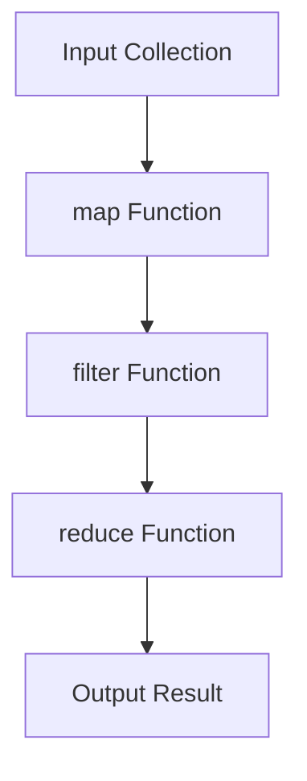

## 7.9.2 Alternatives to Recursion

In the world of functional programming, recursion is often the go-to technique for iterating over data structures. However, recursion isn't always the most efficient or readable approach, especially when dealing with large datasets or when performance is a critical concern. In this section, we'll explore alternatives to recursion in Clojure, such as sequence functions and iteration, and discuss when these alternatives might be more suitable.

### Understanding the Limitations of Recursion

Before diving into alternatives, it's important to understand why recursion might not always be the best choice. In Clojure, recursion can lead to stack overflow errors if not implemented with tail recursion, especially when processing large collections. Additionally, recursive solutions can sometimes be less intuitive and harder to read, particularly for developers transitioning from imperative languages like Java.

### Sequence Functions: A Powerful Alternative

Clojure provides a rich set of sequence functions that can often replace recursion. These functions are designed to work with Clojure's immutable data structures and offer a more declarative approach to data processing.

#### Using `map`, `filter`, and `reduce`

The `map`, `filter`, and `reduce` functions are foundational in Clojure's sequence processing toolkit. They allow you to transform, filter, and aggregate data without explicitly writing recursive functions.

**Example: Using `map` to Transform a Collection**

```clojure
;; Transform a list of numbers by doubling each value
(def numbers [1 2 3 4 5])

(def doubled-numbers (map #(* 2 %) numbers))
;; doubled-numbers => (2 4 6 8 10)

;; Explanation: The `map` function applies the anonymous function `#(* 2 %)` to each element in `numbers`.
```

**Example: Using `filter` to Select Elements**

```clojure
;; Filter out even numbers from a list
(def numbers [1 2 3 4 5 6])

(def odd-numbers (filter odd? numbers))
;; odd-numbers => (1 3 5)

;; Explanation: The `filter` function retains only the elements that satisfy the `odd?` predicate.
```

**Example: Using `reduce` to Aggregate Data**

```clojure
;; Sum a list of numbers
(def numbers [1 2 3 4 5])

(def sum (reduce + numbers))
;; sum => 15

;; Explanation: The `reduce` function aggregates the elements of `numbers` using the `+` function.
```

### Iteration with Loop Constructs

While Clojure emphasizes functional programming, it also provides constructs for iteration that can be more familiar to Java developers.

#### The `loop` and `recur` Constructs

Clojure's `loop` and `recur` constructs allow for iteration without the risk of stack overflow. They provide a way to implement tail-recursive functions in a more iterative style.

**Example: Using `loop` and `recur` for Iteration**

```clojure
;; Calculate the factorial of a number using loop and recur
(defn factorial [n]
  (loop [acc 1, i n]
    (if (zero? i)
      acc
      (recur (* acc i) (dec i)))))

(factorial 5)
;; => 120

;; Explanation: The `loop` establishes a recursive loop with initial bindings for `acc` and `i`.
;; The `recur` keyword rebinds these variables for the next iteration.
```

### Leveraging Laziness with Lazy Sequences

Clojure's lazy sequences provide another alternative to recursion. Lazy sequences allow you to work with potentially infinite data structures without evaluating the entire sequence at once.

#### Creating and Using Lazy Sequences

Lazy sequences can be created using functions like `lazy-seq`, `iterate`, and `range`.

**Example: Using `range` to Create a Lazy Sequence**

```clojure
;; Create an infinite sequence of natural numbers
(def naturals (range))

;; Take the first 10 numbers from the sequence
(take 10 naturals)
;; => (0 1 2 3 4 5 6 7 8 9)

;; Explanation: The `range` function generates an infinite sequence, and `take` extracts the first 10 elements.
```

### Comparing with Java's Iterative Constructs

Java developers are accustomed to using loops for iteration. Let's compare how similar tasks are accomplished in Java and Clojure.

**Java Example: Iterating with a For Loop**

```java
// Java: Calculate the sum of an array of numbers
int[] numbers = {1, 2, 3, 4, 5};
int sum = 0;

for (int number : numbers) {
    sum += number;
}

// sum => 15

// Explanation: The for-each loop iterates over the array, accumulating the sum.
```

**Clojure Equivalent: Using `reduce`**

```clojure
;; Clojure: Calculate the sum using reduce
(def numbers [1 2 3 4 5])

(def sum (reduce + numbers))
;; sum => 15

;; Explanation: The `reduce` function provides a concise and functional way to achieve the same result.
```

### When to Choose Alternatives Over Recursion

Choosing between recursion and its alternatives depends on several factors:

- **Performance**: Sequence functions and iteration constructs can be more efficient than recursion, especially for large datasets.
- **Readability**: Declarative sequence functions often lead to more readable and maintainable code.
- **Stack Safety**: Iterative constructs like `loop` and `recur` avoid stack overflow issues associated with deep recursion.
- **Familiarity**: Developers transitioning from Java may find iterative constructs more intuitive.

### Try It Yourself

Experiment with the following code snippets to deepen your understanding:

1. Modify the `factorial` function to calculate the factorial of a number using `reduce`.
2. Create a lazy sequence of Fibonacci numbers and extract the first 20 elements.
3. Use `map` and `filter` to transform and filter a collection of strings based on length.

### Diagrams and Visual Aids

To further illustrate these concepts, let's use a Mermaid.js diagram to visualize the flow of data through sequence functions.



**Diagram Explanation**: This flowchart illustrates how data is transformed and processed through a series of sequence functions, resulting in an output.

### Further Reading

For more information on Clojure's sequence functions and iteration constructs, consider exploring the following resources:

- [Official Clojure Documentation](https://clojure.org/reference/sequences)
- [ClojureDocs](https://clojuredocs.org/)
- [GitHub - Clojure Examples](https://github.com/clojure-examples)

### Exercises and Practice Problems

1. **Exercise**: Implement a function that calculates the nth Fibonacci number using `loop` and `recur`.
2. **Challenge**: Refactor a recursive function that calculates the sum of a nested list into a version that uses `reduce` and `map`.
3. **Practice Problem**: Create a lazy sequence that generates prime numbers and extract the first 50 primes.

### Key Takeaways

- **Sequence Functions**: Offer a declarative and efficient alternative to recursion for data processing.
- **Iteration Constructs**: Provide stack-safe iteration, familiar to Java developers.
- **Lazy Sequences**: Enable working with infinite data structures without full evaluation.
- **Choosing the Right Tool**: Consider performance, readability, and familiarity when selecting between recursion and its alternatives.

By understanding and leveraging these alternatives, you can write more efficient, readable, and maintainable Clojure code. Now that we've explored these concepts, let's apply them to manage data processing tasks effectively in your applications.

## Quiz: Mastering Alternatives to Recursion in Clojure



### Which Clojure function is used to transform each element in a collection?

- [x] map
- [ ] filter
- [ ] reduce
- [ ] loop

> **Explanation:** The `map` function applies a given function to each element in a collection, transforming it.

### What is the primary advantage of using `reduce` over recursion for aggregation?

- [x] Stack safety
- [ ] Simplicity
- [ ] Familiarity
- [ ] Flexibility

> **Explanation:** `reduce` is stack-safe and can handle large datasets without risk of stack overflow.

### Which construct in Clojure allows for iteration without stack overflow?

- [x] loop and recur
- [ ] map and filter
- [ ] reduce and apply
- [ ] lazy-seq and iterate

> **Explanation:** `loop` and `recur` provide a way to perform iteration without stack overflow by reusing the same stack frame.

### How does Clojure's `filter` function work?

- [x] It retains elements that satisfy a predicate.
- [ ] It removes elements that satisfy a predicate.
- [ ] It transforms each element in a collection.
- [ ] It aggregates elements into a single value.

> **Explanation:** `filter` retains elements in a collection that satisfy the given predicate function.

### What is a key benefit of using lazy sequences in Clojure?

- [x] They allow working with infinite data structures.
- [ ] They improve code readability.
- [ ] They simplify error handling.
- [ ] They enhance security.

> **Explanation:** Lazy sequences enable working with potentially infinite data structures without evaluating the entire sequence at once.

### Which Java construct is most similar to Clojure's `loop` and `recur`?

- [x] For loop
- [ ] While loop
- [ ] Do-while loop
- [ ] Switch statement

> **Explanation:** The `for` loop in Java is similar to `loop` and `recur` in Clojure, as both provide a way to iterate over data.

### What is the purpose of the `recur` keyword in Clojure?

- [x] To perform tail recursion
- [ ] To declare a variable
- [ ] To define a function
- [ ] To create a lazy sequence

> **Explanation:** `recur` is used to perform tail recursion by re-invoking the loop with new arguments.

### Which sequence function would you use to sum a collection of numbers?

- [x] reduce
- [ ] map
- [ ] filter
- [ ] iterate

> **Explanation:** `reduce` is used to aggregate elements in a collection, such as summing numbers.

### What is a common use case for the `map` function in Clojure?

- [x] Transforming each element in a collection
- [ ] Filtering elements based on a condition
- [ ] Aggregating elements into a single value
- [ ] Iterating over a collection with side effects

> **Explanation:** `map` is commonly used to apply a function to each element in a collection, transforming it.

### True or False: Lazy sequences in Clojure are evaluated immediately.

- [ ] True
- [x] False

> **Explanation:** Lazy sequences are not evaluated immediately; they are evaluated on demand.


