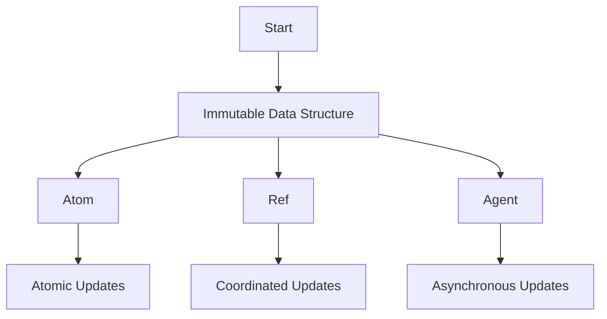

## 8.1.1 Understanding Concurrency in Modern Applications

### Introduction

In today's fast-paced digital world, the demand for high-performance and responsive applications is greater than ever. With the advent of multi-core processors and distributed systems, concurrency has become a crucial aspect of modern software development. Concurrency allows multiple computations to occur simultaneously, leading to improved performance and responsiveness. However, managing concurrency is not without its challenges. Developers often encounter issues such as race conditions, deadlocks, and the complexity of coordinating shared mutable state. In this section, we will explore the importance of concurrency, the challenges it presents, and how Clojure's concurrency model offers solutions to these problems.

### The Importance of Concurrency

Concurrency is essential for maximizing the utilization of modern hardware. With multi-core processors becoming the norm, applications that can perform multiple tasks simultaneously can achieve significant performance gains. Concurrency is also vital in distributed systems, where tasks are spread across multiple machines. This parallel execution can lead to faster processing times and more efficient resource usage.

#### Benefits of Concurrency

1. **Improved Performance**: By executing multiple tasks at once, applications can make better use of available CPU resources, leading to faster processing times.
2. **Increased Responsiveness**: Concurrency allows applications to remain responsive to user input while performing background tasks.
3. **Scalability**: Concurrency enables applications to handle more tasks simultaneously, making them more scalable and capable of handling increased loads.

### Challenges of Concurrency

While concurrency offers numerous benefits, it also introduces several challenges that developers must address to ensure correct and efficient program execution.

#### Race Conditions

A race condition occurs when the behavior of a software system depends on the relative timing of events, such as the order in which threads execute. This can lead to unpredictable and incorrect results, as multiple threads may attempt to modify shared data simultaneously.

**Java Example of a Race Condition:**

```java
public class Counter {
    private int count = 0;

    public void increment() {
        count++;
    }

    public int getCount() {
        return count;
    }
}

Counter counter = new Counter();
Thread t1 = new Thread(() -> {
    for (int i = 0; i < 1000; i++) {
        counter.increment();
    }
});
Thread t2 = new Thread(() -> {
    for (int i = 0; i < 1000; i++) {
        counter.increment();
    }
});
t1.start();
t2.start();
t1.join();
t2.join();
System.out.println(counter.getCount()); // Output may not be 2000 due to race condition
```

In this example, the `increment` method is not synchronized, leading to a race condition where the final count may not be 2000 as expected.

#### Deadlocks

Deadlocks occur when two or more threads are blocked forever, waiting for each other to release resources. This situation can bring a system to a halt and is often difficult to detect and resolve.

**Java Example of a Deadlock:**

```java
public class DeadlockExample {
    private final Object lock1 = new Object();
    private final Object lock2 = new Object();

    public void method1() {
        synchronized (lock1) {
            synchronized (lock2) {
                // Critical section
            }
        }
    }

    public void method2() {
        synchronized (lock2) {
            synchronized (lock1) {
                // Critical section
            }
        }
    }
}

DeadlockExample example = new DeadlockExample();
Thread t1 = new Thread(example::method1);
Thread t2 = new Thread(example::method2);
t1.start();
t2.start();
```

In this example, `method1` and `method2` can cause a deadlock if `t1` locks `lock1` and waits for `lock2`, while `t2` locks `lock2` and waits for `lock1`.

#### Shared Mutable State

Managing shared mutable state is one of the most challenging aspects of concurrent programming. When multiple threads access and modify shared data, it can lead to inconsistencies and errors.

### Clojure's Approach to Concurrency

Clojure, a functional programming language that runs on the Java Virtual Machine (JVM), offers a unique approach to concurrency that addresses many of the challenges faced by Java developers. Clojure emphasizes immutability and provides powerful concurrency primitives that simplify the management of shared state.

#### Immutability

In Clojure, data structures are immutable by default. This means that once a data structure is created, it cannot be modified. Instead, operations on data structures return new versions, leaving the original unchanged. This immutability eliminates many of the issues associated with shared mutable state, as there is no risk of concurrent modifications leading to inconsistencies.

**Clojure Example of Immutability:**

```clojure
(def counter (atom 0))

(defn increment []
  (swap! counter inc))

(doseq [i (range 1000)]
  (future (increment)))

@counter ; The value will be 1000, as swap! ensures atomic updates
```

In this example, the `atom` provides a way to manage state changes safely, ensuring that updates are atomic and consistent.

#### Concurrency Primitives

Clojure provides several concurrency primitives that simplify the management of shared state:

1. **Atoms**: Used for managing independent, synchronous state changes.
2. **Refs**: Used for coordinated, synchronous state changes with Software Transactional Memory (STM).
3. **Agents**: Used for managing asynchronous state changes.

**Clojure Example Using Atoms:**

```clojure
(def counter (atom 0))

(defn increment []
  (swap! counter inc))

(doseq [i (range 1000)]
  (future (increment)))

@counter ; The value will be 1000, as swap! ensures atomic updates
```

In this example, the `atom` provides a way to manage state changes safely, ensuring that updates are atomic and consistent.

**Clojure Example Using Refs:**

```clojure
(def account1 (ref 1000))
(def account2 (ref 2000))

(defn transfer [from to amount]
  (dosync
    (alter from - amount)
    (alter to + amount)))

(transfer account1 account2 100)
```

In this example, `dosync` ensures that the transfer operation is atomic, preventing inconsistencies in the account balances.

**Clojure Example Using Agents:**

```clojure
(def agent-counter (agent 0))

(defn increment-agent [counter]
  (send counter inc))

(doseq [i (range 1000)]
  (increment-agent agent-counter))

(await agent-counter)
@agent-counter ; The value will be 1000
```

In this example, `agents` allow for asynchronous state changes, with `send` dispatching actions to be performed on the agent's state.

### Comparing Clojure and Java Concurrency

Clojure's concurrency model offers several advantages over traditional Java concurrency mechanisms:

- **Immutability**: Clojure's emphasis on immutability reduces the risk of race conditions and simplifies reasoning about state changes.
- **Concurrency Primitives**: Clojure's atoms, refs, and agents provide higher-level abstractions for managing state, reducing the complexity of coordinating shared state.
- **STM**: Clojure's Software Transactional Memory (STM) system allows for safe, coordinated state changes without the need for explicit locks.

**Java vs. Clojure Concurrency Example:**

```java
// Java
public class Counter {
    private int count = 0;

    public synchronized void increment() {
        count++;
    }

    public int getCount() {
        return count;
    }
}

Counter counter = new Counter();
Thread t1 = new Thread(() -> {
    for (int i = 0; i < 1000; i++) {
        counter.increment();
    }
});
Thread t2 = new Thread(() -> {
    for (int i = 0; i < 1000; i++) {
        counter.increment();
    }
});
t1.start();
t2.start();
t1.join();
t2.join();
System.out.println(counter.getCount()); // Output will be 2000
```

```clojure
;; Clojure
(def counter (atom 0))

(defn increment []
  (swap! counter inc))

(doseq [i (range 1000)]
  (future (increment)))

@counter ; The value will be 1000, as swap! ensures atomic updates
```

In the Java example, synchronization is required to ensure thread safety, while in Clojure, the use of `atom` and `swap!` provides a simpler and more elegant solution.

### Try It Yourself

To deepen your understanding of Clojure's concurrency model, try modifying the examples above. Experiment with different concurrency primitives and observe how they handle state changes. Consider the following challenges:

- Modify the `atom` example to use `refs` and `dosync` for coordinated state changes.
- Implement a simple banking system using `agents` to handle asynchronous transactions.
- Compare the performance of Clojure's concurrency primitives with Java's synchronized methods.

### Diagrams and Visualizations

To further illustrate the concepts discussed, let's look at some diagrams that depict the flow of data and state management in Clojure's concurrency model.



*Diagram 1: Flow of Data and State Management in Clojure's Concurrency Model*

This diagram illustrates how Clojure's concurrency primitives (atoms, refs, and agents) manage state changes, emphasizing immutability and atomic updates.

### Further Reading

For more information on Clojure's concurrency model and how it compares to Java, consider exploring the following resources:

- [Official Clojure Documentation](https://clojure.org/reference/concurrency)
- [ClojureDocs](https://clojuredocs.org/)
- [Java Concurrency in Practice](https://jcip.net/)

### Exercises

1. Implement a concurrent counter using Clojure's `refs` and compare its performance with the `atom` example.
2. Create a simple chat application using `agents` to handle message passing between users.
3. Explore the use of `futures` in Clojure for parallel processing and compare it with Java's `CompletableFuture`.

### Key Takeaways

- Concurrency is essential for maximizing the performance and responsiveness of modern applications.
- Clojure's concurrency model, with its emphasis on immutability and powerful concurrency primitives, offers a robust solution to the challenges of managing shared state.
- By leveraging Clojure's atoms, refs, and agents, developers can simplify the management of concurrent programs and reduce the risk of race conditions and deadlocks.

Now that we've explored the importance of concurrency and how Clojure addresses its challenges, let's apply these concepts to build more efficient and reliable applications.

## Quiz: Test Your Understanding of Concurrency in Modern Applications



### What is a race condition?

- [x] A situation where the behavior of a software system depends on the relative timing of events.
- [ ] A condition where two threads are waiting for each other to release resources.
- [ ] A method of synchronizing threads.
- [ ] A technique for improving performance.

> **Explanation:** A race condition occurs when the behavior of a software system depends on the relative timing of events, such as the order in which threads execute.

### What is the primary advantage of using immutability in concurrent programming?

- [x] It eliminates the risk of concurrent modifications leading to inconsistencies.
- [ ] It improves the performance of the application.
- [ ] It simplifies the syntax of the code.
- [ ] It allows for more flexible data structures.

> **Explanation:** Immutability eliminates the risk of concurrent modifications leading to inconsistencies, as data structures cannot be modified once created.

### Which Clojure primitive is used for managing asynchronous state changes?

- [ ] Atom
- [ ] Ref
- [x] Agent
- [ ] Var

> **Explanation:** Agents in Clojure are used for managing asynchronous state changes.

### What is a deadlock?

- [ ] A situation where multiple threads execute simultaneously.
- [x] A condition where two or more threads are blocked forever, waiting for each other to release resources.
- [ ] A method of improving application performance.
- [ ] A technique for managing shared state.

> **Explanation:** A deadlock occurs when two or more threads are blocked forever, waiting for each other to release resources.

### How does Clojure's Software Transactional Memory (STM) system help in concurrency?

- [x] It allows for safe, coordinated state changes without the need for explicit locks.
- [ ] It improves the performance of concurrent applications.
- [ ] It simplifies the syntax of concurrent code.
- [ ] It provides a way to manage asynchronous state changes.

> **Explanation:** Clojure's STM system allows for safe, coordinated state changes without the need for explicit locks, reducing the complexity of managing shared state.

### What is the primary purpose of using `swap!` with an atom in Clojure?

- [x] To ensure atomic updates to the atom's state.
- [ ] To perform asynchronous updates.
- [ ] To manage coordinated state changes.
- [ ] To improve the performance of the application.

> **Explanation:** `swap!` is used with an atom in Clojure to ensure atomic updates to the atom's state.

### Which of the following is a challenge of concurrency?

- [x] Race conditions
- [x] Deadlocks
- [ ] Improved performance
- [ ] Increased responsiveness

> **Explanation:** Race conditions and deadlocks are challenges of concurrency that developers must address to ensure correct and efficient program execution.

### What is the benefit of using Clojure's refs for state management?

- [x] They allow for coordinated, synchronous state changes.
- [ ] They improve the performance of the application.
- [ ] They simplify the syntax of the code.
- [ ] They provide a way to manage asynchronous state changes.

> **Explanation:** Clojure's refs allow for coordinated, synchronous state changes, ensuring consistency in shared state management.

### How does Clojure's concurrency model differ from Java's?

- [x] Clojure emphasizes immutability and provides higher-level concurrency primitives.
- [ ] Java provides a simpler concurrency model.
- [ ] Clojure requires explicit locks for managing shared state.
- [ ] Java does not support concurrent programming.

> **Explanation:** Clojure's concurrency model emphasizes immutability and provides higher-level concurrency primitives, simplifying the management of shared state compared to Java's explicit locks.

### True or False: Clojure's agents are used for synchronous state changes.

- [ ] True
- [x] False

> **Explanation:** False. Clojure's agents are used for asynchronous state changes.


