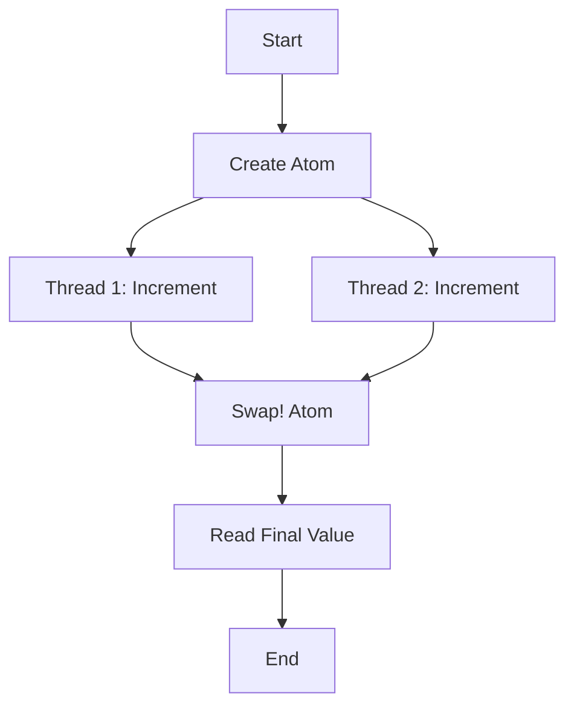

## 8.1.2 Issues with Shared Mutable State

In the realm of concurrent programming, shared mutable state is a notorious source of complexity and bugs. As Java developers, you may have encountered issues such as race conditions, deadlocks, and data inconsistency when multiple threads access and modify shared data. In this section, we will explore these challenges in detail and discuss how Clojure's approach to immutability and state management offers a robust solution.

### Understanding Shared Mutable State

**Shared mutable state** refers to data that can be accessed and modified by multiple threads simultaneously. In a multi-threaded environment, this can lead to unpredictable behavior, as the state of the data can change at any time due to actions performed by other threads.

#### Common Problems with Shared Mutable State

1. **Race Conditions**: Occur when the outcome of a program depends on the sequence or timing of uncontrollable events. For example, if two threads simultaneously increment a shared counter, the final value may not reflect both increments.

2. **Data Inconsistency**: When multiple threads read and write shared data without proper synchronization, it can lead to inconsistent or corrupted data states.

3. **Deadlocks**: Arise when two or more threads are blocked forever, each waiting for the other to release a lock.

4. **Synchronization Overhead**: Using locks to manage access to shared data can introduce significant overhead, reducing the performance benefits of concurrency.

#### Java Example: Shared Mutable State

Consider a simple Java example where multiple threads increment a shared counter:

```java
public class Counter {
    private int count = 0;

    public synchronized void increment() {
        count++;
    }

    public synchronized int getCount() {
        return count;
    }
}

public class CounterTest {
    public static void main(String[] args) throws InterruptedException {
        Counter counter = new Counter();
        Thread t1 = new Thread(() -> {
            for (int i = 0; i < 1000; i++) {
                counter.increment();
            }
        });

        Thread t2 = new Thread(() -> {
            for (int i = 0; i < 1000; i++) {
                counter.increment();
            }
        });

        t1.start();
        t2.start();
        t1.join();
        t2.join();

        System.out.println("Final count: " + counter.getCount());
    }
}
```

**Explanation**: In this example, the `increment` method is synchronized to prevent race conditions. However, synchronization introduces overhead and complexity, especially as the number of threads increases.

### Clojure's Approach to State Management

Clojure addresses the issues of shared mutable state by emphasizing **immutability**. In Clojure, data structures are immutable by default, meaning they cannot be changed once created. This eliminates many concurrency issues, as there is no shared mutable state to manage.

#### Immutable Data Structures

Clojure's core data structures (lists, vectors, maps, and sets) are immutable. When you "modify" a data structure, Clojure creates a new version with the changes, leaving the original unchanged.

```clojure
(def my-vector [1 2 3])
(def new-vector (conj my-vector 4))

(println my-vector)  ; Output: [1 2 3]
(println new-vector) ; Output: [1 2 3 4]
```

**Explanation**: The `conj` function adds an element to a collection, returning a new collection without altering the original.

#### Concurrency Primitives in Clojure

Clojure provides several concurrency primitives that allow you to manage state changes safely and efficiently:

1. **Atoms**: Provide a way to manage shared, synchronous, independent state. They are used for state that can be updated independently.

2. **Refs**: Used for coordinated, synchronous state changes. They leverage Software Transactional Memory (STM) to ensure consistency.

3. **Agents**: Allow for asynchronous state changes, suitable for tasks that can be performed independently and in parallel.

4. **Vars**: Provide thread-local state, useful for dynamic binding.

### Clojure Example: Using Atoms

Let's rewrite the Java counter example using Clojure's `atom`:

```clojure
(def counter (atom 0))

(defn increment-counter []
  (swap! counter inc))

(defn -main []
  (let [threads (repeatedly 2 #(Thread. increment-counter))]
    (doseq [t threads] (.start t))
    (doseq [t threads] (.join t))
    (println "Final count:" @counter)))
```

**Explanation**: The `atom` provides a way to manage shared state without locks. The `swap!` function applies a function (`inc` in this case) to the current value of the atom, ensuring atomic updates.

### Advantages of Clojure's Approach

- **Simplicity**: Immutability simplifies reasoning about code, as data cannot change unexpectedly.
- **Safety**: Eliminates many concurrency issues by avoiding shared mutable state.
- **Performance**: Reduces synchronization overhead, as immutable data structures do not require locks.

### Try It Yourself

Experiment with the Clojure example by modifying the number of threads or the function applied in `swap!`. Observe how Clojure handles state changes without synchronization issues.

### Diagrams and Visualizations

To better understand the flow of data and state management in Clojure, let's visualize the process using a diagram.



**Diagram Explanation**: This flowchart illustrates the process of managing state with an atom in Clojure. Multiple threads can safely update the atom using `swap!`, and the final value is read without synchronization issues.

### Further Reading

For more information on Clojure's concurrency model and immutable data structures, consider exploring the following resources:

- [Official Clojure Documentation](https://clojure.org/reference/concurrency)
- [ClojureDocs](https://clojuredocs.org/)
- [Clojure Programming by Chas Emerick, Brian Carper, and Christophe Grand](https://www.oreilly.com/library/view/clojure-programming/9781449310387/)

### Exercises

1. **Modify the Java Example**: Introduce a race condition by removing synchronization and observe the results.
2. **Experiment with Clojure Atoms**: Create a Clojure program that uses multiple atoms to manage different pieces of state.
3. **Compare Performance**: Measure the performance of the Java and Clojure examples with a large number of threads.

### Key Takeaways

- Shared mutable state in concurrent programming can lead to complex bugs and unpredictable behavior.
- Java requires explicit synchronization to manage shared state, which can introduce overhead.
- Clojure's immutable data structures and concurrency primitives offer a simpler, safer approach to state management.
- By eliminating shared mutable state, Clojure reduces the risk of concurrency issues and simplifies code reasoning.

Now that we've explored the challenges of shared mutable state and how Clojure addresses them, let's continue our journey into the world of functional programming and concurrency with confidence.

---

## Quiz: Understanding Shared Mutable State and Concurrency in Clojure



### What is shared mutable state?

- [x] Data that can be accessed and modified by multiple threads simultaneously.
- [ ] Data that is only read by multiple threads.
- [ ] Data that is immutable and shared across threads.
- [ ] Data that is only modified by a single thread.

> **Explanation:** Shared mutable state refers to data that can be accessed and modified by multiple threads, leading to potential concurrency issues.

### What is a race condition?

- [x] A situation where the outcome depends on the sequence or timing of uncontrollable events.
- [ ] A condition where threads are blocked forever.
- [ ] A situation where data is never modified.
- [ ] A condition where data is always consistent.

> **Explanation:** Race conditions occur when the outcome of a program depends on the sequence or timing of events, often leading to unpredictable results.

### How does Clojure handle shared state?

- [x] By using immutable data structures and concurrency primitives like atoms.
- [ ] By using synchronized blocks and locks.
- [ ] By avoiding multi-threading altogether.
- [ ] By using global variables.

> **Explanation:** Clojure uses immutable data structures and concurrency primitives like atoms to manage shared state safely.

### What is the purpose of the `swap!` function in Clojure?

- [x] To atomically update the value of an atom.
- [ ] To create a new atom.
- [ ] To lock an atom for exclusive access.
- [ ] To delete an atom.

> **Explanation:** The `swap!` function is used to atomically update the value of an atom in Clojure.

### What is a deadlock?

- [x] A situation where two or more threads are blocked forever, each waiting for the other to release a lock.
- [ ] A condition where data is always consistent.
- [ ] A situation where threads never access shared data.
- [ ] A condition where data is never modified.

> **Explanation:** Deadlocks occur when threads are blocked forever, each waiting for the other to release a lock.

### How does immutability help with concurrency?

- [x] It eliminates the need for locks by ensuring data cannot change unexpectedly.
- [ ] It requires more locks to manage data.
- [ ] It makes data mutable by default.
- [ ] It complicates reasoning about code.

> **Explanation:** Immutability helps with concurrency by ensuring data cannot change unexpectedly, eliminating the need for locks.

### What is the advantage of using atoms in Clojure?

- [x] They provide a way to manage shared, synchronous, independent state without locks.
- [ ] They require locks for every operation.
- [ ] They make data mutable.
- [ ] They are slower than synchronized blocks.

> **Explanation:** Atoms provide a way to manage shared, synchronous, independent state without the need for locks.

### What is synchronization overhead?

- [x] The performance cost associated with using locks to manage access to shared data.
- [ ] The speedup gained from using multiple threads.
- [ ] The time taken to start a thread.
- [ ] The delay caused by network latency.

> **Explanation:** Synchronization overhead refers to the performance cost associated with using locks to manage access to shared data.

### What is the main benefit of Clojure's immutable data structures?

- [x] They simplify reasoning about code by ensuring data cannot change unexpectedly.
- [ ] They require more memory than mutable data structures.
- [ ] They are slower than mutable data structures.
- [ ] They complicate code readability.

> **Explanation:** Clojure's immutable data structures simplify reasoning about code by ensuring data cannot change unexpectedly.

### True or False: Clojure eliminates the need for synchronization by using immutable data structures.

- [x] True
- [ ] False

> **Explanation:** Clojure eliminates the need for synchronization by using immutable data structures, which do not require locks.


