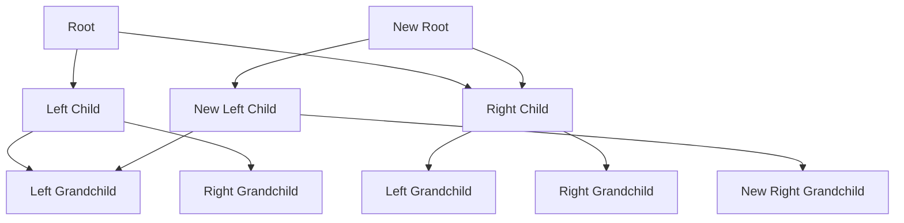

## 8.1.2 Immutability in Multithreaded Environments

In the realm of software development, multithreading is a powerful tool that allows programs to perform multiple operations concurrently. However, with great power comes great complexity, particularly when it comes to managing shared data. Traditional approaches to concurrency often involve intricate mechanisms like locks, semaphores, and other synchronization techniques to ensure data integrity. These mechanisms, while effective, can lead to issues such as deadlocks, race conditions, and reduced performance due to contention.

Clojure, a modern functional programming language, offers a compelling alternative through its emphasis on immutability. By leveraging immutable data structures, Clojure simplifies concurrency, enhances program safety, and often improves performance. This section delves into the benefits of immutability in multithreaded environments, illustrating how Clojure's approach can transform the way developers think about and handle concurrent programming.

### The Concurrency Benefits of Immutability

#### Eliminating the Need for Locks

One of the most significant advantages of immutability in concurrent programming is the elimination of locks for reading shared data. In traditional object-oriented programming (OOP) languages like Java, mutable state is the norm. When multiple threads need to read and write to shared data, developers must use locks to prevent data corruption. Locks ensure that only one thread can access the data at a time, but they also introduce complexity and potential performance bottlenecks.

In contrast, immutable data structures are inherently thread-safe. Since they cannot be modified after creation, there is no risk of one thread altering the data while another is reading it. This means that multiple threads can safely read from the same data structure without any synchronization mechanism. The absence of locks not only simplifies the code but also enhances performance, as threads can proceed without waiting for locks to be acquired or released.

Consider the following Java example, where locks are necessary to manage shared state:

```java
import java.util.concurrent.locks.ReentrantLock;

public class Counter {
    private int count = 0;
    private final ReentrantLock lock = new ReentrantLock();

    public void increment() {
        lock.lock();
        try {
            count++;
        } finally {
            lock.unlock();
        }
    }

    public int getCount() {
        lock.lock();
        try {
            return count;
        } finally {
            lock.unlock();
        }
    }
}
```

In this example, the `ReentrantLock` is used to ensure that the `count` variable is safely incremented and read. This approach, while effective, introduces additional complexity and potential performance issues due to lock contention.

Now, let's see how Clojure handles a similar scenario with immutability:

```clojure
(def counter (atom 0))

(defn increment []
  (swap! counter inc))

(defn get-count []
  @counter)
```

In Clojure, the `atom` provides a way to manage shared state without explicit locks. The `swap!` function safely updates the state, and the `@` symbol dereferences the atom to retrieve its current value. The simplicity and elegance of this approach are evident, as the need for locks is entirely eliminated.

#### Preventing Race Conditions

Race conditions occur when the outcome of a program depends on the relative timing of events, such as the order in which threads execute. They are notoriously difficult to detect and debug, often leading to unpredictable behavior and subtle bugs.

Immutable data structures inherently prevent race conditions because they cannot be modified once created. This guarantees that any thread accessing the data will always see a consistent and unchanging view. In essence, immutability decouples the timing of data access from data modification, eliminating the root cause of race conditions.

Consider a scenario where multiple threads need to update a shared list of items. In a mutable environment, this could lead to race conditions if two threads attempt to modify the list simultaneously. However, with immutable data structures, each modification results in a new version of the list, leaving the original unchanged. This ensures that all threads have a consistent view of the data, regardless of when they access it.

Here's an example in Clojure demonstrating this concept:

```clojure
(def items (atom []))

(defn add-item [item]
  (swap! items conj item))

(defn get-items []
  @items)
```

In this example, the `items` atom holds an immutable vector. The `conj` function creates a new vector with the added item, while the original vector remains unchanged. This approach guarantees that all threads see a consistent view of the `items` list, regardless of concurrent modifications.

### The Role of Persistent Data Structures

Clojure's immutable data structures are not only thread-safe but also efficient, thanks to a concept known as persistence. Persistent data structures are designed to share as much structure as possible between different versions, minimizing the overhead of creating new versions.

#### Structural Sharing

Structural sharing is a technique used to optimize the performance of immutable data structures. When a data structure is modified, instead of copying the entire structure, only the parts that change are updated, while the rest is shared with the original version. This approach significantly reduces memory usage and improves performance, making immutable data structures viable for real-world applications.

For example, consider a binary tree data structure. In a mutable environment, modifying a node might require copying the entire tree to ensure thread safety. However, with structural sharing, only the path from the root to the modified node needs to be updated, while the rest of the tree remains unchanged.

Here's a simplified illustration of structural sharing in a binary tree:



In this diagram, the original tree is modified by updating the right grandchild of the left child. Instead of copying the entire tree, only the affected nodes (highlighted in bold) are updated, while the rest of the structure is shared.

#### Efficient Data Manipulation

Clojure's persistent data structures, such as lists, vectors, maps, and sets, are designed to provide efficient data manipulation operations. These structures leverage structural sharing to offer performance characteristics similar to their mutable counterparts, without sacrificing immutability.

For instance, Clojure's vectors are implemented as 32-way trees, allowing for efficient access, update, and iteration operations. This design ensures that common operations, such as adding or removing elements, are performed in logarithmic time, making them suitable for performance-critical applications.

### Immutability in Multithreaded Environments: A Case Study

To illustrate the practical benefits of immutability in multithreaded environments, let's consider a case study involving a real-time analytics system. This system processes a continuous stream of data, updating various metrics and aggregations in real-time.

#### Problem Statement

In a traditional mutable environment, managing concurrent updates to shared metrics can be challenging. Developers must carefully synchronize access to shared data, using locks or other synchronization mechanisms to prevent race conditions and ensure data consistency.

#### Clojure's Immutable Approach

By leveraging Clojure's immutable data structures, the complexity of managing shared state is significantly reduced. Each update to the metrics results in a new version of the data, ensuring that all threads have a consistent view without the need for explicit synchronization.

Here's a simplified example of how this might be implemented in Clojure:

```clojure
(def metrics (atom {:count 0 :sum 0}))

(defn update-metrics [value]
  (swap! metrics (fn [m]
                   {:count (inc (:count m))
                    :sum (+ (:sum m) value)})))

(defn get-metrics []
  @metrics)
```

In this example, the `metrics` atom holds an immutable map representing the current state of the metrics. The `update-metrics` function safely updates the metrics by creating a new map with the updated values. This approach guarantees that all threads see a consistent view of the metrics, regardless of concurrent updates.

#### Performance Considerations

While immutability offers significant benefits in terms of simplicity and safety, it's essential to consider the performance implications. In some cases, the overhead of creating new versions of data structures can impact performance, particularly in high-throughput scenarios.

However, Clojure's persistent data structures are designed to minimize this overhead through structural sharing and efficient algorithms. In practice, the performance impact is often negligible, and the benefits of immutability far outweigh the costs.

### Best Practices for Leveraging Immutability

To fully harness the power of immutability in multithreaded environments, consider the following best practices:

1. **Favor Atoms for Shared State:** Use atoms for managing shared state that requires frequent updates. Atoms provide a simple and efficient way to handle state changes without explicit synchronization.

2. **Leverage Persistent Data Structures:** Take advantage of Clojure's persistent data structures for efficient data manipulation. These structures offer performance characteristics similar to mutable counterparts, without sacrificing immutability.

3. **Minimize State Changes:** Aim to minimize the frequency and scope of state changes. This reduces the overhead of creating new versions and improves performance.

4. **Embrace Functional Programming Principles:** Adopt functional programming principles, such as pure functions and declarative coding practices, to complement immutability. These principles promote code clarity and maintainability.

5. **Profile and Optimize:** Use profiling tools to identify performance bottlenecks and optimize critical sections of code. In some cases, targeted optimizations can improve performance without sacrificing immutability.

### Conclusion

Immutability in multithreaded environments offers a paradigm shift in how developers approach concurrency. By eliminating the need for locks and preventing race conditions, immutable data structures simplify concurrent programming, enhance program safety, and often improve performance. Clojure's emphasis on immutability, combined with its efficient persistent data structures, provides a powerful foundation for building robust and scalable concurrent applications.

As you continue your journey with Clojure, consider how immutability can transform your approach to concurrency and unlock new possibilities for building high-performance, reliable software.

## Quiz Time!



### Which of the following is a key benefit of using immutable data structures in multithreaded environments?

- [x] Elimination of locks for reading shared data
- [ ] Increased memory usage
- [ ] More complex code
- [ ] Slower performance

> **Explanation:** Immutable data structures eliminate the need for locks when reading shared data, simplifying concurrency and improving performance.


### How do immutable data structures prevent race conditions?

- [x] By ensuring data cannot be modified after creation
- [ ] By using locks to synchronize access
- [ ] By increasing the complexity of code
- [ ] By allowing multiple threads to modify data simultaneously

> **Explanation:** Immutable data structures prevent race conditions by ensuring that data cannot be modified after creation, providing a consistent view for all threads.


### What is structural sharing in the context of immutable data structures?

- [x] A technique to share unchanged parts between versions
- [ ] A method to copy entire data structures
- [ ] A way to increase memory usage
- [ ] A process to lock data structures

> **Explanation:** Structural sharing is a technique used to optimize immutable data structures by sharing unchanged parts between different versions, reducing memory usage.


### Which Clojure construct is commonly used to manage shared state without explicit locks?

- [x] Atom
- [ ] ReentrantLock
- [ ] Semaphore
- [ ] Synchronized block

> **Explanation:** In Clojure, atoms are commonly used to manage shared state without explicit locks, providing a simple and efficient way to handle state changes.


### What is the primary advantage of using persistent data structures in Clojure?

- [x] Efficient data manipulation with immutability
- [ ] Increased complexity of code
- [ ] Higher memory usage
- [ ] Slower performance

> **Explanation:** Persistent data structures in Clojure provide efficient data manipulation while maintaining immutability, offering performance characteristics similar to mutable counterparts.


### How does Clojure's `swap!` function contribute to concurrency?

- [x] It safely updates shared state without locks
- [ ] It locks data structures for exclusive access
- [ ] It increases the complexity of code
- [ ] It slows down performance

> **Explanation:** Clojure's `swap!` function safely updates shared state without locks, contributing to efficient concurrency management.


### What is a common pitfall when using immutable data structures?

- [ ] Increased risk of race conditions
- [x] Potential performance overhead in high-throughput scenarios
- [ ] More complex code
- [ ] Increased memory usage

> **Explanation:** A common pitfall when using immutable data structures is the potential performance overhead in high-throughput scenarios, although Clojure's persistent data structures minimize this impact.


### Which principle complements immutability in functional programming?

- [x] Pure functions
- [ ] Mutable state
- [ ] Synchronized blocks
- [ ] Increased complexity

> **Explanation:** Pure functions complement immutability in functional programming by promoting code clarity and maintainability.


### What is a key consideration when optimizing code with immutable data structures?

- [x] Profiling and optimizing critical sections
- [ ] Increasing memory usage
- [ ] Adding more locks
- [ ] Increasing code complexity

> **Explanation:** Profiling and optimizing critical sections is a key consideration when optimizing code with immutable data structures to ensure performance efficiency.


### True or False: Immutability in Clojure eliminates the need for synchronization mechanisms in all scenarios.

- [ ] True
- [x] False

> **Explanation:** While immutability eliminates the need for synchronization mechanisms in many scenarios, there may still be cases where explicit synchronization is necessary, depending on the application's requirements.


