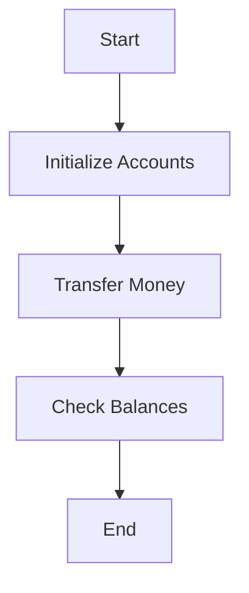
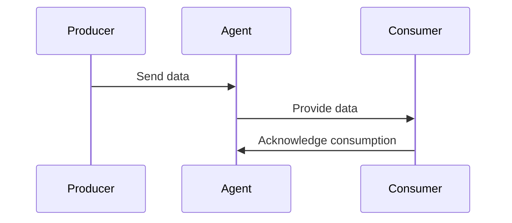
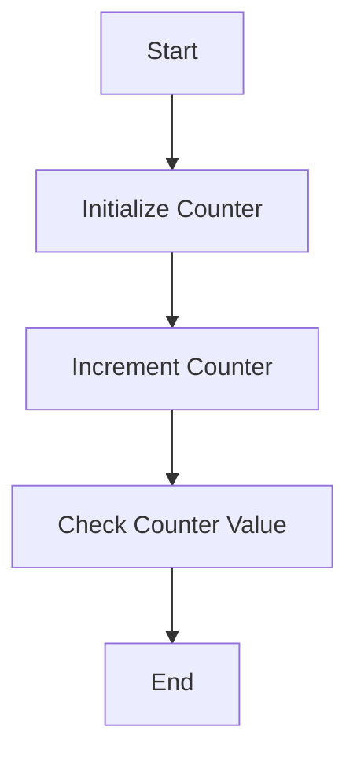
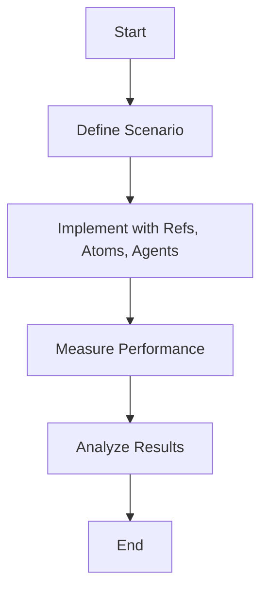

## 8.10 Exercises in Concurrent Programming

In this section, we will delve into practical exercises designed to solidify your understanding of concurrency in Clojure. These exercises will help you apply the theoretical concepts discussed in previous sections to real-world scenarios. By the end of this section, you will have hands-on experience with Clojure's concurrency primitives, including refs, atoms, and agents, and understand how they compare to Java's concurrency mechanisms.

### Exercise 1: Implementing a Bank Account System with Refs

**Objective**: Safely handle concurrent transfers between bank accounts using Clojure's refs and software transactional memory (STM).

#### Background

In Java, managing concurrent updates to shared resources often involves using synchronized blocks or locks. Clojure offers a more elegant solution with refs and STM, allowing you to manage shared state with transactions that ensure consistency and avoid common pitfalls like deadlocks.

#### Task

Implement a simple bank account system where multiple threads can transfer money between accounts. Use refs to ensure that all transfers are atomic and consistent.

#### Steps

1. **Define the Account Structure**: Create a map to represent each account with a balance.

2. **Initialize Accounts**: Use refs to hold the state of each account.

3. **Implement Transfer Function**: Write a function that transfers money between two accounts, ensuring the operation is atomic.

4. **Simulate Concurrent Transfers**: Use multiple threads to perform transfers and verify the consistency of account balances.

#### Clojure Code Example

```clojure
(ns bank-system.core
  (:require [clojure.core.async :refer [go <! >! chan]]))

;; Define account structure
(defn create-account [initial-balance]
  (ref {:balance initial-balance}))

;; Initialize accounts
(def account-a (create-account 1000))
(def account-b (create-account 1000))

;; Transfer function
(defn transfer [from-account to-account amount]
  (dosync
    (alter from-account update :balance - amount)
    (alter to-account update :balance + amount)))

;; Simulate concurrent transfers
(defn simulate-transfers []
  (let [threads (repeatedly 10 #(Thread. #(transfer account-a account-b 100)))]
    (doseq [t threads] (.start t))
    (doseq [t threads] (.join t))))

;; Run simulation
(simulate-transfers)

;; Check balances
(println "Account A balance:" @account-a)
(println "Account B balance:" @account-b)
```

**Try It Yourself**: Modify the initial balances and transfer amounts. Observe how the system maintains consistency despite concurrent operations.

#### Diagram: Bank Account Transfer Flow



*Caption*: This flowchart illustrates the process of initializing accounts, transferring money, and checking balances in a concurrent bank account system.

### Exercise 2: Creating a Producer-Consumer Model with Agents

**Objective**: Implement a producer-consumer model using Clojure's agents to handle asynchronous updates.

#### Background

In Java, producer-consumer models often use blocking queues to manage data flow between threads. Clojure's agents provide a non-blocking alternative, allowing you to manage state changes asynchronously.

#### Task

Create a system where producers generate data and consumers process it. Use agents to manage the state of the data queue.

#### Steps

1. **Define the Data Queue**: Use an agent to hold the state of the queue.

2. **Implement Producer Function**: Write a function that adds data to the queue.

3. **Implement Consumer Function**: Write a function that processes data from the queue.

4. **Simulate Producers and Consumers**: Use multiple threads to simulate concurrent data production and consumption.

#### Clojure Code Example

```clojure
(ns producer-consumer.core)

;; Define data queue
(def data-queue (agent []))

;; Producer function
(defn produce [data]
  (send data-queue conj data))

;; Consumer function
(defn consume []
  (send data-queue (fn [queue]
                     (if (empty? queue)
                       queue
                       (do
                         (println "Consumed:" (first queue))
                         (rest queue))))))

;; Simulate producers and consumers
(defn simulate []
  (dotimes [_ 10]
    (produce (rand-int 100))
    (consume)))

;; Run simulation
(simulate)
```

**Try It Yourself**: Adjust the number of producers and consumers. Observe how agents handle state changes asynchronously.

#### Diagram: Producer-Consumer Model



*Caption*: This sequence diagram shows the interaction between producers, agents, and consumers in a producer-consumer model.

### Exercise 3: Simulating Concurrent Updates with Atoms

**Objective**: Observe the effects of concurrent updates to a shared data structure using atoms.

#### Background

In Java, concurrent updates to shared data structures often require explicit synchronization. Clojure's atoms provide a simpler alternative for managing independent state changes.

#### Task

Simulate concurrent updates to a shared counter using atoms. Compare the results with and without proper concurrency controls.

#### Steps

1. **Define the Counter**: Use an atom to hold the state of the counter.

2. **Implement Update Function**: Write a function that increments the counter.

3. **Simulate Concurrent Updates**: Use multiple threads to perform updates and observe the effects.

#### Clojure Code Example

```clojure
(ns concurrent-updates.core)

;; Define counter
(def counter (atom 0))

;; Update function
(defn increment-counter []
  (swap! counter inc))

;; Simulate concurrent updates
(defn simulate-updates []
  (let [threads (repeatedly 100 #(Thread. increment-counter))]
    (doseq [t threads] (.start t))
    (doseq [t threads] (.join t))))

;; Run simulation
(simulate-updates)

;; Check counter value
(println "Counter value:" @counter)
```

**Try It Yourself**: Increase the number of threads and observe how atoms ensure consistency without explicit locks.

#### Diagram: Concurrent Updates with Atoms



*Caption*: This flowchart illustrates the process of initializing a counter, incrementing it concurrently, and checking its value using atoms.

### Exercise 4: Measuring Performance Impact of Concurrency Primitives

**Objective**: Evaluate the performance impact of different concurrency primitives in specific scenarios.

#### Background

Understanding the performance characteristics of concurrency primitives is crucial for optimizing applications. In Java, developers often use benchmarks to compare the performance of different synchronization mechanisms.

#### Task

Measure the performance of refs, atoms, and agents in a scenario involving frequent state updates. Compare the results to identify the most efficient approach.

#### Steps

1. **Define the Scenario**: Choose a scenario involving frequent state updates.

2. **Implement with Refs, Atoms, and Agents**: Write separate implementations using each concurrency primitive.

3. **Measure Performance**: Use benchmarking tools to measure the execution time of each implementation.

4. **Analyze Results**: Compare the performance metrics and identify the most efficient approach.

#### Clojure Code Example

```clojure
(ns performance-measurement.core
  (:require [criterium.core :refer [quick-bench]]))

;; Define state
(def state-ref (ref 0))
(def state-atom (atom 0))
(def state-agent (agent 0))

;; Update functions
(defn update-ref []
  (dosync (alter state-ref inc)))

(defn update-atom []
  (swap! state-atom inc))

(defn update-agent []
  (send state-agent inc))

;; Measure performance
(defn measure-performance []
  (println "Ref performance:")
  (quick-bench (dotimes [_ 1000] (update-ref)))
  (println "Atom performance:")
  (quick-bench (dotimes [_ 1000] (update-atom)))
  (println "Agent performance:")
  (quick-bench (dotimes [_ 1000] (update-agent))))

;; Run measurement
(measure-performance)
```

**Try It Yourself**: Modify the number of updates and observe how the performance of each primitive changes.

#### Diagram: Performance Measurement Process



*Caption*: This flowchart outlines the process of measuring the performance impact of different concurrency primitives.

### Summary and Key Takeaways

In this section, we've explored practical exercises to deepen your understanding of concurrency in Clojure. By implementing a bank account system, creating a producer-consumer model, simulating concurrent updates, and measuring performance, you've gained hands-on experience with Clojure's concurrency primitives. These exercises highlight the advantages of Clojure's approach to concurrency, such as simplicity, safety, and efficiency, compared to traditional Java mechanisms.

Remember, mastering concurrency in Clojure involves understanding the unique features of refs, atoms, and agents, and knowing when to use each one. As you continue to explore Clojure, keep experimenting with these primitives to build robust and efficient concurrent applications.

### Further Reading

- [Clojure Official Documentation](https://clojure.org/reference/concurrency)
- [ClojureDocs: Concurrency](https://clojuredocs.org/quickref#concurrency)
- [GitHub: Clojure Concurrency Examples](https://github.com/clojure-examples/concurrency)

### Exercises and Practice Problems

1. **Modify the Bank Account System**: Add a feature to calculate interest on each account after every transfer.
2. **Enhance the Producer-Consumer Model**: Implement a priority queue to manage data with different priorities.
3. **Experiment with Atoms**: Create a shared data structure with multiple fields and simulate concurrent updates to each field.
4. **Benchmark Different Scenarios**: Measure the performance of refs, atoms, and agents in scenarios with varying update frequencies and data sizes.

---

## Clojure Concurrency Quiz: Test Your Knowledge



### What concurrency primitive in Clojure is best suited for managing independent state changes?

- [ ] Refs
- [x] Atoms
- [ ] Agents
- [ ] Vars

> **Explanation:** Atoms are best suited for managing independent state changes as they provide a way to update state atomically without transactions.

### Which Clojure concurrency primitive uses software transactional memory (STM)?

- [x] Refs
- [ ] Atoms
- [ ] Agents
- [ ] Vars

> **Explanation:** Refs use software transactional memory (STM) to manage coordinated state changes across multiple refs.

### In a producer-consumer model using agents, what is the role of the agent?

- [ ] To block data flow
- [x] To manage state changes asynchronously
- [ ] To synchronize threads
- [ ] To handle exceptions

> **Explanation:** Agents manage state changes asynchronously, allowing producers and consumers to operate without blocking.

### What function is used to update the state of an atom in Clojure?

- [ ] alter
- [x] swap!
- [ ] send
- [ ] dosync

> **Explanation:** The `swap!` function is used to update the state of an atom in Clojure.

### Which concurrency primitive is most similar to Java's synchronized block?

- [x] Refs
- [ ] Atoms
- [ ] Agents
- [ ] Vars

> **Explanation:** Refs, with their STM, provide a mechanism similar to Java's synchronized block for coordinating state changes.

### What is the primary advantage of using agents in Clojure?

- [ ] Blocking operations
- [ ] Synchronous updates
- [x] Non-blocking state management
- [ ] Complex synchronization

> **Explanation:** Agents provide non-blocking state management, allowing asynchronous updates to state.

### How does Clojure ensure atomic updates with atoms?

- [ ] By using locks
- [x] By using compare-and-swap
- [ ] By blocking threads
- [ ] By using transactions

> **Explanation:** Atoms use a compare-and-swap mechanism to ensure atomic updates.

### What is the purpose of the `dosync` block in Clojure?

- [ ] To update atoms
- [x] To manage transactions with refs
- [ ] To send messages to agents
- [ ] To synchronize threads

> **Explanation:** The `dosync` block is used to manage transactions with refs, ensuring atomic updates.

### Which concurrency primitive would you use for handling asynchronous tasks?

- [ ] Refs
- [ ] Atoms
- [x] Agents
- [ ] Vars

> **Explanation:** Agents are used for handling asynchronous tasks in Clojure.

### True or False: Clojure's concurrency primitives eliminate the need for explicit locks.

- [x] True
- [ ] False

> **Explanation:** Clojure's concurrency primitives, such as refs, atoms, and agents, provide mechanisms that eliminate the need for explicit locks.


