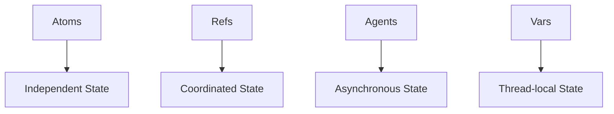

## 8.2.1 Overview of Clojure's Concurrency Primitives

In the realm of concurrent programming, managing state changes safely and efficiently is a significant challenge. Traditional approaches in languages like Java often involve complex mechanisms such as locks and synchronized blocks to prevent race conditions and ensure data consistency. Clojure, however, offers a different paradigm by leveraging immutability and providing a set of concurrency primitives—**atoms**, **refs**, **agents**, and **vars**—that simplify state management in concurrent environments. In this section, we'll explore these primitives, understand their use cases, and see how they can be used to build robust concurrent applications.

### Understanding Clojure's Concurrency Model

Clojure's concurrency model is built on the foundation of **immutability**. In Clojure, data structures are immutable by default, meaning that once created, they cannot be changed. This immutability simplifies concurrent programming because it eliminates the need for locks to protect shared data. Instead of modifying data in place, Clojure provides mechanisms to create new versions of data structures with the desired changes.

#### The Role of Immutability

Immutability in Clojure ensures that data is never changed unexpectedly by concurrent threads. This eliminates a whole class of concurrency bugs related to shared mutable state. Instead of modifying data, Clojure's concurrency primitives allow you to manage state transitions in a controlled manner.

### Clojure's Concurrency Primitives

Clojure provides four primary concurrency primitives: **atoms**, **refs**, **agents**, and **vars**. Each of these primitives is designed for specific use cases and offers different guarantees and capabilities.

#### Atoms

**Atoms** are the simplest concurrency primitive in Clojure. They provide a way to manage shared, synchronous, independent state. Atoms are ideal for managing state that is updated infrequently or by a single thread at a time.

- **Use Case**: Atoms are best suited for managing state that doesn't require coordination with other state changes.
- **Mechanism**: Atoms use **compare-and-swap (CAS)** to ensure atomic updates. This means that updates to an atom are applied only if the current value matches the expected value, ensuring consistency without locks.

**Example**: Managing a simple counter with an atom.

```clojure
(def counter (atom 0))

;; Increment the counter
(swap! counter inc)

;; Get the current value
@counter ; => 1
```

In this example, `swap!` is used to apply the `inc` function to the current value of the atom, ensuring that the update is atomic.

#### Refs and Software Transactional Memory (STM)

**Refs** are used for managing coordinated, synchronous state changes across multiple variables. They leverage **Software Transactional Memory (STM)** to ensure that updates are consistent and isolated.

- **Use Case**: Refs are ideal for situations where multiple pieces of state need to be updated together in a coordinated fashion.
- **Mechanism**: Refs use transactions to ensure that state changes are atomic and consistent. If a transaction fails, it is automatically retried.

**Example**: Managing a bank account balance with refs.

```clojure
(def account-balance (ref 1000))

;; Deposit money into the account
(dosync
  (alter account-balance + 100))

;; Get the current balance
@account-balance ; => 1100
```

In this example, `dosync` is used to create a transaction, and `alter` is used to update the ref within the transaction.

#### Agents

**Agents** are used for managing asynchronous state changes. They are ideal for tasks that can be performed independently and do not require immediate consistency.

- **Use Case**: Agents are suitable for tasks that can be performed in the background, such as logging or sending notifications.
- **Mechanism**: Agents process updates asynchronously, allowing other operations to continue without waiting for the update to complete.

**Example**: Logging messages with an agent.

```clojure
(def logger (agent []))

;; Log a message
(send logger conj "Log message")

;; Get the current log
@logger ; => ["Log message"]
```

In this example, `send` is used to asynchronously update the agent with a new log message.

#### Vars

**Vars** are used for managing thread-local state. They are less commonly used for concurrency but are important for managing dynamic bindings.

- **Use Case**: Vars are useful for managing state that is specific to a particular thread, such as configuration settings.
- **Mechanism**: Vars provide dynamic scoping, allowing different threads to have different values for the same variable.

**Example**: Using vars for thread-local configuration.

```clojure
(def ^:dynamic *config* {:env "development"})

;; Bind a new value for the current thread
(binding [*config* {:env "production"}]
  (println *config*)) ; => {:env "production"}

;; Outside the binding, the original value is restored
(println *config*) ; => {:env "development"}
```

In this example, `binding` is used to temporarily change the value of a var for the current thread.

### Comparing Clojure's Concurrency Primitives

Let's compare Clojure's concurrency primitives to traditional Java concurrency mechanisms:

- **Atoms vs. Java's Atomic Variables**: Atoms are similar to Java's `AtomicInteger` or `AtomicReference`, providing atomic updates without locks.
- **Refs vs. Java's Synchronized Blocks**: Refs offer a higher-level abstraction than synchronized blocks, allowing for coordinated updates across multiple variables.
- **Agents vs. Java's ExecutorService**: Agents provide a simpler model for asynchronous updates compared to Java's `ExecutorService`, focusing on state changes rather than task execution.
- **Vars vs. Java's ThreadLocal**: Vars provide dynamic scoping similar to Java's `ThreadLocal`, but with additional flexibility for managing dynamic bindings.

### Visualizing Clojure's Concurrency Primitives

Below is a diagram illustrating the flow of data through Clojure's concurrency primitives:



**Diagram Description**: This diagram shows how each concurrency primitive in Clojure is used to manage different types of state.

### Try It Yourself

To deepen your understanding of Clojure's concurrency primitives, try modifying the examples above:

- **Atoms**: Create a new atom to manage a list of tasks. Use `swap!` to add and remove tasks.
- **Refs**: Implement a simple inventory system where multiple items can be added or removed in a single transaction.
- **Agents**: Use an agent to manage a queue of messages to be processed asynchronously.
- **Vars**: Experiment with dynamic bindings to manage different configurations for different threads.

### Further Reading

For more information on Clojure's concurrency primitives, check out the following resources:

- [Official Clojure Documentation on Concurrency](https://clojure.org/reference/atoms)
- [ClojureDocs: Atoms, Refs, Agents, and Vars](https://clojuredocs.org/)
- [Clojure Programming by Chas Emerick, Brian Carper, and Christophe Grand](https://www.oreilly.com/library/view/clojure-programming/9781449310387/)

### Exercises

1. **Implement a Counter**: Use an atom to implement a counter that can be incremented and decremented by multiple threads.
2. **Bank Account Simulation**: Use refs to simulate a bank account system where multiple accounts can be transferred between in a single transaction.
3. **Asynchronous Task Processing**: Use agents to implement a simple task processing system where tasks are processed asynchronously.
4. **Configuration Management**: Use vars to manage different configurations for different environments in a web application.

### Key Takeaways

- Clojure's concurrency primitives provide powerful abstractions for managing state changes in concurrent environments.
- **Atoms** are ideal for independent state changes, **refs** for coordinated state changes, **agents** for asynchronous state changes, and **vars** for thread-local state.
- Immutability is a key feature of Clojure's concurrency model, simplifying state management by eliminating shared mutable state.
- By leveraging these primitives, you can build robust concurrent applications without the complexity of traditional locking mechanisms.

Now that we've explored Clojure's concurrency primitives, let's apply these concepts to manage state effectively in your applications.

## Quiz: Mastering Clojure's Concurrency Primitives



### Which Clojure concurrency primitive is best suited for managing independent state changes?

- [x] Atoms
- [ ] Refs
- [ ] Agents
- [ ] Vars

> **Explanation:** Atoms are designed for managing independent state changes, using compare-and-swap for atomic updates.

### What mechanism do refs use to ensure atomic and consistent state changes?

- [ ] Compare-and-swap
- [x] Software Transactional Memory (STM)
- [ ] Asynchronous messaging
- [ ] Dynamic scoping

> **Explanation:** Refs use Software Transactional Memory (STM) to ensure atomic and consistent state changes across multiple variables.

### Which concurrency primitive is ideal for asynchronous state changes?

- [ ] Atoms
- [ ] Refs
- [x] Agents
- [ ] Vars

> **Explanation:** Agents are designed for asynchronous state changes, allowing updates to be processed independently.

### How do vars provide thread-local state management?

- [ ] By using compare-and-swap
- [ ] By using transactions
- [ ] By processing updates asynchronously
- [x] By providing dynamic scoping

> **Explanation:** Vars provide dynamic scoping, allowing different threads to have different values for the same variable.

### Which Java concurrency mechanism is similar to Clojure's atoms?

- [x] Atomic Variables
- [ ] Synchronized Blocks
- [ ] ExecutorService
- [ ] ThreadLocal

> **Explanation:** Java's Atomic Variables, like AtomicInteger, provide atomic updates similar to Clojure's atoms.

### What is the primary advantage of using immutability in Clojure's concurrency model?

- [x] Eliminates the need for locks
- [ ] Increases performance
- [ ] Simplifies syntax
- [ ] Reduces memory usage

> **Explanation:** Immutability eliminates the need for locks, simplifying concurrent programming by preventing shared mutable state.

### Which concurrency primitive would you use for coordinated updates across multiple variables?

- [ ] Atoms
- [x] Refs
- [ ] Agents
- [ ] Vars

> **Explanation:** Refs are used for coordinated updates across multiple variables, ensuring consistency through transactions.

### What is the purpose of the `dosync` block in Clojure?

- [ ] To perform asynchronous updates
- [x] To create a transaction for refs
- [ ] To bind a new value to a var
- [ ] To send a message to an agent

> **Explanation:** The `dosync` block is used to create a transaction for refs, ensuring atomic and consistent updates.

### How do agents differ from Java's ExecutorService?

- [x] Agents focus on state changes rather than task execution
- [ ] Agents use locks for synchronization
- [ ] Agents require explicit thread management
- [ ] Agents are synchronous

> **Explanation:** Agents focus on state changes rather than task execution, providing a simpler model for asynchronous updates.

### True or False: Clojure's concurrency primitives require explicit locking mechanisms.

- [ ] True
- [x] False

> **Explanation:** Clojure's concurrency primitives do not require explicit locking mechanisms, as they leverage immutability and controlled state transitions.


