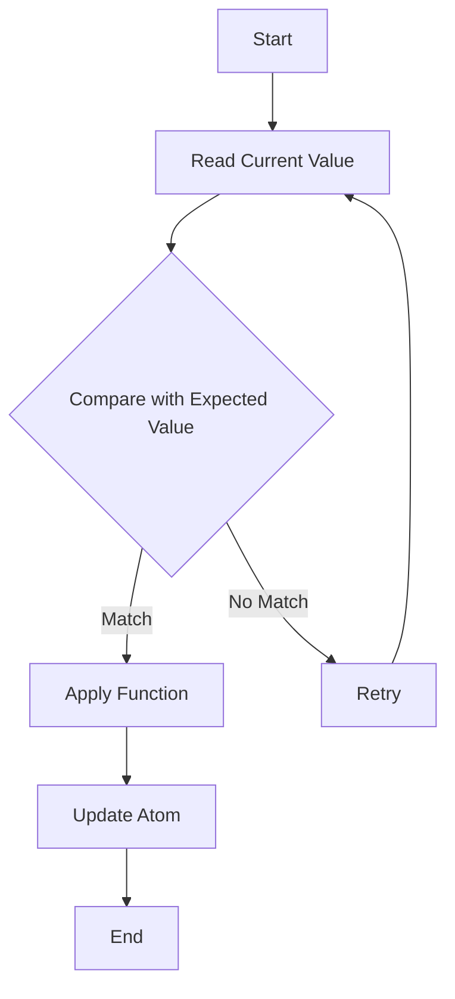

## 8.2.2 Atoms

In the realm of functional programming, managing state in a concurrent environment can be challenging. Clojure offers a unique approach to state management through its concurrency primitives, one of which is **atoms**. Atoms provide a way to manage synchronous, independent state changes safely and efficiently using a mechanism known as **compare-and-swap (CAS)**. This section will delve into the concept of atoms, how they work, and how they can be used effectively in Clojure applications.

### Understanding Atoms

Atoms in Clojure are designed to manage state that is independent and can be updated synchronously. They are ideal for scenarios where you need to manage a single piece of state that is accessed and modified by multiple threads. Unlike traditional locking mechanisms in Java, atoms use CAS operations to ensure that updates to the state are atomic and consistent.

#### Compare-and-Swap (CAS)

The CAS operation is a fundamental concept in concurrent programming. It allows you to update a value only if it matches an expected value, ensuring that the update is atomic. This is particularly useful in a multi-threaded environment where multiple threads might attempt to update the same value simultaneously.

In Java, CAS is often used in conjunction with the `java.util.concurrent` package, particularly with classes like `AtomicInteger` and `AtomicReference`. These classes provide methods like `compareAndSet` to perform CAS operations. Clojure's atoms abstract this complexity, providing a simpler interface for managing state.

### Creating and Using Atoms

Let's start by creating an atom in Clojure. You can create an atom using the `atom` function, which takes an initial value as its argument.

```clojure
(def my-atom (atom 0)) ; Create an atom with an initial value of 0
```

Here, `my-atom` is an atom that holds the integer value `0`. You can access the current value of an atom using the `deref` function or the `@` reader macro.

```clojure
(println @my-atom) ; Prints the current value of the atom, which is 0
```

#### Updating Atoms with `swap!`

To update the value of an atom, you can use the `swap!` function. `swap!` takes an atom and a function as arguments. The function is applied to the current value of the atom, and the result becomes the new value of the atom.

```clojure
(swap! my-atom inc) ; Increment the value of the atom by 1
(println @my-atom)  ; Prints 1
```

In this example, `inc` is a function that increments its argument by 1. `swap!` applies `inc` to the current value of `my-atom`, updating it to 1.

#### Resetting Atoms with `reset!`

If you need to set the value of an atom directly, you can use the `reset!` function. `reset!` takes an atom and a new value, setting the atom's value to the new value unconditionally.

```clojure
(reset! my-atom 42) ; Set the value of the atom to 42
(println @my-atom)  ; Prints 42
```

### Atoms vs. Java's Atomic Classes

Atoms in Clojure provide a higher-level abstraction compared to Java's atomic classes. While both use CAS under the hood, atoms integrate seamlessly with Clojure's functional programming model, allowing you to use pure functions to update state.

Here's a comparison of updating an atomic integer in Java and an atom in Clojure:

**Java Example:**

```java
import java.util.concurrent.atomic.AtomicInteger;

public class AtomicExample {
    public static void main(String[] args) {
        AtomicInteger atomicInt = new AtomicInteger(0);
        atomicInt.incrementAndGet(); // Increment the value by 1
        System.out.println(atomicInt.get()); // Prints 1
    }
}
```

**Clojure Example:**

```clojure
(def my-atom (atom 0))
(swap! my-atom inc)
(println @my-atom) ; Prints 1
```

As you can see, Clojure's syntax is more concise and integrates functional concepts directly into state management.

### Practical Use Cases for Atoms

Atoms are particularly useful in scenarios where you need to manage shared state that is updated independently by multiple threads. Here are some common use cases:

- **Counters**: Atoms are ideal for implementing counters that are incremented or decremented by multiple threads.
- **Caches**: You can use atoms to manage a cache where entries are added or removed independently.
- **Configuration**: Atoms can hold configuration data that might be updated at runtime.

### Visualizing Atom Operations

To better understand how atoms work, let's visualize the process of updating an atom using a flowchart.



**Diagram Description**: This flowchart illustrates the CAS operation used by atoms. The current value is read and compared with an expected value. If they match, a function is applied, and the atom is updated. If not, the operation retries.

### Try It Yourself

To deepen your understanding, try modifying the code examples:

- Change the initial value of the atom and observe how `swap!` and `reset!` affect it.
- Use a different function with `swap!`, such as `dec` or a custom function that multiplies the value by 2.
- Create a multi-threaded example where multiple threads update the same atom.

### Exercises

1. **Implement a Counter**: Create an atom-based counter that multiple threads can increment. Ensure that the final value is consistent with the number of increments.

2. **Build a Simple Cache**: Use an atom to implement a simple cache. Add and remove entries, ensuring that the cache remains consistent.

3. **Configuration Management**: Create an atom to hold configuration settings. Update the settings at runtime and ensure that changes are reflected immediately.

### Key Takeaways

- **Atoms** provide a mechanism for managing synchronous, independent state changes in Clojure.
- **Compare-and-swap (CAS)** operations ensure that updates to atoms are atomic and consistent.
- **swap!** and **reset!** are the primary functions for updating atoms.
- Atoms offer a higher-level abstraction compared to Java's atomic classes, integrating seamlessly with Clojure's functional programming model.

By understanding and utilizing atoms, you can effectively manage state in your Clojure applications, leveraging the power of functional programming and concurrency.

### Further Reading

- [Official Clojure Documentation on Atoms](https://clojure.org/reference/atoms)
- [ClojureDocs: Atoms](https://clojuredocs.org/clojure.core/atom)
- [Java Concurrency in Practice](https://jcip.net/)

Now that we've explored how atoms work in Clojure, let's apply these concepts to manage state effectively in your applications.

## Quiz: Mastering Atoms in Clojure



### What is the primary mechanism used by Clojure atoms to ensure atomic updates?

- [x] Compare-and-swap (CAS)
- [ ] Locking
- [ ] Synchronization
- [ ] Thread pooling

> **Explanation:** Atoms in Clojure use compare-and-swap (CAS) operations to ensure atomic updates without the need for locks.

### Which function is used to update the value of an atom by applying a function to its current value?

- [x] swap!
- [ ] reset!
- [ ] deref
- [ ] alter

> **Explanation:** The `swap!` function is used to update the value of an atom by applying a function to its current value.

### How can you directly set a new value for an atom, bypassing any function application?

- [x] reset!
- [ ] swap!
- [ ] deref
- [ ] alter

> **Explanation:** The `reset!` function is used to directly set a new value for an atom, bypassing any function application.

### What is the purpose of the `deref` function in relation to atoms?

- [x] To retrieve the current value of an atom
- [ ] To update the value of an atom
- [ ] To reset the value of an atom
- [ ] To apply a function to an atom

> **Explanation:** The `deref` function is used to retrieve the current value of an atom.

### Which of the following is a common use case for atoms in Clojure?

- [x] Managing counters
- [x] Implementing caches
- [ ] Handling asynchronous tasks
- [ ] Managing complex transactions

> **Explanation:** Atoms are commonly used for managing counters and implementing caches due to their ability to handle independent state changes.

### How does the `swap!` function ensure atomic updates in a multi-threaded environment?

- [x] By using compare-and-swap (CAS) operations
- [ ] By locking the atom
- [ ] By synchronizing threads
- [ ] By using a thread pool

> **Explanation:** The `swap!` function ensures atomic updates by using compare-and-swap (CAS) operations, which allow updates only if the current value matches the expected value.

### What is the result of calling `swap!` with a function that always returns the same value?

- [x] The atom's value remains unchanged
- [ ] The atom's value is reset
- [ ] An error is thrown
- [ ] The atom's value is incremented

> **Explanation:** If `swap!` is called with a function that always returns the same value, the atom's value remains unchanged.

### Which Clojure function is equivalent to Java's `AtomicInteger.incrementAndGet()`?

- [x] swap! with inc
- [ ] reset! with inc
- [ ] deref with inc
- [ ] alter with inc

> **Explanation:** The `swap!` function with `inc` is equivalent to Java's `AtomicInteger.incrementAndGet()`, as it increments the atom's value by 1.

### What is the advantage of using atoms over traditional locking mechanisms in Java?

- [x] Atoms provide a higher-level abstraction and integrate with functional programming
- [ ] Atoms are faster than locks
- [ ] Atoms are easier to debug
- [ ] Atoms require less memory

> **Explanation:** Atoms provide a higher-level abstraction and integrate seamlessly with functional programming, making them more suitable for Clojure applications.

### True or False: Atoms in Clojure can be used to manage complex transactions involving multiple pieces of state.

- [ ] True
- [x] False

> **Explanation:** Atoms are designed for managing independent state changes. For complex transactions involving multiple pieces of state, Clojure provides refs and software transactional memory (STM).


