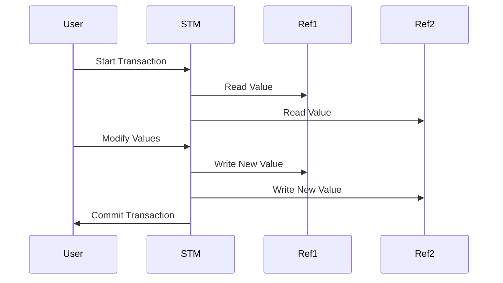

## 8.2.3 Refs and Software Transactional Memory (STM)

In this section, we delve into **Clojure's Refs and Software Transactional Memory (STM)**, a powerful concurrency model that simplifies managing shared state in a multi-threaded environment. As experienced Java developers, you're likely familiar with the complexities of managing concurrency using locks and synchronized blocks. Clojure's STM offers a more elegant solution, allowing for coordinated, synchronous state changes across multiple refs. Let's explore how STM works, its advantages over traditional concurrency mechanisms, and how you can leverage it in your Clojure applications.

### Understanding Refs and STM

**Refs** in Clojure are mutable references to immutable data structures. They are part of Clojure's STM system, which allows you to manage shared state changes atomically. The STM system ensures that all changes to refs are consistent and isolated, much like transactions in a database.

**Software Transactional Memory (STM)** is a concurrency control mechanism that simplifies reasoning about state changes by allowing multiple refs to be updated atomically within a transaction. This approach avoids common concurrency issues like deadlocks and race conditions.

#### Key Concepts of STM

- **Atomicity**: Changes to refs within a transaction are atomic, meaning they either all succeed or none are applied.
- **Consistency**: Transactions ensure that the system remains in a consistent state.
- **Isolation**: Transactions are isolated from each other, preventing intermediate states from being visible to other transactions.

### How STM Works in Clojure

In Clojure, you use the `dosync` macro to create a transaction. Within this transaction, you can update multiple refs using functions like `ref-set` and `alter`. The STM system ensures that these updates are atomic and isolated.

Here's a simple example to illustrate the concept:

```clojure
(def account1 (ref 1000))
(def account2 (ref 2000))

(defn transfer [amount from-account to-account]
  (dosync
    (alter from-account - amount)
    (alter to-account + amount)))

;; Transfer $100 from account1 to account2
(transfer 100 account1 account2)

;; Check balances
(println "Account 1 balance:" @account1) ; => 900
(println "Account 2 balance:" @account2) ; => 2100
```

In this example, the `transfer` function performs a transaction that deducts an amount from one account and adds it to another. The `dosync` macro ensures that both operations are atomic, preventing any inconsistencies.

### Comparing STM with Java's Concurrency Mechanisms

In Java, managing shared state often involves using locks or synchronized blocks to ensure thread safety. This can lead to complex code and potential issues like deadlocks. Let's compare this with Clojure's STM approach:

#### Java Example with Locks

```java
import java.util.concurrent.locks.Lock;
import java.util.concurrent.locks.ReentrantLock;

public class Account {
    private int balance;
    private final Lock lock = new ReentrantLock();

    public Account(int initialBalance) {
        this.balance = initialBalance;
    }

    public void transfer(Account to, int amount) {
        lock.lock();
        try {
            this.balance -= amount;
            to.lock.lock();
            try {
                to.balance += amount;
            } finally {
                to.lock.unlock();
            }
        } finally {
            lock.unlock();
        }
    }

    public int getBalance() {
        return balance;
    }
}

// Usage
Account account1 = new Account(1000);
Account account2 = new Account(2000);
account1.transfer(account2, 100);
System.out.println("Account 1 balance: " + account1.getBalance()); // => 900
System.out.println("Account 2 balance: " + account2.getBalance()); // => 2100
```

In this Java example, we use locks to ensure that the transfer operation is thread-safe. However, this approach is prone to errors, such as forgetting to release a lock, leading to deadlocks.

#### Advantages of Clojure's STM

- **Simplicity**: STM abstracts away the complexity of locks, making code easier to read and maintain.
- **Safety**: STM prevents deadlocks and race conditions by design.
- **Composability**: Transactions can be composed, allowing for more modular code.

### Visualizing STM Transactions

To better understand how STM transactions work, let's visualize the flow of a transaction using a Mermaid.js diagram:



**Diagram Explanation**: This sequence diagram illustrates the flow of a transaction in Clojure's STM. The user initiates a transaction, reads values from refs, modifies them, and commits the transaction. The STM system ensures that these operations are atomic and isolated.

### Best Practices for Using STM

1. **Minimize the Scope of Transactions**: Keep transactions as short as possible to reduce contention and improve performance.
2. **Avoid Side Effects**: Transactions should not have side effects, such as I/O operations, to maintain consistency.
3. **Use Refs for Coordinated State Changes**: Use refs when you need to update multiple pieces of state atomically.

### Try It Yourself

Experiment with the following code to deepen your understanding of STM:

1. Modify the `transfer` function to handle insufficient funds by checking the balance before transferring.
2. Add a third account and perform multiple transfers within a single transaction.
3. Introduce a delay within the transaction to simulate a long-running operation and observe how STM handles it.

### Further Reading

For more information on Clojure's STM and refs, consider exploring the following resources:

- [Official Clojure Documentation on Refs](https://clojure.org/reference/refs)
- [ClojureDocs: Refs and STM](https://clojuredocs.org/clojure.core/ref)
- [Rich Hickey's Talk on Clojure's Concurrency Model](https://www.youtube.com/watch?v=8lQ9GqFZ1tQ)

### Exercises

1. Implement a simple banking system using refs and STM, allowing for deposits, withdrawals, and transfers between accounts.
2. Create a simulation of a ticket booking system where multiple users can book tickets concurrently without overselling.

### Key Takeaways

- **Refs and STM** provide a powerful concurrency model in Clojure, allowing for atomic, consistent, and isolated state changes.
- **STM** simplifies concurrency management compared to traditional Java approaches, reducing the risk of deadlocks and race conditions.
- **Clojure's STM** encourages a functional programming style, promoting immutability and composability.

Now that we've explored how Clojure's STM works, let's apply these concepts to manage state effectively in your applications.

## Quiz: Mastering Clojure's STM and Refs



### What is the primary purpose of Clojure's Software Transactional Memory (STM)?

- [x] To manage shared state changes atomically
- [ ] To perform asynchronous operations
- [ ] To handle I/O operations
- [ ] To manage memory allocation

> **Explanation:** Clojure's STM is designed to manage shared state changes atomically, ensuring consistency and isolation.

### Which macro is used to create a transaction in Clojure's STM?

- [ ] `def`
- [ ] `let`
- [x] `dosync`
- [ ] `alter`

> **Explanation:** The `dosync` macro is used to create a transaction in Clojure's STM.

### What is a key advantage of using STM over traditional locking mechanisms?

- [x] It prevents deadlocks and race conditions
- [ ] It allows for faster execution
- [ ] It simplifies memory management
- [ ] It enables parallel processing

> **Explanation:** STM prevents deadlocks and race conditions by design, making concurrency management safer and more reliable.

### In Clojure, what is a `ref`?

- [ ] A function that performs I/O operations
- [x] A mutable reference to an immutable data structure
- [ ] A keyword used for defining variables
- [ ] A type of collection

> **Explanation:** A `ref` in Clojure is a mutable reference to an immutable data structure, used within the STM system.

### How does Clojure's STM ensure consistency?

- [x] By isolating transactions and ensuring atomicity
- [ ] By using synchronized blocks
- [ ] By locking resources
- [ ] By using semaphores

> **Explanation:** Clojure's STM ensures consistency by isolating transactions and ensuring atomicity, preventing intermediate states from being visible.

### What should be avoided within STM transactions?

- [ ] Reading values
- [ ] Writing values
- [x] Performing I/O operations
- [ ] Using refs

> **Explanation:** Performing I/O operations within STM transactions should be avoided to maintain consistency and isolation.

### Which function is used to update a ref's value within a transaction?

- [ ] `assoc`
- [ ] `conj`
- [x] `alter`
- [ ] `merge`

> **Explanation:** The `alter` function is used to update a ref's value within a transaction in Clojure's STM.

### What is a potential drawback of using long-running transactions in STM?

- [x] Increased contention and reduced performance
- [ ] Increased memory usage
- [ ] Reduced code readability
- [ ] Increased risk of deadlocks

> **Explanation:** Long-running transactions can lead to increased contention and reduced performance in STM.

### How does Clojure's STM differ from Java's synchronized blocks?

- [x] STM provides atomicity and isolation without explicit locks
- [ ] STM requires more memory
- [ ] STM is slower than synchronized blocks
- [ ] STM is only suitable for small applications

> **Explanation:** Clojure's STM provides atomicity and isolation without the need for explicit locks, unlike Java's synchronized blocks.

### True or False: Clojure's STM can handle multiple refs within a single transaction.

- [x] True
- [ ] False

> **Explanation:** True. Clojure's STM can handle multiple refs within a single transaction, ensuring atomicity and consistency across all refs involved.


