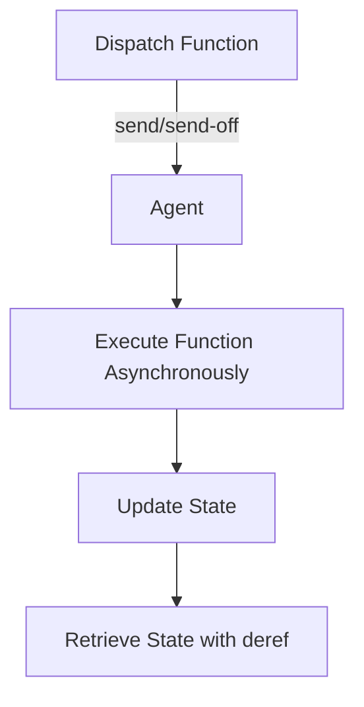

## 8.2.4 Agents

In the realm of functional programming and concurrency, Clojure offers a unique and powerful tool: **agents**. Agents provide a way to manage state changes asynchronously and independently, allowing actions to be performed in the background without blocking the main thread. This section will delve into the concept of agents, how they work, and how they can be effectively used in Clojure applications.

### Understanding Agents

Agents in Clojure are designed for managing state that changes over time, but unlike atoms, refs, and vars, agents handle state changes asynchronously. This means that when you send a function to an agent to update its state, the function is executed in a separate thread, allowing your main program to continue running without waiting for the state change to complete.

#### Key Characteristics of Agents

- **Asynchronous Execution**: Agents perform actions in the background, freeing up the main thread.
- **Independent State Changes**: Each agent manages its own state independently of others.
- **Error Handling**: Agents can handle errors gracefully, allowing you to specify what should happen if an error occurs during state updates.

### Creating and Using Agents

To create an agent in Clojure, you use the `agent` function, which initializes the agent with an initial state. You can then use the `send` or `send-off` functions to dispatch actions to the agent.

```clojure
;; Create an agent with an initial state of 0
(def my-agent (agent 0))

;; Define a function to increment the agent's state
(defn increment [state]
  (inc state))

;; Send the increment function to the agent
(send my-agent increment)

;; Retrieve the agent's state
(println @my-agent) ; Output: 1
```

In this example, we create an agent with an initial state of `0`. We then define a function `increment` that increments the state. Using `send`, we dispatch the `increment` function to the agent, which updates its state asynchronously. Finally, we use `deref` (or the `@` reader macro) to retrieve the agent's state.

### `send` vs `send-off`

Clojure provides two functions for dispatching actions to agents: `send` and `send-off`. Both functions are used to send a function to an agent, but they differ in how they handle execution.

- **`send`**: Executes the function in a thread pool, suitable for CPU-bound tasks. It ensures that the function is executed in a non-blocking manner.
- **`send-off`**: Executes the function in a separate thread, suitable for I/O-bound tasks. This allows for potentially blocking operations without affecting the thread pool.

#### Example: Using `send` and `send-off`

```clojure
;; Function to simulate a CPU-bound task
(defn cpu-bound-task [state]
  (Thread/sleep 1000) ; Simulate computation
  (inc state))

;; Function to simulate an I/O-bound task
(defn io-bound-task [state]
  (Thread/sleep 2000) ; Simulate I/O operation
  (inc state))

;; Use send for CPU-bound task
(send my-agent cpu-bound-task)

;; Use send-off for I/O-bound task
(send-off my-agent io-bound-task)
```

In this example, `cpu-bound-task` simulates a computation, while `io-bound-task` simulates an I/O operation. We use `send` for the CPU-bound task to ensure it runs in the thread pool, and `send-off` for the I/O-bound task to allow it to run in a separate thread.

### Error Handling with Agents

Agents in Clojure can handle errors that occur during state updates. By default, if an error occurs, the agent's state is not updated, and the error is stored in the agent's error handler. You can use the `set-error-handler!` function to specify a custom error handler.

#### Example: Setting an Error Handler

```clojure
;; Define a function that may throw an exception
(defn risky-task [state]
  (if (< state 5)
    (throw (Exception. "State is too low!"))
    (inc state)))

;; Set a custom error handler for the agent
(set-error-handler! my-agent
  (fn [agent exception]
    (println "Error occurred:" (.getMessage exception))))

;; Send the risky task to the agent
(send my-agent risky-task)
```

In this example, `risky-task` throws an exception if the state is less than `5`. We set a custom error handler that prints the error message. When we send `risky-task` to the agent, the error handler is invoked if an exception occurs.

### Retrieving Agent State

To retrieve the current state of an agent, you use the `deref` function or the `@` reader macro. This operation is synchronous and will block if the agent is currently processing a function.

```clojure
;; Retrieve the agent's state
(println @my-agent)
```

### Agents vs Java's Concurrency Mechanisms

In Java, managing asynchronous state changes often involves using threads, executors, and synchronization mechanisms. Clojure's agents provide a higher-level abstraction that simplifies this process by handling the details of thread management and synchronization for you.

#### Comparison with Java Code

**Java Example:**

```java
import java.util.concurrent.ExecutorService;
import java.util.concurrent.Executors;
import java.util.concurrent.atomic.AtomicInteger;

public class AgentExample {
    private static AtomicInteger state = new AtomicInteger(0);
    private static ExecutorService executor = Executors.newFixedThreadPool(2);

    public static void main(String[] args) {
        executor.submit(() -> state.incrementAndGet());
        executor.submit(() -> state.incrementAndGet());

        executor.shutdown();
        System.out.println("State: " + state.get());
    }
}
```

**Clojure Equivalent:**

```clojure
(def my-agent (agent 0))

(send my-agent inc)
(send my-agent inc)

(println @my-agent)
```

In the Java example, we use an `ExecutorService` to manage threads and an `AtomicInteger` to handle state changes. In Clojure, the agent handles these details, allowing us to focus on the logic of our application.

### Try It Yourself

To deepen your understanding of agents, try modifying the examples above:

- Change the initial state of the agent and observe how it affects the output.
- Create a new function that performs a more complex state update and send it to the agent.
- Experiment with error handling by introducing deliberate errors and observing how the error handler responds.

### Visualizing Agent Workflow

Below is a diagram illustrating the workflow of an agent in Clojure, from dispatching a function to retrieving the updated state.



**Diagram Description**: This flowchart shows the process of dispatching a function to an agent using `send` or `send-off`, executing the function asynchronously, updating the agent's state, and retrieving the state using `deref`.

### Exercises

1. **Create a Counter**: Implement a counter using an agent that increments its state every second. Use `send-off` to simulate a non-blocking operation.
2. **Error Handling**: Modify the `risky-task` example to retry the operation if an error occurs, using a custom error handler.
3. **State Aggregation**: Create multiple agents, each managing a part of a larger state. Use `send` to update each agent and aggregate their states into a final result.

### Key Takeaways

- **Agents** provide a way to manage asynchronous, independent state changes in Clojure.
- **`send` and `send-off`** are used to dispatch actions to agents, with `send-off` suitable for I/O-bound tasks.
- **Error handling** in agents allows for graceful recovery from exceptions during state updates.
- **Agents** abstract away the complexities of thread management and synchronization, offering a simpler alternative to Java's concurrency mechanisms.

By leveraging agents, you can build robust, non-blocking applications that efficiently manage state changes in a concurrent environment. Now that we've explored how agents work in Clojure, let's apply these concepts to manage state effectively in your applications.

For further reading, consider exploring the [Official Clojure Documentation on Agents](https://clojure.org/reference/agents) and [ClojureDocs](https://clojuredocs.org/clojure.core/agent) for additional examples and use cases.

---

## Quiz: Mastering Clojure Agents for Asynchronous State Management



### What is the primary purpose of agents in Clojure?

- [x] To manage asynchronous, independent state changes
- [ ] To handle synchronous state updates
- [ ] To replace all concurrency mechanisms
- [ ] To manage only I/O-bound tasks

> **Explanation:** Agents are designed to manage asynchronous, independent state changes, allowing actions to be performed in the background.

### Which function is used to dispatch CPU-bound tasks to an agent?

- [x] `send`
- [ ] `send-off`
- [ ] `dispatch`
- [ ] `execute`

> **Explanation:** `send` is used for CPU-bound tasks, executing functions in a thread pool.

### How do you retrieve the current state of an agent?

- [x] Using `deref` or the `@` reader macro
- [ ] Using `get-state`
- [ ] Using `fetch`
- [ ] Using `retrieve`

> **Explanation:** The `deref` function or the `@` reader macro is used to retrieve the current state of an agent.

### What happens if an error occurs during an agent's state update?

- [x] The error is stored, and the state is not updated
- [ ] The agent crashes
- [ ] The state is updated with a default value
- [ ] The error is ignored

> **Explanation:** If an error occurs, the agent's state is not updated, and the error is stored for handling.

### Which function is suitable for dispatching I/O-bound tasks to an agent?

- [x] `send-off`
- [ ] `send`
- [ ] `dispatch`
- [ ] `execute`

> **Explanation:** `send-off` is suitable for I/O-bound tasks, as it executes functions in a separate thread.

### How can you set a custom error handler for an agent?

- [x] Using `set-error-handler!`
- [ ] Using `set-handler`
- [ ] Using `handle-error`
- [ ] Using `error-handler`

> **Explanation:** `set-error-handler!` is used to set a custom error handler for an agent.

### What is the main difference between `send` and `send-off`?

- [x] `send` uses a thread pool, while `send-off` uses a separate thread
- [ ] `send` is synchronous, while `send-off` is asynchronous
- [ ] `send` is for I/O tasks, while `send-off` is for CPU tasks
- [ ] `send` is faster than `send-off`

> **Explanation:** `send` uses a thread pool for execution, while `send-off` uses a separate thread, making it suitable for I/O-bound tasks.

### Which of the following is a benefit of using agents over Java's concurrency mechanisms?

- [x] Simplified thread management
- [ ] Faster execution
- [ ] More control over threads
- [ ] Direct access to Java's thread API

> **Explanation:** Agents simplify thread management by abstracting away the complexities involved in Java's concurrency mechanisms.

### Can agents be used to manage shared state between multiple threads?

- [x] True
- [ ] False

> **Explanation:** Agents can manage shared state between multiple threads by handling state changes asynchronously and independently.

### What is a common use case for agents in Clojure applications?

- [x] Managing background tasks without blocking the main thread
- [ ] Handling real-time data streams
- [ ] Implementing complex algorithms
- [ ] Replacing all other concurrency primitives

> **Explanation:** Agents are commonly used to manage background tasks without blocking the main thread, allowing for efficient state management.


