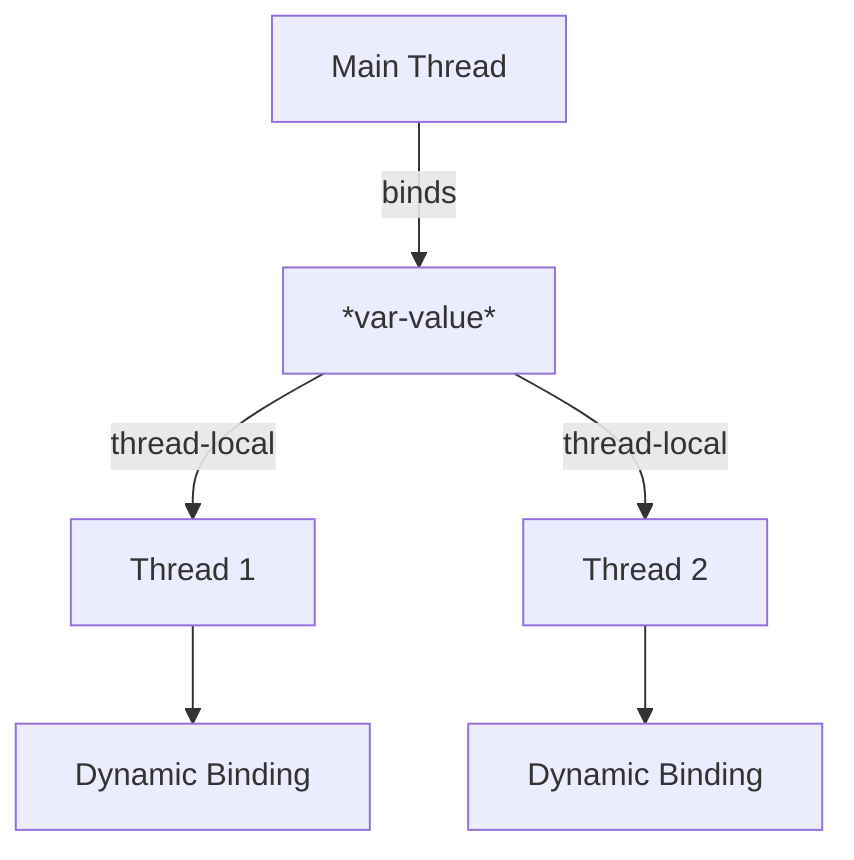

## 8.2.5 Vars

In this section, we delve into the concept of **Vars** in Clojure, a powerful feature that allows for dynamic bindings and thread-local state management. As experienced Java developers, you may be familiar with the concept of thread-local variables. Clojure's Vars provide a similar capability but with a functional twist. Let's explore how Vars work, their use cases, and how they can be leveraged for context-specific configurations or settings that differ across threads.

### Understanding Vars

Vars in Clojure are mutable references that can hold different values in different threads. They are primarily used for global state and dynamic bindings. Unlike Atoms, Refs, and Agents, which are used for managing shared state across threads, Vars are designed to provide thread-local state, making them ideal for scenarios where you need to maintain different values for different threads.

#### Key Characteristics of Vars

- **Global Scope**: Vars are globally accessible, meaning they can be accessed from anywhere in your code.
- **Dynamic Bindings**: Vars support dynamic bindings, allowing you to temporarily override their values within a specific scope.
- **Thread-Local State**: Each thread can have its own value for a Var, making it possible to maintain thread-specific configurations.

### Vars vs. Java's ThreadLocal

In Java, the `ThreadLocal` class is used to create variables that are local to a thread. Each thread accessing such a variable has its own, independently initialized copy of the variable. Clojure's Vars provide a similar mechanism but with additional flexibility through dynamic bindings.

#### Java Example: ThreadLocal

```java
public class ThreadLocalExample {
    private static final ThreadLocal<Integer> threadLocalValue = ThreadLocal.withInitial(() -> 0);

    public static void main(String[] args) {
        Runnable task = () -> {
            int value = threadLocalValue.get();
            System.out.println("Initial Value: " + value);
            threadLocalValue.set(value + 1);
            System.out.println("Updated Value: " + threadLocalValue.get());
        };

        Thread thread1 = new Thread(task);
        Thread thread2 = new Thread(task);

        thread1.start();
        thread2.start();
    }
}
```

#### Clojure Example: Vars

```clojure
(def ^:dynamic *var-value* 0)

(defn print-and-update-var []
  (println "Initial Value:" *var-value*)
  (binding [*var-value* (inc *var-value*)]
    (println "Updated Value:" *var-value*)))

(defn -main []
  (future (print-and-update-var))
  (future (print-and-update-var)))
```

In the Clojure example, we use `binding` to create a dynamic binding for `*var-value*`, allowing each thread to have its own value.

### Dynamic Bindings with Vars

Dynamic bindings are a powerful feature of Vars that allow you to temporarily change the value of a Var within a specific scope. This is particularly useful for managing context-specific configurations, such as logging levels or database connections, that may vary across different parts of your application.

#### Using `binding` for Dynamic Bindings

The `binding` form in Clojure is used to create dynamic bindings for Vars. It temporarily overrides the value of a Var within the scope of the `binding` form.

```clojure
(def ^:dynamic *log-level* :info)

(defn log-message [message]
  (println (str "[" *log-level* "] " message)))

(defn process-data []
  (binding [*log-level* :debug]
    (log-message "Processing data...")))

(defn -main []
  (log-message "Starting application")
  (process-data)
  (log-message "Application finished"))
```

In this example, `*log-level*` is dynamically bound to `:debug` within the `process-data` function, allowing for context-specific logging.

### Thread-Local State with Vars

Vars provide a convenient way to manage thread-local state in Clojure. Each thread can have its own value for a Var, making it possible to maintain separate configurations or settings for different threads.

#### Example: Thread-Local Configuration

Consider a scenario where you need to maintain different database connections for different threads. Vars can be used to achieve this by dynamically binding a Var to a thread-specific connection.

```clojure
(def ^:dynamic *db-connection* nil)

(defn connect-to-db []
  ;; Simulate a database connection
  (println "Connecting to database...")
  {:connection-id (rand-int 1000)})

(defn process-request []
  (binding [*db-connection* (connect-to-db)]
    (println "Processing request with connection:" *db-connection*)))

(defn -main []
  (future (process-request))
  (future (process-request)))
```

In this example, each thread establishes its own database connection, which is stored in the `*db-connection*` Var.

### Best Practices for Using Vars

While Vars are a powerful tool for managing dynamic bindings and thread-local state, they should be used judiciously. Here are some best practices to keep in mind:

- **Limit Scope**: Use dynamic bindings sparingly and limit their scope to avoid unintended side effects.
- **Avoid Global State**: While Vars can be used for global state, it's generally better to use other concurrency primitives like Atoms or Refs for shared state.
- **Use Descriptive Names**: Prefix dynamic Vars with an asterisk (`*`) to indicate their dynamic nature, following Clojure's naming conventions.

### Try It Yourself

Experiment with the examples provided by modifying the dynamic bindings and observing how they affect the behavior of your code. Try creating your own dynamic Vars for different configurations or settings.

### Diagrams and Visualizations

To better understand the flow of data and the role of Vars in managing thread-local state, let's visualize the concept using a diagram.



**Diagram Description**: This diagram illustrates how the main thread binds a Var (`*var-value*`) and how each thread (Thread 1 and Thread 2) maintains its own dynamic binding, allowing for thread-local state management.

### Further Reading

For more information on Vars and dynamic bindings in Clojure, consider exploring the following resources:

- [Official Clojure Documentation on Vars](https://clojure.org/reference/vars)
- [ClojureDocs: Vars](https://clojuredocs.org/clojure.core/var)
- [Clojure Programming by Chas Emerick, Brian Carper, and Christophe Grand](https://www.oreilly.com/library/view/clojure-programming/9781449310387/)

### Exercises

1. Create a dynamic Var for managing user sessions in a web application. Use `binding` to simulate different session states for different threads.
2. Implement a logging system using dynamic Vars to manage different logging levels for different parts of your application.
3. Explore the impact of dynamic bindings on performance by measuring the execution time of a function with and without dynamic bindings.

### Key Takeaways

- **Vars** in Clojure provide a mechanism for dynamic bindings and thread-local state management.
- They are similar to Java's `ThreadLocal` but offer additional flexibility through dynamic bindings.
- Use Vars judiciously, limiting their scope and avoiding global state where possible.
- Dynamic bindings are powerful for managing context-specific configurations or settings.

Now that we've explored the concept of Vars in Clojure, let's apply these principles to manage state effectively in your applications.

## Quiz: Mastering Vars in Clojure



### What is a primary use case for Vars in Clojure?

- [x] Managing dynamic bindings and thread-local state
- [ ] Handling shared state across threads
- [ ] Implementing immutable data structures
- [ ] Creating higher-order functions

> **Explanation:** Vars are primarily used for managing dynamic bindings and thread-local state, allowing different threads to have their own values for a Var.

### How do you create a dynamic binding for a Var in Clojure?

- [x] Using the `binding` form
- [ ] Using the `let` form
- [ ] Using the `def` form
- [ ] Using the `atom` function

> **Explanation:** The `binding` form is used to create dynamic bindings for Vars, temporarily overriding their values within a specific scope.

### What is a key difference between Vars in Clojure and Java's ThreadLocal?

- [x] Vars support dynamic bindings, while ThreadLocal does not
- [ ] Vars are immutable, while ThreadLocal is mutable
- [ ] Vars are used for shared state, while ThreadLocal is not
- [ ] Vars are specific to ClojureScript, while ThreadLocal is not

> **Explanation:** Vars in Clojure support dynamic bindings, allowing for temporary value overrides within a scope, a feature not available in Java's ThreadLocal.

### Which of the following is a best practice when using Vars?

- [x] Limit the scope of dynamic bindings
- [ ] Use Vars for all global state
- [ ] Avoid using dynamic bindings
- [ ] Use Vars for shared state across threads

> **Explanation:** It's best to limit the scope of dynamic bindings to avoid unintended side effects and maintain code clarity.

### What prefix is commonly used for dynamic Vars in Clojure?

- [x] An asterisk (`*`)
- [ ] A dollar sign (`$`)
- [ ] An underscore (`_`)
- [ ] A hash (`#`)

> **Explanation:** Dynamic Vars in Clojure are commonly prefixed with an asterisk (`*`) to indicate their dynamic nature.

### Can Vars be used for shared state across threads?

- [ ] Yes, they are designed for shared state
- [x] No, they are intended for thread-local state
- [ ] Yes, but only with dynamic bindings
- [ ] No, they are immutable

> **Explanation:** Vars are intended for thread-local state, allowing each thread to have its own value for a Var.

### What is the purpose of the `binding` form in Clojure?

- [x] To create dynamic bindings for Vars
- [ ] To define new Vars
- [ ] To update the value of an Atom
- [ ] To create immutable data structures

> **Explanation:** The `binding` form is used to create dynamic bindings for Vars, temporarily changing their values within a specific scope.

### How do dynamic bindings affect the performance of a Clojure application?

- [ ] They always improve performance
- [ ] They have no impact on performance
- [x] They can introduce overhead due to context switching
- [ ] They make the application immutable

> **Explanation:** Dynamic bindings can introduce overhead due to context switching, so they should be used judiciously.

### What is a common use case for dynamic bindings in Clojure?

- [x] Managing context-specific configurations
- [ ] Implementing immutable data structures
- [ ] Handling shared state across threads
- [ ] Creating higher-order functions

> **Explanation:** Dynamic bindings are commonly used for managing context-specific configurations, such as logging levels or database connections.

### Vars in Clojure are similar to Java's ThreadLocal in that they both provide thread-local state.

- [x] True
- [ ] False

> **Explanation:** Both Vars in Clojure and Java's ThreadLocal provide mechanisms for managing thread-local state, allowing each thread to maintain its own value for a variable.


