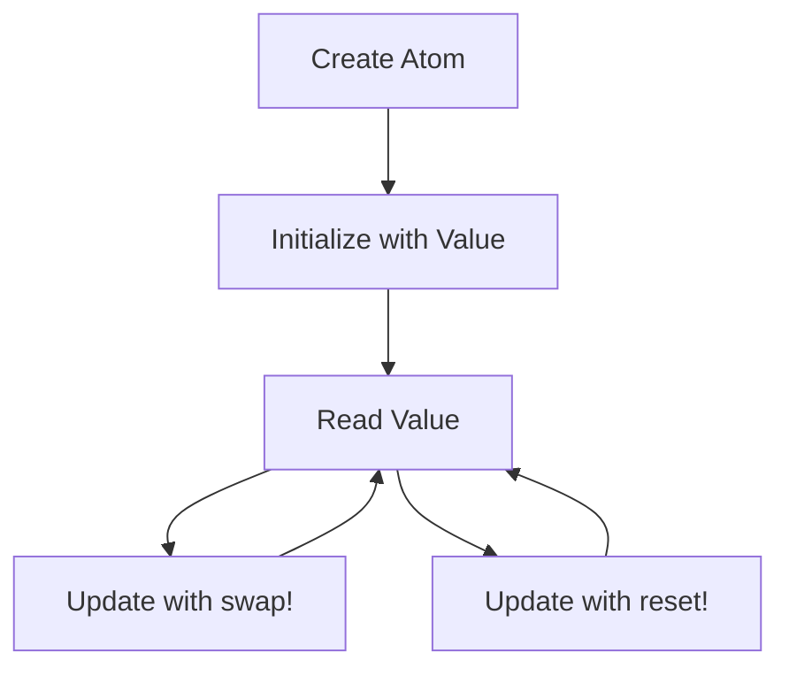

## 8.3.1 Creating and Using Atoms

In this section, we delve into the concept of **atoms** in Clojure, a powerful tool for managing state in a concurrent environment. Atoms provide a way to manage shared, mutable state in a thread-safe manner, which is crucial for building robust applications. As experienced Java developers, you may be familiar with the challenges of managing state in a multithreaded environment. Clojure's atoms offer a simpler and more elegant solution compared to traditional Java concurrency mechanisms.

### Understanding Atoms

Atoms in Clojure are a type of reference that allows you to manage shared, mutable state. They are designed to be used in situations where you need to update a value atomically, ensuring that changes are visible to all threads. Unlike Java's `synchronized` blocks or `volatile` variables, atoms provide a higher-level abstraction that simplifies state management.

#### Key Characteristics of Atoms

- **Immutability**: While the value an atom points to is immutable, the atom itself can be updated to point to a new value.
- **Atomic Updates**: Updates to an atom are atomic, meaning they are performed in a single, indivisible operation.
- **Consistency**: Atoms ensure that all threads see a consistent view of the state.

### Creating Atoms

To create an atom in Clojure, you use the `atom` function, which initializes the atom with a given value. This value can be of any type, including numbers, strings, collections, or even other atoms.

```clojure
(def my-atom (atom 0)) ; Create an atom initialized with the value 0
```

In this example, `my-atom` is an atom that initially holds the value `0`. You can create atoms with more complex data structures as well:

```clojure
(def my-map-atom (atom {:key "value"})) ; Create an atom with a map
```

### Reading the Value of an Atom

To read the current value of an atom, you can use the `deref` function or the `@` reader macro. Both methods provide a snapshot of the current value.

```clojure
(println (deref my-atom)) ; Prints the current value of my-atom
(println @my-atom)        ; Equivalent to (deref my-atom)
```

### Updating the Value of an Atom

Atoms are updated using the `swap!` and `reset!` functions. The `swap!` function applies a function to the current value of the atom, while `reset!` sets the atom to a new value directly.

#### Using `swap!`

The `swap!` function takes a function and any additional arguments, applying the function to the current value of the atom.

```clojure
(swap! my-atom inc) ; Increment the value of my-atom by 1
```

In this example, the `inc` function is applied to the current value of `my-atom`, incrementing it by 1.

#### Using `reset!`

The `reset!` function sets the atom to a new value, bypassing any transformation function.

```clojure
(reset! my-atom 42) ; Set the value of my-atom to 42
```

### Comparing Atoms with Java's Concurrency Mechanisms

In Java, managing shared state often involves using `synchronized` blocks, `volatile` variables, or concurrent collections. These mechanisms can be complex and error-prone, especially in large applications. Atoms in Clojure provide a simpler and more intuitive approach to state management.

#### Java Example: Using `synchronized`

```java
public class Counter {
    private int count = 0;

    public synchronized void increment() {
        count++;
    }

    public synchronized int getCount() {
        return count;
    }
}
```

In this Java example, the `synchronized` keyword is used to ensure that the `increment` and `getCount` methods are thread-safe. However, this approach can lead to performance bottlenecks and increased complexity.

#### Clojure Example: Using Atoms

```clojure
(def counter (atom 0))

(defn increment-counter []
  (swap! counter inc))

(defn get-counter []
  @counter)
```

In the Clojure example, the `swap!` function is used to atomically increment the value of the `counter` atom. This approach is simpler and more efficient, as it avoids the need for explicit locking.

### Best Practices for Using Atoms

- **Use Atoms for Independent State**: Atoms are ideal for managing state that is independent and does not require coordination with other state changes.
- **Avoid Complex State Transitions**: If your application requires complex state transitions involving multiple atoms, consider using refs or agents instead.
- **Leverage Immutability**: Take advantage of Clojure's immutable data structures to simplify state management and reduce the risk of bugs.

### Try It Yourself

To deepen your understanding of atoms, try modifying the code examples provided. Experiment with different data types and update functions to see how atoms behave in various scenarios.

- **Challenge**: Create an atom that holds a vector of numbers. Use `swap!` to add a new number to the vector.
- **Challenge**: Implement a simple counter using an atom, and compare its performance with a Java implementation using `synchronized`.

### Diagrams and Visualizations

To better understand how atoms work, let's visualize the process of creating and updating an atom.



**Diagram 1**: This flowchart illustrates the lifecycle of an atom, from creation to reading and updating its value.

### Further Reading

For more information on atoms and concurrency in Clojure, consider exploring the following resources:

- [Official Clojure Documentation on Atoms](https://clojure.org/reference/atoms)
- [ClojureDocs: Atoms](https://clojuredocs.org/clojure.core/atom)

### Exercises

1. **Exercise**: Create an atom that holds a map of user profiles. Implement functions to add, update, and remove profiles using `swap!`.
2. **Exercise**: Compare the performance of an atom-based counter with a Java `AtomicInteger` in a multithreaded environment.

### Key Takeaways

- Atoms provide a simple and efficient way to manage shared, mutable state in Clojure.
- They offer atomic updates and ensure consistency across threads, making them ideal for concurrent applications.
- By leveraging Clojure's immutable data structures, atoms simplify state management and reduce the risk of concurrency-related bugs.

Now that we've explored how to create and use atoms in Clojure, let's apply these concepts to manage state effectively in your applications.

## Quiz: Mastering Atoms in Clojure



### What is the primary purpose of atoms in Clojure?

- [x] To manage shared, mutable state in a thread-safe manner
- [ ] To perform mathematical calculations
- [ ] To handle file I/O operations
- [ ] To manage network connections

> **Explanation:** Atoms are designed to manage shared, mutable state in a thread-safe manner, providing atomic updates and consistency across threads.

### How do you read the value of an atom in Clojure?

- [x] Using the `deref` function
- [x] Using the `@` reader macro
- [ ] Using the `get` function
- [ ] Using the `read` function

> **Explanation:** You can read the value of an atom using the `deref` function or the `@` reader macro, both of which provide a snapshot of the current value.

### Which function is used to atomically update the value of an atom?

- [x] `swap!`
- [ ] `reset!`
- [ ] `update!`
- [ ] `change!`

> **Explanation:** The `swap!` function is used to atomically update the value of an atom by applying a function to its current value.

### What is the difference between `swap!` and `reset!`?

- [x] `swap!` applies a function to the current value, while `reset!` sets a new value directly
- [ ] `swap!` sets a new value directly, while `reset!` applies a function
- [ ] Both perform the same operation
- [ ] Neither can update an atom

> **Explanation:** `swap!` applies a function to the current value of an atom, while `reset!` sets the atom to a new value directly.

### Which of the following is a characteristic of atoms?

- [x] Atomic updates
- [x] Consistency across threads
- [ ] Requires explicit locking
- [ ] Mutable values

> **Explanation:** Atoms provide atomic updates and ensure consistency across threads, without requiring explicit locking. The values they point to are immutable.

### How do atoms in Clojure compare to Java's `synchronized` keyword?

- [x] Atoms provide a higher-level abstraction for state management
- [ ] Atoms require explicit locking like `synchronized`
- [ ] Atoms are less efficient than `synchronized`
- [ ] Atoms are not suitable for concurrent applications

> **Explanation:** Atoms provide a higher-level abstraction for state management, simplifying concurrency compared to Java's `synchronized` keyword.

### What is a best practice when using atoms in Clojure?

- [x] Use atoms for independent state
- [ ] Use atoms for complex state transitions
- [ ] Avoid using atoms in concurrent applications
- [ ] Always use `reset!` for updates

> **Explanation:** Atoms are best used for managing independent state. For complex state transitions, consider using refs or agents.

### Which of the following is a valid use case for atoms?

- [x] Managing a counter
- [ ] Handling file I/O operations
- [ ] Managing network connections
- [ ] Performing mathematical calculations

> **Explanation:** Atoms are well-suited for managing simple state, such as a counter, in a concurrent environment.

### Can atoms be used to manage complex state transitions?

- [ ] True
- [x] False

> **Explanation:** Atoms are not ideal for complex state transitions that require coordination with other state changes. Consider using refs or agents for such scenarios.

### What is the benefit of using Clojure's immutable data structures with atoms?

- [x] Simplifies state management and reduces concurrency-related bugs
- [ ] Increases the complexity of state management
- [ ] Requires more memory
- [ ] Slows down application performance

> **Explanation:** Clojure's immutable data structures simplify state management and reduce the risk of concurrency-related bugs, making them ideal for use with atoms.


