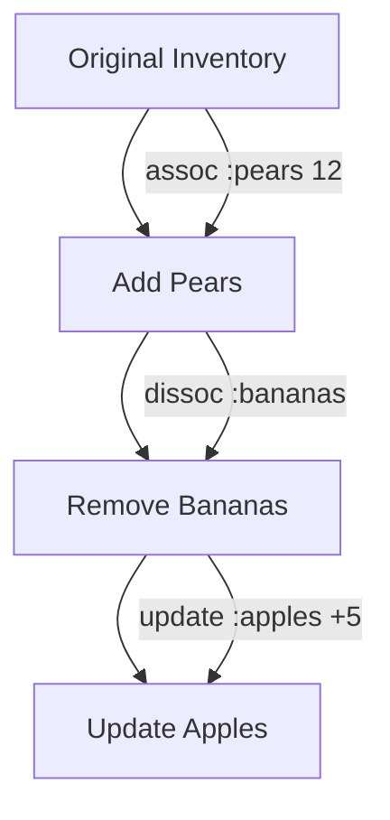

## 8.3.1 Transforming Data Structures

In the realm of Clojure, data transformation is a fundamental concept that underpins the language's functional programming paradigm. Unlike Java, where mutable state and in-place updates are common, Clojure emphasizes immutability and persistent data structures. This section will guide you through the essential operations for transforming Clojure's core data structures, focusing on adding, removing, and updating elements. We'll explore functions such as `conj`, `disj`, `dissoc`, `assoc`, and `update`, illustrating how each operation returns a new collection, leaving the original unchanged.

### Understanding Immutability and Persistent Data Structures

Before diving into specific operations, it's crucial to understand the philosophy of immutability in Clojure. Immutability means that once a data structure is created, it cannot be changed. Instead, operations on data structures produce new versions, sharing as much structure as possible with the originals. This concept is known as structural sharing and is key to the efficiency of Clojure's persistent data structures.

#### Benefits of Immutability

1. **Thread Safety**: Immutability eliminates the need for locks or synchronization when accessing data structures across multiple threads, as there is no risk of concurrent modifications.
2. **Predictability**: Functions that operate on immutable data structures are easier to reason about since they do not have side effects.
3. **Ease of Undo/Redo**: In applications where state changes need to be reversible, immutable data structures simplify the implementation of undo/redo functionality.

### Adding Elements with `conj`

The `conj` function is used to add elements to a collection. The behavior of `conj` varies slightly depending on the type of collection:

- **Lists**: `conj` adds elements to the front.
- **Vectors**: `conj` appends elements to the end.
- **Sets**: `conj` adds elements, maintaining uniqueness.

#### Example: Using `conj` with Different Collections

```clojure
;; Adding to a list
(def my-list '(1 2 3))
(def new-list (conj my-list 0))
;; new-list => (0 1 2 3)

;; Adding to a vector
(def my-vector [1 2 3])
(def new-vector (conj my-vector 4))
;; new-vector => [1 2 3 4]

;; Adding to a set
(def my-set #{1 2 3})
(def new-set (conj my-set 4))
;; new-set => #{1 2 3 4}
```

### Removing Elements with `disj` and `dissoc`

To remove elements from collections, Clojure provides `disj` for sets and `dissoc` for maps.

#### Removing Elements from Sets with `disj`

The `disj` function removes elements from a set. If the element is not present, the original set is returned.

```clojure
(def my-set #{1 2 3})
(def smaller-set (disj my-set 2))
;; smaller-set => #{1 3}
```

#### Removing Elements from Maps with `dissoc`

The `dissoc` function removes key-value pairs from a map.

```clojure
(def my-map {:a 1 :b 2 :c 3})
(def smaller-map (dissoc my-map :b))
;; smaller-map => {:a 1 :c 3}
```

### Updating Elements with `assoc` and `update`

Updating elements in Clojure involves creating a new version of the collection with the desired changes.

#### Associating New Values with `assoc`

The `assoc` function is used to add or update key-value pairs in maps and vectors.

```clojure
;; Updating a map
(def my-map {:a 1 :b 2})
(def updated-map (assoc my-map :b 3))
;; updated-map => {:a 1 :b 3}

;; Adding a new key-value pair
(def expanded-map (assoc my-map :c 4))
;; expanded-map => {:a 1 :b 2 :c 4}
```

#### Updating Values with `update`

The `update` function applies a function to a value associated with a key in a map.

```clojure
(def my-map {:a 1 :b 2})
(def incremented-map (update my-map :b inc))
;; incremented-map => {:a 1 :b 3}
```

### Practical Code Examples

Let's explore a practical example where we transform a collection of data representing a simple inventory system.

#### Example: Inventory Management

Suppose we have an inventory represented as a map, where keys are item names and values are quantities.

```clojure
(def inventory {:apples 10 :bananas 5 :oranges 8})

;; Adding a new item
(def updated-inventory (assoc inventory :pears 12))
;; updated-inventory => {:apples 10 :bananas 5 :oranges 8 :pears 12}

;; Removing an item
(def reduced-inventory (dissoc updated-inventory :bananas))
;; reduced-inventory => {:apples 10 :oranges 8 :pears 12}

;; Updating the quantity of an existing item
(def final-inventory (update reduced-inventory :apples + 5))
;; final-inventory => {:apples 15 :oranges 8 :pears 12}
```

### Diagrams and Visualizations

To better understand the transformations, let's visualize the operations using a flowchart.



### Best Practices and Optimization Tips

1. **Leverage Immutability**: Embrace the immutability of Clojure's data structures to write safer and more predictable code.
2. **Use Persistent Data Structures**: Understand that persistent data structures are optimized for performance, using structural sharing to minimize memory usage.
3. **Avoid Unnecessary Copies**: When transforming data, ensure that you are not inadvertently creating unnecessary copies of large data structures.

### Common Pitfalls

1. **Assuming In-Place Modification**: Java developers may mistakenly assume that operations modify the original collection. Always remember that Clojure returns new collections.
2. **Misusing `conj`**: Be aware of how `conj` behaves differently with lists, vectors, and sets to avoid unexpected results.

### Conclusion

Transforming data structures in Clojure is a powerful technique that leverages immutability and functional programming principles. By understanding and effectively using functions like `conj`, `disj`, `dissoc`, `assoc`, and `update`, you can manipulate data in a way that is both efficient and safe. As you continue to explore Clojure, these operations will become second nature, enabling you to write robust, concurrent, and maintainable code.

## Quiz Time!



### What does the `conj` function do when used with a list?

- [x] Adds elements to the front of the list
- [ ] Adds elements to the end of the list
- [ ] Removes elements from the list
- [ ] Updates elements in the list

> **Explanation:** In Clojure, `conj` adds elements to the front of a list, which is a key difference from its behavior with vectors.

### How does `conj` behave with vectors?

- [ ] Adds elements to the front of the vector
- [x] Adds elements to the end of the vector
- [ ] Removes elements from the vector
- [ ] Updates elements in the vector

> **Explanation:** For vectors, `conj` appends elements to the end, maintaining the order of elements.

### Which function is used to remove elements from a set?

- [ ] `assoc`
- [ ] `update`
- [x] `disj`
- [ ] `dissoc`

> **Explanation:** The `disj` function is specifically used to remove elements from a set in Clojure.

### What is the purpose of the `dissoc` function?

- [ ] Add key-value pairs to a map
- [x] Remove key-value pairs from a map
- [ ] Update values in a map
- [ ] Add elements to a set

> **Explanation:** `dissoc` is used to remove key-value pairs from a map, effectively creating a new map without the specified keys.

### How does `assoc` function in Clojure?

- [x] Adds or updates key-value pairs in a map
- [ ] Removes key-value pairs from a map
- [ ] Adds elements to a set
- [ ] Removes elements from a set

> **Explanation:** The `assoc` function is used to add or update key-value pairs in a map, returning a new map with the changes.

### What does the `update` function do?

- [ ] Adds elements to a collection
- [ ] Removes elements from a collection
- [x] Applies a function to a value associated with a key in a map
- [ ] Creates a new collection

> **Explanation:** `update` applies a function to a value associated with a key in a map, allowing for transformation of the value.

### Which function would you use to increment a value in a map?

- [ ] `conj`
- [ ] `disj`
- [x] `update`
- [ ] `assoc`

> **Explanation:** To increment a value in a map, you can use `update` with the `inc` function.

### What is a key benefit of immutability in Clojure?

- [x] Thread safety
- [ ] Increased memory usage
- [ ] Slower performance
- [ ] In-place modifications

> **Explanation:** Immutability provides thread safety, as there are no concurrent modifications to worry about.

### What is structural sharing in Clojure?

- [x] A technique to minimize memory usage by sharing parts of data structures
- [ ] A method to copy entire data structures
- [ ] A way to modify data structures in place
- [ ] A process to convert data structures to strings

> **Explanation:** Structural sharing is a technique used in Clojure to minimize memory usage by sharing unchanged parts of data structures between versions.

### True or False: Operations like `conj`, `disj`, and `assoc` modify the original collection.

- [ ] True
- [x] False

> **Explanation:** These operations do not modify the original collection; they return a new collection with the changes applied.


