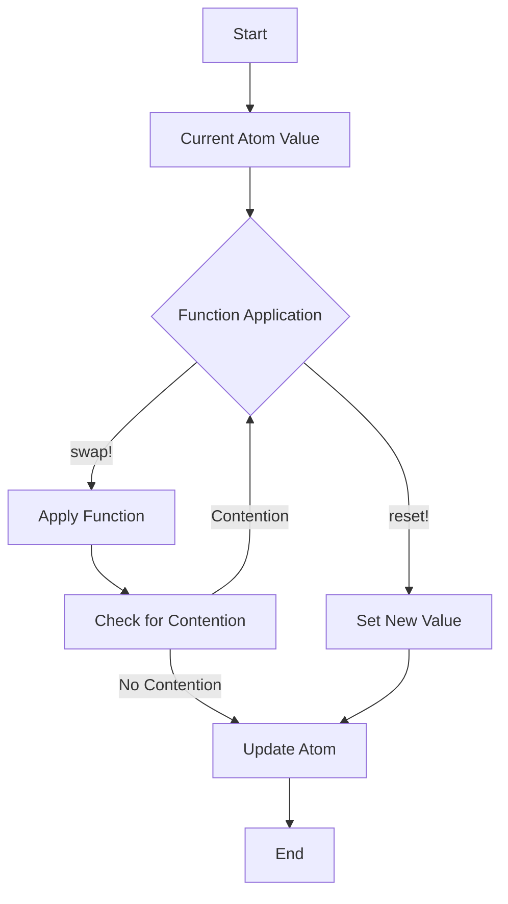

## 8.3.2 Updating Atom State with `swap!` and `reset!`

In this section, we delve into the powerful concurrency primitives provided by Clojure, focusing on **atoms** and their state management capabilities through the `swap!` and `reset!` functions. These functions are essential tools for managing state in a concurrent environment, offering a robust alternative to traditional Java concurrency mechanisms.

### Understanding Atoms in Clojure

Atoms in Clojure are a type of reference that provides a way to manage shared, mutable state. They are designed to be used in situations where you need to manage state changes that are independent and do not require coordination with other state changes. Atoms ensure that updates are atomic and consistent, making them ideal for managing state in a concurrent environment.

#### Key Characteristics of Atoms:

- **Atomic Updates**: Changes to an atom's state are atomic, meaning they are applied in a single, indivisible operation.
- **Consistency**: Atoms ensure that state changes are consistent, even in the presence of concurrent updates.
- **Immutability**: The value held by an atom is immutable, but the reference itself can point to different immutable values over time.

### The `swap!` Function

The `swap!` function is used to update the state of an atom by applying a function to its current value. This function is the cornerstone of atomic updates in Clojure, ensuring that state changes are applied consistently, even in the presence of concurrent modifications.

#### How `swap!` Works:

1. **Function Application**: `swap!` takes a function and applies it to the current value of the atom.
2. **Atomicity**: The update is atomic, meaning it is applied in a single, indivisible operation.
3. **Retry Mechanism**: If the atom's value has changed since the function was applied, `swap!` will retry the operation with the new value.

Here's a simple example to illustrate the use of `swap!`:

```clojure
(def counter (atom 0))

;; Increment the counter atomically
(swap! counter inc)

;; Print the updated value
(println @counter) ; => 1
```

In this example, we define an atom `counter` initialized to `0`. We then use `swap!` to increment its value atomically. The `inc` function is applied to the current value of the atom, and the result is stored back in the atom.

#### Handling Contention with `swap!`

In a concurrent environment, multiple threads might attempt to update the same atom simultaneously. `swap!` handles this contention by using a retry mechanism. If the atom's value changes between the time the function is applied and the time the update is committed, `swap!` will retry the operation with the new value.

Consider the following example:

```clojure
(def shared-state (atom {:count 0}))

;; Function to increment the count in a map
(defn increment-count [state]
  (update state :count inc))

;; Simulate concurrent updates
(future (dotimes [_ 1000] (swap! shared-state increment-count)))
(future (dotimes [_ 1000] (swap! shared-state increment-count)))

;; Wait for futures to complete
(Thread/sleep 100)

;; Print the final state
(println @shared-state) ; => {:count 2000}
```

In this example, two futures concurrently increment the `:count` key in the `shared-state` atom. Despite the concurrent updates, `swap!` ensures that the final count is `2000`, demonstrating its ability to handle contention and ensure consistency.

### The `reset!` Function

While `swap!` is used to update an atom's state by applying a function, `reset!` is used to replace the atom's value directly. This function is useful when you want to set the atom to a specific value without considering its current state.

#### How `reset!` Works:

- **Direct Replacement**: `reset!` directly sets the atom's value to the specified new value.
- **No Retry Mechanism**: Unlike `swap!`, `reset!` does not involve a retry mechanism since it does not depend on the current value of the atom.

Here's an example of using `reset!`:

```clojure
(def state (atom {:status "pending"}))

;; Reset the state to a new value
(reset! state {:status "completed"})

;; Print the updated state
(println @state) ; => {:status "completed"}
```

In this example, we use `reset!` to directly set the `state` atom to a new map. This operation does not involve any function application or retries, making it straightforward and efficient for direct replacements.

### Comparing `swap!` and `reset!`

Both `swap!` and `reset!` are used to update the state of an atom, but they serve different purposes and are suited to different scenarios.

| Feature          | `swap!`                                      | `reset!`                                  |
|------------------|----------------------------------------------|-------------------------------------------|
| **Purpose**      | Apply a function to the current value        | Directly set a new value                  |
| **Atomicity**    | Yes                                          | Yes                                       |
| **Retry**        | Yes, if the value changes during update      | No, direct replacement                    |
| **Use Case**     | When updates depend on the current value     | When setting a specific value directly    |

### Java Comparison: Atomic Variables

In Java, managing shared mutable state often involves using classes from the `java.util.concurrent.atomic` package, such as `AtomicInteger` or `AtomicReference`. These classes provide atomic operations similar to Clojure's atoms.

#### Java Example: AtomicInteger

```java
import java.util.concurrent.atomic.AtomicInteger;

public class AtomicExample {
    public static void main(String[] args) {
        AtomicInteger counter = new AtomicInteger(0);

        // Increment the counter atomically
        counter.incrementAndGet();

        // Print the updated value
        System.out.println(counter.get()); // => 1
    }
}
```

In this Java example, we use `AtomicInteger` to manage a shared counter. The `incrementAndGet` method provides an atomic update, similar to Clojure's `swap!`.

### Try It Yourself

To deepen your understanding of `swap!` and `reset!`, try modifying the examples above:

- **Experiment with Contention**: Increase the number of concurrent updates in the `swap!` example and observe how the atom handles contention.
- **Use Complex Data Structures**: Try using `swap!` and `reset!` with more complex data structures, such as nested maps or vectors.
- **Combine with Other Functions**: Explore combining `swap!` with other Clojure functions, such as `assoc` or `dissoc`, to manipulate data structures.

### Visualizing Atom Updates

To better understand how `swap!` and `reset!` work, let's visualize the process using a flowchart.



**Diagram Description**: This flowchart illustrates the process of updating an atom using `swap!` and `reset!`. `swap!` involves applying a function and checking for contention, while `reset!` directly sets a new value.

### Further Reading

For more information on atoms and concurrency in Clojure, consider exploring the following resources:

- [Official Clojure Documentation on Atoms](https://clojure.org/reference/atoms)
- [ClojureDocs: Atoms](https://clojuredocs.org/clojure.core/atom)
- [Java Concurrency in Practice](https://www.oreilly.com/library/view/java-concurrency-in/0321349601/)

### Exercises

1. **Implement a Counter**: Create a counter using an atom and `swap!`. Ensure that it handles concurrent updates correctly.
2. **State Management**: Use `reset!` to manage the state of a simple application, such as a to-do list.
3. **Complex Data Structures**: Experiment with `swap!` to update nested data structures, such as a map of vectors.

### Key Takeaways

- **Atoms** in Clojure provide a way to manage shared, mutable state with atomic updates.
- **`swap!`** applies a function to an atom's current value, ensuring atomic updates even in the presence of contention.
- **`reset!`** directly sets an atom's value, offering a straightforward way to replace state.
- Both functions offer a robust alternative to traditional Java concurrency mechanisms, simplifying state management in concurrent applications.

By mastering `swap!` and `reset!`, you can effectively manage state in your Clojure applications, leveraging the power of functional programming and immutability to build robust, concurrent systems.

## Quiz: Mastering Atom State Management with `swap!` and `reset!`



### What is the primary purpose of the `swap!` function in Clojure?

- [x] To apply a function to an atom's current value atomically
- [ ] To directly set a new value for an atom
- [ ] To create a new atom
- [ ] To delete an atom

> **Explanation:** `swap!` is used to apply a function to an atom's current value atomically, ensuring consistent updates even in concurrent environments.

### How does `swap!` handle contention in a concurrent environment?

- [x] By retrying the operation with the new value if the atom's value changes
- [ ] By locking the atom until the update is complete
- [ ] By ignoring concurrent updates
- [ ] By throwing an exception

> **Explanation:** `swap!` handles contention by retrying the operation with the new value if the atom's value changes during the update process.

### What is the main difference between `swap!` and `reset!`?

- [x] `swap!` applies a function to the current value, while `reset!` sets a new value directly
- [ ] `swap!` is faster than `reset!`
- [ ] `reset!` applies a function, while `swap!` sets a new value directly
- [ ] There is no difference

> **Explanation:** `swap!` applies a function to the current value of an atom, while `reset!` directly sets a new value without considering the current state.

### In what scenario would you use `reset!` instead of `swap!`?

- [x] When you want to set a specific value directly
- [ ] When you need to apply a function to the current value
- [ ] When handling concurrent updates
- [ ] When creating a new atom

> **Explanation:** `reset!` is used when you want to set a specific value directly, without applying a function to the current value.

### Which Java class provides similar functionality to Clojure's atoms?

- [x] `AtomicInteger`
- [ ] `Thread`
- [ ] `HashMap`
- [ ] `ArrayList`

> **Explanation:** `AtomicInteger` in Java provides atomic operations similar to Clojure's atoms, allowing for safe updates in concurrent environments.

### What happens if `swap!` detects contention during an update?

- [x] It retries the operation with the new value
- [ ] It throws an exception
- [ ] It cancels the update
- [ ] It locks the atom

> **Explanation:** If `swap!` detects contention, it retries the operation with the new value to ensure consistency.

### How does `reset!` differ from `swap!` in terms of retry mechanism?

- [x] `reset!` does not involve a retry mechanism
- [ ] `reset!` retries the operation multiple times
- [ ] `swap!` does not involve a retry mechanism
- [ ] Both have the same retry mechanism

> **Explanation:** `reset!` directly sets a new value and does not involve a retry mechanism, unlike `swap!`, which retries if contention is detected.

### Which function would you use to update an atom's state based on its current value?

- [x] `swap!`
- [ ] `reset!`
- [ ] `deref`
- [ ] `assoc`

> **Explanation:** `swap!` is used to update an atom's state based on its current value by applying a function.

### What is the result of using `reset!` on an atom?

- [x] The atom's value is directly set to the specified new value
- [ ] The atom's value is incremented
- [ ] The atom is deleted
- [ ] The atom's value is doubled

> **Explanation:** `reset!` directly sets the atom's value to the specified new value, replacing the current state.

### True or False: `swap!` ensures atomic updates even in the presence of concurrent modifications.

- [x] True
- [ ] False

> **Explanation:** `swap!` ensures atomic updates by applying a function to the current value and retrying if necessary, maintaining consistency even with concurrent modifications.


