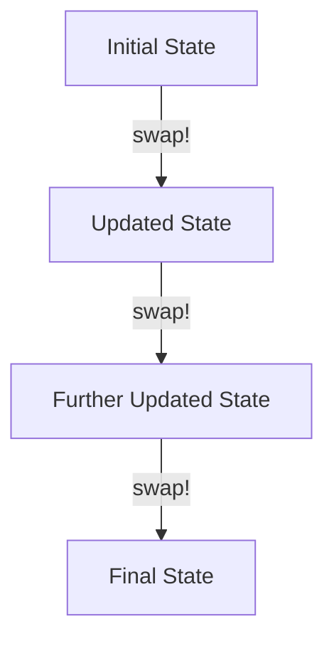

## 8.3.3 Practical Scenarios for Atoms

In this section, we delve into the practical applications of **atoms** in Clojure, a powerful concurrency primitive that provides a way to manage state changes in a functional programming environment. Atoms are particularly useful in scenarios where state changes are independent and do not require coordination with other states. This makes them ideal for use cases such as counters, caches, and configuration management. Let's explore these scenarios in detail, drawing parallels to Java concepts where applicable.

### Understanding Atoms in Clojure

Atoms in Clojure are a type of reference that provides a way to manage mutable state in a controlled manner. They are designed for situations where you need to manage state changes that are independent and don't require complex coordination. Atoms ensure that state changes are atomic and consistent, even in a concurrent environment.

#### Key Characteristics of Atoms

- **Atomic Updates**: Atoms provide atomic updates to their state, ensuring that changes are consistent and visible to all threads.
- **Immutability**: The state managed by an atom is immutable, meaning that any change results in a new state rather than modifying the existing one.
- **Concurrency**: Atoms are designed to work seamlessly in a concurrent environment, making them ideal for managing state in multi-threaded applications.

### Practical Use Cases for Atoms

Let's explore some practical scenarios where atoms can be effectively used in Clojure applications.

#### 1. Counters

Counters are a common use case for atoms, especially in scenarios where you need to track the number of occurrences of an event or maintain a simple count.

**Example: Implementing a Counter**

```clojure
(def counter (atom 0))

(defn increment-counter []
  (swap! counter inc))

(defn get-counter []
  @counter)

;; Usage
(increment-counter) ; Increment the counter
(println (get-counter)) ; Output: 1
```

In this example, we define an atom `counter` initialized to `0`. The `increment-counter` function uses `swap!` to atomically update the counter by applying the `inc` function. The `get-counter` function dereferences the atom to retrieve its current value.

**Java Parallel**: In Java, you might use an `AtomicInteger` to achieve similar functionality. However, Clojure's atoms provide a more concise and expressive way to manage state changes.

#### 2. Caches

Atoms can be used to implement simple caches, where you need to store and retrieve data efficiently. Caches are useful for reducing the cost of expensive computations by storing previously computed results.

**Example: Implementing a Simple Cache**

```clojure
(def cache (atom {}))

(defn get-from-cache [key]
  (@cache key))

(defn add-to-cache [key value]
  (swap! cache assoc key value))

;; Usage
(add-to-cache :user1 {:name "Alice" :age 30})
(println (get-from-cache :user1)) ; Output: {:name "Alice", :age 30}
```

In this example, we define an atom `cache` initialized to an empty map. The `add-to-cache` function uses `swap!` to add a key-value pair to the cache, while `get-from-cache` retrieves the value associated with a given key.

**Java Parallel**: In Java, you might use a `ConcurrentHashMap` to implement a thread-safe cache. Clojure's atoms provide a simpler and more functional approach to managing cache state.

#### 3. Configuration Management

Atoms are well-suited for managing configuration settings that may change at runtime. This is particularly useful in applications that need to adapt to changing environments or user preferences.

**Example: Managing Configuration Settings**

```clojure
(def config (atom {:theme "light" :language "en"}))

(defn update-config [key value]
  (swap! config assoc key value))

(defn get-config [key]
  (@config key))

;; Usage
(update-config :theme "dark")
(println (get-config :theme)) ; Output: "dark"
```

In this example, we define an atom `config` initialized with default settings. The `update-config` function uses `swap!` to update a specific configuration setting, while `get-config` retrieves the current value of a setting.

**Java Parallel**: In Java, configuration management might involve using properties files or environment variables. Clojure's atoms provide a dynamic and flexible way to manage configuration settings at runtime.

### When to Use Atoms

Atoms are appropriate in scenarios where:

- **State Changes are Independent**: Use atoms when state changes are independent and don't require coordination with other states.
- **Low Contention**: Atoms are ideal for low-contention scenarios where state changes are infrequent.
- **Simple State Management**: Use atoms for simple state management tasks that don't require complex logic or coordination.

### Comparing Atoms with Other Clojure Concurrency Primitives

Clojure provides several concurrency primitives, each suited for different scenarios. Let's compare atoms with other concurrency primitives such as refs and agents.

| Feature         | Atoms                  | Refs                   | Agents                 |
|-----------------|------------------------|------------------------|------------------------|
| **Use Case**    | Independent state      | Coordinated state      | Asynchronous updates   |
| **Coordination**| No coordination needed | Coordinated transactions| No coordination needed |
| **Update**      | Synchronous            | Synchronous            | Asynchronous           |
| **Complexity**  | Simple                 | Complex                | Simple                 |

Atoms are best suited for scenarios where state changes are independent and don't require coordination with other states. Refs are more appropriate for coordinated state changes, while agents are ideal for asynchronous updates.

### Visualizing Atoms in Action

To better understand how atoms work, let's visualize the flow of data through an atom using a Mermaid.js diagram.



**Diagram Explanation**: This diagram illustrates the flow of data through an atom. Each `swap!` operation updates the state of the atom, resulting in a new state.

### Try It Yourself

Now that we've explored practical scenarios for atoms, try modifying the examples to suit your needs. Here are some suggestions:

- **Extend the Counter Example**: Add a `decrement-counter` function to decrease the counter.
- **Enhance the Cache Example**: Implement a `remove-from-cache` function to delete a key-value pair from the cache.
- **Expand the Configuration Example**: Add a function to reset the configuration to its default settings.

### Exercises

To reinforce your understanding of atoms, try solving the following exercises:

1. **Implement a Hit Counter**: Create a hit counter that tracks the number of times a webpage is accessed. Use an atom to store the count and provide functions to increment and retrieve the count.

2. **Build a Simple Key-Value Store**: Implement a simple key-value store using an atom. Provide functions to add, retrieve, update, and delete key-value pairs.

3. **Manage User Preferences**: Create a user preferences manager that stores user-specific settings. Use an atom to store the preferences and provide functions to update and retrieve settings.

### Key Takeaways

- **Atoms are Ideal for Independent State Changes**: Use atoms when state changes are independent and don't require coordination with other states.
- **Atoms Provide Atomic Updates**: Atoms ensure that state changes are atomic and consistent, even in a concurrent environment.
- **Atoms are Simple and Flexible**: Atoms provide a simple and flexible way to manage state in Clojure applications.

By understanding and leveraging atoms, you can effectively manage state in your Clojure applications, taking advantage of Clojure's functional programming paradigm and concurrency model.

### Further Reading

For more information on atoms and concurrency in Clojure, check out the following resources:

- [Official Clojure Documentation on Atoms](https://clojure.org/reference/atoms)
- [ClojureDocs: Atoms](https://clojuredocs.org/clojure.core/atom)
- [Clojure Programming: Concurrency](https://www.clojurebook.com/)

---

## Quiz: Mastering Atoms in Clojure



### What is a primary use case for atoms in Clojure?

- [x] Managing independent state changes
- [ ] Coordinating complex state changes
- [ ] Asynchronous updates
- [ ] Handling high contention scenarios

> **Explanation:** Atoms are best suited for managing independent state changes that don't require coordination with other states.

### Which function is used to atomically update the state of an atom?

- [x] swap!
- [ ] reset!
- [ ] deref
- [ ] assoc

> **Explanation:** The `swap!` function is used to atomically update the state of an atom by applying a function to its current value.

### How do atoms ensure consistency in a concurrent environment?

- [x] By providing atomic updates
- [ ] By using locks
- [ ] By coordinating transactions
- [ ] By using asynchronous operations

> **Explanation:** Atoms ensure consistency by providing atomic updates, which are consistent and visible to all threads.

### What is the initial value of an atom defined as `(def counter (atom 0))`?

- [x] 0
- [ ] 1
- [ ] nil
- [ ] undefined

> **Explanation:** The initial value of the atom `counter` is `0`, as specified in its definition.

### Which Clojure concurrency primitive is best for coordinated state changes?

- [ ] Atoms
- [x] Refs
- [ ] Agents
- [ ] Futures

> **Explanation:** Refs are best suited for coordinated state changes, as they support transactions that ensure consistency across multiple refs.

### What is the purpose of the `deref` function in the context of atoms?

- [x] To retrieve the current value of an atom
- [ ] To update the state of an atom
- [ ] To reset the state of an atom
- [ ] To create a new atom

> **Explanation:** The `deref` function is used to retrieve the current value of an atom.

### In which scenario would you choose an atom over a ref?

- [x] When state changes are independent
- [ ] When state changes require coordination
- [ ] When updates are asynchronous
- [ ] When handling high contention

> **Explanation:** Atoms are chosen over refs when state changes are independent and don't require coordination with other states.

### What is a key advantage of using atoms for state management?

- [x] Simplicity and flexibility
- [ ] Complex coordination
- [ ] Asynchronous processing
- [ ] High contention handling

> **Explanation:** Atoms provide a simple and flexible way to manage state, making them ideal for scenarios where state changes are independent.

### How can you reset the state of an atom to a specific value?

- [x] Using the `reset!` function
- [ ] Using the `swap!` function
- [ ] Using the `deref` function
- [ ] Using the `assoc` function

> **Explanation:** The `reset!` function is used to reset the state of an atom to a specific value.

### True or False: Atoms in Clojure are suitable for managing high-contention scenarios.

- [ ] True
- [x] False

> **Explanation:** Atoms are not suitable for high-contention scenarios, as they are designed for low-contention situations where state changes are infrequent.


