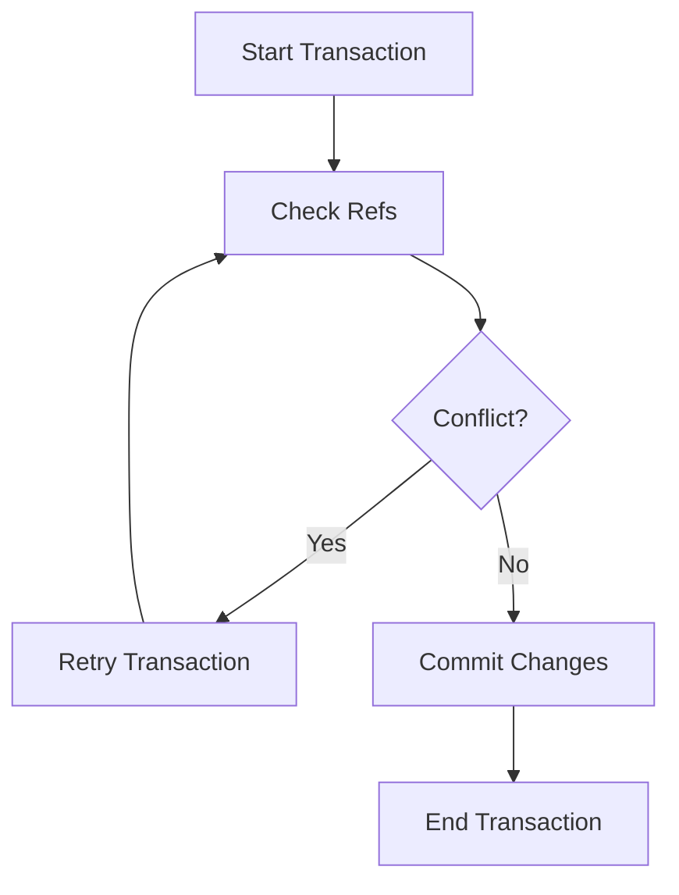

## 8.4.1 Introduction to Software Transactional Memory (STM)

In this section, we delve into Software Transactional Memory (STM), a concurrency control mechanism that allows for safe, coordinated state changes across multiple references (refs) in Clojure. STM is a powerful tool for managing shared state in concurrent applications, providing a more intuitive and less error-prone alternative to traditional locking mechanisms found in Java.

### Understanding Software Transactional Memory (STM)

Software Transactional Memory (STM) is a concurrency control mechanism that simplifies the management of shared state in concurrent programming. Unlike traditional locking mechanisms, STM allows multiple threads to operate on shared data without explicit locks, reducing the risk of deadlocks and race conditions.

#### Key Concepts of STM

- **Transactions**: STM operates on the concept of transactions, which are sequences of operations that are executed atomically. If a transaction fails due to a conflict, it is automatically retried until it succeeds.
- **Refs**: In Clojure, refs are mutable references that can be safely modified within transactions. Refs ensure that changes to shared state are consistent and coordinated.
- **Automatic Conflict Resolution**: STM automatically handles conflicts by retrying transactions that fail due to concurrent modifications, ensuring data consistency.

### Comparing STM with Java's Concurrency Mechanisms

Java developers are familiar with concurrency mechanisms such as synchronized blocks, locks, and concurrent collections. While these tools are powerful, they can be complex and error-prone, especially in large applications with multiple threads.

#### Java's Traditional Concurrency Model

- **Locks and Synchronization**: Java uses locks and synchronized blocks to control access to shared resources. While effective, these mechanisms can lead to deadlocks and require careful management.
- **Concurrent Collections**: Java provides concurrent collections like `ConcurrentHashMap` to simplify concurrent access to data structures. However, these collections still require careful handling of shared state.

#### Advantages of STM in Clojure

- **Simplicity**: STM abstracts away the complexity of locks, allowing developers to focus on the logic of their applications.
- **Safety**: STM ensures that transactions are executed atomically, reducing the risk of data corruption.
- **Automatic Conflict Resolution**: STM automatically retries transactions that fail due to conflicts, simplifying error handling.

### Implementing STM in Clojure

Let's explore how to implement STM in Clojure with a simple example. We'll create a bank account system where multiple threads can deposit and withdraw money safely.

#### Defining Refs

In Clojure, refs are defined using the `ref` function. Refs are mutable references that can be safely modified within transactions.

```clojure
(def account-balance (ref 1000)) ; Initial balance of 1000
```

#### Performing Transactions

Transactions are defined using the `dosync` macro. Within a transaction, you can use the `ref-set` and `alter` functions to modify refs.

```clojure
(dosync
  (alter account-balance + 500)) ; Deposit 500
```

#### Handling Conflicts

STM automatically handles conflicts by retrying transactions that fail due to concurrent modifications. This ensures that all transactions are executed atomically and consistently.

### Code Example: Bank Account System

Let's implement a simple bank account system using STM in Clojure. We'll create functions for depositing and withdrawing money, and demonstrate how STM ensures safe, coordinated state changes.

```clojure
(def account-balance (ref 1000)) ; Initial balance of 1000

(defn deposit [amount]
  (dosync
    (alter account-balance + amount)))

(defn withdraw [amount]
  (dosync
    (alter account-balance - amount)))

;; Simulate concurrent transactions
(future (deposit 500))
(future (withdraw 200))

;; Check the final balance
(println "Final balance:" @account-balance)
```

### Try It Yourself

Experiment with the bank account system by modifying the deposit and withdrawal amounts. Observe how STM ensures that all transactions are executed atomically and consistently.

### Visualizing STM with Diagrams

To better understand how STM works, let's visualize the flow of data through transactions using a Mermaid.js diagram.



**Diagram Description**: This diagram illustrates the flow of a transaction in STM. The transaction starts by checking the refs, and if a conflict is detected, it retries the transaction. If no conflict is found, the changes are committed, and the transaction ends.

### Further Reading

For more information on STM and concurrency in Clojure, check out the following resources:

- [Clojure Official Documentation](https://clojure.org/reference/refs)
- [ClojureDocs: STM](https://clojuredocs.org/clojure.core/ref)
- [GitHub: Clojure Concurrency Examples](https://github.com/clojure-examples/concurrency)

### Exercises

1. **Modify the Bank Account System**: Add a function to transfer money between two accounts. Ensure that the transfer is executed atomically using STM.
2. **Implement a Shopping Cart**: Create a shopping cart system where multiple threads can add and remove items. Use STM to ensure that the cart's state is consistent.
3. **Explore Conflict Resolution**: Simulate a scenario where multiple threads try to modify the same ref simultaneously. Observe how STM handles conflicts and retries transactions.

### Key Takeaways

- **STM simplifies concurrency** by abstracting away the complexity of locks and synchronization.
- **Transactions ensure atomicity** and consistency, reducing the risk of data corruption.
- **Refs provide safe, mutable references** that can be modified within transactions.
- **Automatic conflict resolution** simplifies error handling and ensures data consistency.

Now that we've explored how STM works in Clojure, let's apply these concepts to manage state effectively in your applications. By leveraging STM, you can build concurrent applications that are safe, efficient, and easy to maintain.

## Quiz: Mastering Software Transactional Memory in Clojure



### What is the primary purpose of Software Transactional Memory (STM) in Clojure?

- [x] To manage shared state in concurrent applications safely
- [ ] To replace all Java concurrency mechanisms
- [ ] To improve the performance of single-threaded applications
- [ ] To provide a graphical user interface for Clojure applications

> **Explanation:** STM is designed to manage shared state safely in concurrent applications by using transactions and automatic conflict resolution.

### How does STM handle conflicts in transactions?

- [x] By automatically retrying the transaction
- [ ] By locking the resources involved
- [ ] By throwing an exception
- [ ] By ignoring the conflict

> **Explanation:** STM automatically retries transactions that fail due to conflicts, ensuring atomicity and consistency.

### What is a ref in Clojure's STM?

- [x] A mutable reference that can be modified within transactions
- [ ] A function that executes transactions
- [ ] A type of immutable data structure
- [ ] A concurrency primitive for asynchronous tasks

> **Explanation:** Refs are mutable references in Clojure's STM that can be safely modified within transactions.

### Which Clojure macro is used to define transactions?

- [x] `dosync`
- [ ] `defn`
- [ ] `let`
- [ ] `future`

> **Explanation:** The `dosync` macro is used to define transactions in Clojure's STM.

### What is the main advantage of using STM over traditional locking mechanisms?

- [x] Simplifies concurrency by abstracting away locks
- [ ] Increases the speed of all operations
- [ ] Provides a built-in user interface
- [ ] Eliminates the need for any error handling

> **Explanation:** STM simplifies concurrency by abstracting away the complexity of locks and synchronization.

### In the provided bank account example, what does the `alter` function do?

- [x] Modifies the value of a ref within a transaction
- [ ] Creates a new ref
- [ ] Executes a transaction
- [ ] Handles errors in transactions

> **Explanation:** The `alter` function modifies the value of a ref within a transaction.

### What happens if a transaction fails due to a conflict in STM?

- [x] It is automatically retried
- [ ] It is aborted and an exception is thrown
- [ ] It continues with partial changes
- [ ] It locks the conflicting resources

> **Explanation:** STM automatically retries transactions that fail due to conflicts.

### How can you ensure that a transfer between two accounts is atomic in Clojure?

- [x] Use STM to manage the transfer within a transaction
- [ ] Use synchronized blocks
- [ ] Use Java's `ReentrantLock`
- [ ] Use a single-threaded executor

> **Explanation:** Using STM to manage the transfer within a transaction ensures atomicity and consistency.

### What is the role of the `ref-set` function in Clojure's STM?

- [x] Sets the value of a ref within a transaction
- [ ] Creates a new transaction
- [ ] Commits a transaction
- [ ] Cancels a transaction

> **Explanation:** The `ref-set` function sets the value of a ref within a transaction.

### True or False: STM in Clojure eliminates the need for any error handling in concurrent applications.

- [ ] True
- [x] False

> **Explanation:** While STM simplifies error handling by automatically retrying transactions, it does not eliminate the need for error handling entirely.


