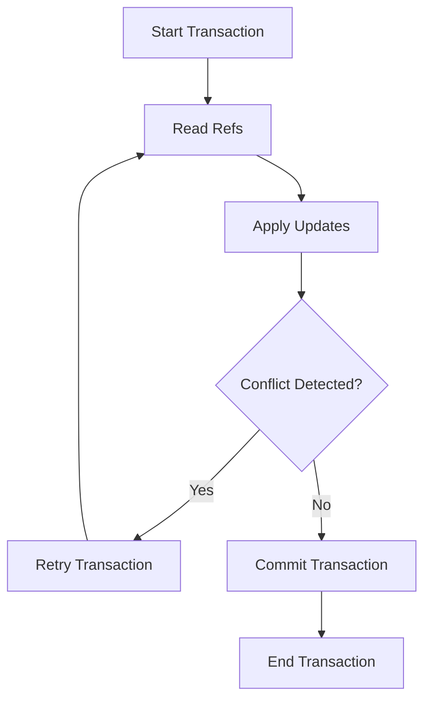

## 8.4.2 Using Refs and Transactions

In this section, we delve into the powerful concurrency model provided by Clojure through **Refs** and **Software Transactional Memory (STM)**. As experienced Java developers, you are likely familiar with the complexities of managing shared mutable state using locks and synchronized blocks. Clojure offers a more elegant solution with refs and transactions, allowing you to manage state changes in a coordinated and consistent manner without the typical pitfalls of traditional concurrency mechanisms.

### Understanding Refs and Transactions

**Refs** in Clojure are a type of reference that allows for coordinated, synchronous updates to shared state. They are part of Clojure's STM system, which ensures that changes to refs are atomic, consistent, and isolated. This means that multiple refs can be updated in a single transaction, and these updates will either all succeed or all fail, maintaining the integrity of your application's state.

**Transactions** are blocks of code that are executed atomically. In Clojure, transactions are initiated using the `dosync` macro. Within a transaction, you can read from and write to refs, and Clojure's STM will ensure that these operations are performed safely, even in the presence of concurrent transactions.

### Creating Refs

To create a ref, you use the `ref` function. This function takes an initial value and returns a ref that holds that value. Here's a simple example:

```clojure
(def account-balance (ref 1000))
```

In this example, `account-balance` is a ref initialized with a value of 1000. You can think of it as a thread-safe variable that can be safely shared across multiple threads.

### Reading from Refs

To read the value of a ref, you can use the `deref` function or the shorthand `@` syntax. Both approaches are equivalent:

```clojure
;; Using deref
(println (deref account-balance))

;; Using @
(println @account-balance)
```

Both of these lines will print the current value of `account-balance`, which is 1000.

### Updating Refs

Refs can only be updated within a transaction. Clojure provides two functions for updating refs: `alter` and `ref-set`.

- **`alter`**: This function takes a ref, a function, and any additional arguments. It applies the function to the current value of the ref and any additional arguments, and sets the ref to the result.

- **`ref-set`**: This function directly sets the value of a ref to a new value. It is less commonly used than `alter` because it does not leverage the functional nature of Clojure.

Here's an example of using `alter` to update a ref within a transaction:

```clojure
(dosync
  (alter account-balance + 500))
```

In this transaction, we add 500 to the current value of `account-balance`. The `+` function is applied to the current value of the ref and the additional argument 500.

### Coordinated Updates with Multiple Refs

One of the key advantages of using refs and transactions is the ability to perform coordinated updates to multiple refs. This ensures that all updates are applied atomically, maintaining consistency across your application's state.

Consider a simple banking application where you need to transfer money between two accounts. Using refs and transactions, you can ensure that the transfer is atomic:

```clojure
(def account-a (ref 1000))
(def account-b (ref 2000))

(defn transfer [from-account to-account amount]
  (dosync
    (alter from-account - amount)
    (alter to-account + amount)))

(transfer account-a account-b 300)
```

In this example, the `transfer` function takes two accounts and an amount to transfer. Within the `dosync` block, we subtract the amount from `from-account` and add it to `to-account`. The transaction ensures that both operations are applied atomically, so the transfer is either fully completed or not applied at all.

### Handling Conflicts and Retries

Clojure's STM automatically handles conflicts and retries. If two transactions attempt to update the same ref simultaneously, one of them will be retried. This is similar to optimistic locking in databases, where transactions assume they will succeed and only retry if a conflict is detected.

### Comparing with Java's Concurrency Mechanisms

In Java, managing shared mutable state often involves using `synchronized` blocks or `java.util.concurrent` classes like `ReentrantLock`. These approaches can be error-prone and difficult to reason about, especially in complex systems with many threads.

Clojure's STM provides a higher-level abstraction that simplifies concurrency management. By using refs and transactions, you can focus on the logic of your application rather than the intricacies of thread synchronization.

### Code Example: Bank Account Transfer

Let's revisit the bank account transfer example and compare it with a similar implementation in Java:

**Clojure Implementation:**

```clojure
(def account-a (ref 1000))
(def account-b (ref 2000))

(defn transfer [from-account to-account amount]
  (dosync
    (alter from-account - amount)
    (alter to-account + amount)))

(transfer account-a account-b 300)
```

**Java Implementation:**

```java
import java.util.concurrent.locks.Lock;
import java.util.concurrent.locks.ReentrantLock;

public class BankAccount {
    private int balance;
    private final Lock lock = new ReentrantLock();

    public BankAccount(int initialBalance) {
        this.balance = initialBalance;
    }

    public void transfer(BankAccount toAccount, int amount) {
        lock.lock();
        try {
            this.balance -= amount;
            toAccount.deposit(amount);
        } finally {
            lock.unlock();
        }
    }

    public void deposit(int amount) {
        lock.lock();
        try {
            this.balance += amount;
        } finally {
            lock.unlock();
        }
    }
}
```

In the Java implementation, we use a `ReentrantLock` to ensure that the transfer operation is thread-safe. This requires careful management of locks and can lead to deadlocks if not handled correctly. In contrast, the Clojure implementation is simpler and more declarative, leveraging STM to manage concurrency.

### Visualizing Transactions with Mermaid.js

To better understand how transactions work in Clojure, let's visualize the flow of a transaction using a Mermaid.js diagram:



**Diagram Description**: This flowchart illustrates the lifecycle of a transaction in Clojure's STM. The transaction begins by reading refs, applies updates, checks for conflicts, and either retries or commits the transaction based on conflict detection.

### Try It Yourself

Now that we've explored the basics of using refs and transactions in Clojure, let's try some hands-on exercises:

1. **Modify the Transfer Function**: Change the `transfer` function to include a fee for each transfer. Ensure that the fee is deducted from the `from-account`.

2. **Add Logging**: Add logging to the `transfer` function to print the balances of both accounts before and after the transfer.

3. **Simulate Concurrent Transfers**: Create multiple threads that perform transfers between accounts simultaneously. Observe how Clojure's STM handles concurrency.

### Exercises

1. **Implement a Simple Inventory System**: Create a system that manages the inventory of a store using refs. Implement functions to add and remove items, ensuring that inventory updates are atomic.

2. **Build a Banking Application**: Extend the bank account example to support multiple accounts and transactions. Implement features like account creation, balance inquiry, and transaction history.

3. **Explore Conflict Resolution**: Experiment with scenarios where transactions conflict. Observe how Clojure's STM resolves these conflicts and retries transactions.

### Key Takeaways

- **Refs and Transactions**: Clojure's refs and transactions provide a powerful and elegant way to manage shared state in concurrent applications.
- **Atomicity and Consistency**: Transactions ensure that updates to refs are atomic and consistent, simplifying concurrency management.
- **Comparison with Java**: Clojure's STM offers a higher-level abstraction compared to Java's traditional concurrency mechanisms, reducing complexity and potential for errors.
- **Hands-On Practice**: Experimenting with refs and transactions will deepen your understanding of Clojure's concurrency model and its advantages over traditional approaches.

By leveraging Clojure's refs and transactions, you can build robust and scalable applications that handle concurrency with ease. Now, let's put these concepts into practice and explore the full potential of Clojure's STM in your projects.

## Quiz: Mastering Clojure Refs and Transactions



### What is the primary purpose of using refs in Clojure?

- [x] To manage coordinated, synchronous updates to shared state
- [ ] To handle asynchronous tasks
- [ ] To perform I/O operations
- [ ] To manage memory allocation

> **Explanation:** Refs in Clojure are used to manage coordinated, synchronous updates to shared state, ensuring atomicity and consistency.

### How do you initiate a transaction in Clojure?

- [x] Using the `dosync` macro
- [ ] Using the `sync` keyword
- [ ] Using the `transaction` function
- [ ] Using the `atomic` block

> **Explanation:** Transactions in Clojure are initiated using the `dosync` macro, which ensures that updates to refs are performed atomically.

### Which function is used to update a ref within a transaction?

- [x] `alter`
- [ ] `set!`
- [ ] `update`
- [ ] `modify`

> **Explanation:** The `alter` function is used to update a ref within a transaction, applying a function to the current value of the ref.

### What happens if two transactions attempt to update the same ref simultaneously?

- [x] One transaction is retried
- [ ] Both transactions fail
- [ ] Both transactions succeed
- [ ] The ref is locked

> **Explanation:** If two transactions attempt to update the same ref simultaneously, one transaction is retried to resolve the conflict.

### How can you read the value of a ref in Clojure?

- [x] Using `deref` or `@`
- [ ] Using `get`
- [ ] Using `read`
- [ ] Using `fetch`

> **Explanation:** The value of a ref in Clojure can be read using the `deref` function or the shorthand `@` syntax.

### Which of the following is a benefit of using Clojure's STM over Java's traditional concurrency mechanisms?

- [x] Simplified concurrency management
- [ ] Faster execution speed
- [ ] Better memory usage
- [ ] Easier debugging

> **Explanation:** Clojure's STM simplifies concurrency management by providing a higher-level abstraction for managing shared state.

### What is the role of the `ref-set` function in Clojure?

- [x] To directly set the value of a ref
- [ ] To read the value of a ref
- [ ] To lock a ref
- [ ] To create a new ref

> **Explanation:** The `ref-set` function is used to directly set the value of a ref within a transaction.

### In the context of Clojure's STM, what does atomicity mean?

- [x] All operations within a transaction are completed as a single unit
- [ ] Operations are performed in parallel
- [ ] Operations are distributed across multiple threads
- [ ] Operations are executed without any delay

> **Explanation:** Atomicity means that all operations within a transaction are completed as a single unit, ensuring consistency.

### Which keyword is used to create a ref in Clojure?

- [x] `ref`
- [ ] `var`
- [ ] `atom`
- [ ] `def`

> **Explanation:** The `ref` keyword is used to create a ref in Clojure, initializing it with a value.

### True or False: Clojure's STM automatically handles conflict resolution and retries.

- [x] True
- [ ] False

> **Explanation:** True. Clojure's STM automatically handles conflict resolution and retries, ensuring that transactions are applied consistently.


