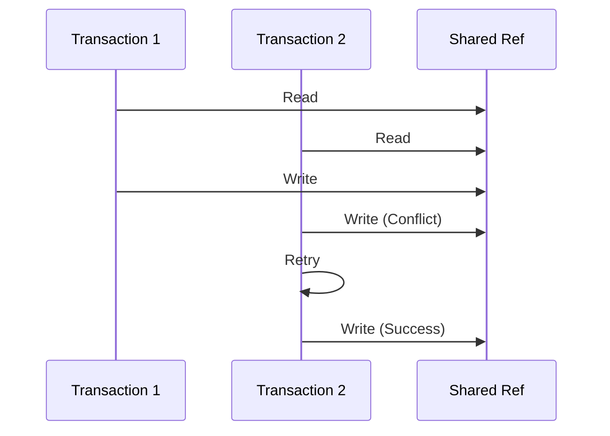

## 8.4.3 Avoiding Conflicts and Ensuring Consistency

As experienced Java developers, you're likely familiar with the challenges of managing concurrency and ensuring data consistency in multi-threaded applications. In Java, this often involves complex synchronization mechanisms, such as locks and semaphores, which can lead to issues like deadlocks and race conditions. Clojure offers a different approach with its Software Transactional Memory (STM) system, which simplifies concurrency by providing a higher level of abstraction for managing shared state. In this section, we'll explore strategies for avoiding conflicts and ensuring consistency in Clojure's STM, focusing on minimizing transaction retries and maintaining isolation.

### Understanding Clojure's STM

Clojure's STM is designed to manage shared mutable state in a way that is both safe and efficient. It allows multiple threads to access and modify shared data without the need for explicit locks. Instead, STM uses transactions to ensure that changes to shared state are atomic, consistent, isolated, and durable (ACID properties). This approach reduces the complexity of concurrent programming and helps prevent common pitfalls associated with traditional locking mechanisms.

#### Key Concepts of STM

- **Transactions**: In STM, a transaction is a block of code that executes atomically. If a transaction conflicts with another transaction, it is automatically retried until it succeeds.
- **Refs**: Refs are mutable references to shared state. They can only be modified within a transaction, ensuring that changes are consistent and isolated.
- **Consistency**: STM ensures that all transactions leave the system in a consistent state. This means that any invariants or constraints on the data are maintained.

### Strategies for Avoiding Conflicts

One of the main challenges in using STM is minimizing transaction retries due to conflicts. Conflicts occur when two transactions attempt to modify the same ref simultaneously. Here are some strategies to reduce conflicts:

#### 1. Keep Transactions Short

The longer a transaction runs, the more likely it is to conflict with other transactions. To minimize conflicts, keep transactions short and focused. This reduces the window of time during which a conflict can occur.

```clojure
;; Example of a short transaction
(dosync
  (alter account-balance + 100))
```

In this example, the transaction is short and only modifies a single ref, reducing the likelihood of conflicts.

#### 2. Minimize Side Effects

Transactions should be free of side effects, such as I/O operations or changes to external systems. Side effects can lead to inconsistencies if a transaction is retried. Instead, perform side effects outside of transactions.

```clojure
;; Avoid side effects within transactions
(dosync
  (alter account-balance + 100))
;; Perform side effects after the transaction
(println "Transaction completed")
```

#### 3. Use Fine-Grained Refs

Using fine-grained refs can help reduce conflicts by limiting the scope of each transaction. Instead of having a single ref for a large data structure, consider breaking it into smaller refs that can be updated independently.

```clojure
;; Fine-grained refs for different parts of a data structure
(def account-balance (ref 1000))
(def account-history (ref []))

(dosync
  (alter account-balance + 100)
  (alter account-history conj {:type :deposit, :amount 100}))
```

#### 4. Prioritize Read-Only Transactions

Read-only transactions do not modify any refs and therefore do not conflict with other transactions. Prioritize read-only transactions when possible to reduce the likelihood of conflicts.

```clojure
;; Read-only transaction
(dosync
  (println "Current balance:" @account-balance))
```

### Ensuring Consistency with STM

Clojure's STM ensures consistency by maintaining transaction isolation and automatically retrying transactions that conflict. Let's explore how STM achieves this:

#### Transaction Isolation

STM provides a level of isolation similar to serializable transactions in databases. This means that transactions appear to execute in a serial order, even though they may be running concurrently. This isolation level prevents anomalies such as dirty reads and lost updates.

- **Serializable Isolation**: Ensures that the outcome of concurrent transactions is the same as if they were executed serially. This is the highest level of isolation and prevents all types of anomalies.

#### Automatic Retry Mechanism

When a transaction conflicts with another transaction, STM automatically retries it. This retry mechanism is transparent to the developer, simplifying the handling of conflicts.

```clojure
;; Automatic retry example
(dosync
  (alter account-balance + 100))
```

In this example, if another transaction modifies `account-balance` concurrently, the transaction will be retried until it succeeds.

### Comparing STM with Java's Concurrency Mechanisms

Java provides several concurrency mechanisms, such as synchronized blocks, locks, and concurrent collections. Let's compare these with Clojure's STM:

- **Locks vs. Transactions**: Locks require explicit management and can lead to deadlocks if not used carefully. STM transactions are managed automatically, reducing the risk of deadlocks.
- **Isolation Levels**: Java's synchronized blocks provide mutual exclusion but do not guarantee isolation. STM provides serializable isolation, ensuring consistency.
- **Complexity**: Managing locks and synchronization in Java can be complex and error-prone. STM abstracts away these complexities, making concurrent programming more straightforward.

### Code Example: Bank Account Management

Let's look at a practical example of managing bank accounts using STM. We'll implement a simple system that allows deposits and withdrawals while ensuring consistency.

```clojure
(def accounts (ref {}))

(defn create-account [id initial-balance]
  (dosync
    (alter accounts assoc id {:balance initial-balance})))

(defn deposit [id amount]
  (dosync
    (let [account (get @accounts id)]
      (when account
        (alter accounts assoc id (update account :balance + amount))))))

(defn withdraw [id amount]
  (dosync
    (let [account (get @accounts id)]
      (when (and account (>= (:balance account) amount))
        (alter accounts assoc id (update account :balance - amount))))))

;; Create an account with an initial balance of 1000
(create-account :acc1 1000)

;; Deposit 500 into the account
(deposit :acc1 500)

;; Withdraw 300 from the account
(withdraw :acc1 300)

;; Check the account balance
(println "Account balance:" (:balance (get @accounts :acc1)))
```

In this example, we use STM to manage account balances, ensuring that deposits and withdrawals are consistent and isolated.

### Try It Yourself

To deepen your understanding of STM, try modifying the code example above:

- Add a function to transfer money between accounts.
- Implement a feature to log transaction history for each account.
- Experiment with different isolation levels and observe the behavior.

### Diagrams and Visualizations

To better understand the flow of transactions in STM, let's visualize the process using a Mermaid.js diagram.



**Diagram Description**: This sequence diagram illustrates two transactions, T1 and T2, accessing a shared ref. T1 writes to the ref first, causing T2 to retry its write operation due to a conflict.

### Further Reading

For more information on Clojure's STM and concurrency, consider exploring the following resources:

- [Official Clojure Documentation on STM](https://clojure.org/reference/refs)
- [ClojureDocs: STM Examples](https://clojuredocs.org/clojure.core/dosync)
- [GitHub: Clojure Concurrency Examples](https://github.com/clojure-examples/concurrency)

### Exercises

1. Implement a simple inventory management system using STM, where multiple transactions can add or remove items.
2. Create a simulation of a ticket booking system that ensures no overbooking occurs.
3. Experiment with different transaction sizes and observe the impact on performance and conflicts.

### Key Takeaways

- Clojure's STM provides a powerful abstraction for managing shared state, reducing the complexity of concurrent programming.
- Keeping transactions short and minimizing side effects are effective strategies for avoiding conflicts.
- STM ensures consistency through automatic retries and serializable isolation, preventing common concurrency issues.
- By leveraging STM, you can build robust and scalable applications that handle concurrency gracefully.

Now that we've explored how to avoid conflicts and ensure consistency in Clojure's STM, let's apply these concepts to manage state effectively in your applications.

## Quiz: Mastering Clojure's STM for Consistency and Conflict Avoidance



### What is the primary purpose of Clojure's Software Transactional Memory (STM)?

- [x] To manage shared mutable state safely and efficiently
- [ ] To provide a way to perform I/O operations
- [ ] To replace all Java concurrency mechanisms
- [ ] To simplify the syntax of Clojure code

> **Explanation:** Clojure's STM is designed to manage shared mutable state in a safe and efficient manner, providing a higher level of abstraction for concurrency.

### How does Clojure's STM handle transaction conflicts?

- [x] By automatically retrying the transaction
- [ ] By locking the conflicting resource
- [ ] By aborting the transaction
- [ ] By notifying the developer to resolve the conflict

> **Explanation:** STM automatically retries transactions that conflict, ensuring that they eventually succeed without developer intervention.

### What is a key strategy for minimizing transaction conflicts in STM?

- [x] Keeping transactions short
- [ ] Performing I/O operations within transactions
- [ ] Using a single ref for all shared data
- [ ] Increasing the number of threads

> **Explanation:** Keeping transactions short reduces the window of time during which conflicts can occur, minimizing the likelihood of retries.

### What level of isolation does Clojure's STM provide?

- [x] Serializable isolation
- [ ] Read committed isolation
- [ ] Repeatable read isolation
- [ ] Read uncommitted isolation

> **Explanation:** Clojure's STM provides serializable isolation, ensuring that transactions appear to execute in a serial order.

### Which of the following is NOT a recommended practice for avoiding conflicts in STM?

- [ ] Using fine-grained refs
- [x] Performing side effects within transactions
- [ ] Prioritizing read-only transactions
- [ ] Keeping transactions short

> **Explanation:** Performing side effects within transactions can lead to inconsistencies if a transaction is retried, so it is not recommended.

### What is the role of refs in Clojure's STM?

- [x] To hold mutable references to shared state
- [ ] To perform I/O operations
- [ ] To manage thread synchronization
- [ ] To replace Java's synchronized blocks

> **Explanation:** Refs are used to hold mutable references to shared state, which can only be modified within a transaction.

### How does STM ensure consistency in transactions?

- [x] By maintaining transaction isolation and retrying conflicts
- [ ] By locking all shared resources
- [ ] By using a single-threaded execution model
- [ ] By requiring manual conflict resolution

> **Explanation:** STM ensures consistency by maintaining transaction isolation and automatically retrying transactions that conflict.

### What is a benefit of using STM over traditional locking mechanisms?

- [x] Reduced complexity and risk of deadlocks
- [ ] Increased performance in all scenarios
- [ ] Elimination of all concurrency issues
- [ ] Simplified syntax for I/O operations

> **Explanation:** STM reduces complexity and the risk of deadlocks by abstracting away explicit lock management.

### Which Java concurrency mechanism is most similar to STM transactions?

- [ ] Synchronized blocks
- [ ] Locks
- [x] Serializable transactions in databases
- [ ] Concurrent collections

> **Explanation:** STM transactions provide a level of isolation similar to serializable transactions in databases.

### True or False: STM transactions can include side effects like I/O operations.

- [ ] True
- [x] False

> **Explanation:** STM transactions should be free of side effects to ensure consistency and avoid issues with retries.


