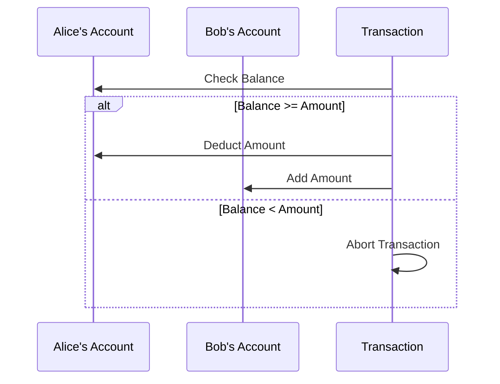

## 8.4.4 Practical Applications of Refs and STM

In this section, we delve into the practical applications of Refs and Software Transactional Memory (STM) in Clojure, focusing on real-world scenarios where these concurrency primitives shine. As experienced Java developers, you are likely familiar with the challenges of managing shared mutable state in concurrent applications. Clojure's STM offers a robust solution to these challenges, providing a way to manage state changes in a coordinated and thread-safe manner.

### Understanding Refs and STM

Before we explore practical applications, let's briefly revisit the concepts of Refs and STM in Clojure. Refs are mutable references to immutable data structures, and STM is a concurrency control mechanism that allows for safe, coordinated updates to shared state. Unlike traditional locking mechanisms in Java, STM in Clojure provides a higher-level abstraction that simplifies reasoning about concurrent state changes.

**Key Features of Refs and STM:**

- **Atomicity**: Changes to Refs are atomic, meaning they either complete entirely or not at all.
- **Consistency**: STM ensures that the system remains in a consistent state across transactions.
- **Isolation**: Transactions are isolated from each other, preventing race conditions.
- **Durability**: Once a transaction is committed, its changes are permanent.

### Real-World Applications of Refs and STM

#### 1. Managing Bank Account Transfers

One of the classic examples of using Refs and STM is managing bank account transfers. In a banking system, multiple transactions may occur simultaneously, such as deposits, withdrawals, and transfers between accounts. Ensuring that these operations are atomic and consistent is crucial to maintaining the integrity of the system.

**Clojure Code Example:**

```clojure
(def accounts (ref {:alice 1000 :bob 500}))

(defn transfer [from to amount]
  (dosync
    (let [from-balance (get @accounts from)
          to-balance (get @accounts to)]
      (when (>= from-balance amount)
        (alter accounts assoc from (- from-balance amount))
        (alter accounts assoc to (+ to-balance amount))))))

;; Transfer $200 from Alice to Bob
(transfer :alice :bob 200)

;; Check balances
@accounts
```

**Explanation:**

- **`ref`**: We define a `ref` to hold the account balances.
- **`dosync`**: The `dosync` block ensures that the operations within it are executed as a single transaction.
- **`alter`**: The `alter` function is used to update the state of the `ref`.

**Try It Yourself:**

- Modify the code to handle multiple simultaneous transfers.
- Add a check to prevent overdrafts.

#### 2. Maintaining Game State

In multiplayer games, maintaining a consistent game state across multiple players is essential. Clojure's STM can be used to manage the state of the game world, ensuring that updates from different players do not conflict.

**Clojure Code Example:**

```clojure
(def game-state (ref {:players {} :world {}}))

(defn update-player-position [player-id new-position]
  (dosync
    (alter game-state update-in [:players player-id :position] (constantly new-position))))

(defn add-player [player-id initial-position]
  (dosync
    (alter game-state assoc-in [:players player-id] {:position initial-position})))

;; Add a new player
(add-player :player1 {:x 0 :y 0})

;; Update player position
(update-player-position :player1 {:x 10 :y 5})

;; Check game state
@game-state
```

**Explanation:**

- **`update-in`** and **`assoc-in`**: These functions are used to update nested data structures within the `ref`.
- **Game State Management**: The game state is managed as a map containing player information and world data.

**Try It Yourself:**

- Implement a function to remove a player from the game.
- Add a mechanism to handle player collisions.

#### 3. Synchronizing Complex Data Structures

In applications that require synchronization of complex data structures, such as collaborative editing tools, Refs and STM can be used to manage shared state efficiently.

**Clojure Code Example:**

```clojure
(def document (ref {:content "" :editors {}}))

(defn add-editor [editor-id]
  (dosync
    (alter document assoc-in [:editors editor-id] {:cursor 0})))

(defn update-content [editor-id new-content]
  (dosync
    (alter document assoc :content new-content)
    (alter document assoc-in [:editors editor-id :cursor] (count new-content))))

;; Add an editor
(add-editor :editor1)

;; Update document content
(update-content :editor1 "Hello, Clojure!")

;; Check document state
@document
```

**Explanation:**

- **Collaborative Editing**: The document state is managed as a map with content and editor information.
- **Cursor Management**: Each editor's cursor position is tracked within the document state.

**Try It Yourself:**

- Implement a function to remove an editor.
- Add support for tracking changes made by each editor.

### Comparing with Java's Concurrency Mechanisms

In Java, managing shared mutable state often involves using synchronized blocks, locks, or concurrent collections. While these mechanisms can be effective, they can also lead to complex and error-prone code. Clojure's STM provides a more declarative approach, allowing developers to focus on the logic of state changes without worrying about low-level synchronization details.

**Java Code Example:**

```java
import java.util.concurrent.locks.ReentrantLock;

public class BankAccount {
    private double balance;
    private final ReentrantLock lock = new ReentrantLock();

    public BankAccount(double initialBalance) {
        this.balance = initialBalance;
    }

    public void transfer(BankAccount to, double amount) {
        lock.lock();
        try {
            if (balance >= amount) {
                balance -= amount;
                to.deposit(amount);
            }
        } finally {
            lock.unlock();
        }
    }

    public void deposit(double amount) {
        lock.lock();
        try {
            balance += amount;
        } finally {
            lock.unlock();
        }
    }
}
```

**Comparison:**

- **Locking**: Java uses explicit locks to manage concurrency, which can lead to deadlocks if not handled carefully.
- **STM**: Clojure's STM abstracts away the complexity of locks, providing a simpler and more reliable way to manage concurrent state changes.

### Diagrams and Visualizations

To further illustrate the flow of data and state changes in Clojure's STM, let's use a Mermaid.js diagram to visualize a bank account transfer transaction.



**Diagram Explanation:**

- **Transaction Flow**: The diagram shows the sequence of operations in a bank account transfer, highlighting the conditional logic for checking and updating balances.
- **Atomicity**: The transaction either completes fully or aborts if the balance is insufficient.

### Best Practices for Using Refs and STM

- **Use Refs for Shared State**: Use Refs when you need to manage shared state that requires coordination across multiple threads.
- **Keep Transactions Short**: Minimize the work done within a `dosync` block to reduce contention and improve performance.
- **Avoid Side Effects**: Ensure that transactions are free of side effects, as they may be retried multiple times.

### Exercises and Practice Problems

1. **Implement a Simple Banking System**: Extend the bank account example to support multiple accounts and transaction types (e.g., deposits, withdrawals).
2. **Build a Multiplayer Game**: Use Refs and STM to manage the state of a simple multiplayer game, including player positions and scores.
3. **Collaborative Document Editor**: Create a collaborative document editor that supports multiple editors making changes simultaneously.

### Key Takeaways

- **Refs and STM** provide a powerful abstraction for managing shared state in concurrent applications.
- **Atomicity, Consistency, Isolation, and Durability (ACID)** properties of STM ensure reliable state management.
- **Clojure's STM** simplifies concurrency by abstracting away low-level synchronization details, allowing developers to focus on application logic.

By leveraging Refs and STM, you can build robust, concurrent applications in Clojure that are easier to reason about and maintain. Now that we've explored practical applications of Refs and STM, let's apply these concepts to manage state effectively in your applications.

For further reading, consider exploring the [Official Clojure Documentation on Refs and STM](https://clojure.org/reference/refs) and [ClojureDocs](https://clojuredocs.org/).

---

## Quiz: Mastering Refs and STM in Clojure



### What is the primary purpose of using Refs in Clojure?

- [x] To manage shared mutable state in a thread-safe manner
- [ ] To perform asynchronous computations
- [ ] To handle I/O operations
- [ ] To create immutable data structures

> **Explanation:** Refs are used to manage shared mutable state in a thread-safe manner, ensuring atomicity and consistency across transactions.

### Which Clojure function is used to update the state of a Ref?

- [ ] `swap!`
- [x] `alter`
- [ ] `reset!`
- [ ] `assoc`

> **Explanation:** The `alter` function is used within a `dosync` block to update the state of a Ref.

### What does the `dosync` block ensure in Clojure's STM?

- [x] That all operations within it are executed as a single transaction
- [ ] That the code runs asynchronously
- [ ] That the code is executed in parallel
- [ ] That the code is executed with a lock

> **Explanation:** The `dosync` block ensures that all operations within it are executed as a single transaction, providing atomicity and consistency.

### How does Clojure's STM differ from traditional locking mechanisms in Java?

- [x] It provides a higher-level abstraction that simplifies reasoning about concurrent state changes
- [ ] It requires explicit locks for synchronization
- [ ] It is only suitable for single-threaded applications
- [ ] It does not support atomic operations

> **Explanation:** Clojure's STM provides a higher-level abstraction that simplifies reasoning about concurrent state changes, unlike traditional locking mechanisms in Java.

### In the context of STM, what does ACID stand for?

- [x] Atomicity, Consistency, Isolation, Durability
- [ ] Asynchronous, Concurrent, Immutable, Deterministic
- [ ] Atomicity, Concurrency, Isolation, Determinism
- [ ] Asynchronous, Consistent, Immutable, Durable

> **Explanation:** ACID stands for Atomicity, Consistency, Isolation, and Durability, which are key properties of transactions in STM.

### Which of the following is a best practice when using Refs and STM in Clojure?

- [x] Keep transactions short to reduce contention
- [ ] Use Refs for all state management
- [ ] Perform I/O operations within transactions
- [ ] Avoid using Refs in concurrent applications

> **Explanation:** Keeping transactions short helps reduce contention and improve performance when using Refs and STM.

### What is a potential drawback of using STM in Clojure?

- [x] Transactions may be retried multiple times, leading to performance overhead
- [ ] It does not support concurrent state management
- [ ] It requires explicit locking mechanisms
- [ ] It is only suitable for single-threaded applications

> **Explanation:** Transactions in STM may be retried multiple times, which can lead to performance overhead if not managed properly.

### How can you ensure that a transaction in Clojure's STM is free of side effects?

- [x] Avoid performing I/O operations within the transaction
- [ ] Use explicit locks within the transaction
- [ ] Perform all state updates outside the transaction
- [ ] Use global variables within the transaction

> **Explanation:** To ensure a transaction is free of side effects, avoid performing I/O operations within the transaction, as it may be retried multiple times.

### What is the role of the `alter` function in Clojure's STM?

- [x] To update the state of a Ref within a transaction
- [ ] To create a new Ref
- [ ] To perform asynchronous computations
- [ ] To lock a Ref for exclusive access

> **Explanation:** The `alter` function is used to update the state of a Ref within a transaction, ensuring atomicity and consistency.

### True or False: Clojure's STM abstracts away the complexity of locks, providing a simpler way to manage concurrent state changes.

- [x] True
- [ ] False

> **Explanation:** True. Clojure's STM abstracts away the complexity of locks, providing a simpler and more reliable way to manage concurrent state changes.


