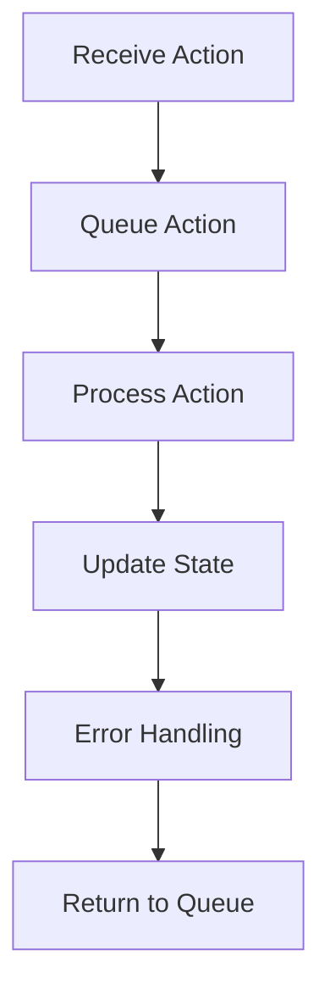

## 8.5.1 Creating and Using Agents

In this section, we will explore the concept of **agents** in Clojure, a powerful tool for managing state in a concurrent environment. Agents allow you to perform asynchronous updates to shared state, making them ideal for tasks that require concurrency without the complexity of locks and synchronization. We will delve into how to create agents, initialize them, and use them effectively in your Clojure applications.

### Understanding Agents

Agents in Clojure are designed to manage state changes asynchronously. They are part of Clojure's concurrency model, which also includes atoms, refs, and vars. Unlike atoms, which handle synchronous state changes, agents process actions asynchronously, allowing for non-blocking updates.

#### Key Characteristics of Agents

- **Asynchronous Processing**: Agents process actions in a separate thread, allowing your main program to continue executing without waiting for the state update to complete.
- **Single-threaded Updates**: Each agent processes actions sequentially, ensuring that state changes are applied in the order they are received.
- **Error Handling**: Agents can handle errors gracefully, allowing you to define error-handling strategies for failed actions.

### Creating Agents

To create an agent in Clojure, you use the `agent` function, which initializes the agent with a given value. This value represents the initial state of the agent.

```clojure
(def my-agent (agent 0)) ; Create an agent with an initial value of 0
```

In this example, `my-agent` is an agent initialized with the value `0`. This value can be any Clojure data type, including numbers, strings, collections, or even custom data structures.

### Sending Actions to Agents

Once you have an agent, you can send actions to it using the `send` and `send-off` functions. These functions take an agent and a function as arguments. The function is applied to the current state of the agent, and the result becomes the new state.

#### Using `send` for CPU-bound Tasks

The `send` function is used for CPU-bound tasks. It queues the action to be processed by a thread from a fixed-size thread pool, ensuring that CPU resources are used efficiently.

```clojure
(send my-agent inc) ; Increment the agent's state by 1
```

In this example, the `inc` function is sent to `my-agent`, which increments its state by 1. The action is processed asynchronously, allowing your program to continue executing other tasks.

#### Using `send-off` for I/O-bound Tasks

The `send-off` function is used for I/O-bound tasks, such as file operations or network requests. It queues the action to be processed by a thread from an unbounded thread pool, allowing for greater concurrency.

```clojure
(send-off my-agent (fn [state] (do-some-io state))) ; Perform an I/O operation
```

Here, a custom function is sent to `my-agent`, which performs an I/O operation on its state. The `send-off` function is ideal for tasks that may block, as it allows other actions to proceed without waiting.

### Error Handling with Agents

Agents provide built-in error handling capabilities. If an action fails, the agent's error handler is invoked, allowing you to define custom error-handling logic.

#### Setting an Error Handler

You can set an error handler for an agent using the `set-error-handler!` function. The error handler is a function that takes two arguments: the agent and the exception that occurred.

```clojure
(set-error-handler! my-agent
  (fn [agent exception]
    (println "Error in agent:" exception)))
```

In this example, the error handler prints an error message whenever an exception occurs during an action. This allows you to log errors or take corrective action as needed.

### Monitoring Agent State

You can monitor the state of an agent using the `@` dereferencing operator. This operator returns the current state of the agent.

```clojure
(println "Current state:" @my-agent) ; Print the current state of the agent
```

This is useful for debugging and verifying that your actions are being applied correctly.

### Practical Example: Managing a Counter

Let's put these concepts into practice by creating a simple counter application using agents. This application will increment and decrement a counter asynchronously.

```clojure
(def counter (agent 0)) ; Initialize the counter agent with a value of 0

(defn increment-counter [n]
  (send counter + n)) ; Increment the counter by n

(defn decrement-counter [n]
  (send counter - n)) ; Decrement the counter by n

(increment-counter 5) ; Increment the counter by 5
(decrement-counter 2) ; Decrement the counter by 2

(println "Final counter value:" @counter) ; Print the final counter value
```

In this example, we define two functions, `increment-counter` and `decrement-counter`, which send actions to the `counter` agent to update its state. The final counter value is printed using the `@` operator.

### Try It Yourself

Experiment with the counter application by modifying the increment and decrement values. Observe how the agent processes actions asynchronously and updates its state.

- **Challenge**: Modify the application to handle negative counter values gracefully. Implement an error handler that logs an error message if the counter becomes negative.

### Diagram: Agent Workflow

Below is a diagram illustrating the workflow of an agent in Clojure, from receiving an action to updating its state.



**Diagram Description**: This flowchart shows the lifecycle of an action sent to an agent. The action is queued, processed, and the state is updated. If an error occurs, the error handler is invoked.

### Comparing Agents with Java's Concurrency Model

In Java, concurrency is typically managed using threads, locks, and synchronized blocks. While these tools are powerful, they can lead to complex and error-prone code. Clojure's agents provide a simpler and more intuitive model for managing state changes asynchronously.

#### Java Example: Using Threads

```java
class Counter {
    private int count = 0;

    public synchronized void increment() {
        count++;
    }

    public synchronized void decrement() {
        count--;
    }

    public synchronized int getCount() {
        return count;
    }
}

Counter counter = new Counter();
Thread t1 = new Thread(() -> counter.increment());
Thread t2 = new Thread(() -> counter.decrement());
t1.start();
t2.start();
```

In this Java example, we use synchronized methods to ensure thread-safe updates to a counter. While effective, this approach requires careful management of locks and can lead to deadlocks if not handled correctly.

#### Clojure Example: Using Agents

```clojure
(def counter (agent 0))

(defn increment-counter []
  (send counter inc))

(defn decrement-counter []
  (send counter dec))

(increment-counter)
(decrement-counter)
```

In contrast, the Clojure example uses agents to manage state changes asynchronously, eliminating the need for explicit synchronization and reducing the risk of concurrency-related bugs.

### Key Takeaways

- **Agents** provide a powerful tool for managing asynchronous state changes in Clojure.
- **send** and **send-off** allow you to queue actions for CPU-bound and I/O-bound tasks, respectively.
- **Error handling** is built into agents, allowing for graceful recovery from failed actions.
- **Agents** simplify concurrency management compared to Java's traditional thread-based model.

### Exercises

1. **Implement a Task Queue**: Use agents to create a simple task queue that processes tasks asynchronously. Implement error handling to log failed tasks.
2. **Simulate a Bank Account**: Create an agent-based simulation of a bank account that supports deposits and withdrawals. Ensure that the account balance never becomes negative.
3. **Explore Performance**: Measure the performance of agents in a multi-threaded environment. Compare the results with a Java-based implementation using threads and locks.

By mastering agents in Clojure, you can effectively manage asynchronous tasks and state changes in your applications, leveraging the power of functional programming to simplify concurrency management.

For further reading, explore the [Official Clojure Documentation on Agents](https://clojure.org/reference/agents) and [ClojureDocs](https://clojuredocs.org/clojure.core/agent) for additional examples and use cases.

---

## Quiz: Mastering Agents in Clojure for Asynchronous Task Management



### What is the primary purpose of agents in Clojure?

- [x] To manage state changes asynchronously
- [ ] To perform synchronous computations
- [ ] To replace all concurrency mechanisms
- [ ] To handle exceptions in Clojure

> **Explanation:** Agents in Clojure are designed to manage state changes asynchronously, allowing for non-blocking updates.

### Which function is used to send CPU-bound tasks to an agent?

- [x] send
- [ ] send-off
- [ ] swap!
- [ ] reset!

> **Explanation:** The `send` function is used for CPU-bound tasks, queuing actions to be processed by a fixed-size thread pool.

### How do you initialize an agent in Clojure?

- [x] (def my-agent (agent 0))
- [ ] (def my-agent (atom 0))
- [ ] (def my-agent (ref 0))
- [ ] (def my-agent (var 0))

> **Explanation:** The `agent` function is used to initialize an agent with a given value.

### What is the role of the `send-off` function?

- [x] To queue I/O-bound tasks for asynchronous processing
- [ ] To perform synchronous updates
- [ ] To handle errors in agents
- [ ] To initialize an agent

> **Explanation:** The `send-off` function is used for I/O-bound tasks, queuing actions to be processed by an unbounded thread pool.

### How can you monitor the state of an agent?

- [x] Using the `@` dereferencing operator
- [ ] Using the `ref` function
- [ ] Using the `atom` function
- [ ] Using the `var` function

> **Explanation:** The `@` operator is used to dereference an agent and retrieve its current state.

### Which function sets an error handler for an agent?

- [x] set-error-handler!
- [ ] set-validator!
- [ ] add-watch
- [ ] remove-watch

> **Explanation:** The `set-error-handler!` function is used to define a custom error handler for an agent.

### What is a key advantage of using agents over Java's thread-based model?

- [x] Simplified concurrency management
- [ ] Faster execution speed
- [ ] More complex code
- [ ] Increased memory usage

> **Explanation:** Agents provide a simpler model for managing concurrency, reducing the need for explicit synchronization.

### In which scenario would you use the `send-off` function?

- [x] When performing a network request
- [ ] When incrementing a counter
- [ ] When updating a UI component
- [ ] When reading a local file

> **Explanation:** The `send-off` function is ideal for I/O-bound tasks, such as network requests.

### What happens if an action sent to an agent fails?

- [x] The agent's error handler is invoked
- [ ] The agent stops processing actions
- [ ] The agent's state is reset
- [ ] The action is retried automatically

> **Explanation:** If an action fails, the agent's error handler is invoked to handle the exception.

### True or False: Agents in Clojure can process multiple actions simultaneously.

- [ ] True
- [x] False

> **Explanation:** Agents process actions sequentially, ensuring that state changes are applied in the order they are received.


