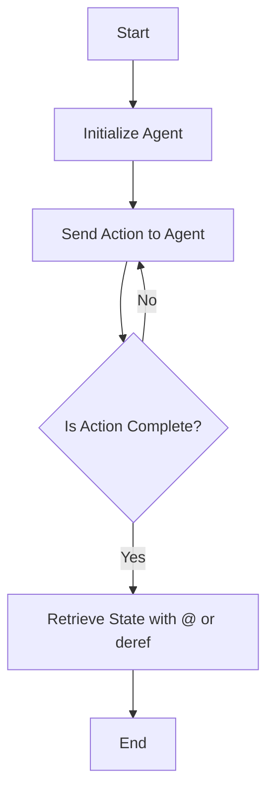

## 8.5.2 Retrieving Agent State

In this section, we delve into the intricacies of retrieving the state of agents in Clojure, a critical aspect of managing concurrency in functional programming. As experienced Java developers, you are likely familiar with the challenges of managing state in concurrent applications. Clojure offers a unique approach with its immutable data structures and concurrency primitives, such as agents, which simplify state management while ensuring thread safety.

### Understanding Agents in Clojure

Agents in Clojure are designed to manage state changes asynchronously. They provide a way to encapsulate state and update it independently of other agents or threads. This is particularly useful in scenarios where you want to perform state changes without blocking the main execution flow.

#### Key Characteristics of Agents

- **Asynchronous Updates**: Agents process updates asynchronously, allowing your program to continue executing without waiting for the state change to complete.
- **Immutability**: The state managed by an agent is immutable, ensuring that changes do not affect other parts of your program unexpectedly.
- **Error Handling**: Agents provide built-in mechanisms for handling errors that occur during state updates.

### Retrieving Agent State

Retrieving the current state of an agent is straightforward in Clojure. You can use the `deref` function or the shorthand `@` operator to access the state. However, due to the asynchronous nature of agents, the state you retrieve might not always reflect the most recent updates.

#### Using `deref` and `@` to Access Agent State

The `deref` function and the `@` operator are used to obtain the current state of an agent. Here's a simple example:

```clojure
(def my-agent (agent 0)) ; Initialize an agent with state 0

;; Retrieve the state using deref
(println "Current state:" (deref my-agent))

;; Retrieve the state using @
(println "Current state:" @my-agent)
```

In this example, we define an agent `my-agent` with an initial state of `0`. We then retrieve the state using both `deref` and `@`, which will output the current state of the agent.

#### Understanding Stale State

Because agents update their state asynchronously, there is a possibility that the state you retrieve might be stale. This means that the state you access might not include the latest updates if those updates are still being processed.

##### Ensuring Up-to-Date Values

To ensure that you are working with the most up-to-date values, you can use the `await` function. This function blocks the current thread until all pending actions on the agent have been completed. Here's how you can use it:

```clojure
(send my-agent inc) ; Increment the agent's state asynchronously

(await my-agent) ; Wait for the update to complete

(println "Updated state:" @my-agent) ; Now the state is guaranteed to be up-to-date
```

In this example, we send an increment action to `my-agent` and use `await` to ensure that the state is updated before retrieving it.

### Comparing with Java's Concurrency Model

In Java, managing state in a concurrent environment often involves using synchronized blocks or locks to ensure thread safety. This can lead to complex and error-prone code. Clojure's agents provide a more elegant solution by abstracting away the complexity of synchronization and allowing you to focus on the logic of your application.

#### Java Example: Synchronized State Access

```java
public class Counter {
    private int count = 0;

    public synchronized void increment() {
        count++;
    }

    public synchronized int getCount() {
        return count;
    }
}
```

In this Java example, we use synchronized methods to ensure that the `count` variable is accessed safely by multiple threads. While effective, this approach can lead to performance bottlenecks and increased complexity.

#### Clojure Example: Agent State Access

```clojure
(def counter (agent 0))

(defn increment-counter []
  (send counter inc))

(defn get-counter []
  @counter)
```

In Clojure, we achieve the same functionality with less code and greater clarity. The agent handles synchronization internally, allowing us to focus on the logic of incrementing and retrieving the counter.

### Visualizing Agent State Retrieval

To better understand how agent state retrieval works, let's visualize the process using a flowchart.



**Diagram Caption**: This flowchart illustrates the process of retrieving agent state in Clojure. After initializing an agent and sending an action, you can retrieve the state once the action is complete.

### Best Practices for Using Agents

- **Use Agents for Independent State Changes**: Agents are ideal for managing state changes that do not depend on other parts of your application.
- **Avoid Blocking Operations**: Since agents process updates asynchronously, avoid performing blocking operations within the functions you send to agents.
- **Handle Errors Gracefully**: Use the `set-error-handler!` function to define how your application should respond to errors during state updates.

### Try It Yourself

Experiment with the following code snippets to deepen your understanding of agent state retrieval:

1. **Modify the Initial State**: Change the initial state of the agent and observe how it affects the output.
2. **Add Multiple Actions**: Send multiple actions to the agent and use `await` to ensure all updates are complete before retrieving the state.
3. **Implement Error Handling**: Introduce an error in one of the actions and use `set-error-handler!` to handle it.

### Exercises

1. **Exercise 1**: Create an agent that manages a list of tasks. Implement functions to add, remove, and retrieve tasks. Ensure that the state is always up-to-date before retrieval.
2. **Exercise 2**: Compare the performance of managing state with agents versus synchronized methods in Java. Measure the time taken for multiple threads to update and retrieve state.

### Key Takeaways

- **Agents Simplify Concurrency**: Clojure's agents provide a powerful abstraction for managing state changes asynchronously, reducing the complexity of concurrent programming.
- **State Retrieval is Straightforward**: Use `deref` or `@` to access agent state, but be mindful of potential staleness due to asynchronous updates.
- **Ensure Up-to-Date Values**: Use `await` to block until all actions are complete, ensuring that you retrieve the most recent state.
- **Leverage Your Java Knowledge**: Understanding Java's concurrency model can help you appreciate the simplicity and elegance of Clojure's approach.

By mastering agent state retrieval in Clojure, you can build robust and efficient concurrent applications that leverage the full power of functional programming.

### Further Reading

- [Clojure Official Documentation on Agents](https://clojure.org/reference/agents)
- [ClojureDocs: Agent Examples](https://clojuredocs.org/clojure.core/agent)
- [Java Concurrency in Practice](https://www.oreilly.com/library/view/java-concurrency-in/0321349601/)

## Quiz Time!



### What is the primary purpose of agents in Clojure?

- [x] To manage state changes asynchronously
- [ ] To perform synchronous computations
- [ ] To handle exceptions
- [ ] To manage memory allocation

> **Explanation:** Agents in Clojure are designed to manage state changes asynchronously, allowing for non-blocking updates.

### How can you retrieve the current state of an agent in Clojure?

- [x] Using `deref` or `@`
- [ ] Using `get`
- [ ] Using `fetch`
- [ ] Using `retrieve`

> **Explanation:** The `deref` function or the `@` operator is used to access the current state of an agent in Clojure.

### What function can you use to ensure all pending actions on an agent are complete before retrieving its state?

- [x] `await`
- [ ] `wait`
- [ ] `complete`
- [ ] `finalize`

> **Explanation:** The `await` function blocks until all pending actions on an agent are complete, ensuring the state is up-to-date.

### What is a potential issue when retrieving the state of an agent?

- [x] The state might be stale
- [ ] The state might be corrupted
- [ ] The state might be lost
- [ ] The state might be duplicated

> **Explanation:** Due to the asynchronous nature of agents, the state retrieved might not reflect the most recent updates, making it potentially stale.

### How does Clojure's approach to concurrency differ from Java's?

- [x] Clojure uses immutable data structures and concurrency primitives like agents
- [ ] Clojure relies on synchronized blocks
- [ ] Clojure uses locks extensively
- [ ] Clojure does not support concurrency

> **Explanation:** Clojure's concurrency model is based on immutable data structures and primitives like agents, which simplify state management compared to Java's synchronized blocks and locks.

### Which of the following is NOT a characteristic of Clojure agents?

- [ ] Asynchronous updates
- [ ] Immutability
- [ ] Built-in error handling
- [x] Synchronous execution

> **Explanation:** Clojure agents perform asynchronous updates, not synchronous execution.

### What is the shorthand operator for `deref` in Clojure?

- [x] `@`
- [ ] `#`
- [ ] `&`
- [ ] `*`

> **Explanation:** The `@` operator is the shorthand for `deref` in Clojure.

### What should you avoid doing within functions sent to agents?

- [x] Performing blocking operations
- [ ] Performing mathematical calculations
- [ ] Logging information
- [ ] Updating state

> **Explanation:** Blocking operations should be avoided within functions sent to agents, as they can hinder the asynchronous nature of agents.

### What is the purpose of the `set-error-handler!` function in Clojure?

- [x] To define how an application should respond to errors during state updates
- [ ] To synchronize agent actions
- [ ] To log errors
- [ ] To prevent errors

> **Explanation:** The `set-error-handler!` function is used to define how an application should handle errors that occur during agent state updates.

### True or False: Agents in Clojure can be used to manage state changes that depend on other parts of the application.

- [ ] True
- [x] False

> **Explanation:** Agents are best used for managing state changes that do not depend on other parts of the application, as they operate independently.


