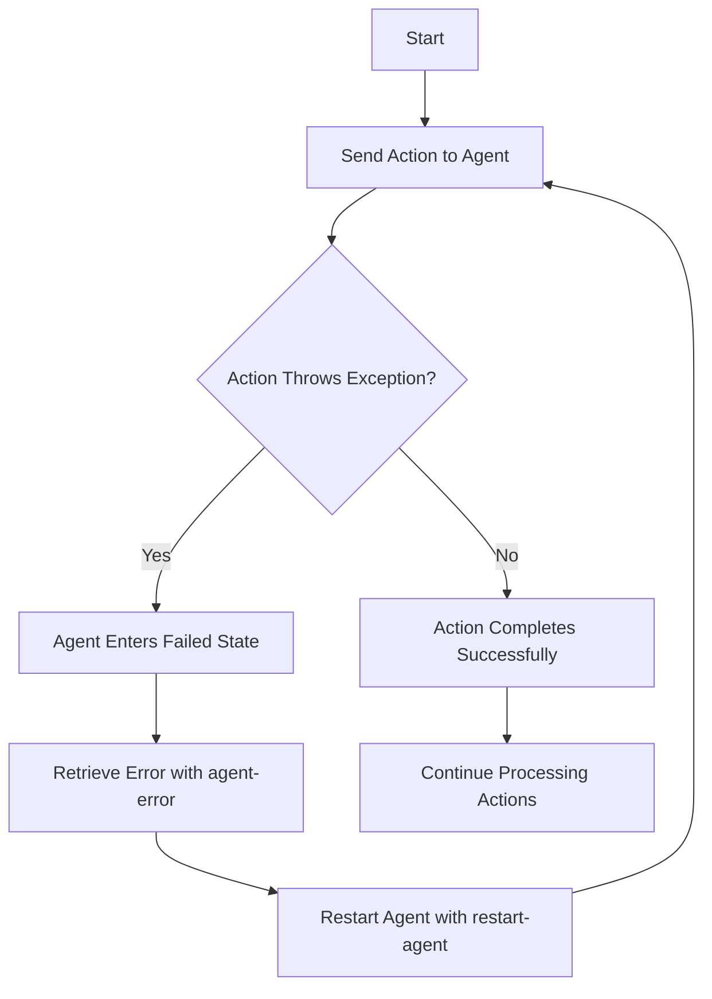

## 8.5.3 Error Handling in Agents

In this section, we will delve into the intricacies of error handling in Clojure agents, a powerful concurrency primitive that allows you to manage state changes asynchronously. Understanding how to handle errors effectively is crucial for building robust and reliable applications. We'll explore how exceptions thrown within agent actions are managed, how agents can become 'failed', and how to recover from such failures using `agent-error` and `restart-agent`. We'll also provide practical examples and strategies for robust error handling.

### Understanding Agents and Error Handling

Agents in Clojure are designed to manage state changes asynchronously. They are particularly useful when you want to perform operations that do not require immediate feedback. However, like any asynchronous operation, errors can occur, and handling these errors gracefully is essential.

#### How Agents Handle Errors

When an exception is thrown within an agent's action, the agent enters a 'failed' state. In this state, the agent stops processing any further actions until the error is addressed. This behavior is intentional, as it prevents the propagation of errors and allows you to handle them explicitly.

Let's look at a simple example to illustrate this concept:

```clojure
(def my-agent (agent 0))

;; Define an action that will cause an error
(send my-agent (fn [state]
                 (/ state 0))) ; Division by zero error

;; Check the agent's state
(agent-error my-agent) ; Returns the exception that caused the failure
```

In this example, the division by zero causes an exception, and the agent enters a failed state. The `agent-error` function can be used to retrieve the exception that caused the failure.

### Recovering from Agent Failures

Once an agent is in a failed state, it will not process any new actions until it is restarted. Clojure provides the `restart-agent` function to reset the agent's state and allow it to continue processing actions.

```clojure
;; Restart the agent with a new initial state
(restart-agent my-agent 1)

;; Send a new action
(send my-agent (fn [state]
                 (+ state 10)))

;; Check the agent's state again
@my-agent ; Returns 11
```

In this example, we restart the agent with an initial state of 1 and send a new action to it. The agent resumes processing actions normally.

### Robust Error Handling Strategies

To ensure your application remains robust, it's important to implement effective error handling strategies. Here are some approaches you can take:

#### 1. Use `try-catch` Blocks

Wrap your agent actions in `try-catch` blocks to handle exceptions locally and prevent the agent from entering a failed state.

```clojure
(send my-agent (fn [state]
                 (try
                   (/ state 0)
                   (catch ArithmeticException e
                     (println "Caught exception:" e)
                     state)))) ; Return the current state if an error occurs
```

#### 2. Log Errors for Debugging

Logging errors can help you diagnose issues and understand the conditions that lead to failures.

```clojure
(send my-agent (fn [state]
                 (try
                   (/ state 0)
                   (catch ArithmeticException e
                     (println "Error occurred:" (.getMessage e))
                     state))))
```

#### 3. Implement Retry Logic

In some cases, it may be appropriate to retry an action if it fails. You can implement a retry mechanism within the agent action.

```clojure
(defn retry-action [state retries]
  (try
    (/ state 0)
    (catch ArithmeticException e
      (if (pos? retries)
        (do
          (println "Retrying...")
          (retry-action state (dec retries)))
        (do
          (println "Max retries reached")
          state)))))

(send my-agent (partial retry-action 3))
```

### Comparing with Java's Error Handling

In Java, error handling in concurrent applications typically involves using `try-catch` blocks within threads or tasks. However, managing state and ensuring consistency can be more complex due to shared mutable state and the need for synchronization.

Clojure's agents provide a higher-level abstraction that simplifies error handling by isolating state changes and allowing you to focus on handling exceptions within individual actions.

### Visualizing Agent Error Handling

Let's use a diagram to visualize the flow of error handling in agents:



**Diagram Caption**: This flowchart illustrates the process of error handling in Clojure agents. When an action throws an exception, the agent enters a failed state. The error can be retrieved using `agent-error`, and the agent can be restarted with `restart-agent`.

### Try It Yourself

To deepen your understanding, try modifying the code examples above. Experiment with different types of exceptions and see how the agent behaves. Implement additional error handling strategies, such as logging or retry logic, and observe their effects.

### Exercises

1. **Implement a Robust Agent System**: Create an agent-based system that performs a series of calculations. Implement error handling to ensure the system can recover from failures and continue processing.

2. **Compare Error Handling**: Write a Java program that performs similar asynchronous tasks and compare the error handling strategies with those in Clojure. What are the key differences and similarities?

3. **Explore Advanced Error Handling**: Research advanced error handling techniques in Clojure, such as using middleware or custom error handlers. Implement these techniques in your agent-based system.

### Key Takeaways

- **Agents in Clojure** provide a powerful mechanism for managing state changes asynchronously.
- **Error handling** is crucial for building robust applications, and Clojure offers tools like `agent-error` and `restart-agent` to manage agent failures.
- **Effective strategies** include using `try-catch` blocks, logging errors, and implementing retry logic.
- **Comparing with Java**, Clojure's agents offer a simpler and more isolated approach to error handling in concurrent applications.

By mastering error handling in agents, you'll be well-equipped to build reliable and resilient Clojure applications. Now that we've explored how to handle errors in agents, let's apply these concepts to manage state effectively in your applications.

For further reading, check out the [Official Clojure Documentation on Agents](https://clojure.org/reference/agents) and explore more examples on [ClojureDocs](https://clojuredocs.org/).

---

## Quiz: Mastering Error Handling in Clojure Agents



### What happens when an exception is thrown within an agent's action in Clojure?

- [x] The agent enters a failed state.
- [ ] The agent continues processing actions.
- [ ] The agent automatically retries the action.
- [ ] The agent shuts down permanently.

> **Explanation:** When an exception is thrown within an agent's action, the agent enters a failed state and stops processing further actions until the error is addressed.

### How can you retrieve the exception that caused an agent to fail?

- [x] Use the `agent-error` function.
- [ ] Use the `get-error` function.
- [ ] Use the `exception` function.
- [ ] Use the `error-state` function.

> **Explanation:** The `agent-error` function is used to retrieve the exception that caused an agent to enter a failed state.

### Which function is used to restart a failed agent in Clojure?

- [x] `restart-agent`
- [ ] `reset-agent`
- [ ] `resume-agent`
- [ ] `recover-agent`

> **Explanation:** The `restart-agent` function is used to reset a failed agent and allow it to continue processing actions.

### What is a common strategy for handling exceptions within agent actions?

- [x] Use `try-catch` blocks to handle exceptions locally.
- [ ] Ignore exceptions and let the agent fail.
- [ ] Use global exception handlers.
- [ ] Restart the agent automatically.

> **Explanation:** Using `try-catch` blocks within agent actions is a common strategy to handle exceptions locally and prevent the agent from entering a failed state.

### How can you implement retry logic within an agent action?

- [x] Use a recursive function with a retry counter.
- [ ] Use the `retry-agent` function.
- [ ] Use the `retry` keyword.
- [ ] Use a global retry handler.

> **Explanation:** Implementing retry logic within an agent action can be done using a recursive function with a retry counter to attempt the action multiple times.

### What is the purpose of logging errors in agent actions?

- [x] To diagnose issues and understand failure conditions.
- [ ] To automatically fix errors.
- [ ] To prevent agents from failing.
- [ ] To improve performance.

> **Explanation:** Logging errors helps diagnose issues and understand the conditions that lead to failures, aiding in debugging and error resolution.

### How does Clojure's error handling in agents compare to Java's?

- [x] Clojure provides a simpler and more isolated approach.
- [ ] Java offers more robust error handling mechanisms.
- [ ] Clojure requires more synchronization.
- [ ] Java automatically retries failed actions.

> **Explanation:** Clojure's agents provide a simpler and more isolated approach to error handling compared to Java's traditional concurrency mechanisms.

### What is the effect of using `restart-agent` on a failed agent?

- [x] It resets the agent's state and resumes processing actions.
- [ ] It permanently shuts down the agent.
- [ ] It logs the error and continues processing.
- [ ] It retries the failed action automatically.

> **Explanation:** Using `restart-agent` resets the agent's state and allows it to resume processing actions.

### Which of the following is NOT a recommended error handling strategy for agents?

- [ ] Use `try-catch` blocks.
- [ ] Implement retry logic.
- [ ] Log errors for debugging.
- [x] Ignore exceptions and let the agent fail.

> **Explanation:** Ignoring exceptions and letting the agent fail is not a recommended strategy, as it can lead to unhandled errors and application instability.

### True or False: Agents in Clojure automatically retry actions that fail due to exceptions.

- [ ] True
- [x] False

> **Explanation:** False. Agents in Clojure do not automatically retry actions that fail due to exceptions. You must handle retries explicitly within the action.


