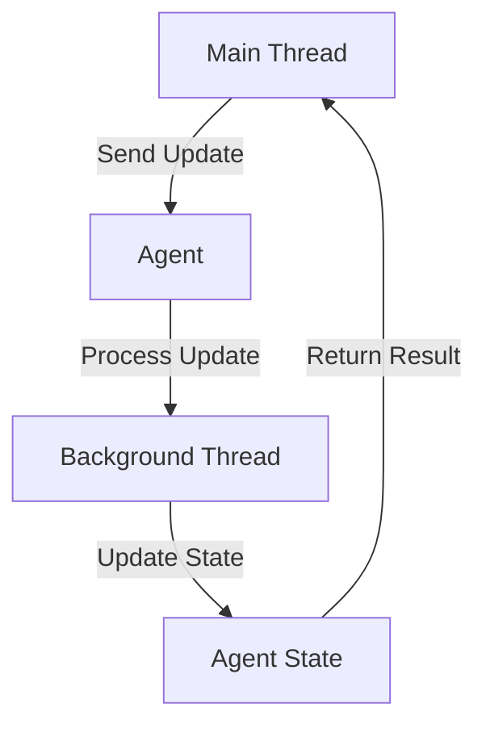

## 8.5.4 Practical Use Cases for Agents

In the world of concurrent programming, managing state changes safely and efficiently is crucial. Clojure offers a unique approach to concurrency with its immutable data structures and concurrency primitives, such as agents. Agents are particularly useful for managing state changes that occur asynchronously and do not require immediate synchronization. In this section, we'll explore practical use cases for agents, including updating GUI elements, handling I/O operations, and managing background tasks.

### Understanding Agents in Clojure

Before diving into practical use cases, let's briefly revisit what agents are and how they work in Clojure. Agents in Clojure are designed for managing independent, asynchronous state changes. They allow you to perform updates to a state in a separate thread without blocking the main thread. This makes them ideal for tasks that can be performed in the background, such as updating a user interface or processing data from an external source.

#### Key Characteristics of Agents

- **Asynchronous Updates**: Agents process updates asynchronously, meaning that the caller can continue executing without waiting for the update to complete.
- **Consistency**: Agents ensure that updates are applied consistently, even when multiple updates are queued.
- **Error Handling**: Agents provide mechanisms for handling errors that occur during state updates.

### Use Case 1: Updating GUI Elements

One of the most common use cases for agents is updating graphical user interface (GUI) elements. In a typical desktop application, the user interface needs to remain responsive while performing background tasks, such as fetching data from a server or processing user input. Agents can be used to manage these updates without blocking the main thread.

#### Example: Real-Time Data Display

Consider an application that displays real-time data, such as stock prices or weather updates. We can use an agent to manage the state of the data being displayed, ensuring that updates are applied asynchronously.

```clojure
(ns gui-example.core
  (:require [clojure.core.async :as async]))

(def stock-price (agent {:symbol "AAPL" :price 150.00}))

(defn update-price [agent new-price]
  (send-off agent (fn [state] (assoc state :price new-price))))

;; Simulate receiving new stock prices
(defn simulate-price-updates []
  (async/go-loop []
    (let [new-price (+ 150 (rand-int 10))]
      (update-price stock-price new-price)
      (async/<! (async/timeout 1000))
      (recur))))

;; Start the simulation
(simulate-price-updates)
```

In this example, the `stock-price` agent manages the state of a stock's price. The `update-price` function sends an asynchronous update to the agent, ensuring that the GUI remains responsive while new prices are processed.

### Use Case 2: Handling I/O Operations

Agents are also well-suited for handling input/output (I/O) operations, such as reading from or writing to files, databases, or network sockets. These operations can be time-consuming and should not block the main thread.

#### Example: Logging System

Let's consider a logging system that writes log messages to a file. We can use an agent to manage the state of the log file, ensuring that log messages are written asynchronously.

```clojure
(ns logging-example.core
  (:require [clojure.java.io :as io]))

(def log-agent (agent (io/writer "application.log" :append true)))

(defn log-message [agent message]
  (send-off agent
            (fn [writer]
              (.write writer (str message "\n"))
              (.flush writer)
              writer)))

;; Log some messages
(log-message log-agent "Application started")
(log-message log-agent "User logged in")
(log-message log-agent "Error: Invalid input")
```

In this example, the `log-agent` manages the state of the log file writer. The `log-message` function sends log messages to the agent, which writes them to the file asynchronously. This approach ensures that the application remains responsive, even when writing large volumes of log data.

### Use Case 3: Managing Background Tasks

Agents are ideal for managing background tasks that do not require immediate synchronization with the main application logic. These tasks can include data processing, batch operations, or periodic maintenance tasks.

#### Example: Batch Data Processing

Consider a scenario where we need to process a large dataset in batches. We can use an agent to manage the state of the processing task, ensuring that each batch is processed asynchronously.

```clojure
(ns batch-processing.core)

(def data-agent (agent []))

(defn process-batch [agent batch]
  (send-off agent
            (fn [processed-data]
              (let [result (map #(* % 2) batch)] ; Example processing
                (concat processed-data result)))))

;; Simulate processing batches of data
(defn simulate-batch-processing []
  (doseq [batch (partition 10 (range 100))]
    (process-batch data-agent batch)))

;; Start processing
(simulate-batch-processing)
```

In this example, the `data-agent` manages the state of the processed data. The `process-batch` function sends each batch of data to the agent for processing, ensuring that the main application remains responsive.

### Comparing Agents with Java's Concurrency Mechanisms

Java developers are familiar with concurrency mechanisms such as threads, executors, and futures. While these tools are powerful, they often require explicit synchronization and error handling. Clojure's agents provide a higher-level abstraction for managing asynchronous state changes, reducing the complexity of concurrent programming.

#### Java Example: ExecutorService

Let's compare the Clojure agent example with a similar implementation in Java using `ExecutorService`.

```java
import java.util.concurrent.ExecutorService;
import java.util.concurrent.Executors;
import java.util.concurrent.Future;

public class BatchProcessing {
    private static final ExecutorService executor = Executors.newFixedThreadPool(4);

    public static void main(String[] args) {
        for (int i = 0; i < 10; i++) {
            final int batchStart = i * 10;
            Future<?> future = executor.submit(() -> {
                for (int j = batchStart; j < batchStart + 10; j++) {
                    System.out.println(j * 2); // Example processing
                }
            });
        }
        executor.shutdown();
    }
}
```

In this Java example, we use an `ExecutorService` to manage the execution of tasks in separate threads. While this approach is effective, it requires more boilerplate code and explicit management of thread pools.

### Try It Yourself: Experimenting with Agents

Now that we've explored practical use cases for agents, let's encourage you to experiment with the code examples. Try modifying the examples to suit different scenarios:

- **GUI Updates**: Modify the `stock-price` example to update multiple stock symbols simultaneously.
- **Logging System**: Enhance the logging system to include log levels (e.g., INFO, ERROR) and filter messages based on the level.
- **Batch Processing**: Experiment with different data processing functions, such as filtering or aggregating data.

### Diagrams and Visualizations

To further illustrate the flow of data and state management with agents, let's include a diagram that visualizes the process of updating state asynchronously.



**Diagram Description**: This diagram illustrates the flow of data when using an agent to manage state updates. The main thread sends an update to the agent, which processes the update in a background thread. The updated state is then returned to the main thread.

### Key Takeaways

- **Agents** are a powerful tool for managing asynchronous state changes in Clojure.
- They are ideal for tasks that can be performed in the background, such as updating GUI elements, handling I/O operations, and managing batch processing.
- Compared to Java's concurrency mechanisms, agents provide a higher-level abstraction that simplifies error handling and synchronization.
- Experimenting with agents can help you better understand their capabilities and how they can be applied to real-world scenarios.

### Exercises

1. **GUI Update Challenge**: Modify the `stock-price` example to handle multiple stock symbols and display the highest and lowest prices in real-time.
2. **Enhanced Logging**: Extend the logging system to support log rotation, where the log file is archived and a new file is created after reaching a certain size.
3. **Data Processing Pipeline**: Create a data processing pipeline using agents that filters, transforms, and aggregates data from a large dataset.

By exploring these exercises, you'll gain hands-on experience with agents and their practical applications in Clojure.

### Further Reading

For more information on Clojure agents and concurrency, consider exploring the following resources:

- [Official Clojure Documentation on Agents](https://clojure.org/reference/agents)
- [ClojureDocs: Agents](https://clojuredocs.org/clojure.core/agent)
- [Concurrency in Clojure: A Practical Guide](https://practical.li/clojure/concurrency/)

---

## Quiz: Mastering Clojure Agents for Concurrency



### What is a primary advantage of using agents in Clojure?

- [x] Asynchronous state updates
- [ ] Synchronous execution
- [ ] Direct thread management
- [ ] Immediate synchronization

> **Explanation:** Agents in Clojure are designed for asynchronous state updates, allowing tasks to be processed in the background without blocking the main thread.


### How do agents handle errors during state updates?

- [x] They provide mechanisms for error handling
- [ ] They ignore errors
- [ ] They crash the application
- [ ] They log errors silently

> **Explanation:** Agents in Clojure have built-in mechanisms for handling errors that occur during state updates, ensuring consistency and reliability.


### In the context of GUI updates, why are agents useful?

- [x] They allow the UI to remain responsive
- [ ] They block the main thread
- [ ] They require manual synchronization
- [ ] They are only for batch processing

> **Explanation:** Agents allow GUI updates to be processed asynchronously, keeping the user interface responsive while background tasks are executed.


### What is a common use case for agents in I/O operations?

- [x] Writing log messages asynchronously
- [ ] Reading files synchronously
- [ ] Blocking network requests
- [ ] Immediate data processing

> **Explanation:** Agents are often used to handle I/O operations like writing log messages asynchronously, ensuring that the main application remains responsive.


### How do agents compare to Java's ExecutorService?

- [x] Agents provide a higher-level abstraction
- [ ] Agents require more boilerplate code
- [ ] Agents manage thread pools explicitly
- [ ] Agents are less efficient

> **Explanation:** Agents offer a higher-level abstraction for managing asynchronous state changes, reducing the complexity compared to Java's ExecutorService.


### What is the role of the `send-off` function in agents?

- [x] It sends an asynchronous update to the agent
- [ ] It blocks the main thread
- [ ] It synchronizes state changes
- [ ] It initializes the agent

> **Explanation:** The `send-off` function is used to send asynchronous updates to an agent, allowing state changes to be processed in the background.


### Which of the following is NOT a practical use case for agents?

- [ ] Updating GUI elements
- [ ] Handling I/O operations
- [ ] Managing background tasks
- [x] Real-time synchronous processing

> **Explanation:** Agents are designed for asynchronous processing, making them unsuitable for real-time synchronous tasks.


### What is the benefit of using agents for batch data processing?

- [x] They allow processing to occur in the background
- [ ] They require manual thread management
- [ ] They block the main application
- [ ] They are only for small datasets

> **Explanation:** Agents enable batch data processing to occur asynchronously, allowing the main application to remain responsive.


### How can you experiment with agents in Clojure?

- [x] Modify existing examples to handle different scenarios
- [ ] Use them only in production code
- [ ] Avoid changing the default behavior
- [ ] Limit their use to simple tasks

> **Explanation:** Experimenting with agents by modifying examples helps you understand their capabilities and apply them to various scenarios.


### True or False: Agents in Clojure require explicit synchronization.

- [ ] True
- [x] False

> **Explanation:** Agents in Clojure handle synchronization internally, allowing state updates to be processed asynchronously without explicit synchronization.


