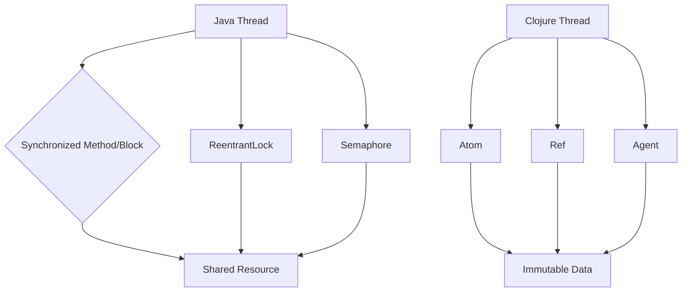

## 8.6.1 Locks and Synchronization in Java

In this section, we delve into the intricacies of Java's concurrency mechanisms, focusing on locks and synchronization. As experienced Java developers, you are likely familiar with the challenges of managing concurrent access to shared resources. This discussion will provide a comprehensive overview of Java's synchronization tools, including synchronized methods and blocks, `ReentrantLock`, `Semaphore`, and other concurrency utilities. We will also explore the complexities and pitfalls associated with manual synchronization, and how Clojure offers alternative approaches to concurrency.

### Understanding Java's Synchronization Mechanisms

Java provides several built-in mechanisms to handle concurrency, ensuring that shared resources are accessed in a thread-safe manner. The primary tools for synchronization in Java include:

- **Synchronized Methods and Blocks**: These are the simplest forms of synchronization, allowing you to lock an object or a block of code to prevent concurrent access.
- **ReentrantLock**: A more flexible locking mechanism that provides additional features such as try-lock and timed lock.
- **Semaphore**: A counting semaphore that controls access to a resource with a set number of permits.
- **Other Utilities**: Java's `java.util.concurrent` package offers additional utilities like `CountDownLatch`, `CyclicBarrier`, and `ReadWriteLock`.

Let's explore each of these mechanisms in detail, comparing them with Clojure's approach to concurrency.

### Synchronized Methods and Blocks

The synchronized keyword in Java is used to lock an object for mutual exclusion. When a thread enters a synchronized method or block, it acquires the lock for the specified object, preventing other threads from entering any synchronized method/block on the same object.

#### Example: Synchronized Method

```java
public class Counter {
    private int count = 0;

    public synchronized void increment() {
        count++;
    }

    public synchronized int getCount() {
        return count;
    }
}
```

In this example, the `increment` and `getCount` methods are synchronized, ensuring that only one thread can execute them at a time for a given `Counter` instance.

#### Example: Synchronized Block

```java
public class Counter {
    private int count = 0;
    private final Object lock = new Object();

    public void increment() {
        synchronized (lock) {
            count++;
        }
    }

    public int getCount() {
        synchronized (lock) {
            return count;
        }
    }
}
```

Here, we use a synchronized block to lock a specific object (`lock`), providing more granular control over synchronization.

#### Pitfalls of Synchronized Methods and Blocks

- **Deadlocks**: Occur when two or more threads are blocked forever, waiting for each other.
- **Performance Overhead**: Synchronization can introduce performance bottlenecks due to thread contention.
- **Complexity**: Managing synchronized code can become complex, especially in large applications.

### ReentrantLock

`ReentrantLock` is part of the `java.util.concurrent.locks` package and offers more flexibility than synchronized methods/blocks. It allows for more sophisticated locking mechanisms, such as try-lock and timed lock.

#### Example: Using ReentrantLock

```java
import java.util.concurrent.locks.ReentrantLock;

public class Counter {
    private int count = 0;
    private final ReentrantLock lock = new ReentrantLock();

    public void increment() {
        lock.lock();
        try {
            count++;
        } finally {
            lock.unlock();
        }
    }

    public int getCount() {
        lock.lock();
        try {
            return count;
        } finally {
            lock.unlock();
        }
    }
}
```

#### Advantages of ReentrantLock

- **Try-Lock**: Allows a thread to attempt to acquire the lock without blocking indefinitely.
- **Timed Lock**: Enables a thread to wait for a lock for a specified amount of time.
- **Interruptible Lock**: Supports interrupting threads waiting for a lock.

#### Pitfalls of ReentrantLock

- **Complexity**: Requires explicit lock and unlock calls, increasing the risk of forgetting to release the lock.
- **Deadlocks**: Still susceptible to deadlocks if not used carefully.

### Semaphore

A `Semaphore` is a concurrency utility that controls access to a resource through a set number of permits. It can be used to limit the number of threads accessing a resource simultaneously.

#### Example: Using Semaphore

```java
import java.util.concurrent.Semaphore;

public class ResourcePool {
    private final Semaphore semaphore;

    public ResourcePool(int permits) {
        this.semaphore = new Semaphore(permits);
    }

    public void accessResource() {
        try {
            semaphore.acquire();
            // Access the resource
        } catch (InterruptedException e) {
            Thread.currentThread().interrupt();
        } finally {
            semaphore.release();
        }
    }
}
```

#### Advantages of Semaphore

- **Resource Limiting**: Useful for limiting access to a fixed number of resources.
- **Fairness**: Can be configured to ensure fair access to resources.

#### Pitfalls of Semaphore

- **Complexity**: Managing permits and ensuring proper release can be error-prone.
- **Deadlocks**: Incorrect usage can lead to deadlocks.

### Other Concurrency Utilities

Java's `java.util.concurrent` package offers additional utilities for managing concurrency:

- **CountDownLatch**: Allows one or more threads to wait until a set of operations being performed in other threads completes.
- **CyclicBarrier**: A synchronization aid that allows a set of threads to all wait for each other to reach a common barrier point.
- **ReadWriteLock**: Provides a pair of locks for read and write operations, allowing multiple threads to read simultaneously while ensuring exclusive access for write operations.

### Comparing Java and Clojure Concurrency

Java's concurrency model relies heavily on locks and synchronization, which can lead to complex and error-prone code. In contrast, Clojure offers a more functional approach to concurrency, emphasizing immutability and state management through atoms, refs, and agents.

#### Clojure's Concurrency Primitives

- **Atoms**: Provide a way to manage shared, synchronous, independent state.
- **Refs**: Allow coordinated, synchronous changes to multiple pieces of state using Software Transactional Memory (STM).
- **Agents**: Enable asynchronous, independent state changes.

Clojure's approach reduces the need for explicit locking, minimizing the risk of deadlocks and race conditions. By leveraging immutable data structures and functional programming principles, Clojure simplifies concurrency management.

### Try It Yourself

To deepen your understanding, try modifying the Java examples to introduce a deadlock scenario. Then, attempt to resolve it using `ReentrantLock` or `Semaphore`. Consider how you might approach the same problem in Clojure using atoms or refs.

### Diagrams and Visual Aids

Below is a diagram illustrating the flow of data through Java's synchronization mechanisms compared to Clojure's concurrency model.



**Diagram Caption**: This diagram compares Java's synchronization mechanisms with Clojure's concurrency model, highlighting the flow of data and the role of locks and synchronization.

### Further Reading

For more information on Java's concurrency utilities, refer to the [Java Concurrency Tutorial](https://docs.oracle.com/javase/tutorial/essential/concurrency/). To explore Clojure's concurrency model, visit the [Official Clojure Documentation](https://clojure.org/reference/atoms).

### Exercises

1. **Deadlock Resolution**: Create a Java program with two threads that cause a deadlock. Resolve the deadlock using `ReentrantLock`.
2. **Semaphore Usage**: Implement a resource pool using `Semaphore` to limit access to a fixed number of resources.
3. **Clojure Conversion**: Convert a Java program using synchronized methods to a Clojure program using atoms or refs.

### Key Takeaways

- Java provides several synchronization mechanisms, each with its own advantages and pitfalls.
- Synchronized methods and blocks are simple but can lead to deadlocks and performance issues.
- `ReentrantLock` offers more flexibility but requires careful management to avoid errors.
- `Semaphore` is useful for controlling access to resources but can be complex to manage.
- Clojure's concurrency model emphasizes immutability and functional programming, reducing the need for explicit locking.

By understanding Java's concurrency mechanisms and exploring Clojure's alternatives, you can develop more robust and maintainable concurrent applications.

## Java Locks and Synchronization Quiz



### What is the primary purpose of using synchronized methods in Java?

- [x] To ensure mutual exclusion when accessing shared resources
- [ ] To improve performance by allowing multiple threads to access resources simultaneously
- [ ] To simplify code by removing the need for explicit locking
- [ ] To enable asynchronous execution of methods

> **Explanation:** Synchronized methods ensure mutual exclusion, preventing multiple threads from accessing shared resources concurrently.

### Which Java class provides more flexible locking mechanisms than synchronized methods?

- [ ] Semaphore
- [x] ReentrantLock
- [ ] CountDownLatch
- [ ] CyclicBarrier

> **Explanation:** ReentrantLock offers more flexible locking mechanisms, such as try-lock and timed lock, compared to synchronized methods.

### What is a potential drawback of using synchronized blocks in Java?

- [ ] They are too complex to implement
- [x] They can lead to deadlocks if not used carefully
- [ ] They do not provide mutual exclusion
- [ ] They are not supported in Java

> **Explanation:** Synchronized blocks can lead to deadlocks if multiple threads are waiting for each other to release locks.

### How does a Semaphore control access to a resource?

- [x] By using a set number of permits
- [ ] By locking the resource indefinitely
- [ ] By allowing only one thread to access the resource at a time
- [ ] By using a queue to manage thread access

> **Explanation:** A Semaphore controls access by using a set number of permits, limiting the number of threads that can access a resource simultaneously.

### What is a key advantage of using ReentrantLock over synchronized methods?

- [x] It allows for try-lock and timed lock operations
- [ ] It automatically releases locks when exceptions occur
- [ ] It simplifies code by removing the need for explicit locking
- [ ] It improves performance by allowing multiple threads to access resources simultaneously

> **Explanation:** ReentrantLock allows for try-lock and timed lock operations, providing more flexibility than synchronized methods.

### Which Clojure concurrency primitive is used for asynchronous state changes?

- [ ] Atom
- [ ] Ref
- [x] Agent
- [ ] Semaphore

> **Explanation:** Agents in Clojure are used for asynchronous state changes, allowing independent updates to state.

### What is a common pitfall of manual synchronization in Java?

- [x] Deadlocks and race conditions
- [ ] Lack of mutual exclusion
- [ ] Inability to handle multiple threads
- [ ] Automatic lock release

> **Explanation:** Manual synchronization can lead to deadlocks and race conditions if not managed carefully.

### How does Clojure's concurrency model differ from Java's?

- [x] It emphasizes immutability and functional programming
- [ ] It relies heavily on synchronized methods and blocks
- [ ] It uses explicit locks for all state changes
- [ ] It does not support concurrent programming

> **Explanation:** Clojure's concurrency model emphasizes immutability and functional programming, reducing the need for explicit locks.

### Which Java utility allows threads to wait for each other to reach a common barrier point?

- [ ] Semaphore
- [ ] ReentrantLock
- [ ] CountDownLatch
- [x] CyclicBarrier

> **Explanation:** CyclicBarrier allows threads to wait for each other to reach a common barrier point before proceeding.

### True or False: Clojure's concurrency primitives eliminate the need for explicit locking.

- [x] True
- [ ] False

> **Explanation:** Clojure's concurrency primitives, such as atoms, refs, and agents, reduce the need for explicit locking by emphasizing immutability and functional programming.


