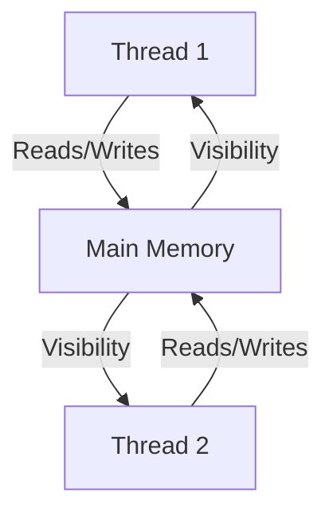
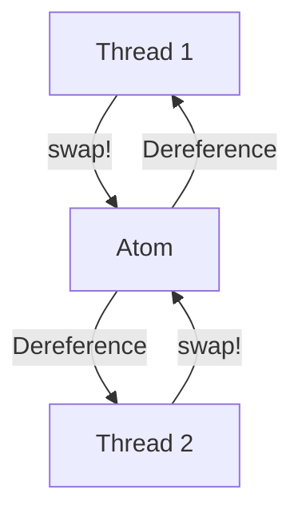

## 8.6.2 The Java Memory Model

As experienced Java developers transitioning to Clojure, understanding the Java Memory Model (JMM) is crucial for mastering concurrency and state management in both languages. The JMM defines how threads interact through memory and ensures that Java applications behave consistently across different platforms. In this section, we'll explore the key concepts of the JMM, including visibility of shared variables, memory inconsistencies, and the use of `volatile` variables and synchronization to ensure correct behavior.

### Introduction to the Java Memory Model

The Java Memory Model is a part of the Java Language Specification that describes how threads interact with memory. It provides a framework for understanding the behavior of concurrent programs, ensuring that they execute correctly and consistently across different hardware and operating systems.

#### Key Concepts of the Java Memory Model

1. **Visibility**: The JMM defines how changes to memory made by one thread become visible to other threads. This is crucial for ensuring that threads have a consistent view of shared data.

2. **Atomicity**: Certain operations, such as reading and writing to a `volatile` variable, are atomic, meaning they are indivisible and cannot be interrupted by other threads.

3. **Ordering**: The JMM specifies the order in which operations are executed, ensuring that threads execute in a predictable manner.

4. **Synchronization**: The use of synchronization mechanisms, such as locks and `volatile` variables, to control access to shared data and ensure visibility and ordering.

### Visibility and Memory Inconsistencies

In a multithreaded environment, threads may have inconsistent views of shared variables due to caching and compiler optimizations. This can lead to memory inconsistencies, where one thread sees stale or incorrect data.

#### Example of Memory Inconsistency

Consider the following Java code snippet:

```java
class SharedData {
    private int counter = 0;

    public void increment() {
        counter++;
    }

    public int getCounter() {
        return counter;
    }
}
```

In a multithreaded environment, if multiple threads call the `increment()` method simultaneously, they may see inconsistent values of `counter` due to caching and lack of synchronization.

### Ensuring Visibility with `volatile` Variables

The `volatile` keyword in Java is used to ensure that changes to a variable are immediately visible to all threads. When a variable is declared as `volatile`, it guarantees that any read or write to the variable is directly from or to the main memory, bypassing the CPU cache.

#### Example of `volatile` Usage

```java
class VolatileExample {
    private volatile boolean flag = false;

    public void setFlag() {
        flag = true;
    }

    public boolean checkFlag() {
        return flag;
    }
}
```

In this example, the `flag` variable is declared as `volatile`, ensuring that changes made by one thread are visible to all other threads.

### Synchronization for Correct Behavior

While `volatile` ensures visibility, it does not provide atomicity for compound actions like incrementing a counter. For such operations, synchronization is necessary to ensure correct behavior.

#### Example of Synchronization

```java
class SynchronizedCounter {
    private int counter = 0;

    public synchronized void increment() {
        counter++;
    }

    public synchronized int getCounter() {
        return counter;
    }
}
```

In this example, the `increment()` and `getCounter()` methods are synchronized, ensuring that only one thread can execute them at a time, thus preventing race conditions.

### Comparing Java and Clojure Concurrency

Clojure, being a functional language, offers a different approach to concurrency. It emphasizes immutability and provides concurrency primitives like atoms, refs, and agents, which simplify state management and reduce the need for explicit synchronization.

#### Clojure's Approach to Concurrency

- **Atoms**: Provide a way to manage shared, mutable state with atomic updates.
- **Refs**: Allow coordinated, synchronous changes to multiple pieces of state using Software Transactional Memory (STM).
- **Agents**: Facilitate asynchronous updates to state.

### Code Example: Clojure Atoms

```clojure
(def counter (atom 0))

(defn increment-counter []
  (swap! counter inc))

(defn get-counter []
  @counter)
```

In this Clojure example, we use an `atom` to manage the `counter` state. The `swap!` function ensures atomic updates, and `@counter` dereferences the atom to get its current value.

### Diagrams and Visualizations

To better understand the flow of data and control in concurrent programs, let's visualize the interaction between threads and memory in both Java and Clojure.



**Diagram 1**: Interaction between threads and main memory in the Java Memory Model, illustrating how visibility is controlled.



**Diagram 2**: Interaction between threads and an atom in Clojure, showing atomic updates and dereferencing.

### Try It Yourself

Experiment with the provided code examples by modifying the `increment` logic to include additional operations, such as decrementing or resetting the counter. Observe how synchronization and atomic updates affect the behavior of the program.

### Further Reading

For more information on the Java Memory Model and concurrency in Java and Clojure, consider exploring the following resources:

- [Java Language Specification](https://docs.oracle.com/javase/specs/jls/se17/html/index.html)
- [Clojure Concurrency](https://clojure.org/reference/concurrency)
- [Java Concurrency in Practice](https://jcip.net/)

### Exercises

1. Modify the `SynchronizedCounter` class to include a `decrement()` method and ensure it is thread-safe.
2. Implement a Clojure function that uses an `atom` to manage a shared list of tasks, allowing concurrent additions and removals.
3. Compare the performance of a Java program using synchronized methods with a Clojure program using atoms for a similar task.

### Key Takeaways

- The Java Memory Model defines how threads interact with memory, ensuring visibility, atomicity, and ordering.
- `volatile` variables ensure visibility but not atomicity for compound actions.
- Synchronization is necessary for ensuring correct behavior in multithreaded Java programs.
- Clojure offers a different approach to concurrency, emphasizing immutability and providing concurrency primitives like atoms, refs, and agents.
- Understanding the JMM is crucial for writing correct and efficient concurrent programs in both Java and Clojure.

Now that we've explored the Java Memory Model and its implications for concurrency, let's apply these concepts to manage state effectively in your Clojure applications.

## Java Memory Model Quiz: Test Your Understanding



### What is the primary purpose of the Java Memory Model?

- [x] To define how threads interact with memory
- [ ] To optimize Java code execution
- [ ] To manage Java garbage collection
- [ ] To improve Java's syntax

> **Explanation:** The Java Memory Model defines how threads interact with memory, ensuring consistent behavior across different platforms.

### Which keyword in Java ensures visibility of changes to a variable across threads?

- [ ] synchronized
- [x] volatile
- [ ] transient
- [ ] static

> **Explanation:** The `volatile` keyword ensures that changes to a variable are immediately visible to all threads.

### What does the `volatile` keyword guarantee?

- [x] Visibility of changes to a variable
- [ ] Atomicity of operations
- [ ] Synchronization of methods
- [ ] Improved performance

> **Explanation:** `volatile` guarantees visibility but not atomicity or synchronization.

### Which Java construct is used to ensure atomicity of compound actions?

- [ ] volatile
- [x] synchronized
- [ ] transient
- [ ] static

> **Explanation:** The `synchronized` keyword is used to ensure atomicity and prevent race conditions.

### How does Clojure handle concurrency differently from Java?

- [x] By emphasizing immutability and using concurrency primitives like atoms
- [ ] By using synchronized methods exclusively
- [ ] By relying on the Java Memory Model
- [ ] By avoiding multithreading

> **Explanation:** Clojure emphasizes immutability and provides concurrency primitives like atoms, refs, and agents.

### What is the role of an `atom` in Clojure?

- [x] To manage shared, mutable state with atomic updates
- [ ] To synchronize method execution
- [ ] To improve performance
- [ ] To handle exceptions

> **Explanation:** An `atom` in Clojure is used to manage shared, mutable state with atomic updates.

### Which of the following is NOT a concurrency primitive in Clojure?

- [ ] Atoms
- [ ] Refs
- [ ] Agents
- [x] Threads

> **Explanation:** Threads are not a concurrency primitive in Clojure; atoms, refs, and agents are.

### What is the main advantage of using `volatile` variables?

- [x] Ensuring visibility of changes across threads
- [ ] Ensuring atomicity of operations
- [ ] Improving performance
- [ ] Simplifying code

> **Explanation:** `volatile` variables ensure visibility of changes across threads.

### Which Clojure primitive allows coordinated, synchronous changes to multiple pieces of state?

- [ ] Atoms
- [x] Refs
- [ ] Agents
- [ ] Vars

> **Explanation:** Refs allow coordinated, synchronous changes to multiple pieces of state using Software Transactional Memory (STM).

### True or False: The Java Memory Model ensures that all threads have a consistent view of shared data without any additional synchronization.

- [ ] True
- [x] False

> **Explanation:** Without additional synchronization, threads may have inconsistent views of shared data due to caching and compiler optimizations.


