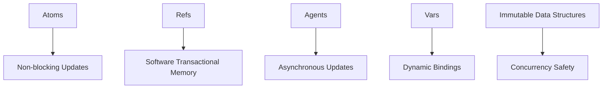

## 8.6.3 Using Concurrent Collections in Java

As Java developers, we are well-acquainted with the challenges of managing state in concurrent applications. Java provides a robust set of concurrent collections designed to handle these challenges, ensuring thread safety and improving performance in multi-threaded environments. In this section, we will explore some of the most commonly used concurrent collections in Java, such as `ConcurrentHashMap`, `CopyOnWriteArrayList`, and `BlockingQueue`. We will also discuss their advantages, limitations, and how they compare to Clojure's concurrency mechanisms.

### Understanding Concurrent Collections

Concurrent collections in Java are part of the `java.util.concurrent` package, introduced to address the limitations of synchronized collections. These collections are designed to provide thread-safe operations without the need for explicit synchronization, thereby reducing the risk of concurrency-related issues such as race conditions and deadlocks.

#### Key Features of Concurrent Collections

- **Thread Safety**: Concurrent collections are inherently thread-safe, meaning they can be accessed by multiple threads simultaneously without compromising data integrity.
- **Non-blocking Algorithms**: Many concurrent collections use non-blocking algorithms, which allow threads to proceed without waiting for locks, improving performance and scalability.
- **Atomic Operations**: These collections provide atomic operations, ensuring that complex operations can be performed without the risk of partial updates.

### Exploring Java's Concurrent Collections

Let's delve into some of the most widely used concurrent collections in Java and understand their unique characteristics and use cases.

#### ConcurrentHashMap

`ConcurrentHashMap` is a highly efficient, thread-safe implementation of the `Map` interface. Unlike `HashMap`, which is not synchronized, `ConcurrentHashMap` allows concurrent read and write operations, making it ideal for high-concurrency scenarios.

**Key Characteristics:**

- **Segmented Locking**: `ConcurrentHashMap` uses a segmented locking mechanism, dividing the map into segments and locking only the segment being accessed. This reduces contention and improves performance.
- **No Null Keys or Values**: Unlike `HashMap`, `ConcurrentHashMap` does not allow null keys or values, preventing potential `NullPointerException` issues.
- **Atomic Operations**: It provides atomic operations such as `putIfAbsent`, `remove`, and `replace`, which are crucial for concurrent modifications.

**Example Usage:**

```java
import java.util.concurrent.ConcurrentHashMap;

public class ConcurrentHashMapExample {
    public static void main(String[] args) {
        ConcurrentHashMap<String, Integer> map = new ConcurrentHashMap<>();

        // Adding elements
        map.put("A", 1);
        map.put("B", 2);

        // Concurrent modification
        map.computeIfAbsent("C", key -> 3);

        // Atomic operation
        map.putIfAbsent("A", 4); // Will not update as "A" already exists

        System.out.println(map);
    }
}
```

**Try It Yourself:** Modify the example to use `compute` instead of `computeIfAbsent` and observe the behavior when updating existing keys.

#### CopyOnWriteArrayList

`CopyOnWriteArrayList` is a thread-safe variant of `ArrayList` where all mutative operations (add, set, and remove) are implemented by making a fresh copy of the underlying array. This makes it suitable for scenarios where reads are frequent and writes are infrequent.

**Key Characteristics:**

- **Snapshot Isolation**: Iterators over `CopyOnWriteArrayList` provide a snapshot of the list at the time of their creation, ensuring consistent reads even during concurrent modifications.
- **High Read Performance**: Since reads do not require locking, `CopyOnWriteArrayList` offers high performance for read-heavy workloads.
- **Memory Overhead**: The trade-off for thread safety is increased memory usage due to copying the array on each write.

**Example Usage:**

```java
import java.util.concurrent.CopyOnWriteArrayList;

public class CopyOnWriteArrayListExample {
    public static void main(String[] args) {
        CopyOnWriteArrayList<String> list = new CopyOnWriteArrayList<>();

        // Adding elements
        list.add("A");
        list.add("B");

        // Concurrent read
        for (String s : list) {
            System.out.println(s);
        }

        // Concurrent write
        list.add("C");

        System.out.println(list);
    }
}
```

**Try It Yourself:** Experiment by adding elements to the list while iterating over it and observe how the iterator behaves.

#### BlockingQueue

`BlockingQueue` is an interface that represents a thread-safe queue supporting operations that wait for the queue to become non-empty when retrieving an element, and wait for space to become available in the queue when storing an element.

**Key Characteristics:**

- **Blocking Operations**: Methods like `take` and `put` block until the queue is ready for the operation, making it suitable for producer-consumer scenarios.
- **Bounded and Unbounded Queues**: Implementations like `ArrayBlockingQueue` and `LinkedBlockingQueue` can be bounded or unbounded, offering flexibility in managing capacity.
- **Thread Coordination**: `BlockingQueue` facilitates thread coordination by managing the flow of data between threads.

**Example Usage:**

```java
import java.util.concurrent.ArrayBlockingQueue;
import java.util.concurrent.BlockingQueue;

public class BlockingQueueExample {
    public static void main(String[] args) throws InterruptedException {
        BlockingQueue<String> queue = new ArrayBlockingQueue<>(3);

        // Producer thread
        new Thread(() -> {
            try {
                queue.put("A");
                queue.put("B");
                queue.put("C");
                System.out.println("Produced all items");
            } catch (InterruptedException e) {
                Thread.currentThread().interrupt();
            }
        }).start();

        // Consumer thread
        new Thread(() -> {
            try {
                Thread.sleep(1000); // Simulate delay
                System.out.println("Consumed: " + queue.take());
                System.out.println("Consumed: " + queue.take());
                System.out.println("Consumed: " + queue.take());
            } catch (InterruptedException e) {
                Thread.currentThread().interrupt();
            }
        }).start();
    }
}
```

**Try It Yourself:** Modify the queue size and observe how it affects the producer-consumer interaction.

### Comparing Java's Concurrent Collections with Clojure's Concurrency Primitives

While Java's concurrent collections provide robust solutions for managing shared state in multi-threaded environments, Clojure offers a different approach with its concurrency primitives, such as atoms, refs, agents, and vars. Let's compare these two paradigms to understand their strengths and limitations.

#### Java's Approach

- **Explicit Synchronization**: Java's concurrent collections often require explicit synchronization or coordination, especially when complex operations involve multiple collections.
- **Mutable State**: Java collections are mutable, which can lead to challenges in maintaining data consistency across threads.
- **Blocking Operations**: Some collections, like `BlockingQueue`, rely on blocking operations, which can impact performance in certain scenarios.

#### Clojure's Approach

- **Immutable Data Structures**: Clojure's data structures are immutable by default, eliminating many concurrency-related issues.
- **Software Transactional Memory (STM)**: Clojure's refs provide STM, allowing coordinated state changes across multiple refs without explicit locking.
- **Non-blocking Concurrency**: Clojure's agents and atoms offer non-blocking concurrency, enabling efficient state management without locks.

**Mermaid Diagram: Clojure Concurrency Model**



*Diagram Caption: Clojure's concurrency model emphasizes immutability and non-blocking updates, providing a robust alternative to Java's concurrent collections.*

### Best Practices for Using Concurrent Collections

To effectively use Java's concurrent collections, consider the following best practices:

- **Choose the Right Collection**: Select the appropriate concurrent collection based on your application's read-write patterns and concurrency requirements.
- **Minimize Lock Contention**: Use collections that minimize lock contention, such as `ConcurrentHashMap`, to improve performance.
- **Avoid Blocking Operations**: Where possible, avoid blocking operations that can lead to performance bottlenecks.
- **Use Atomic Operations**: Leverage atomic operations provided by concurrent collections to ensure data consistency without explicit synchronization.

### Exercises and Practice Problems

1. **Implement a Producer-Consumer Model**: Using `BlockingQueue`, implement a producer-consumer model where multiple producers and consumers interact with the queue. Experiment with different queue sizes and observe the impact on performance.

2. **Concurrent Modification**: Modify the `ConcurrentHashMap` example to perform concurrent read and write operations from multiple threads. Use atomic operations to ensure data consistency.

3. **Snapshot Isolation**: Create a scenario using `CopyOnWriteArrayList` where multiple threads read from the list while another thread modifies it. Observe how snapshot isolation ensures consistent reads.

### Key Takeaways

- Java's concurrent collections provide thread-safe operations for managing shared state in multi-threaded environments.
- `ConcurrentHashMap`, `CopyOnWriteArrayList`, and `BlockingQueue` are commonly used concurrent collections, each with unique characteristics and use cases.
- Clojure's concurrency model, based on immutability and non-blocking updates, offers a compelling alternative to Java's approach.
- Understanding the strengths and limitations of each paradigm is crucial for effective state management and concurrency in your applications.

By mastering Java's concurrent collections and understanding Clojure's concurrency model, you can build robust, efficient applications that leverage the best of both worlds.

## Quiz: Mastering Concurrent Collections in Java



### Which of the following is a key feature of Java's concurrent collections?

- [x] Thread safety
- [ ] Immutable data structures
- [ ] Software transactional memory
- [ ] Dynamic bindings

> **Explanation:** Java's concurrent collections are designed to be thread-safe, allowing multiple threads to access them simultaneously without compromising data integrity.

### What is the primary advantage of `ConcurrentHashMap` over `HashMap`?

- [x] Thread-safe concurrent access
- [ ] Allows null keys and values
- [ ] Uses blocking operations
- [ ] Provides snapshot isolation

> **Explanation:** `ConcurrentHashMap` is thread-safe and allows concurrent read and write operations, unlike `HashMap`, which is not synchronized.

### How does `CopyOnWriteArrayList` ensure thread safety?

- [x] By creating a new copy of the array on each write
- [ ] By using locks for all operations
- [ ] By blocking reads during writes
- [ ] By using software transactional memory

> **Explanation:** `CopyOnWriteArrayList` creates a new copy of the underlying array for each write operation, ensuring that reads are not affected by concurrent modifications.

### What is a key characteristic of `BlockingQueue`?

- [x] It supports blocking operations for thread coordination
- [ ] It is immutable
- [ ] It uses software transactional memory
- [ ] It allows null elements

> **Explanation:** `BlockingQueue` supports blocking operations, such as `take` and `put`, which wait for the queue to be ready for the operation, making it suitable for producer-consumer scenarios.

### Which Clojure concurrency primitive provides software transactional memory?

- [x] Refs
- [ ] Atoms
- [ ] Agents
- [ ] Vars

> **Explanation:** Clojure's refs provide software transactional memory, allowing coordinated state changes across multiple refs without explicit locking.

### What is a common use case for `CopyOnWriteArrayList`?

- [x] Read-heavy workloads with infrequent writes
- [ ] Write-heavy workloads with frequent reads
- [ ] Coordinated state changes
- [ ] Asynchronous updates

> **Explanation:** `CopyOnWriteArrayList` is ideal for read-heavy workloads with infrequent writes, as it provides high read performance by avoiding locks.

### How does `ConcurrentHashMap` minimize lock contention?

- [x] By using segmented locking
- [ ] By blocking all operations
- [ ] By using software transactional memory
- [ ] By creating a new copy on each write

> **Explanation:** `ConcurrentHashMap` uses segmented locking, which divides the map into segments and locks only the segment being accessed, reducing contention.

### What is a limitation of Java's concurrent collections compared to Clojure's concurrency model?

- [x] They require explicit synchronization for complex operations
- [ ] They are immutable by default
- [ ] They use software transactional memory
- [ ] They support non-blocking concurrency

> **Explanation:** Java's concurrent collections often require explicit synchronization or coordination for complex operations, unlike Clojure's concurrency model, which emphasizes immutability and non-blocking updates.

### Which of the following is a best practice for using Java's concurrent collections?

- [x] Choose the right collection based on read-write patterns
- [ ] Use blocking operations whenever possible
- [ ] Avoid atomic operations
- [ ] Minimize lock contention by using locks

> **Explanation:** Choosing the right collection based on your application's read-write patterns and concurrency requirements is crucial for effective use of Java's concurrent collections.

### True or False: Clojure's concurrency model relies on mutable data structures.

- [ ] True
- [x] False

> **Explanation:** Clojure's concurrency model is based on immutable data structures, which eliminate many concurrency-related issues and provide a robust alternative to Java's mutable collections.


