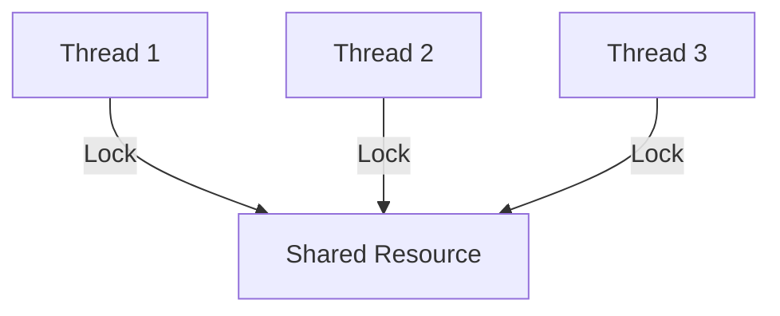
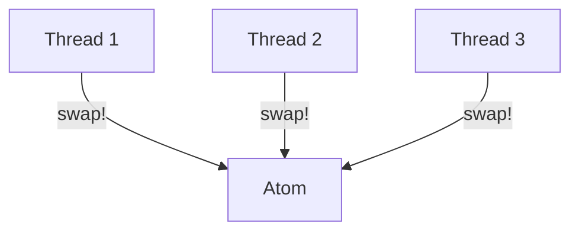

## 8.6.4 Comparison with Clojure's Approach

Concurrency is a critical aspect of modern software development, especially in a world where multi-core processors are the norm. Java developers are familiar with explicit locking and synchronization mechanisms to manage concurrency. However, these approaches can lead to complex code and subtle bugs. In contrast, Clojure offers a functional and immutable approach to concurrency that simplifies the process and reduces the risk of common concurrency issues. In this section, we will explore how Clojure's abstractions, such as atoms, refs, and agents, provide a more straightforward and safer way to handle concurrency compared to Java's traditional methods.

### Understanding Java's Concurrency Model

Java's concurrency model is built around threads, locks, and synchronized blocks. These constructs allow developers to manage access to shared resources, ensuring that only one thread can modify a resource at a time. While powerful, this model can be error-prone and difficult to manage, especially in complex applications.

#### Java's Explicit Locking and Synchronization

In Java, the `synchronized` keyword is used to lock a method or block of code, ensuring that only one thread can execute it at a time. Here's a simple example:

```java
public class Counter {
    private int count = 0;

    public synchronized void increment() {
        count++;
    }

    public synchronized int getCount() {
        return count;
    }
}
```

In this example, the `increment` and `getCount` methods are synchronized, meaning that only one thread can execute them at a time. While this ensures thread safety, it can lead to performance bottlenecks and deadlocks if not managed carefully.

#### Java's Lock Interface

Java also provides the `Lock` interface, which offers more flexibility than the `synchronized` keyword. Here's an example using `ReentrantLock`:

```java
import java.util.concurrent.locks.Lock;
import java.util.concurrent.locks.ReentrantLock;

public class Counter {
    private int count = 0;
    private final Lock lock = new ReentrantLock();

    public void increment() {
        lock.lock();
        try {
            count++;
        } finally {
            lock.unlock();
        }
    }

    public int getCount() {
        lock.lock();
        try {
            return count;
        } finally {
            lock.unlock();
        }
    }
}
```

While `ReentrantLock` provides more control, such as the ability to try locking without blocking, it also increases complexity and the potential for errors, such as forgetting to release a lock.

### Clojure's Functional and Immutable Approach

Clojure takes a different approach to concurrency, leveraging immutability and functional programming principles. By default, data structures in Clojure are immutable, meaning they cannot be changed once created. This eliminates many concurrency issues, as there is no risk of one thread modifying a data structure while another is reading it.

#### Atoms: Managing Independent State

Atoms in Clojure are used to manage independent, synchronous state changes. They provide a way to safely update a value without locks. Here's a simple example:

```clojure
(def counter (atom 0))

(defn increment []
  (swap! counter inc))

(defn get-count []
  @counter)
```

In this example, `swap!` is used to update the atom's value. The `swap!` function ensures that updates are atomic, meaning they are applied without interference from other threads.

#### Refs and Software Transactional Memory (STM)

For coordinated state changes, Clojure provides refs and software transactional memory (STM). STM allows multiple refs to be updated in a single transaction, ensuring consistency. Here's an example:

```clojure
(def account1 (ref 100))
(def account2 (ref 200))

(defn transfer [amount]
  (dosync
    (alter account1 - amount)
    (alter account2 + amount)))
```

In this example, `dosync` creates a transaction that updates both `account1` and `account2`. If any part of the transaction fails, the entire transaction is retried, ensuring consistency.

#### Agents: Asynchronous State Management

Agents in Clojure are used for managing asynchronous state changes. They allow you to send updates to be applied in the future, without blocking the current thread. Here's an example:

```clojure
(def counter (agent 0))

(defn increment []
  (send counter inc))

(defn get-count []
  @counter)
```

Agents are ideal for tasks that can be performed independently and do not require immediate feedback.

### Comparing Java and Clojure's Concurrency Models

Let's compare Java's concurrency mechanisms with Clojure's approach:

- **Immutability**: Clojure's immutable data structures eliminate many concurrency issues by default. In Java, developers must carefully manage mutable state to avoid race conditions.
- **Simplicity**: Clojure's concurrency primitives (atoms, refs, agents) provide a simpler and more intuitive model for managing state changes compared to Java's locks and synchronized blocks.
- **Safety**: Clojure's STM ensures that state changes are consistent and free from deadlocks, whereas Java's explicit locking can lead to complex and error-prone code.
- **Asynchronous Programming**: Clojure's agents provide a straightforward way to handle asynchronous tasks, while Java requires more boilerplate code to achieve the same result.

### Code Comparison: Java vs. Clojure

Let's look at a practical example to highlight the differences between Java and Clojure's concurrency models. We'll implement a simple counter that can be incremented by multiple threads.

#### Java Implementation

```java
import java.util.concurrent.atomic.AtomicInteger;

public class Counter {
    private final AtomicInteger count = new AtomicInteger(0);

    public void increment() {
        count.incrementAndGet();
    }

    public int getCount() {
        return count.get();
    }
}
```

In this Java example, we use `AtomicInteger` to manage the counter's state. While this approach is thread-safe, it requires careful management of mutable state.

#### Clojure Implementation

```clojure
(def counter (atom 0))

(defn increment []
  (swap! counter inc))

(defn get-count []
  @counter)
```

In Clojure, the atom provides a simpler and more intuitive way to manage the counter's state. The `swap!` function ensures that updates are atomic and thread-safe.

### Diagrams: Visualizing Concurrency Models

To better understand the differences between Java and Clojure's concurrency models, let's look at some diagrams.

#### Java's Concurrency Model



*Diagram 1: Java's concurrency model relies on explicit locks to manage access to shared resources.*

#### Clojure's Concurrency Model



*Diagram 2: Clojure's concurrency model uses atoms to manage state changes, eliminating the need for explicit locks.*

### Try It Yourself: Experiment with Clojure's Concurrency Primitives

Now that we've explored the differences between Java and Clojure's concurrency models, let's try some hands-on experiments. Modify the Clojure code examples to:

1. Create a new atom to manage a different piece of state, such as a list of names.
2. Use `dosync` and `alter` to implement a simple banking transaction system with multiple accounts.
3. Experiment with agents to perform asynchronous tasks, such as logging messages to a file.

### Key Takeaways

- Clojure's immutable data structures and functional programming principles provide a simpler and safer approach to concurrency compared to Java's explicit locking mechanisms.
- Atoms, refs, and agents offer intuitive abstractions for managing state changes, reducing the risk of common concurrency bugs.
- Clojure's software transactional memory ensures consistency and eliminates deadlocks, making it easier to write correct concurrent programs.
- By leveraging Clojure's concurrency primitives, developers can focus on building robust and scalable applications without the complexity of traditional locking mechanisms.

### Further Reading

For more information on Clojure's concurrency model, check out the following resources:

- [Official Clojure Documentation on Concurrency](https://clojure.org/reference/atoms)
- [ClojureDocs: Atoms, Refs, and Agents](https://clojuredocs.org/)
- [GitHub: Clojure Concurrency Examples](https://github.com/clojure-examples/concurrency)

### Exercises

1. Implement a simple chat server using Clojure's agents to manage client connections.
2. Create a multi-threaded application in Java and refactor it to use Clojure's concurrency primitives.
3. Explore the performance differences between Java's locks and Clojure's STM by implementing a benchmark test.

By understanding and applying Clojure's concurrency model, you can build more reliable and efficient applications. Embrace the power of functional programming and immutability to simplify your concurrent code and reduce the risk of bugs.

## Quiz: Test Your Knowledge of Clojure's Concurrency Model



### Which Clojure primitive is used for managing independent, synchronous state changes?

- [x] Atom
- [ ] Ref
- [ ] Agent
- [ ] Var

> **Explanation:** Atoms are used for managing independent, synchronous state changes in Clojure.

### What is the primary benefit of Clojure's immutable data structures in concurrent programming?

- [x] They eliminate race conditions.
- [ ] They improve performance.
- [ ] They simplify syntax.
- [ ] They reduce memory usage.

> **Explanation:** Immutable data structures eliminate race conditions by ensuring that data cannot be changed once created.

### How does Clojure's STM ensure consistency in state changes?

- [x] By using transactions that can be retried if they fail.
- [ ] By locking all resources during updates.
- [ ] By using asynchronous updates.
- [ ] By using a single-threaded model.

> **Explanation:** Clojure's STM uses transactions that can be retried if they fail, ensuring consistency in state changes.

### Which Clojure primitive is best suited for asynchronous state management?

- [ ] Atom
- [ ] Ref
- [x] Agent
- [ ] Var

> **Explanation:** Agents are used for asynchronous state management in Clojure.

### What is a key difference between Java's `synchronized` keyword and Clojure's `swap!` function?

- [x] `swap!` does not require explicit locks.
- [ ] `synchronized` is faster.
- [ ] `swap!` is only for asynchronous updates.
- [ ] `synchronized` is used for immutable data.

> **Explanation:** `swap!` does not require explicit locks, making it simpler and less error-prone than Java's `synchronized` keyword.

### In Clojure, what does the `dosync` block do?

- [x] It creates a transaction for coordinated state changes.
- [ ] It locks a resource for exclusive access.
- [ ] It performs asynchronous updates.
- [ ] It initializes an atom.

> **Explanation:** `dosync` creates a transaction for coordinated state changes, ensuring consistency.

### Which Java class is often used for atomic operations similar to Clojure's atoms?

- [x] AtomicInteger
- [ ] ReentrantLock
- [ ] Semaphore
- [ ] Thread

> **Explanation:** `AtomicInteger` is used for atomic operations in Java, similar to Clojure's atoms.

### What is a potential downside of Java's explicit locking mechanisms?

- [x] They can lead to deadlocks.
- [ ] They are too simple.
- [ ] They are not thread-safe.
- [ ] They are immutable.

> **Explanation:** Java's explicit locking mechanisms can lead to deadlocks if not managed carefully.

### How do Clojure's agents differ from refs?

- [x] Agents are for asynchronous updates, while refs are for synchronous transactions.
- [ ] Agents require locks, refs do not.
- [ ] Refs are faster than agents.
- [ ] Agents are immutable, refs are not.

> **Explanation:** Agents are used for asynchronous updates, while refs are used for synchronous transactions.

### True or False: Clojure's concurrency model eliminates the need for explicit locks.

- [x] True
- [ ] False

> **Explanation:** Clojure's concurrency model, with its immutable data structures and functional approach, eliminates the need for explicit locks.


