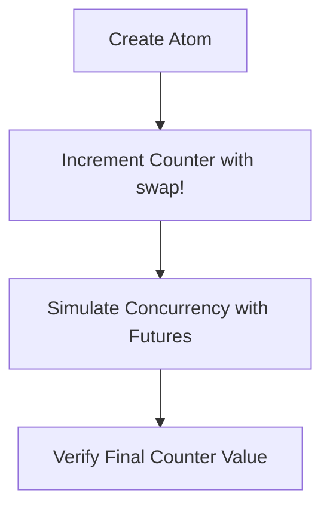

## 8.7.1 Implementing a Shared Counter with Atoms

In this section, we'll explore how to implement a thread-safe shared counter using **Clojure's atom**. Atoms provide a simple and effective way to manage shared, mutable state in a concurrent environment, without the need for explicit locks. This is particularly beneficial for Java developers transitioning to Clojure, as it offers a more straightforward approach to concurrency.

### Understanding Atoms in Clojure

Atoms in Clojure are a type of reference that provides a way to manage shared state. They are designed to be used in situations where you have a single, independent piece of state that can be updated atomically. The key features of atoms include:

- **Atomic Updates**: Changes to the state are made atomically, ensuring consistency.
- **No Locks Required**: Atoms use a compare-and-swap (CAS) mechanism, avoiding the need for explicit locks.
- **Immutability**: The state managed by an atom is immutable, which aligns with Clojure's functional programming paradigm.

#### Atoms vs. Java's Synchronization

In Java, managing shared state often involves using synchronization mechanisms such as `synchronized` blocks or `java.util.concurrent` locks. These approaches can be complex and error-prone, especially when dealing with multiple threads. In contrast, Clojure's atoms provide a simpler and more elegant solution:

- **Java Synchronization**: Requires explicit locks, which can lead to deadlocks and race conditions if not handled carefully.
- **Clojure Atoms**: Automatically handle concurrency using CAS, reducing the risk of errors.

### Implementing a Shared Counter

Let's dive into implementing a shared counter using atoms. We'll start by creating a simple counter and then demonstrate how multiple threads can safely increment it.

#### Step 1: Creating an Atom

First, we'll create an atom to hold our counter's state. In Clojure, you can create an atom using the `atom` function:

```clojure
(def counter (atom 0))
```

Here, `counter` is an atom initialized with the value `0`. This atom will hold the state of our counter.

#### Step 2: Incrementing the Counter

To increment the counter, we'll use the `swap!` function. This function takes an atom and a function, applying the function to the atom's current value and updating it atomically:

```clojure
(defn increment-counter []
  (swap! counter inc))
```

In this example, `inc` is a built-in function that increments a number by 1. The `swap!` function ensures that the increment operation is atomic, meaning it will be executed without interference from other threads.

#### Step 3: Simulating Concurrency

Now, let's simulate a concurrent environment where multiple threads increment the counter. We'll use Clojure's `future` to create asynchronous tasks:

```clojure
(defn simulate-concurrency []
  (let [tasks (repeatedly 100 #(future (increment-counter)))]
    (doseq [task tasks]
      @task)))
```

In this code, we create 100 futures, each of which increments the counter. The `repeatedly` function generates a sequence of tasks, and `doseq` ensures that each future is executed.

#### Step 4: Verifying the Result

After running the concurrent tasks, we can check the final value of the counter:

```clojure
(println "Final counter value:" @counter)
```

The expected output should be `100`, as each of the 100 futures increments the counter by 1.

### Comparing with Java

To illustrate the difference, let's look at a similar implementation in Java using `AtomicInteger`:

```java
import java.util.concurrent.atomic.AtomicInteger;

public class SharedCounter {
    private AtomicInteger counter = new AtomicInteger(0);

    public void incrementCounter() {
        counter.incrementAndGet();
    }

    public int getCounter() {
        return counter.get();
    }

    public static void main(String[] args) {
        SharedCounter sharedCounter = new SharedCounter();
        Thread[] threads = new Thread[100];

        for (int i = 0; i < 100; i++) {
            threads[i] = new Thread(sharedCounter::incrementCounter);
            threads[i].start();
        }

        for (Thread thread : threads) {
            try {
                thread.join();
            } catch (InterruptedException e) {
                e.printStackTrace();
            }
        }

        System.out.println("Final counter value: " + sharedCounter.getCounter());
    }
}
```

In this Java example, we use `AtomicInteger` to manage the counter's state. The `incrementAndGet` method provides atomic updates, similar to Clojure's `swap!`. However, the Java code requires more boilerplate, such as managing threads and handling exceptions.

### Visualizing the Process

To better understand the flow of data and operations, let's visualize the process using a diagram:



**Diagram Explanation**: This flowchart illustrates the steps involved in implementing a shared counter with atoms in Clojure. We start by creating an atom, incrementing it using `swap!`, simulating concurrency with futures, and finally verifying the counter's value.

### Try It Yourself

To deepen your understanding, try modifying the code examples:

- **Change the Number of Threads**: Increase or decrease the number of futures to see how it affects the counter's final value.
- **Add a Delay**: Introduce a delay in the `increment-counter` function to simulate longer-running tasks.
- **Use Different Functions**: Instead of `inc`, try using other functions with `swap!`, such as `dec` or custom functions.

### Key Takeaways

- **Atoms Provide Simplicity**: Clojure's atoms offer a simple way to manage shared state without explicit locks.
- **Atomic Updates**: The `swap!` function ensures atomic updates, preventing race conditions.
- **Immutability**: Atoms align with Clojure's emphasis on immutability, making code easier to reason about.
- **Comparison with Java**: Atoms reduce boilerplate compared to Java's synchronization mechanisms.

### Exercises

1. **Implement a Decrement Function**: Extend the shared counter example to include a function that decrements the counter.
2. **Concurrent Reads and Writes**: Modify the example to include concurrent read operations and ensure they don't interfere with writes.
3. **Error Handling**: Introduce error handling in the `increment-counter` function to manage potential exceptions.

### Further Reading

For more information on atoms and concurrency in Clojure, consider exploring the following resources:

- [Official Clojure Documentation on Atoms](https://clojure.org/reference/atoms)
- [ClojureDocs: Atoms](https://clojuredocs.org/clojure.core/atom)
- [Concurrency in Clojure: A Practical Guide](https://practical.li/clojure/concurrency/)

By understanding and applying these concepts, you'll be well-equipped to manage state effectively in your Clojure applications, leveraging the power of functional programming and immutability.

## Quiz: Mastering Atoms and Concurrency in Clojure



### What is the primary advantage of using atoms in Clojure for managing shared state?

- [x] They provide atomic updates without explicit locks.
- [ ] They allow mutable state.
- [ ] They require less memory than Java's synchronization.
- [ ] They are faster than all Java concurrency mechanisms.

> **Explanation:** Atoms provide atomic updates using a compare-and-swap mechanism, eliminating the need for explicit locks.

### How does the `swap!` function work in Clojure?

- [x] It applies a function to the current value of an atom and updates it atomically.
- [ ] It locks the atom before updating its value.
- [ ] It directly assigns a new value to the atom.
- [ ] It only works with numeric values.

> **Explanation:** `swap!` applies a function to the current value of an atom and updates it atomically, ensuring thread safety.

### In the context of Clojure, what is a future?

- [x] An asynchronous task that can be executed concurrently.
- [ ] A reference to a past state of an atom.
- [ ] A mechanism for locking shared state.
- [ ] A type of immutable data structure.

> **Explanation:** A future in Clojure is an asynchronous task that runs concurrently, allowing for parallel execution.

### What is the expected final value of the counter after running 100 futures that each increment it by 1?

- [x] 100
- [ ] 0
- [ ] 50
- [ ] 200

> **Explanation:** Each future increments the counter by 1, so the final value should be 100.

### How does Clojure's atom compare to Java's `AtomicInteger`?

- [x] Both provide atomic updates, but atoms are more idiomatic in Clojure.
- [ ] Atoms are faster than `AtomicInteger`.
- [ ] `AtomicInteger` supports more data types than atoms.
- [ ] Atoms require explicit locks, unlike `AtomicInteger`.

> **Explanation:** Both atoms and `AtomicInteger` provide atomic updates, but atoms are more idiomatic and align with Clojure's functional paradigm.

### What is the role of immutability in Clojure's concurrency model?

- [x] It simplifies reasoning about state changes and prevents race conditions.
- [ ] It allows for mutable state in a controlled manner.
- [ ] It requires explicit locks for state management.
- [ ] It is not relevant to concurrency.

> **Explanation:** Immutability simplifies reasoning about state changes and prevents race conditions, making concurrency easier to manage.

### Which function is used to create an atom in Clojure?

- [x] `atom`
- [ ] `create-atom`
- [ ] `new-atom`
- [ ] `init-atom`

> **Explanation:** The `atom` function is used to create an atom in Clojure.

### What is the purpose of the `@` symbol when used with an atom?

- [x] It dereferences the atom to get its current value.
- [ ] It locks the atom for updates.
- [ ] It initializes the atom with a value.
- [ ] It resets the atom to its initial state.

> **Explanation:** The `@` symbol is used to dereference an atom, retrieving its current value.

### How can you introduce a delay in a Clojure function to simulate longer-running tasks?

- [x] Use the `Thread/sleep` function.
- [ ] Use the `delay` function.
- [ ] Use the `pause` function.
- [ ] Use the `wait` function.

> **Explanation:** The `Thread/sleep` function can be used to introduce a delay in a Clojure function.

### True or False: Atoms in Clojure require explicit locks to ensure thread safety.

- [ ] True
- [x] False

> **Explanation:** Atoms in Clojure do not require explicit locks; they use a compare-and-swap mechanism for thread safety.


