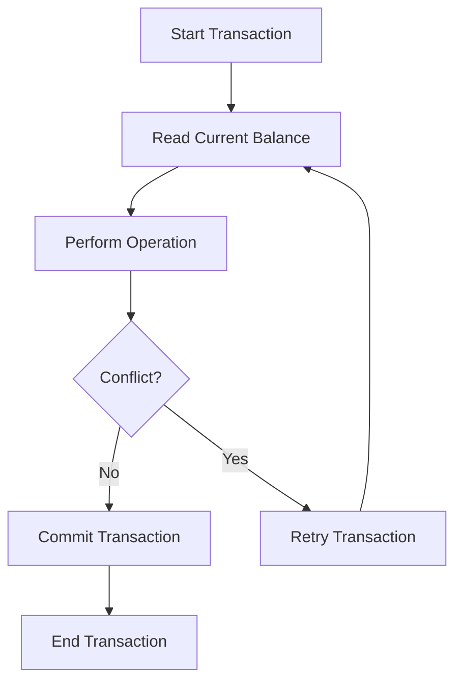

## 8.7.2 Managing State in a Multithreaded Application

In this section, we will explore how to manage state in a multithreaded application using Clojure's powerful concurrency primitives. As experienced Java developers, you are likely familiar with the challenges of managing shared state in a concurrent environment. Clojure offers a unique approach to concurrency through its immutable data structures and Software Transactional Memory (STM) system, which can simplify the process and reduce common pitfalls such as race conditions and deadlocks.

### Understanding the Challenges of Multithreaded State Management

Managing state in a multithreaded application is inherently complex due to the need to coordinate access to shared resources. In Java, this often involves using synchronized blocks, locks, or concurrent collections to ensure thread safety. However, these mechanisms can lead to issues like deadlocks, race conditions, and complex code that is difficult to reason about.

Clojure addresses these challenges by embracing immutability and providing a set of concurrency primitives that allow for safe and efficient state management. Let's delve into how Clojure's approach can simplify multithreaded state management.

### Clojure's Concurrency Primitives

Clojure provides several concurrency primitives, including atoms, refs, agents, and vars, each suited for different use cases. In this section, we will focus on refs and Software Transactional Memory (STM), which are particularly useful for managing coordinated state changes across multiple threads.

#### Refs and Software Transactional Memory (STM)

Refs in Clojure are used to manage shared, synchronous, and coordinated state. They are part of Clojure's STM system, which allows for atomic updates to multiple refs within a transaction. This ensures that all changes are consistent and isolated, much like transactions in a database.

**Key Features of STM:**

- **Atomicity**: All changes within a transaction are applied atomically.
- **Consistency**: Transactions ensure that the system remains in a consistent state.
- **Isolation**: Transactions are isolated from each other, preventing interference.
- **Durability**: Changes are durable once a transaction is committed.

Let's see how we can use refs and STM to manage state in a multithreaded application.

### Example: Managing a Bank Account System

Consider a simple bank account system where multiple clients can deposit and withdraw money concurrently. We need to ensure that the account balance remains consistent despite concurrent updates.

#### Defining the State with Refs

First, we define the state of our bank account using a ref:

```clojure
(def account-balance (ref 1000)) ; Initial balance is 1000
```

Here, `account-balance` is a ref that holds the current balance of the account.

#### Performing Transactions with STM

To update the account balance safely, we use the `dosync` macro to create a transaction. Within this transaction, we can use the `alter` function to update the ref:

```clojure
(defn deposit [amount]
  (dosync
    (alter account-balance + amount)))

(defn withdraw [amount]
  (dosync
    (alter account-balance - amount)))
```

- **`dosync`**: Starts a transaction.
- **`alter`**: Updates the value of a ref within a transaction.

#### Handling Concurrent Requests

Now, let's simulate concurrent requests to deposit and withdraw money from the account. We'll use Clojure's `future` to run these operations in parallel:

```clojure
(defn simulate-concurrent-transactions []
  (let [futures (doall (map #(future (deposit 100)) (range 10)))]
    (doseq [f futures] @f)
    (println "Final balance after deposits:" @account-balance)))

(simulate-concurrent-transactions)
```

In this example, we create 10 futures, each performing a deposit of 100. The `doall` function ensures that all futures are realized, and `@f` waits for each future to complete.

### Visualizing the STM Process

To better understand how STM works, let's visualize the process using a flowchart:



**Diagram Description**: This flowchart illustrates the STM process in Clojure. A transaction starts by reading the current balance, performs the operation, checks for conflicts, and either commits or retries the transaction.

### Comparing with Java's Approach

In Java, managing state in a multithreaded environment typically involves using synchronized blocks or locks. Here's a simple example of how you might handle a similar bank account system in Java:

```java
public class BankAccount {
    private int balance = 1000;

    public synchronized void deposit(int amount) {
        balance += amount;
    }

    public synchronized void withdraw(int amount) {
        balance -= amount;
    }

    public synchronized int getBalance() {
        return balance;
    }
}
```

While this approach works, it can lead to issues such as deadlocks if not managed carefully. Clojure's STM provides a more elegant solution by handling these concerns automatically.

### Advantages of Using STM in Clojure

- **Simplicity**: STM abstracts away the complexity of managing locks and synchronization.
- **Safety**: Transactions ensure that state changes are consistent and isolated.
- **Scalability**: STM can handle high levels of concurrency without performance degradation.

### Try It Yourself

To deepen your understanding, try modifying the Clojure example to include withdrawals and observe how the balance changes. Experiment with different transaction scenarios to see how STM handles conflicts.

### Further Reading

For more information on Clojure's STM and concurrency primitives, check out the following resources:

- [Official Clojure Documentation on Refs](https://clojure.org/reference/refs)
- [ClojureDocs: Refs and STM](https://clojuredocs.org/clojure.core/ref)
- [GitHub: Clojure Concurrency Examples](https://github.com/clojure-examples/concurrency)

### Exercises

1. **Implement a Transfer Function**: Create a function to transfer money between two accounts using refs and STM. Ensure that the transfer is atomic and consistent.
2. **Simulate High Concurrency**: Increase the number of concurrent transactions and observe how STM handles the load.
3. **Explore Agents**: Modify the example to use agents instead of refs and compare the performance and behavior.

### Key Takeaways

- Clojure's STM provides a powerful and elegant way to manage state in a multithreaded application.
- Refs and transactions ensure that state changes are atomic, consistent, and isolated.
- Compared to Java's traditional concurrency mechanisms, STM simplifies code and reduces the risk of common concurrency issues.

Now that we've explored how to manage state in a multithreaded application using Clojure's STM, you're well-equipped to handle concurrency in your applications effectively. Embrace these concepts to build robust and scalable systems.

---

## Quiz: Mastering State Management in Multithreaded Clojure Applications



### What is the primary benefit of using Clojure's STM for managing state in a multithreaded application?

- [x] It ensures atomic, consistent, and isolated state changes.
- [ ] It allows for mutable state changes.
- [ ] It simplifies the use of synchronized blocks.
- [ ] It eliminates the need for any concurrency control.

> **Explanation:** Clojure's STM ensures that state changes are atomic, consistent, and isolated, providing a safe and efficient way to manage state in a multithreaded environment.

### Which Clojure construct is used to start a transaction for updating refs?

- [x] `dosync`
- [ ] `alter`
- [ ] `future`
- [ ] `atom`

> **Explanation:** The `dosync` macro is used to start a transaction in Clojure's STM, allowing for safe updates to refs.

### How does Clojure's STM handle conflicts during a transaction?

- [x] It retries the transaction.
- [ ] It throws an exception.
- [ ] It ignores the conflict.
- [ ] It logs the conflict and continues.

> **Explanation:** Clojure's STM automatically retries transactions in case of conflicts, ensuring consistency and isolation.

### What is the role of the `alter` function in Clojure's STM?

- [x] It updates the value of a ref within a transaction.
- [ ] It starts a new transaction.
- [ ] It creates a new ref.
- [ ] It reads the current value of a ref.

> **Explanation:** The `alter` function is used to update the value of a ref within a transaction in Clojure's STM.

### In the provided Java example, what is the purpose of the `synchronized` keyword?

- [x] To ensure thread safety by locking the method.
- [ ] To start a transaction.
- [ ] To create a new thread.
- [ ] To update the balance atomically.

> **Explanation:** The `synchronized` keyword in Java is used to ensure thread safety by locking the method, preventing concurrent access.

### What is a key advantage of using Clojure's STM over Java's synchronized blocks?

- [x] STM abstracts away the complexity of managing locks.
- [ ] STM allows for mutable state changes.
- [ ] STM eliminates the need for any concurrency control.
- [ ] STM is only suitable for single-threaded applications.

> **Explanation:** Clojure's STM abstracts away the complexity of managing locks and synchronization, providing a simpler and safer concurrency model.

### Which of the following is NOT a feature of Clojure's STM?

- [ ] Atomicity
- [ ] Consistency
- [ ] Isolation
- [x] Mutable state

> **Explanation:** Clojure's STM is based on immutable state, ensuring atomicity, consistency, and isolation in transactions.

### What is the purpose of the `future` function in Clojure?

- [x] To run operations asynchronously in a separate thread.
- [ ] To update the value of a ref.
- [ ] To start a transaction.
- [ ] To create a new ref.

> **Explanation:** The `future` function in Clojure is used to run operations asynchronously in a separate thread, allowing for concurrent execution.

### How does Clojure's STM ensure durability of state changes?

- [x] By committing transactions once they are complete.
- [ ] By using synchronized blocks.
- [ ] By allowing mutable state changes.
- [ ] By ignoring conflicts.

> **Explanation:** Clojure's STM ensures durability by committing transactions once they are complete, making state changes permanent.

### True or False: Clojure's STM can handle high levels of concurrency without performance degradation.

- [x] True
- [ ] False

> **Explanation:** Clojure's STM is designed to handle high levels of concurrency efficiently, without performance degradation.


