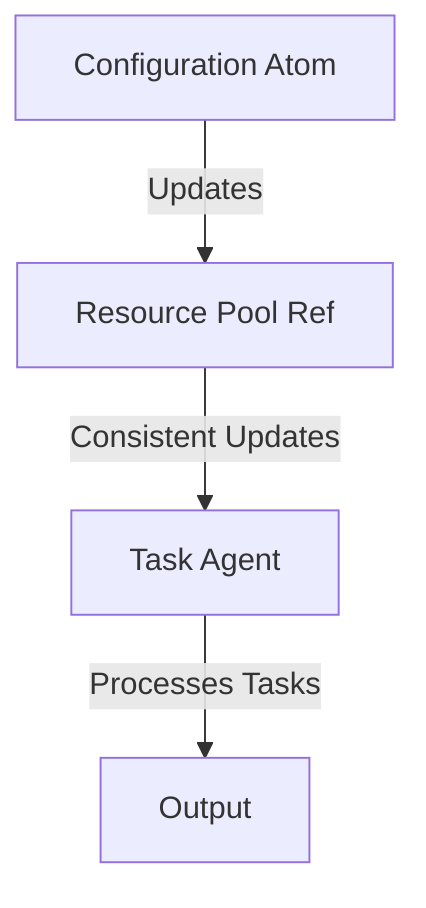

## 8.7.4 Combining Concurrency Primitives

Concurrency is a crucial aspect of modern software development, especially as applications become more complex and require efficient resource management. In Clojure, concurrency is handled elegantly through a set of primitives: **atoms**, **refs**, and **agents**. Each of these primitives serves a specific purpose and can be combined to create powerful concurrency models. In this section, we'll explore how to effectively use these primitives together to manage configurations, shared resources, and asynchronous tasks.

### Understanding Clojure's Concurrency Primitives

Before diving into combining these primitives, let's briefly recap their individual roles:

- **Atoms**: Provide a way to manage shared, synchronous, and independent state. They are ideal for managing configurations or settings that can change over time.
- **Refs**: Utilize Software Transactional Memory (STM) to manage coordinated, synchronous updates to shared state. They are suitable for managing shared resources that require consistency.
- **Agents**: Handle asynchronous updates to state, allowing tasks to be processed in the background without blocking the main thread.

### Combining Atoms, Refs, and Agents: A Practical Example

Let's consider a scenario where we need to manage a configuration system, a shared resource pool, and a set of asynchronous tasks in a Clojure application. We'll use atoms for configuration, refs for the resource pool, and agents for task processing.

#### Step 1: Managing Configurations with Atoms

Atoms are perfect for managing configurations because they allow for immediate, synchronous updates. Here's how we can set up a configuration atom:

```clojure
;; Define an atom to hold application configurations
(def config (atom {:max-connections 10
                   :timeout 3000
                   :log-level :info}))

;; Function to update configuration
(defn update-config [key value]
  (swap! config assoc key value))

;; Example usage
(update-config :log-level :debug)
(println @config) ; => {:max-connections 10, :timeout 3000, :log-level :debug}
```

**Explanation**: We define an atom `config` to store configuration settings. The `update-config` function uses `swap!` to update the atom's state. This operation is atomic and thread-safe.

#### Step 2: Managing Shared Resources with Refs

Refs are ideal for managing shared resources that require consistency across multiple updates. Let's create a resource pool using refs:

```clojure
;; Define a ref to manage a pool of resources
(def resource-pool (ref {:available 5
                         :in-use 0}))

;; Function to allocate a resource
(defn allocate-resource []
  (dosync
    (when (> (:available @resource-pool) 0)
      (alter resource-pool update :available dec)
      (alter resource-pool update :in-use inc))))

;; Function to release a resource
(defn release-resource []
  (dosync
    (alter resource-pool update :available inc)
    (alter resource-pool update :in-use dec)))

;; Example usage
(allocate-resource)
(println @resource-pool) ; => {:available 4, :in-use 1}
(release-resource)
(println @resource-pool) ; => {:available 5, :in-use 0}
```

**Explanation**: We define a ref `resource-pool` to track available and in-use resources. The `allocate-resource` and `release-resource` functions use `dosync` to ensure that updates are transactional and consistent.

#### Step 3: Handling Asynchronous Tasks with Agents

Agents are used for managing asynchronous tasks. Let's set up an agent to process tasks in the background:

```clojure
;; Define an agent to handle tasks
(def task-agent (agent []))

;; Function to add a task
(defn add-task [task]
  (send task-agent conj task))

;; Function to process tasks
(defn process-tasks [tasks]
  (doseq [task tasks]
    (println "Processing task:" task))
  [])

;; Set the agent to process tasks asynchronously
(send-off task-agent process-tasks)

;; Example usage
(add-task "Task 1")
(add-task "Task 2")
```

**Explanation**: We define an agent `task-agent` to hold a list of tasks. The `add-task` function uses `send` to add tasks to the agent, and `process-tasks` processes them asynchronously.

### Integrating Atoms, Refs, and Agents

Now that we have individual components, let's integrate them into a cohesive system. We'll simulate a scenario where configuration changes affect resource allocation and task processing.

```clojure
;; Function to adjust resources based on configuration
(defn adjust-resources []
  (let [max-connections (:max-connections @config)]
    (dosync
      (alter resource-pool assoc :available max-connections)
      (alter resource-pool assoc :in-use 0))))

;; Function to handle configuration changes
(defn handle-config-change [key value]
  (update-config key value)
  (when (= key :max-connections)
    (adjust-resources)))

;; Example usage
(handle-config-change :max-connections 8)
(println @resource-pool) ; => {:available 8, :in-use 0}
```

**Explanation**: The `adjust-resources` function updates the resource pool based on the current configuration. The `handle-config-change` function updates the configuration and adjusts resources if necessary.

### Comparing with Java Concurrency

In Java, managing concurrency often involves using synchronized blocks, locks, or concurrent collections. Here's a simple comparison:

**Java Example**:

```java
import java.util.concurrent.atomic.AtomicInteger;

public class ResourcePool {
    private final AtomicInteger available = new AtomicInteger(5);
    private final AtomicInteger inUse = new AtomicInteger(0);

    public synchronized void allocateResource() {
        if (available.get() > 0) {
            available.decrementAndGet();
            inUse.incrementAndGet();
        }
    }

    public synchronized void releaseResource() {
        available.incrementAndGet();
        inUse.decrementAndGet();
    }
}
```

**Comparison**: In Java, we use `AtomicInteger` for atomic operations and `synchronized` methods to ensure thread safety. Clojure's refs and STM provide a more declarative and compositional approach to managing shared state.

### Try It Yourself

Experiment with the provided Clojure code by:

1. Modifying the configuration atom to add new settings.
2. Simulating concurrent resource allocation and release.
3. Adding more complex task processing logic to the agent.

### Diagrams and Visualizations

To better understand the flow of data and control in our concurrency model, let's visualize the interactions between atoms, refs, and agents.



**Diagram Explanation**: This flowchart illustrates how configuration changes (managed by atoms) affect the resource pool (managed by refs), which in turn influences task processing (managed by agents).

### Key Takeaways

- **Atoms** are ideal for managing independent, synchronous state changes.
- **Refs** provide a robust mechanism for coordinating consistent updates to shared state.
- **Agents** enable asynchronous task processing without blocking the main thread.
- Combining these primitives allows for flexible and efficient concurrency models in Clojure.
- Clojure's concurrency model offers a declarative and compositional alternative to Java's imperative concurrency mechanisms.

### Further Reading

- [Official Clojure Documentation on Concurrency](https://clojure.org/reference/atoms)
- [ClojureDocs: Atoms, Refs, and Agents](https://clojuredocs.org/)
- [Java Concurrency in Practice](https://jcip.net/)

### Exercises

1. **Modify the Configuration**: Extend the configuration atom to include new settings, such as logging formats or retry limits.
2. **Simulate Concurrent Access**: Create a scenario where multiple threads attempt to allocate and release resources simultaneously. Observe how refs handle consistency.
3. **Enhance Task Processing**: Implement a more complex task processing logic in the agent, such as handling task priorities or dependencies.

By mastering the combination of atoms, refs, and agents, you can build robust and efficient concurrent applications in Clojure. Now that we've explored these concepts, let's apply them to manage state effectively in your applications.

## Quiz: Mastering Concurrency in Clojure



### What is the primary use of atoms in Clojure?

- [x] Managing independent, synchronous state changes
- [ ] Handling asynchronous tasks
- [ ] Coordinating consistent updates to shared state
- [ ] Managing side effects

> **Explanation:** Atoms are used for managing independent, synchronous state changes in Clojure.

### Which concurrency primitive in Clojure is best suited for asynchronous task processing?

- [ ] Atoms
- [ ] Refs
- [x] Agents
- [ ] Vars

> **Explanation:** Agents are designed for asynchronous task processing in Clojure.

### How do refs ensure consistency in Clojure?

- [x] By using Software Transactional Memory (STM)
- [ ] By locking resources
- [ ] By using atomic operations
- [ ] By blocking threads

> **Explanation:** Refs use Software Transactional Memory (STM) to ensure consistency across updates.

### In the provided example, what is the role of the `adjust-resources` function?

- [x] To update the resource pool based on the current configuration
- [ ] To process tasks asynchronously
- [ ] To manage configuration changes
- [ ] To handle errors

> **Explanation:** The `adjust-resources` function updates the resource pool based on the current configuration.

### What is a key advantage of using Clojure's concurrency primitives over Java's synchronized methods?

- [x] Declarative and compositional approach
- [ ] Faster execution
- [ ] Simpler syntax
- [ ] Better error handling

> **Explanation:** Clojure's concurrency primitives offer a declarative and compositional approach compared to Java's imperative synchronized methods.

### Which function is used to update an atom's state in Clojure?

- [ ] alter
- [ ] send
- [x] swap!
- [ ] dosync

> **Explanation:** The `swap!` function is used to update an atom's state in Clojure.

### What does the `dosync` block do in Clojure?

- [x] Ensures that updates to refs are transactional and consistent
- [ ] Executes tasks asynchronously
- [ ] Updates an atom's state
- [ ] Handles errors

> **Explanation:** The `dosync` block ensures that updates to refs are transactional and consistent.

### How can you modify the configuration atom to add a new setting?

- [x] Use the `swap!` function with `assoc`
- [ ] Use the `alter` function
- [ ] Use the `send` function
- [ ] Use the `dosync` block

> **Explanation:** You can use the `swap!` function with `assoc` to add a new setting to the configuration atom.

### What is the purpose of the `send-off` function in the task agent example?

- [x] To process tasks asynchronously
- [ ] To update the agent's state synchronously
- [ ] To handle errors
- [ ] To manage configuration changes

> **Explanation:** The `send-off` function is used to process tasks asynchronously in the task agent example.

### True or False: In Clojure, agents block the main thread while processing tasks.

- [ ] True
- [x] False

> **Explanation:** Agents do not block the main thread while processing tasks; they handle tasks asynchronously.


