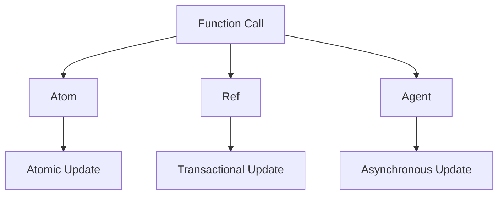

## 8.8.1 Side Effects in Functional Programming

In functional programming, **side effects** are operations that affect the state outside their local environment or interact with the outside world. This includes modifying a global variable, writing to a file, or making a network request. While side effects are sometimes necessary, they can lead to unpredictable behavior, especially in concurrent programs. In this section, we will explore the nature of side effects, their implications in functional programming, and how to manage them effectively in Clojure.

### Understanding Side Effects

A **pure function** is a function where the output value is determined only by its input values, without observable side effects. In contrast, a function with side effects might alter some state or interact with the outside world. Let's consider a simple example in Java and Clojure to illustrate this concept.

#### Java Example

```java
public class SideEffectExample {
    private int counter = 0;

    public int incrementCounter() {
        return ++counter; // Side effect: modifies the state of 'counter'
    }

    public static void main(String[] args) {
        SideEffectExample example = new SideEffectExample();
        System.out.println(example.incrementCounter()); // Output: 1
        System.out.println(example.incrementCounter()); // Output: 2
    }
}
```

In this Java example, the `incrementCounter` method has a side effect: it modifies the `counter` variable's state.

#### Clojure Example

```clojure
(def counter (atom 0))

(defn increment-counter []
  (swap! counter inc)) ; Side effect: modifies the state of 'counter'

(println (increment-counter)) ; Output: 1
(println (increment-counter)) ; Output: 2
```

In Clojure, we use an `atom` to manage state changes. The `swap!` function applies a function to the current state of the atom, producing a new state. This is a controlled side effect.

### Implications of Side Effects in Concurrent Programs

Side effects can lead to issues in concurrent programs, such as race conditions, where the program's behavior depends on the sequence or timing of uncontrollable events. Let's explore why managing side effects is crucial in concurrent programming.

#### Race Conditions

A **race condition** occurs when two or more threads can access shared data and try to change it simultaneously. If the access to the shared data is not synchronized, it can lead to inconsistent or incorrect results.

#### Example in Java

```java
public class RaceConditionExample {
    private int counter = 0;

    public void increment() {
        counter++; // Potential race condition
    }

    public static void main(String[] args) {
        RaceConditionExample example = new RaceConditionExample();
        for (int i = 0; i < 1000; i++) {
            new Thread(example::increment).start();
        }
        System.out.println(example.counter); // Output may vary
    }
}
```

In this Java example, multiple threads increment the `counter` variable, leading to a race condition.

#### Example in Clojure

```clojure
(def counter (atom 0))

(defn increment []
  (swap! counter inc)) ; No race condition due to atomic updates

(dotimes [_ 1000]
  (future (increment)))

(Thread/sleep 1000) ; Wait for all futures to complete
(println @counter) ; Output: 1000
```

In Clojure, using `atom` ensures that updates to `counter` are atomic, preventing race conditions.

### Managing Side Effects in Clojure

Clojure provides several constructs to manage side effects and state changes safely and predictably. Let's explore some of these constructs and how they help in managing side effects.

#### Atoms

**Atoms** provide a way to manage shared, synchronous, independent state. They are ideal for managing state that is updated independently and infrequently.

```clojure
(def counter (atom 0))

(defn increment-counter []
  (swap! counter inc)) ; Atomically increments the counter

(println (increment-counter)) ; Output: 1
```

Atoms ensure that state changes are atomic and consistent, making them suitable for managing side effects in concurrent programs.

#### Refs and Software Transactional Memory (STM)

**Refs** and **Software Transactional Memory (STM)** are used for coordinated, synchronous updates to shared state. They allow multiple changes to be made atomically, ensuring consistency.

```clojure
(def account1 (ref 100))
(def account2 (ref 200))

(defn transfer [from to amount]
  (dosync
    (alter from - amount)
    (alter to + amount)))

(transfer account1 account2 50)
(println @account1) ; Output: 50
(println @account2) ; Output: 250
```

In this example, `dosync` ensures that the transfer operation is atomic, preventing inconsistencies.

#### Agents

**Agents** are used for managing asynchronous state changes. They are ideal for tasks that can be performed independently and do not require immediate feedback.

```clojure
(def agent-counter (agent 0))

(defn increment-agent []
  (send agent-counter inc)) ; Asynchronously increments the counter

(increment-agent)
(Thread/sleep 100) ; Wait for the agent to process
(println @agent-counter) ; Output: 1
```

Agents provide a way to manage side effects asynchronously, allowing for non-blocking updates.

### Best Practices for Managing Side Effects

Managing side effects effectively is crucial for writing robust and maintainable functional programs. Here are some best practices to consider:

- **Isolate Side Effects**: Keep side effects at the boundaries of your system, such as I/O operations, and ensure that core logic remains pure.
- **Use Immutability**: Leverage immutable data structures to prevent unintended state changes.
- **Leverage Clojure's Concurrency Primitives**: Use atoms, refs, and agents to manage state changes safely and predictably.
- **Test Thoroughly**: Write tests to ensure that side effects behave as expected and do not introduce bugs.

### Try It Yourself

Experiment with the following code examples to deepen your understanding of managing side effects in Clojure:

1. Modify the `increment-counter` function to decrement the counter instead.
2. Create a new function that transfers money between two accounts using refs and STM, and test it with different amounts.
3. Implement a simple logging system using agents to asynchronously log messages to a file.

### Diagrams and Visualizations

Below is a diagram illustrating the flow of data through Clojure's concurrency primitives:



**Diagram Description**: This diagram shows how function calls interact with Clojure's concurrency primitives (atoms, refs, and agents) to manage state changes.

### Further Reading

For more information on managing side effects and concurrency in Clojure, consider exploring the following resources:

- [Official Clojure Documentation](https://clojure.org/reference/atoms)
- [ClojureDocs](https://clojuredocs.org/)
- [Clojure for the Brave and True](https://www.braveclojure.com/)

### Exercises and Practice Problems

1. **Exercise 1**: Implement a simple counter using atoms and test it with concurrent updates.
2. **Exercise 2**: Create a bank account system using refs and STM, ensuring that all transactions are atomic.
3. **Exercise 3**: Develop a task queue using agents to process tasks asynchronously.

### Key Takeaways

- Side effects are operations that affect the state outside their local environment or interact with the outside world.
- Managing side effects is crucial in concurrent programs to avoid race conditions and ensure consistency.
- Clojure provides constructs like atoms, refs, and agents to manage side effects safely and predictably.
- Best practices include isolating side effects, using immutability, leveraging concurrency primitives, and thorough testing.

Now that we've explored how to manage side effects in functional programming, let's apply these concepts to build robust and maintainable Clojure applications.

## Quiz: Understanding Side Effects in Functional Programming



### What is a side effect in functional programming?

- [x] An operation that affects the state outside its local environment
- [ ] A function that returns a value without modifying any state
- [ ] A function that only reads from a global variable
- [ ] An operation that only interacts with local variables

> **Explanation:** A side effect is an operation that affects the state outside its local environment or interacts with the outside world, such as modifying a global variable or writing to a file.

### Why are side effects problematic in concurrent programs?

- [x] They can lead to race conditions
- [ ] They always improve performance
- [ ] They make code easier to read
- [ ] They ensure data consistency

> **Explanation:** Side effects can lead to race conditions in concurrent programs, where the program's behavior depends on the sequence or timing of uncontrollable events.

### Which Clojure construct is used for managing asynchronous state changes?

- [ ] Atom
- [ ] Ref
- [x] Agent
- [ ] Var

> **Explanation:** Agents are used for managing asynchronous state changes in Clojure, allowing for non-blocking updates.

### What is the purpose of `dosync` in Clojure?

- [ ] To perform asynchronous updates
- [x] To ensure atomic transactions
- [ ] To create immutable data structures
- [ ] To manage side effects

> **Explanation:** `dosync` is used in Clojure to ensure that multiple changes to refs are made atomically, preventing inconsistencies.

### How can side effects be isolated in a functional program?

- [x] By keeping them at the boundaries of the system
- [ ] By using global variables
- [ ] By avoiding immutability
- [ ] By using loops

> **Explanation:** Side effects should be isolated at the boundaries of the system, such as I/O operations, to ensure that core logic remains pure.

### Which Clojure construct provides atomic updates to shared state?

- [x] Atom
- [ ] Ref
- [ ] Agent
- [ ] Var

> **Explanation:** Atoms provide atomic updates to shared state in Clojure, ensuring consistency and preventing race conditions.

### What is a race condition?

- [x] A situation where multiple threads access shared data simultaneously
- [ ] A function that returns different results based on input
- [ ] A loop that runs indefinitely
- [ ] A variable that cannot be modified

> **Explanation:** A race condition occurs when multiple threads access shared data simultaneously, leading to inconsistent or incorrect results.

### How does Clojure ensure atomic updates with atoms?

- [ ] By using locks
- [x] By using atomic operations
- [ ] By using global variables
- [ ] By using loops

> **Explanation:** Clojure uses atomic operations with atoms to ensure that updates to shared state are consistent and free from race conditions.

### What is the benefit of using immutable data structures?

- [x] They prevent unintended state changes
- [ ] They always improve performance
- [ ] They allow for global variables
- [ ] They make code harder to read

> **Explanation:** Immutable data structures prevent unintended state changes, making it easier to reason about code and ensuring consistency.

### True or False: Side effects should be avoided entirely in functional programming.

- [ ] True
- [x] False

> **Explanation:** While side effects should be minimized and managed carefully, they are sometimes necessary, especially for I/O operations and interacting with the outside world.


