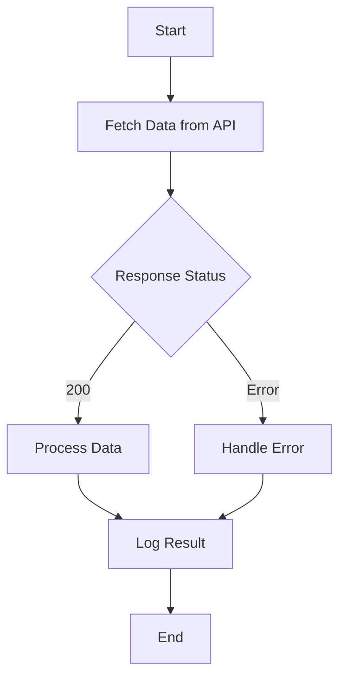

## 8.8.2 Isolating Side Effects

In the realm of functional programming, isolating side effects is a crucial practice that enhances code reliability, testability, and concurrency. As experienced Java developers transitioning to Clojure, understanding how to manage side effects effectively will allow you to leverage Clojure's strengths in building robust, concurrent applications. In this section, we will explore strategies for isolating side effects in Clojure, drawing parallels with Java where applicable, and providing practical examples to solidify your understanding.

### Understanding Side Effects

**Side effects** occur when a function interacts with the outside world or modifies some state outside its local environment. Common examples include:

- Modifying a global variable
- Writing to a file or database
- Sending data over a network
- Printing to the console

In Java, side effects are often intertwined with business logic, making it challenging to reason about code behavior, especially in concurrent environments. Clojure, with its emphasis on immutability and pure functions, encourages a different approach.

### Why Isolate Side Effects?

Isolating side effects offers several benefits:

1. **Improved Testability**: Pure functions, which are free of side effects, are easier to test as their output depends solely on their input.
2. **Enhanced Concurrency**: By confining side effects, you reduce the risk of race conditions and other concurrency issues.
3. **Better Code Maintainability**: Code becomes more modular and easier to reason about when side effects are isolated.

### Strategies for Isolating Side Effects

Let's delve into specific strategies for isolating side effects in Clojure, using examples to illustrate each concept.

#### 1. Confining Side Effects to Specific Parts of the Code

One effective strategy is to confine side effects to specific parts of your codebase, often at the boundaries of your application. This approach allows the core logic to remain pure and functional.

**Example:**

```clojure
(defn fetch-data-from-api []
  ;; Side effect: HTTP request
  (println "Fetching data from API...")
  ;; Simulated API response
  {:status 200 :body "Data"})

(defn process-data [data]
  ;; Pure function: processes data without side effects
  (str "Processed " data))

(defn main []
  (let [response (fetch-data-from-api)]
    (if (= 200 (:status response))
      (process-data (:body response))
      "Error fetching data")))

;; Execute the main function
(main)
```

In this example, `fetch-data-from-api` contains the side effect of making an HTTP request, while `process-data` is a pure function. By structuring your code this way, you can easily test `process-data` independently.

#### 2. Using Dedicated Threads or Agents

Clojure provides concurrency primitives like **agents** to handle side effects in a controlled manner. Agents allow you to manage state changes asynchronously, ensuring that side effects do not interfere with the main logic.

**Example with Agents:**

```clojure
(def log-agent (agent []))

(defn log-message [message]
  ;; Side effect: logging
  (send log-agent conj message))

(defn process-data [data]
  ;; Pure function
  (str "Processed " data))

(defn main []
  (let [data "Sample Data"]
    (log-message "Starting data processing")
    (let [result (process-data data)]
      (log-message (str "Result: " result))
      result)))

;; Execute the main function
(main)

;; Wait for all agent actions to complete
(await log-agent)

;; Print the log
(println @log-agent)
```

Here, `log-message` uses an agent to handle logging asynchronously. This approach isolates the side effect of logging from the main data processing logic.

#### 3. Leveraging Atoms for State Management

While atoms are primarily used for managing mutable state, they can also help isolate side effects by encapsulating state changes within specific functions.

**Example with Atoms:**

```clojure
(def counter (atom 0))

(defn increment-counter []
  ;; Side effect: modifying state
  (swap! counter inc))

(defn get-counter-value []
  ;; Pure function
  @counter)

(defn main []
  (increment-counter)
  (increment-counter)
  (println "Counter value:" (get-counter-value)))

;; Execute the main function
(main)
```

In this example, `increment-counter` encapsulates the side effect of modifying the counter state, while `get-counter-value` remains a pure function.

### Comparing with Java

In Java, handling side effects often involves using synchronized blocks or concurrent collections to manage shared state. While these approaches work, they can lead to complex and error-prone code. Clojure's concurrency primitives, such as agents and atoms, provide a more elegant solution by abstracting away the complexities of thread management.

**Java Example:**

```java
import java.util.concurrent.atomic.AtomicInteger;

public class Counter {
    private AtomicInteger counter = new AtomicInteger(0);

    public void increment() {
        // Side effect: modifying state
        counter.incrementAndGet();
    }

    public int getValue() {
        // Pure function
        return counter.get();
    }

    public static void main(String[] args) {
        Counter counter = new Counter();
        counter.increment();
        counter.increment();
        System.out.println("Counter value: " + counter.getValue());
    }
}
```

In this Java example, we use `AtomicInteger` to manage state changes. While effective, this approach requires careful handling of concurrency, which Clojure simplifies with its functional paradigm.

### Try It Yourself

To deepen your understanding, try modifying the Clojure examples:

- **Experiment with Agents**: Add more logging messages and observe how agents handle them asynchronously.
- **Use Atoms**: Create a new atom to track a different piece of state, such as a list of processed data items.

### Visualizing Side Effect Isolation

To better understand the flow of data and side effects, let's visualize the process using a flowchart.



**Diagram Description**: This flowchart illustrates the process of isolating side effects in a Clojure application. The side effect of fetching data is confined to the `Fetch Data from API` step, while processing and logging are handled separately.

### Further Reading

For more information on Clojure's concurrency primitives and best practices for managing side effects, consider exploring the following resources:

- [Official Clojure Documentation](https://clojure.org/reference/atoms)
- [ClojureDocs](https://clojuredocs.org/)
- [Clojure Programming by Chas Emerick, Brian Carper, and Christophe Grand](https://www.oreilly.com/library/view/clojure-programming/9781449310387/)

### Exercises

1. **Refactor a Java Program**: Take a simple Java program with side effects and refactor it into Clojure, isolating side effects using the strategies discussed.
2. **Build a Logging System**: Create a logging system using agents that logs messages from multiple parts of an application concurrently.
3. **State Management with Atoms**: Implement a simple counter application using atoms, and extend it to track multiple counters.

### Key Takeaways

- **Isolating side effects** enhances code testability, maintainability, and concurrency.
- **Clojure's concurrency primitives** like agents and atoms provide elegant solutions for managing side effects.
- **Functional programming principles** encourage confining side effects to specific parts of the codebase.
- **Comparing with Java** highlights the simplicity and power of Clojure's approach to concurrency and state management.

Now that we've explored how to isolate side effects in Clojure, let's apply these concepts to manage state effectively in your applications. By embracing functional programming principles, you can build more reliable and maintainable software.

## Quiz: Mastering Side Effect Isolation in Clojure



### What is a side effect in programming?

- [x] An operation that modifies some state outside its local environment
- [ ] A function that returns a value
- [ ] A method that takes no arguments
- [ ] A variable that is declared but not used

> **Explanation:** A side effect occurs when a function interacts with the outside world or modifies some state outside its local environment.

### Why is it important to isolate side effects in functional programming?

- [x] To improve testability and maintainability
- [ ] To increase the number of side effects
- [ ] To make code more complex
- [ ] To decrease performance

> **Explanation:** Isolating side effects improves testability and maintainability by ensuring that most of the code remains pure and functional.

### Which Clojure primitive is used for managing state changes asynchronously?

- [x] Agents
- [ ] Atoms
- [ ] Vars
- [ ] Refs

> **Explanation:** Agents in Clojure are used for managing state changes asynchronously, allowing side effects to be handled in a controlled manner.

### How does Clojure's approach to concurrency differ from Java's?

- [x] Clojure abstracts away thread management complexities
- [ ] Java provides more concurrency primitives
- [ ] Clojure requires manual thread management
- [ ] Java does not support concurrency

> **Explanation:** Clojure abstracts away the complexities of thread management with its concurrency primitives, making it easier to handle concurrent operations.

### What is the role of a pure function in isolating side effects?

- [x] It processes data without side effects
- [ ] It modifies global state
- [ ] It performs I/O operations
- [ ] It logs messages

> **Explanation:** Pure functions process data without side effects, allowing them to be easily tested and reasoned about.

### Which Clojure construct is used to encapsulate state changes?

- [x] Atoms
- [ ] Functions
- [ ] Macros
- [ ] Sequences

> **Explanation:** Atoms in Clojure are used to encapsulate state changes, allowing for controlled modifications to state.

### What is a benefit of using agents for logging in Clojure?

- [x] Asynchronous handling of log messages
- [ ] Synchronous execution of log messages
- [ ] Increased complexity in logging
- [ ] Reduced performance

> **Explanation:** Agents allow for asynchronous handling of log messages, isolating the side effect of logging from the main logic.

### How can you test a function that contains side effects?

- [x] By isolating the side effects and testing the pure logic separately
- [ ] By ignoring the side effects
- [ ] By testing only the side effects
- [ ] By using only unit tests

> **Explanation:** By isolating the side effects, you can test the pure logic separately, ensuring that the function behaves as expected.

### What is the advantage of confining side effects to specific parts of the code?

- [x] It makes the code more modular and easier to reason about
- [ ] It increases the number of side effects
- [ ] It makes the code less readable
- [ ] It decreases performance

> **Explanation:** Confining side effects to specific parts of the code makes it more modular and easier to reason about, enhancing maintainability.

### True or False: Clojure's concurrency primitives make it easier to manage side effects compared to Java.

- [x] True
- [ ] False

> **Explanation:** True. Clojure's concurrency primitives, such as agents and atoms, make it easier to manage side effects compared to Java's traditional concurrency mechanisms.


