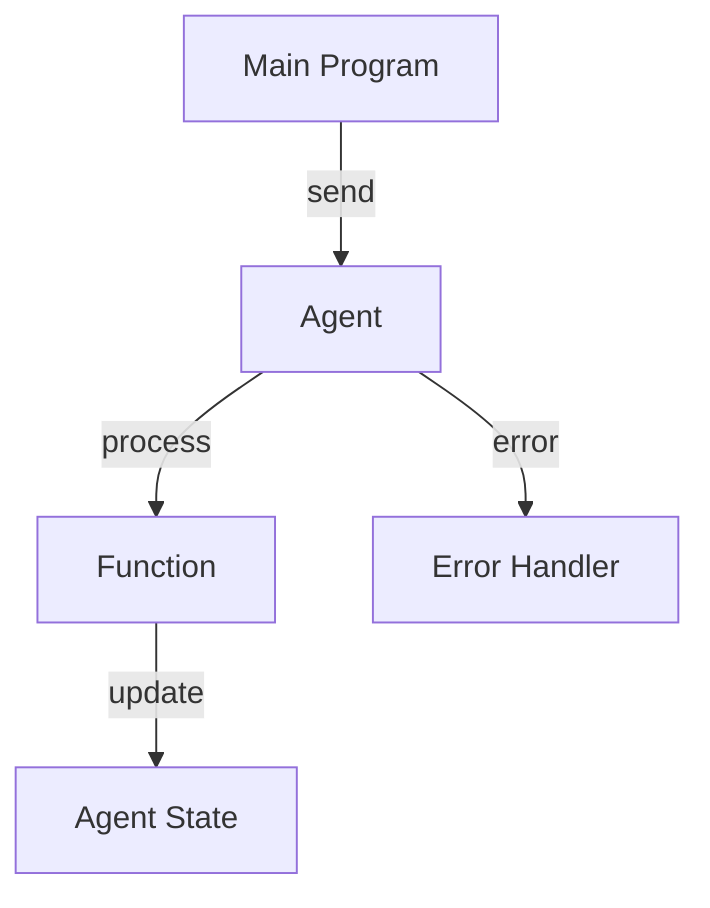

## 8.8.3 Using Agents for Side Effects

In the realm of concurrent programming, managing side effects safely and predictably is a significant challenge. Clojure offers a unique solution to this problem through the use of **agents**. Agents provide a way to handle state changes asynchronously, allowing side effects to be managed in a controlled manner. This section will delve into how agents work, their advantages over traditional Java concurrency mechanisms, and how they can be effectively used to manage side effects in Clojure applications.

### Understanding Agents in Clojure

Agents in Clojure are designed to manage state changes asynchronously. They are part of Clojure's concurrency primitives, which also include atoms, refs, and vars. Unlike atoms, which handle synchronous updates, agents allow you to perform updates asynchronously, making them ideal for operations that involve side effects.

#### Key Characteristics of Agents

- **Asynchronous Updates**: Agents process updates in a separate thread, allowing the main program to continue executing without waiting for the update to complete.
- **Single-threaded Updates**: Each agent ensures that updates are processed sequentially, preventing race conditions.
- **Error Handling**: Agents can handle errors gracefully, allowing you to define error-handling strategies for failed updates.

### Agents vs. Java Concurrency Mechanisms

Java developers are familiar with concurrency mechanisms such as threads, locks, and synchronized blocks. While these tools are powerful, they can lead to complex and error-prone code, especially when dealing with shared mutable state.

#### Comparison with Java

- **Simplicity**: Agents abstract away the complexity of thread management, allowing you to focus on the logic of your application.
- **Safety**: By ensuring that updates are processed sequentially, agents eliminate the risk of race conditions without the need for explicit locks.
- **Error Handling**: Agents provide built-in error handling, making it easier to manage exceptions that occur during state updates.

### Using Agents for Side Effects

Agents are particularly useful for managing side effects in a concurrent program. Side effects, such as logging, sending emails, or updating a database, can be performed asynchronously using agents, ensuring that they do not block the main program flow.

#### Creating and Using Agents

Let's explore how to create and use agents in Clojure with a simple example:

```clojure
;; Define an agent with an initial state
(def my-agent (agent 0))

;; Define a function to update the agent's state
(defn increment [state]
  (println "Incrementing state:" state)
  (inc state))

;; Send an update to the agent
(send my-agent increment)

;; Check the agent's state
@my-agent
```

**Explanation**:
- We define an agent `my-agent` with an initial state of `0`.
- The `increment` function is used to update the agent's state.
- The `send` function sends the `increment` function to the agent for asynchronous execution.
- We use `@my-agent` to dereference and check the agent's current state.

#### Handling Side Effects

Agents are ideal for operations that involve side effects. For example, consider a logging system where logs are written to a file. Using an agent, we can ensure that log entries are written asynchronously, without blocking the main application:

```clojure
;; Define an agent for logging
(def log-agent (agent nil))

;; Define a function to log messages
(defn log-message [log-file message]
  (spit log-file (str message "\n") :append true)
  log-file)

;; Send a log message to the agent
(send log-agent log-message "log.txt" "This is a log entry.")
```

**Explanation**:
- We define a `log-agent` to manage log file updates.
- The `log-message` function writes a message to a log file.
- We use `send` to asynchronously log messages, ensuring that the main program is not blocked.

### Error Handling with Agents

Agents provide robust error-handling capabilities. If an error occurs during an update, the agent's state is not changed, and the error is stored in the agent's error handler. You can define custom error-handling strategies to manage these errors.

#### Example of Error Handling

```clojure
;; Define an agent with error handling
(def error-agent (agent 0 :error-handler (fn [agnt ex] (println "Error:" (.getMessage ex)))))

;; Define a function that causes an error
(defn faulty-update [state]
  (/ state 0)) ;; Division by zero error

;; Send a faulty update to the agent
(send error-agent faulty-update)

;; Check the agent's state
@error-agent
```

**Explanation**:
- We define an `error-agent` with a custom error handler that prints error messages.
- The `faulty-update` function causes a division by zero error.
- The error is caught by the agent's error handler, and the agent's state remains unchanged.

### Best Practices for Using Agents

When using agents to manage side effects, consider the following best practices:

- **Use Agents for I/O Operations**: Agents are ideal for I/O operations that can be performed asynchronously, such as logging or sending network requests.
- **Avoid Long-Running Tasks**: Since agents process updates sequentially, avoid using them for long-running tasks that could delay subsequent updates.
- **Monitor Agent Errors**: Regularly check for errors in agents and implement appropriate error-handling strategies.

### Try It Yourself

Experiment with the following modifications to the code examples:

1. **Modify the Logging Example**: Change the log file path and message format. Observe how the agent handles different log entries.
2. **Implement a Counter**: Use an agent to implement a counter that increments asynchronously. Add error handling for invalid operations.
3. **Simulate Network Requests**: Use an agent to simulate sending network requests. Implement error handling for failed requests.

### Diagrams and Visualizations

To better understand how agents work, let's visualize the flow of data through an agent using a Mermaid.js diagram.



**Diagram Explanation**:
- The main program sends an update to the agent.
- The agent processes the update using a function.
- The function updates the agent's state.
- If an error occurs, the error handler is invoked.

### Further Reading

For more information on agents and concurrency in Clojure, consider exploring the following resources:

- [Official Clojure Documentation on Agents](https://clojure.org/reference/agents)
- [ClojureDocs: Agents](https://clojuredocs.org/clojure.core/agent)
- [Concurrency in Clojure: A Practical Guide](https://practical.li/clojure/concurrency/)

### Exercises

1. **Implement a Task Queue**: Use an agent to implement a task queue that processes tasks asynchronously. Add error handling for failed tasks.
2. **Create a Chat Application**: Use agents to manage chat messages in a simple chat application. Ensure that messages are processed asynchronously.
3. **Build a Monitoring System**: Use agents to build a system that monitors server health and logs status updates asynchronously.

### Key Takeaways

- **Agents provide a safe and efficient way to manage side effects asynchronously** in Clojure applications.
- **They simplify concurrency management** by abstracting away thread management and ensuring sequential updates.
- **Error handling is built-in**, allowing for robust and reliable state management.
- **Agents are ideal for I/O operations** and other tasks that can be performed asynchronously without blocking the main program.

Now that we've explored how agents can be used to manage side effects in Clojure, let's apply these concepts to build more robust and efficient concurrent applications.

## Quiz: Mastering Agents for Side Effects in Clojure



### What is the primary purpose of using agents in Clojure?

- [x] To manage state changes asynchronously
- [ ] To perform synchronous updates
- [ ] To replace all concurrency mechanisms
- [ ] To handle only I/O operations

> **Explanation:** Agents are designed to manage state changes asynchronously, allowing for non-blocking updates.

### How do agents ensure that updates are processed safely?

- [x] By processing updates sequentially
- [ ] By using locks and synchronization
- [ ] By running updates in parallel
- [ ] By ignoring errors

> **Explanation:** Agents process updates sequentially, ensuring that each update is completed before the next one begins, preventing race conditions.

### What happens if an error occurs during an agent update?

- [x] The error is stored, and the agent's state remains unchanged
- [ ] The agent's state is updated with the error
- [ ] The program crashes
- [ ] The error is ignored

> **Explanation:** If an error occurs, the agent's state is not changed, and the error is stored for handling.

### Which function is used to send updates to an agent?

- [x] send
- [ ] swap!
- [ ] reset!
- [ ] alter

> **Explanation:** The `send` function is used to send updates to an agent for asynchronous processing.

### What type of operations are agents best suited for?

- [x] I/O operations and side effects
- [ ] CPU-intensive calculations
- [ ] Real-time data processing
- [ ] Synchronous updates

> **Explanation:** Agents are ideal for I/O operations and side effects that can be performed asynchronously.

### How can you check the current state of an agent?

- [x] By dereferencing the agent using @
- [ ] By calling a `getState` method
- [ ] By using a `state` function
- [ ] By printing the agent directly

> **Explanation:** You can check the current state of an agent by dereferencing it using `@`.

### What is a key advantage of using agents over traditional Java concurrency mechanisms?

- [x] Simplified concurrency management
- [ ] Faster execution speed
- [ ] More complex code
- [ ] Less error handling

> **Explanation:** Agents simplify concurrency management by abstracting away thread handling and ensuring sequential updates.

### Can agents be used for long-running tasks?

- [ ] Yes, they are ideal for long-running tasks
- [x] No, they should be avoided for long-running tasks
- [ ] Yes, but only with error handling
- [ ] No, they cannot handle any tasks

> **Explanation:** Agents should be avoided for long-running tasks as they process updates sequentially, which could delay subsequent updates.

### What is the role of an error handler in an agent?

- [x] To manage errors that occur during updates
- [ ] To prevent errors from occurring
- [ ] To log all operations
- [ ] To synchronize updates

> **Explanation:** An error handler manages errors that occur during updates, allowing for appropriate handling without changing the agent's state.

### True or False: Agents in Clojure can replace all concurrency mechanisms.

- [ ] True
- [x] False

> **Explanation:** False. While agents are powerful, they are not a replacement for all concurrency mechanisms. They are best suited for specific use cases involving asynchronous side effects.


