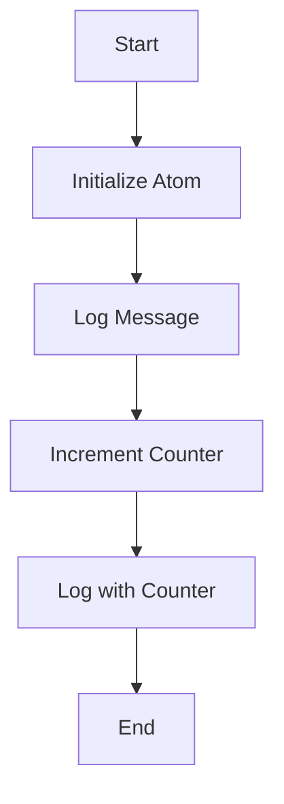

## 8.8.4 Logging and I/O Operations

In this section, we will delve into the intricacies of handling logging and input/output (I/O) operations in Clojure, particularly within the context of concurrent applications. As experienced Java developers, you are likely familiar with the challenges of managing I/O and logging in multi-threaded environments. Clojure offers unique approaches to these challenges, leveraging its functional programming paradigm and concurrency primitives to ensure thread safety and enhance performance.

### Understanding Logging and I/O in Clojure

Logging and I/O operations are inherently side-effecting, meaning they interact with the outside world and can introduce complexity in concurrent applications. In Java, you might use synchronized blocks or concurrent libraries to manage these operations safely. In Clojure, we can utilize its immutable data structures and concurrency primitives like atoms, refs, and agents to achieve similar goals.

#### Key Concepts

- **Immutability**: Clojure's immutable data structures help prevent race conditions by ensuring that data cannot be changed by multiple threads simultaneously.
- **Concurrency Primitives**: Atoms, refs, and agents provide mechanisms to manage state changes safely across threads.
- **Functional Programming**: Encourages the use of pure functions, reducing side effects and making code easier to reason about.

### Logging in Clojure

Logging is crucial for monitoring application behavior, debugging, and auditing. In Clojure, we can use libraries like `clojure.tools.logging` to integrate with popular Java logging frameworks such as Log4j or SLF4J.

#### Setting Up Logging

Let's start by setting up a simple logging configuration using `clojure.tools.logging` and SLF4J.

```clojure
(ns myapp.logging
  (:require [clojure.tools.logging :as log]))

(defn log-example []
  (log/info "This is an info message")
  (log/warn "This is a warning message")
  (log/error "This is an error message"))
```

**Explanation**: 
- We require the `clojure.tools.logging` namespace and alias it as `log`.
- We define a function `log-example` that logs messages at different levels.

#### Thread-Safe Logging

Logging in a concurrent environment requires careful consideration to avoid race conditions. Clojure's logging libraries are designed to be thread-safe, but it's essential to ensure that the underlying logging framework (e.g., Log4j) is configured correctly.

**Best Practices**:
- **Use Asynchronous Logging**: Configure your logging framework to handle logs asynchronously, reducing the performance impact on your application.
- **Log Contextual Information**: Include thread identifiers or request IDs in your logs to trace issues across concurrent operations.

### I/O Operations in Clojure

I/O operations, such as reading from or writing to files, databases, or network sockets, are another area where concurrency can introduce complexity. Clojure provides several ways to handle I/O safely and efficiently.

#### File I/O Example

Let's explore a simple example of reading from and writing to a file in Clojure.

```clojure
(ns myapp.file-io
  (:require [clojure.java.io :as io]))

(defn read-file [file-path]
  (with-open [reader (io/reader file-path)]
    (doall (line-seq reader))))

(defn write-file [file-path data]
  (with-open [writer (io/writer file-path)]
    (doseq [line data]
      (.write writer (str line "\n")))))
```

**Explanation**:
- We use `clojure.java.io` for file operations.
- `with-open` ensures that resources are closed after use, preventing resource leaks.
- `read-file` reads lines from a file and returns them as a sequence.
- `write-file` writes a sequence of data to a file.

#### Handling Concurrent I/O

When performing I/O operations concurrently, it's crucial to manage access to shared resources carefully. Clojure's concurrency primitives can help ensure that I/O operations are performed safely.

**Using Atoms for State Management**:

Atoms provide a way to manage shared, mutable state safely. Let's see how we can use an atom to manage a shared counter for logging purposes.

```clojure
(def log-counter (atom 0))

(defn log-with-counter [message]
  (let [count (swap! log-counter inc)]
    (log/info (str "Log #" count ": " message))))
```

**Explanation**:
- We define an atom `log-counter` to keep track of the number of log messages.
- `swap!` is used to update the atom's state atomically, ensuring thread safety.

### Comparing Clojure and Java Approaches

In Java, you might use synchronized blocks or concurrent collections to manage logging and I/O operations. Clojure's approach, leveraging immutability and concurrency primitives, offers a more declarative and less error-prone way to handle these tasks.

#### Java Example

Here's a simple Java example of logging with synchronization:

```java
import java.util.concurrent.atomic.AtomicInteger;
import java.util.logging.Logger;

public class LoggingExample {
    private static final Logger logger = Logger.getLogger(LoggingExample.class.getName());
    private static final AtomicInteger logCounter = new AtomicInteger(0);

    public static void logWithCounter(String message) {
        int count = logCounter.incrementAndGet();
        logger.info("Log #" + count + ": " + message);
    }
}
```

**Comparison**:
- **AtomicInteger** in Java is similar to Clojure's atom, providing atomic updates.
- Clojure's functional approach reduces the need for explicit synchronization, making the code more concise and less error-prone.

### Best Practices for Logging and I/O in Clojure

- **Use Immutable Data Structures**: Leverage Clojure's immutable collections to prevent race conditions.
- **Leverage Concurrency Primitives**: Use atoms, refs, and agents to manage state changes safely.
- **Asynchronous Operations**: Consider using asynchronous I/O and logging to improve performance.
- **Monitor and Tune**: Regularly monitor your application's performance and tune your logging and I/O configurations as needed.

### Try It Yourself

Experiment with the provided code examples by modifying the logging levels or adding additional I/O operations. Try using different concurrency primitives to manage shared state and observe how it affects the application's behavior.

### Diagrams and Visualizations

Below is a diagram illustrating the flow of data through a logging function using an atom to manage state:



**Diagram Description**: This flowchart shows the process of logging a message with a counter, using an atom to manage the state safely.

### Further Reading

For more information on Clojure's logging and I/O capabilities, consider exploring the following resources:

- [Clojure Tools Logging Documentation](https://clojure.github.io/tools.logging/)
- [Clojure Java IO Documentation](https://clojure.github.io/clojure/clojure.java.io-api.html)
- [SLF4J Documentation](http://www.slf4j.org/)

### Exercises

1. Modify the `log-with-counter` function to include timestamps in the log messages.
2. Implement a file I/O operation that reads from multiple files concurrently and aggregates the results.
3. Explore using agents for handling I/O operations asynchronously.

### Summary and Key Takeaways

- Clojure's immutable data structures and concurrency primitives provide robust tools for managing logging and I/O operations in concurrent applications.
- Leveraging functional programming principles can simplify the handling of side effects, making your code more maintainable and less prone to errors.
- Regularly monitor and tune your application's logging and I/O configurations to ensure optimal performance.

Now that we've explored how to handle logging and I/O operations in Clojure, let's apply these concepts to manage state effectively in your applications.

## Quiz: Mastering Logging and I/O Operations in Clojure



### Which Clojure library is commonly used for logging?

- [x] clojure.tools.logging
- [ ] clojure.java.io
- [ ] clojure.core.async
- [ ] clojure.data.json

> **Explanation:** `clojure.tools.logging` is the library used for logging in Clojure, providing integration with popular Java logging frameworks.

### What is the primary benefit of using immutable data structures in Clojure?

- [x] Preventing race conditions
- [ ] Improving I/O performance
- [ ] Simplifying syntax
- [ ] Enhancing logging capabilities

> **Explanation:** Immutable data structures prevent race conditions by ensuring that data cannot be changed by multiple threads simultaneously.

### How does Clojure's `swap!` function ensure thread safety?

- [x] It performs atomic updates to an atom's state.
- [ ] It locks the atom during updates.
- [ ] It uses synchronized blocks.
- [ ] It queues updates for later execution.

> **Explanation:** `swap!` performs atomic updates, ensuring that changes to an atom's state are thread-safe.

### What is the purpose of the `with-open` macro in Clojure?

- [x] To ensure resources are closed after use
- [ ] To open files for reading
- [ ] To log messages
- [ ] To manage concurrency

> **Explanation:** `with-open` ensures that resources, such as file readers or writers, are closed after use, preventing resource leaks.

### Which concurrency primitive is best suited for managing shared state in Clojure?

- [x] Atom
- [ ] Ref
- [ ] Agent
- [ ] Var

> **Explanation:** Atoms are best suited for managing shared, mutable state safely in Clojure.

### What is a key advantage of asynchronous logging?

- [x] Reducing performance impact
- [ ] Simplifying code
- [ ] Increasing log verbosity
- [ ] Enhancing security

> **Explanation:** Asynchronous logging reduces the performance impact on the application by handling logs in a separate thread.

### How can you include contextual information in log messages?

- [x] By adding thread identifiers or request IDs
- [ ] By using synchronized blocks
- [ ] By increasing log levels
- [ ] By using `println`

> **Explanation:** Including thread identifiers or request IDs in log messages helps trace issues across concurrent operations.

### What is the equivalent of Java's `AtomicInteger` in Clojure?

- [x] Atom
- [ ] Ref
- [ ] Agent
- [ ] Var

> **Explanation:** An atom in Clojure is similar to Java's `AtomicInteger`, providing atomic updates to shared state.

### Which Clojure function is used to write data to a file?

- [x] io/writer
- [ ] io/reader
- [ ] log/info
- [ ] swap!

> **Explanation:** `io/writer` is used to write data to a file in Clojure.

### True or False: Clojure's functional approach reduces the need for explicit synchronization.

- [x] True
- [ ] False

> **Explanation:** Clojure's functional approach, with its emphasis on immutability and concurrency primitives, reduces the need for explicit synchronization.


