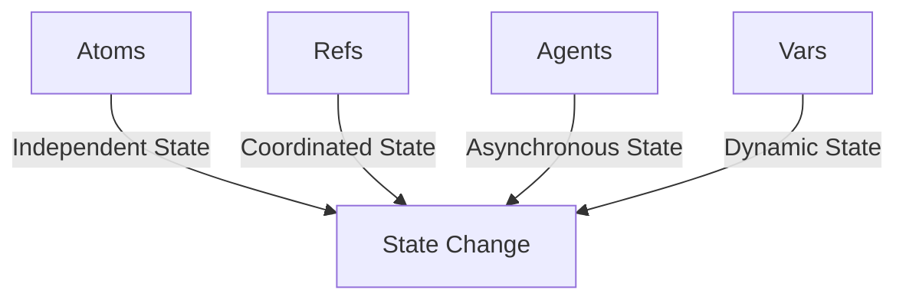

## 8.9.2 Optimizing State Management

In this section, we will delve into optimizing state management in Clojure, focusing on minimizing the scope of transactions, reducing the frequency of state changes, and avoiding unnecessary coordination. These strategies are crucial for building efficient, scalable, and maintainable applications, especially when dealing with concurrency.

### Understanding State Management in Clojure

Clojure's approach to state management is fundamentally different from Java's. While Java relies heavily on mutable state and synchronization mechanisms like locks, Clojure embraces immutability and provides concurrency primitives such as atoms, refs, agents, and vars. These primitives allow you to manage state changes in a controlled and efficient manner.

#### Immutability and Persistent Data Structures

Clojure's persistent data structures are immutable by default, meaning that any modification results in a new version of the data structure. This immutability is achieved through structural sharing, which allows for efficient memory usage and performance.

```clojure
(def original-vector [1 2 3])
(def new-vector (conj original-vector 4))

;; original-vector remains unchanged
;; new-vector is [1 2 3 4]
```

In the example above, `original-vector` remains unchanged after adding an element to it. Instead, `new-vector` is created, sharing most of its structure with `original-vector`.

### Minimizing the Scope of Transactions

When using refs and software transactional memory (STM) in Clojure, it's essential to minimize the scope of transactions. Transactions should be as short as possible to reduce contention and improve performance.

#### Example: Reducing Transaction Scope

Consider a scenario where multiple threads update a shared counter. Using refs, you can manage these updates transactionally:

```clojure
(def counter (ref 0))

(defn increment-counter []
  (dosync
    (alter counter inc)))
```

To optimize, ensure that only the necessary operations are within the `dosync` block. Avoid performing expensive computations or I/O operations inside transactions.

### Reducing the Frequency of State Changes

Frequent state changes can lead to performance bottlenecks, especially in a concurrent environment. By batching updates or using more efficient data structures, you can reduce the frequency of state changes.

#### Example: Batching Updates

Instead of updating a counter for each event, batch the updates and apply them in a single transaction:

```clojure
(defn batch-update-counter [events]
  (dosync
    (alter counter + (count events))))
```

This approach reduces the number of transactions and improves throughput.

### Avoiding Unnecessary Coordination

Unnecessary coordination between threads can lead to contention and reduced performance. Use Clojure's concurrency primitives wisely to avoid such scenarios.

#### Atoms for Independent State

Atoms are ideal for managing independent state changes without coordination. They provide atomic updates and are suitable for counters, flags, and other independent state variables.

```clojure
(def counter-atom (atom 0))

(defn increment-atom []
  (swap! counter-atom inc))
```

Atoms do not require transactions, making them faster and more efficient for independent state changes.

### Comparing Clojure and Java State Management

Let's compare how Clojure and Java handle state management, focusing on concurrency and performance.

#### Java's Approach

In Java, managing state often involves using synchronized blocks or locks to ensure thread safety. This can lead to complex and error-prone code.

```java
public class Counter {
    private int count = 0;

    public synchronized void increment() {
        count++;
    }
}
```

While this approach ensures thread safety, it can lead to contention and reduced performance in highly concurrent environments.

#### Clojure's Approach

Clojure's immutable data structures and concurrency primitives provide a more straightforward and efficient way to manage state.

```clojure
(def counter (atom 0))

(defn increment []
  (swap! counter inc))
```

This code is simpler and avoids the pitfalls of manual synchronization.

### Try It Yourself: Experimenting with State Management

To deepen your understanding, try modifying the examples above:

1. **Experiment with Refs**: Create a scenario where multiple threads update a shared resource using refs. Measure the performance impact of different transaction scopes.

2. **Batch Updates**: Implement a system that processes events in batches and updates state accordingly. Compare the performance with a system that updates state for each event.

3. **Atom vs. Ref**: Use atoms for independent state changes and refs for coordinated changes. Observe the differences in performance and complexity.

### Visualizing State Management Concepts

Below is a diagram illustrating the flow of data through Clojure's concurrency primitives:



**Diagram Caption**: This diagram shows how different concurrency primitives in Clojure manage state changes, highlighting their use cases.

### Further Reading and Resources

- [Clojure Official Documentation](https://clojure.org/reference)
- [ClojureDocs](https://clojuredocs.org/)
- [GitHub - Clojure Concurrency Examples](https://github.com/clojure-examples/concurrency)

### Exercises and Practice Problems

1. **Optimize a Transaction**: Given a function that updates multiple refs, refactor it to minimize the transaction scope.

2. **Batch Processing**: Implement a batch processing system using agents and compare its performance with a non-batch system.

3. **Concurrency Challenge**: Create a multi-threaded application that uses atoms, refs, and agents. Measure and optimize its performance.

### Key Takeaways

- **Minimize Transaction Scope**: Keep transactions short to reduce contention and improve performance.
- **Batch Updates**: Reduce the frequency of state changes by batching updates.
- **Use Atoms for Independent State**: Atoms are efficient for managing independent state changes without coordination.
- **Leverage Clojure's Concurrency Primitives**: Use the right primitive for your use case to optimize state management.

Now that we've explored how to optimize state management in Clojure, let's apply these concepts to build efficient and scalable applications.

## Quiz: Optimizing State Management in Clojure



### What is a key advantage of using Clojure's immutable data structures?

- [x] They allow for efficient memory usage through structural sharing.
- [ ] They automatically synchronize state changes across threads.
- [ ] They eliminate the need for transactions.
- [ ] They provide built-in logging for state changes.

> **Explanation:** Clojure's immutable data structures use structural sharing to efficiently manage memory, allowing for efficient state management.

### How can you minimize the scope of transactions in Clojure?

- [x] By keeping transactions short and avoiding expensive operations inside them.
- [ ] By using synchronized blocks.
- [ ] By increasing the number of refs involved.
- [ ] By using dynamic vars.

> **Explanation:** Minimizing the scope of transactions involves keeping them short and avoiding expensive operations inside them to reduce contention.

### What is a benefit of batching updates in Clojure?

- [x] It reduces the frequency of state changes and improves throughput.
- [ ] It increases the complexity of the code.
- [ ] It requires more memory.
- [ ] It decreases the performance of the application.

> **Explanation:** Batching updates reduces the frequency of state changes, leading to improved throughput and performance.

### Which Clojure primitive is ideal for managing independent state changes?

- [x] Atoms
- [ ] Refs
- [ ] Agents
- [ ] Vars

> **Explanation:** Atoms are ideal for managing independent state changes without requiring coordination.

### How does Clojure's approach to state management differ from Java's?

- [x] Clojure uses immutable data structures and concurrency primitives, while Java relies on mutable state and locks.
- [ ] Clojure uses synchronized blocks, while Java uses transactions.
- [ ] Clojure requires manual synchronization, while Java does not.
- [ ] Clojure and Java have identical state management approaches.

> **Explanation:** Clojure's approach involves immutable data structures and concurrency primitives, contrasting with Java's reliance on mutable state and locks.

### What is the purpose of using `swap!` with atoms in Clojure?

- [x] To atomically update the state of an atom.
- [ ] To synchronize state changes across threads.
- [ ] To create a new atom.
- [ ] To batch updates to an atom.

> **Explanation:** `swap!` is used to atomically update the state of an atom in Clojure.

### What is a potential downside of frequent state changes in a concurrent environment?

- [x] It can lead to performance bottlenecks.
- [ ] It simplifies the code.
- [ ] It improves throughput.
- [ ] It reduces memory usage.

> **Explanation:** Frequent state changes can lead to performance bottlenecks, especially in a concurrent environment.

### Which Clojure primitive is used for asynchronous state changes?

- [x] Agents
- [ ] Atoms
- [ ] Refs
- [ ] Vars

> **Explanation:** Agents are used for asynchronous state changes in Clojure.

### What is a key consideration when using refs and STM in Clojure?

- [x] Minimizing the scope of transactions to reduce contention.
- [ ] Using synchronized blocks for thread safety.
- [ ] Increasing the number of refs involved.
- [ ] Avoiding the use of transactions.

> **Explanation:** Minimizing the scope of transactions is crucial to reduce contention when using refs and STM in Clojure.

### True or False: Atoms in Clojure require transactions for state changes.

- [ ] True
- [x] False

> **Explanation:** Atoms do not require transactions for state changes; they use atomic updates.


